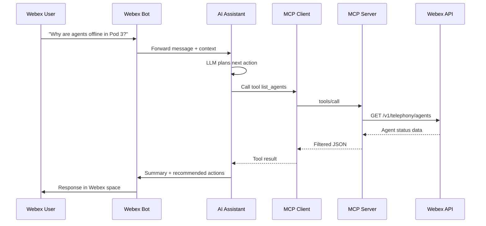

```mermaid
sequenceDiagram
    participant U as Webex User
    participant B as Webex Bot
    participant A as AI Assistant
    participant C as MCP Client
    participant S as MCP Server
    participant W as Webex API

    U->>B: "Why are agents offline in Pod 3?"
    B->>A: Forward message + context
    A->>A: LLM plans next action
    A->>C: Call tool list_agents
    C->>S: tools/call
    S->>W: GET /v1/telephony/agents
    W-->>S: Agent status data
    S-->>C: Filtered JSON
    C-->>A: Tool result
    A->>B: Summary + recommended actions
    B->>U: Response in Webex space
```
