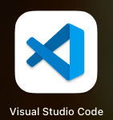
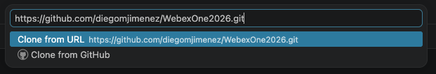
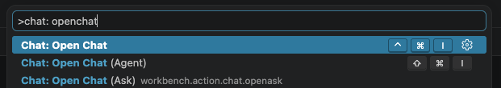
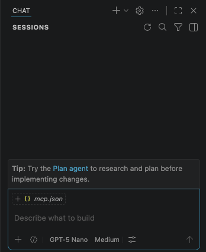

# Getting Started

Welcome to **LAB-31123: Troubleshoot and Manage Your Organization with an AI Assistant**. This section prepares your lab workstation, credentials, and development environment.

## Join the conversation!

Scan the QR code to be added to the Webex space for Q&A and more

{ width="300" style="display: block; margin: 0 auto; border: 1px solid lightgray; border-radius: 8px;"}

## Tools used in this lab

- **Webex Client** — interact with your bot and verify assistant responses
- **Visual Studio Code** — edit code, configure MCP servers, and run the lab assistant from the terminal
- **OpenAI API** — LLM for the bot and agent (key provided by your instructor; **not** GitHub Copilot)
- **Webex for Developers** — create bots, WCIT tokens, and review API documentation
- **Python 3.10+** — run bot, OpenAI, and MCP client samples

## Webex lab credentials

Use the credentials provided by your lab instructor:

| Item | Value |
| --- | --- |
| Username | `userX@webexone-ai-assistant.wbx.ai` (replace X with your pod number) |
| Password | Provided in the lab handout |

## Webex Client

To begin, you'll log into your dedicated Webex lab account. This will allow you to see the results of your exercises and interact with your assistant.

1. **Open the Webex Client:** Launch the Webex Desktop App on your lab workstation.
2. **Enter Lab Credentials:** When prompted, enter the **Webex email address and password** provided to you.

!!! Note
    You can also login at [Webex](https://web.webex.com/){:target="_blank"} 

## Visual Studio

Visual Studio Code will be used for Python-based bot development, service app configuration, and the agentic app and MCP server exercises.

1. Open Visual Studio Code from the desktop:

   { width="150" style="display: block; margin: 0 auto; border: 1px solid lightgray; border-radius: 8px;"}


### Clone the lab repository

3. Go to the **Source Control** tab and click **Clone Repository**:

    { width="500" style="display: block; margin: 0 auto; border: 1px solid lightgray; border-radius: 8px;"}

4. Type the following:

    - https://github.com/diegomjimenez/WebexOne2026.git

    { width="600" style="display: block; margin: 0 auto; border: 1px solid lightgray; border-radius: 8px;"}

5. Select a directory to save the project.
6. Click on **Yes, I trust the authors** if a pop-up appears.

### Virtual Enviroment

3. Create a virtual environment and install dependencies:

    ```bash
    python -m venv .venv
    .\webexone2026\Scripts\activate.ps1
    pip install -r requirements.txt
    ```

4. Copy the environment template and fill in your values:

    ```bash
    cp .env.example .env
    ```

### Chat

1. Open the chat, open the Command Palette `Ctrl+Shift+P` and type "Chat: Open Chat (Agent)"

    { width="600" style="display: block; margin: 0 auto; border: 1px solid lightgray; border-radius: 8px;"}

    Chat should open on the side:

    { width="400" style="display: block; margin: 0 auto; border: 1px solid lightgray; border-radius: 8px;"}

### Bruno / Postman


