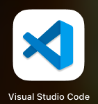
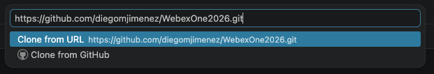
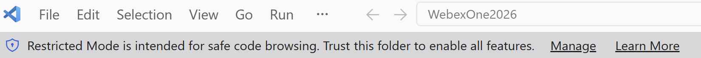
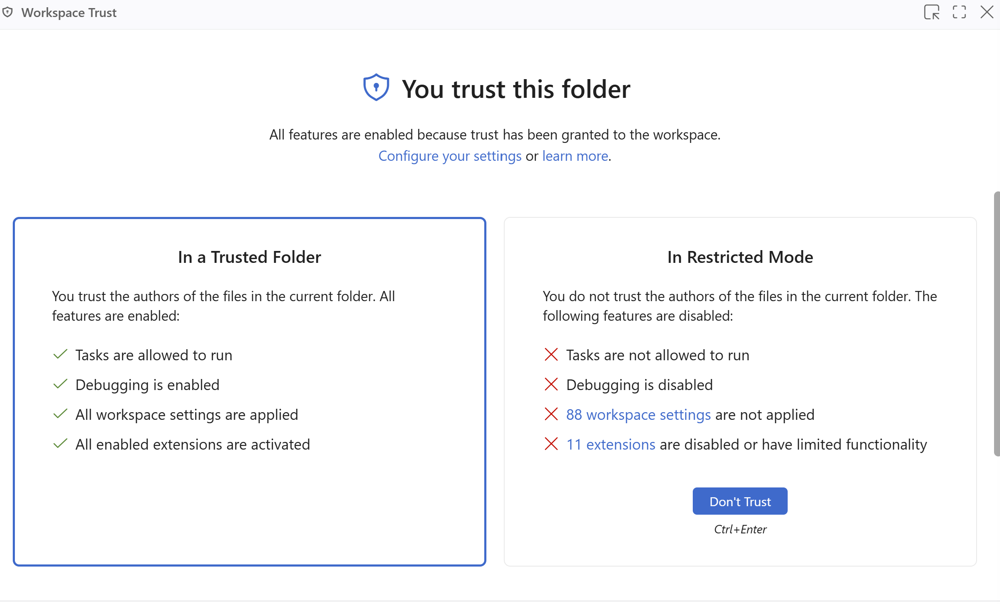
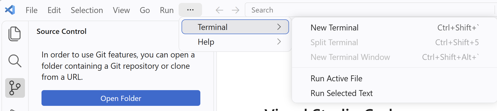
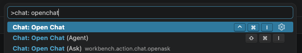
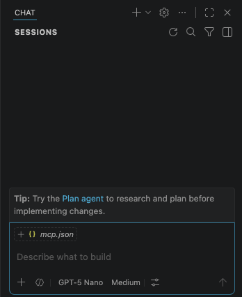
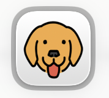
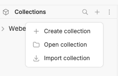
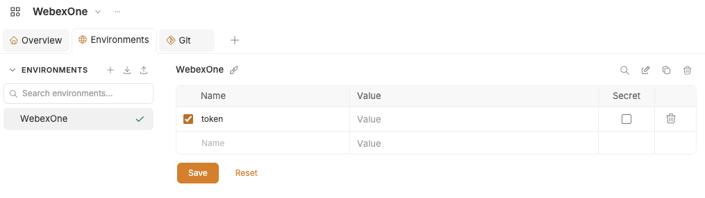

# Getting Started

Welcome to **LAB-31123: Troubleshoot and Manage Your Organization with an AI Assistant**. This section prepares your lab workstation, credentials, and development environment.

## Join the conversation!

Scan the QR code to be added to the Webex space for Q&A and more.

{ width="300" style="display: block; margin: 0 auto; border: 1px solid lightgray; border-radius: 8px;"}

## Tools used in this lab

- **Webex Client** — Interact with your bot and verify assistant responses.
- **Control Hub** — Organization admin portal.
- **Visual Studio Code** — Edit code, configure MCP servers, and run the lab assistant.
- **Webex for Developers** — Create bots, Webex MCP tokens, service apps, and review API documentation.
- **Bruno** — Call Webex REST APIs by hand before wrapping them as MCP tools.

## Webex lab credentials

These are your Webex credentials for this lab:

| Item | Value |
| --- | --- |
| Username | `podX@webexone-ai-assistant.wbx.ai` (replace X with your pod number) |
| Password | `WebexOne2026!` |

## Webex Client

To begin, you'll log into your dedicated Webex lab account. This will allow you to see the results of your exercises and interact with your assistant.

1. **Open the Webex Client:** Launch the Webex Desktop App on your lab workstation:
    { width="150" style="display: block; margin: 0 auto; border: 1px solid lightgray; border-radius: 8px;"}
2. **Enter Lab Credentials:** When prompted, enter the **Webex email address and password** provided to you.

!!! Note
    You can also log in at [Webex](https://web.webex.com/){:target="_blank"}

## Log into Control Hub

You will use Control Hub during the lab. Sign in now with the same credentials.

1. Open [Control Hub](https://admin.webex.com/){:target="_blank"} in a browser.
2. Sign in with the **Webex email address and password** provided to you.

## Log into Webex for Developers

Use the same lab credentials you just used for the Webex Client.

1. Open [Webex for Developers](https://developer.webex.com/){:target="_blank"} in a browser.
2. Sign in with the **Webex email address and password** provided to you.

## Visual Studio Code

Visual Studio Code will be used for Python-based bot development, the agentic app, and the MCP server exercises.

1. Open Visual Studio Code from the desktop:

   { width="150" style="display: block; margin: 0 auto; border: 1px solid lightgray; border-radius: 8px;"}

### Clone the lab repository

1. Go to the **Source Control** tab and click **Clone Repository**:

    { width="500" style="display: block; margin: 0 auto; border: 1px solid lightgray; border-radius: 8px;"}

2. Enter the following URL:

    `https://github.com/diegomjimenez/WebexOne2026.git`

    { width="600" style="display: block; margin: 0 auto; border: 1px solid lightgray; border-radius: 8px;"}

3. Select a directory to save the project.
4. You need to trust the workspace. Click **Manage** in the top notification bar:
   
    { width="700" style="display: block; margin: 0 auto; border: 1px solid lightgray; border-radius: 8px;"}

5. Select **Trust**:

   { width="700" style="display: block; margin: 0 auto; border: 1px solid lightgray; border-radius: 8px;"}

### Virtual Environment

1. Click **Terminal > New Terminal** from the top menu bar, or press **Ctrl+Shift+`** to open the terminal.

    !!! Note
        If you do not see **Terminal** in the top bar, click the **...** icon first:

        { width="700" style="display: block; margin: 0 auto; border: 1px solid lightgray; border-radius: 8px;"}

2. Create a virtual environment and install dependencies:

    ```bash
    python -m venv webexone
    .\webexone\Scripts\Activate.ps1
    pip install -r requirements.txt
    ```

3. Copy the environment template and fill in your values:

    ```bash
    cp .env.example .env
    ```

### Open the Chat

You will talk to the assistant from the VS Code Chat view.

1. Open the Command Palette (`Ctrl+Shift+P`) and type `Chat: Open Chat (Agent)`.

    { width="600" style="display: block; margin: 0 auto; border: 1px solid lightgray; border-radius: 8px;"}

    The Chat view should open on the side:

    { width="400" style="display: block; margin: 0 auto; border: 1px solid lightgray; border-radius: 8px;"}

## Bruno

Bruno is the API client you will use to call Webex REST APIs. It stores collections as files on your machine, so there is no account to create and nothing to sign into.

1. Open **Bruno** from the desktop.

    { width="150" style="display: block; margin: 0 auto; border: 1px solid lightgray; border-radius: 8px;"}

2. Click **Create Collection** and name it `WebexOne`:

    { width="300" style="display: block; margin: 0 auto; border: 1px solid lightgray; border-radius: 8px;"}

3. Create the environment that will hold your token. Open the environment selector in the top right corner, choose **Configure**, add an environment called `WebexOne`, and add one variable:

    | Variable | Value |
    | --- | --- |
    | `token` | Leave empty for now |

    { style="display: block; margin: 0 auto; border: 1px solid lightgray; border-radius: 8px;"}
