# Lab 2 - Agent Skills

In this section, you will use an **Agent Skill** to teach the assistant *how* to review Webex meetings thoroughly. This separates the operational expertise from the MCP tool connectivity, and you can run it directly inside **VS Code Chat (Agent mode)** without writing any code.

Skills aren't just fancy instructions, they're **portable, task-specific workflows** that load only when you need them. Unlike custom instructions that just define coding standards, skills bring scripts, examples, and automation into the mix to make agents truly **action-oriented**.

Instead of copying a file from the repository, you will create the skill yourself using the VS Code skills flow. VS Code will automatically save it to a supported location, ensuring the lab works regardless of which folder you have open.

## Skills vs MCP

| Layer            | Responsibility                                    | Example                                                                                   |
| ---------------- | ------------------------------------------------- | ----------------------------------------------------------------------------------------- |
| **MCP server**   | What the assistant *can do* — governed API access | Webex Meeting tools (list meetings, participants, summaries, recordings)                  |
| **Agent Skills** | *How* to use those tools — runbooks and judgment  | "For every meeting, also check participants, summary, recording, transcript, then triage" |

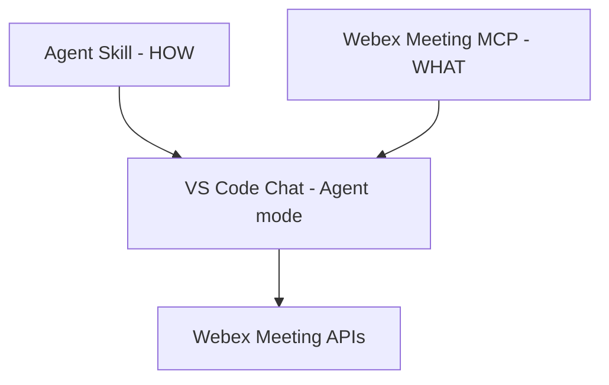

A skill doesn't add new tools. Instead, it tells the assistant **how to use the tools it already has more effectively**—and what *not* to do.

## Skills vs Custom Instructions

If you already use custom instructions in VS Code, you might be wondering how skills are different. They actually serve different purposes. They actually serve different purposes:

| Feature      | Custom Instructions                  | Agent Skills                                                                          |
| ------------ | ------------------------------------ | ------------------------------------------------------------------------------------- |
| **Purpose**  | Project-wide conventions and guardrails | Task-specific workflows and runbooks                                                  |
| **Scope**    | Always applied to every conversation    | Loaded on demand when the task matches                                                |
| **Content**  | Instructions only                       | Instructions + scripts + examples + resources                                         |
| **Size**     | Kept short, since it is always sent      | Can be long, since it is only sent when relevant                                      |

## Step 2.1: Enable Agent Skills

!!! Note "Prerequisite: Webex Meeting MCP"
    This lab relies on the **Webex Meeting MCP server** you configured before.
    
    Before proceeding, make sure it is still present in your `mcp.json` file and running.

### Enable Agent Skills

Skills should be enabled already, but you can check it doing the following:

1. Open **Settings** (`Ctrl+,`) and search for `chat.useAgentSkills`:

    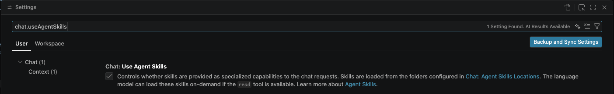{ width="850" style="display: block; margin: 0 auto; border: 1px solid lightgray; border-radius: 8px;"}

2. **Enable** the checkbox if it is not already enabled.
3. If you had to enable them, reload the window: `Ctrl+Shift+P` → `Developer: Reload Window`.

### Where skills live

VS Code automatically scans these project directories for skills ([VS Code docs](https://code.visualstudio.com/docs/agent-customization/agent-skills)):

| Location          | Convention                         |
| ----------------- | ---------------------------------- |
| `.agents/skills/` | agentskills.io cross-host standard |
| `.github/skills/` | GitHub convention                  |
| `.claude/skills/` | Anthropic convention               |

## Step 2.2: Create a skill

A skill is simply a folder containing a `SKILL.md` file, following an open standard defined by [agentskills.io](https://agentskills.io/home).

1. In the Chat view, type `/skills` and press Enter:

    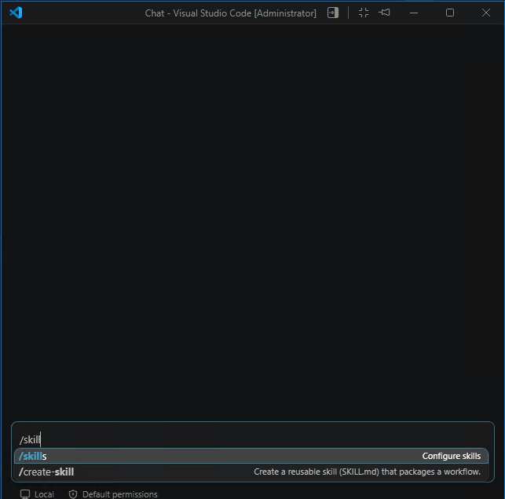{ width="450" style="display: block; margin: 0 auto; border: 1px solid lightgray; border-radius: 8px;"}

2. Select **+ New Skill...**:

    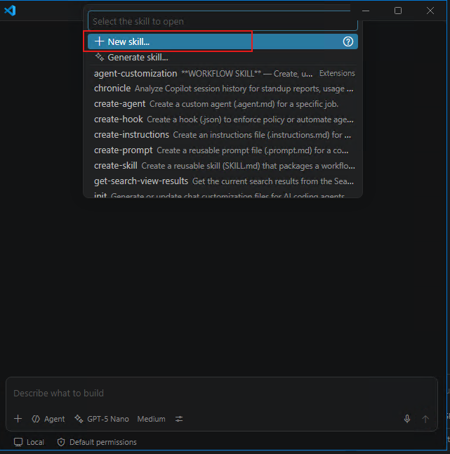{ width="450" style="display: block; margin: 0 auto; border: 1px solid lightgray; border-radius: 8px;"}

3. And select the default option **~/.agents/skills (default) Workspace**:

    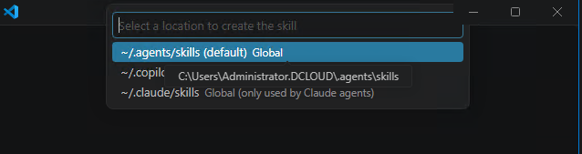{ width="450" style="display: block; margin: 0 auto; border: 1px solid lightgray; border-radius: 8px;"}

4. Name the new skill `meeting-review`:

    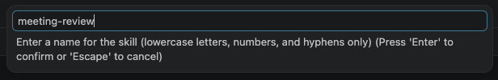{ width="850" style="display: block; margin: 0 auto; border: 1px solid lightgray; border-radius: 8px;"}
        
5. This will create a new file for you:

    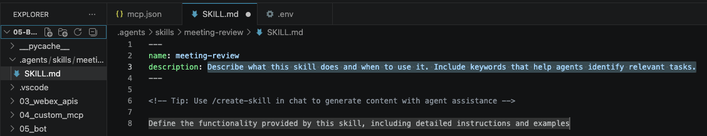{ width="850" style="display: block; margin: 0 auto; border: 1px solid lightgray; border-radius: 8px;"}

6. Replace the generated contents with the skill below:

    ??? Tip "SKILL.md"
        ````markdown
        ---
        name: meeting-review
        description: >-
          Use when the user asks to prepare for, review readiness of, check what is missing
          from, or fix readiness gaps in their meetings. Triggers on phrases like 'help me
          prepare', 'am I ready for', 'check my schedule for gaps', or 'add an agenda to
          my meetings'. This skill evaluates agendas, invitees, and conflicts, and can
          update missing meeting details. Do NOT use it for plain requests to list meetings.
        argument-hint: "person or time range"
        ---
        
        # Meeting Review
        
        ## Tools
        
        Use the Webex Meeting MCP server only.
        
        | Need | Tool |
        |---|---|
        | Find upcoming meetings | `webex-list-meetings` |
        | Set agenda, title, time, or invitees | `webex-update-meeting` |
        
        If no Webex Meeting tool is available, output
        `WEBEX MEETING TOOLS NOT AVAILABLE` and stop. Do not answer from memory.
        
        ## Procedure
        
        1. Call `webex-list-meetings` with `includeParticipants=true` as the only parameter.
        Add `from`/`to` only if the user gave an explicit date range.
        If the user asked to add or change an agenda, stop here and do only this:
        call `webex-update-meeting` once per meeting, using the meeting ID from this
        list and no other meeting tool, then report whether each update succeeded.
        Do not produce the readiness template.
        2. Check all three dimensions for every meeting:
            - **Agenda** — is the `agenda` field non-empty? A meeting without one wastes
              its own first ten minutes, so this is the highest-value flag.
            - **Invitees** — is anyone listed besides the host?
            - **Conflicts** — compare each meeting's start and end against every other
              meeting in the result set. Flag both sides of any overlap.
        3. Report every check, including the ones that pass. A silent check reads as a
            skipped check.
        4. Produce the checklist using the template below.
        5. If the user asks to add or change an agenda, call `webex-update-meeting` once
        per meeting, using the meeting ID from step 1. Never create or delete a meeting.
        Report whether each update succeeded.
        
        ## Output template
        
        ```markdown
        ### Meeting readiness
        
        > **<title>** · <weekday> <HH:MM>–<HH:MM>
        > Agenda · present or **missing**
        > Invitees · <invitee names, comma-separated, or **none**>
        > Conflict · none, or **overlaps with <other title>**
        
        **To do**
        1. <one action per gap, most urgent first>
        ```
        
        ## Gotchas & Constraints
        
        - **Creating Agendas:** `webex-create-meeting` has no `agenda` parameter, so a newly
        scheduled meeting needs a follow-up `webex-update-meeting` call to set one. Do not
        imply the agenda was set during creation.
        - **Missing Invitee Data:** `webex-list-meetings` only returns invitees when
        `includeParticipants=true`. If the invitee field is absent from the tool response,
        the data was not requested. Re-query the tool. Do NOT report invitees as **none**
        unless the field is explicitly present and empty. Use each invitee's display name,
        or their email address if no name is returned.
        - **Times:** The tool returns UTC. User is on "Central European time": add 2 hours from the
        last Sunday of March to the last Sunday of October, and 1 hour otherwise. Never
        print the UTC value, and never ask the user to confirm a timezone.
        - **No Hallucination:** Report only what the tools return. Never infer an attendee
        list or agenda content from a meeting title.
        - **No Local Storage:** Never create, edit, or save a local file. This skill produces
        chat output only. Meeting data belongs in Webex, not on disk. If a tool cannot store
        a value the user asked for, report the limitation and stop.
        ````

    ??? Note "Best practices"

        The file you just pasted is a worked example of how to write a skill. Each part is there because a vaguer version of it failed.

        **Say when, not just what:** The `description` is written as phrases a person would actually type — "help me prepare", "am I ready for", "add an agenda to my meetings" — and it ends by saying when *not* to load the skill. Until the skill activates, that text is the only part the agent sees, so it is what decides whether the file is read at all.

        - **Give one tool per need:** The table names a single tool for finding meetings and a single tool for changing one. Offering a choice ("you could use X or Y") hands the decision back to the model, which is the decision the skill exists to make. The line under the table matters just as much: if those tools are missing, stop and say so. Do not improvise.

        - **Write the steps, not the goal:** "Check for conflicts" is a wish. "Compare each meeting's start and end against every other meeting" is a procedure, and a small model can follow the second one. Step 1 is the same idea applied to the call itself: `includeParticipants=true`, and no other parameter unless the user asked for one.

        - **Show the output instead of describing it:** The template is a block the model can copy, which is why it is fenced rather than explained in prose. Keep instructions *about* the template outside that block.

        - **Record corrections as gotchas, and keep them to one point each:** Every bullet in that section is a failure already seen. Creating a meeting cannot set an agenda. Invitees come back only when the call asks for them. Times come back in UTC, so the skill states the conversion instead of letting the model guess or ask. When a run goes wrong, add the correction here. Do not grow the procedure with the story of how you found it.

        - **Leave out what the model already does:** Nothing in the file explains what a meeting is, and nothing tells the model to sort a list. A skill earns its place by adding the judgment the model lacks — the order of checks, the API constraints, the shape of the answer. This one is about 70 lines. If a skill needs a preamble, it is usually explaining the wrong thing.

8. **Save** the file.
9. **Reload the window**: `Ctrl+Shift+P` → `Developer: Reload Window`.

!!! Warning
    Reload after every edit to `SKILL.md` in this lab. You will edit the skill again in the Exercise, and the reload is what makes the change take effect before you re-run.

### Reading the front matter

Here are two important rules from the [agentskills.io specification](https://agentskills.io/specification):

- `name` must be lowercase letters, numbers, and hyphens, and **match the folder name**.
- `description` says what the skill does **and when to use it** — this is the only part the agent sees until the skill activates, so it is what decides whether the skill loads at all.

Notice how the description starts with phrases *you* would actually type (like "help me prepare" or "am I ready for") and ends with a specific exclusion. This is deliberate, and you'll see why later in this section.

## Step 2.3: Verify discovery

Do **not** ask the agent "what skills are available?", a model without any skills loaded might just make up a plausible answer. Instead, check the observable state.

Type `/` in the chat input. `meeting-review` should appear in the list.

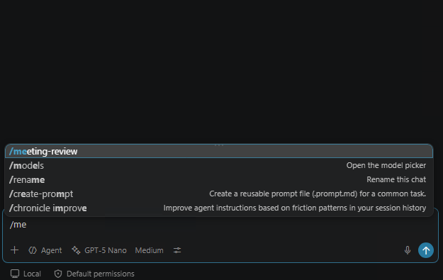{ width="450" style="display: block; margin: 0 auto; border: 1px solid lightgray; border-radius: 8px;"}

!!! Note "If `meeting-review` does not appear"
    - Confirm `chat.useAgentSkills` is enabled (Step 2.1).
    - Confirm the `name` in the front matter is exactly `meeting-review` and matches the folder name.
    - Reload the window again (`Developer: Reload Window`).
    - If you created the file by hand instead of using `/skills`, it may be in a directory VS Code does not scan. Delete it and create it again with `/skills`.

## Step 2.4: Progressive disclosure

Agent Skills load in three stages, allowing many skills to be available without consuming too many resources:

1. **Discovery** — at startup, the agent reads only each skill's name and description (~100 tokens). That is everything it knows about `meeting-review` until it has a reason to know more.
2. **Activation** — when your request matches the description, or when you type `/meeting-review`, the full `SKILL.md` body is pulled into the conversation.
3. **Execution** — the agent now works through the procedure in order, calls the MCP tools the skill told it to use, and shapes the answer to match the skill's output template.

!!! Warning "Important"
    The full instructions only load when needed. This is why the `description` field is so important: it's the only part the model sees when deciding whether to use the skill in a conversation.

## Step 2.5: Schedule meetings

Let's schedule two meetings so we have some data to review. Neither meeting will have an agenda because `webex-create-meeting` doesn't have an agenda parameter. This limitation is intentional for this exercise, as the skill will flag this missing information.

1. Schedule the first meeting:

- Ask: *"Schedule a meeting with admin@webexone-ai-assistant.wbx.ai tomorrow at 10am CET. Title: Planning Session."*

    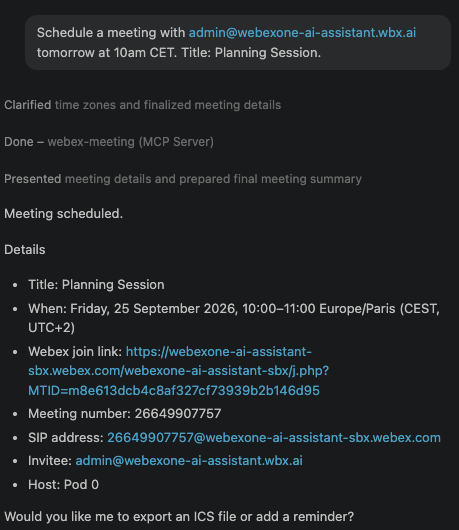{ width="450" style="display: block; margin: 0 auto; border: 1px solid lightgray; border-radius: 8px;"}

2. Schedule the second meeting:

- Ask: *"Schedule a meeting with admin@webexone-ai-assistant.wbx.ai tomorrow at 2pm CET. Title: Architecture Review."*

    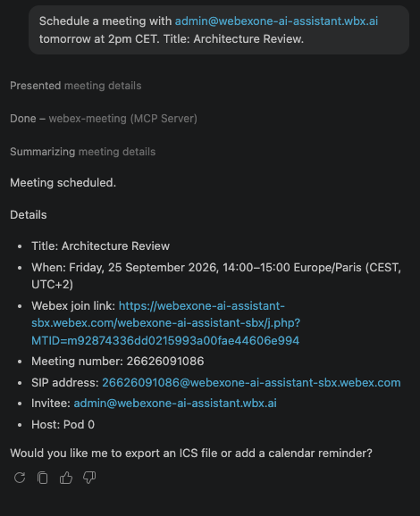{ width="450" style="display: block; margin: 0 auto; border: 1px solid lightgray; border-radius: 8px;"}

You now have two upcoming meetings, both without agendas.

## Step 2.6: Configure project instructions

Before we test the skill, we need to ensure the agent acts as an operational assistant rather than a coding assistant. Otherwise, the rest of the lab becomes unpredictable: the agent will sometimes load your skill and sometimes read the lab's Python files instead, sometimes call the Webex tools and sometimes write its own notes to disk.

### Why the agent might fail to use the skill

VS Code Chat was built first and foremost as a **coding** assistant. In Agent mode, it hands the model *every* tool it has: reading files, searching the codebase, editing files, running terminal commands, saving notes, plus whatever your MCP servers contribute. Then it lets the model choose.

That choice is easier for the model in some situations than others. When you asked it to *create* meetings before, the conversation already contained successful Webex tool calls, so a follow-up question about your meetings is straightforward — it has just seen which tools work. Start a fresh chat, or ask something more open-ended like "help me prepare", and that advantage disappears. In a workspace full of Python, with a couple of dozen tools on offer, a small model, like the one we are using, will sometimes go and read the lab's source code, or save its own notes to a file, instead of loading the skill that was written for exactly this question:

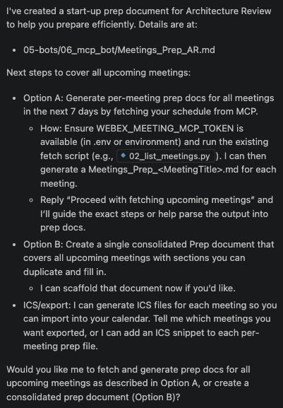{ width="450" style="display: block; margin: 0 auto; border: 1px solid lightgray; border-radius: 8px;"}

That is not a broken skill or a broken MCP server. It is a tool-selection problem: the model has too many plausible options and no stated order to try them in, and it is choosing its file-editing tools over the Webex tools.

### The fix: a project instructions file

To fix this, you need to create a project instructions file.

A project instructions file is prepended to every request you send in this workspace. It is where you state, once, what kind of assistant the agent is and in what order it should reach for things.

1. Create a new file named `AGENTS.md` at the root of your workspace.
2. Paste the following content into it and save:

    !!! Note "AGENTS.md"
        ```markdown
        # Project instructions
        
        You are an operational assistant, not a coding assistant. This repository is lab
        material. It is never the data the user is asking about.
        
        Follow these three rules on every request, in this order.
        
        ## Rule 1 - Load a matching skill before you do anything else
        
        Your first action on every request is to check the available Agent Skills.
        
        1. Read the list of available skills and their descriptions.
        2. If a skill description matches what the user asked for, load that skill now.
        3. Follow the loaded skill exactly: its procedure, its tool choices, and its
           output format.
        
        Do not call an MCP tool, read a file, or begin your answer until you have done
        this check. Loading the skill comes first, then the tools the skill tells you to
        call. A skill exists because the default behaviour was not good enough.
        
        If the skill defines an output template, follow its structure. Emit it as chat
        text so it renders. Do not wrap the answer in a code block. Do not add sections
        the template does not have. The format is part of the answer.
        
        ## Rule 2 - Use tools, never this repository
        
        - Answer questions about live systems by calling an MCP tool.
        - Never read, search, or list the files in this repository to answer a question
          about a live system. The answer is not in these files.
        - If no tool can answer the question, say so and name the tool you are missing.
          Never answer from memory, and never ask the user to paste in data that a tool
          could have returned.
        - If a tool returns an error, report the tool name and the error text. Do not
          work around a failing tool by another route.
        
        ## Rule 3 - Do not write anything to disk
        
        Do not create, edit, rename, or delete a file unless the user explicitly asks you
        to change a file. Do not save notes, memories, or summaries as files. Writing a
        file is never a substitute for calling a tool.
        
        Return your answer as chat text.
        ```

Notice what it does *not* say. It never mentions Webex, and it never names a specific MCP server or tool. It only tells the model what kind of assistant it is in this workspace: check for a skill before acting, reach for MCP tools rather than the files, and leave the disk alone. That keeps it valid for every lab that follows, and for any MCP server you add later.

### Why the wording matters more than the content

An instruction can be correct and still be ignored. A strong reasoning model fills in what you meant; a small one takes what you wrote, and any room you leave it becomes room to do something else. The file above is written to leave as little room as possible. Four habits do most of the work, and you can apply them to any instructions file you write:

- **State an order, not a preference:** *"Prefer a skill"* never says when to check. *"Your first action on every request is to check the available Agent Skills"* does. Put the rule that matters most first, because position is itself a signal.
- **Pair the instruction with a prohibition:** Saying what to do is not enough when something easier is available. Name the shortcut and forbid it: *"Do not call an MCP tool, read a file, or begin your answer until you have done this check."*
- **Write commands, not descriptions:** *"You are an operational assistant"* is shorter than *"you are acting as an operational assistant rather than a coding assistant"*, and leaves nothing to weigh up.
- **Leave out the rationale:** Explaining *why* each rule exists invites a small model to reason about the rule instead of following it. State what to do and stop.

The general rule: the weaker the model, the more your instructions have to read like a procedure and the less they can read like advice. Hedged verbs — *prefer*, *consider*, *try to*, *where appropriate* — are read as genuine permission to do otherwise. If you would be annoyed to see the opposite behaviour, do not write the instruction as a preference.

`AGENTS.md` is a [cross-agent standard](https://agents.md/){:target="_blank"}, so the same file also works in Copilot CLI, Codex, and other hosts. This is the "always applied" column of the table you read earlier: unlike a skill, it is prepended to every request, because it is guidance that should never be optional.

## Step 2.6: Three ways to ask the same question

Two meetings, one MCP server, three phrasings. What changes between them is whether the skill loads at all, and what the answer is worth once it does.

### 1 - Ask for a list

- Ask: *"What webex meetings do I have scheduled?"*

    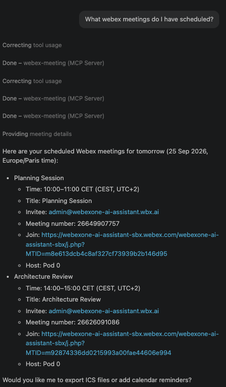{ width="450" style="display: block; margin: 0 auto; border: 1px solid lightgray; border-radius: 8px;"}

You get titles, times, attendees, links, ... but nothing else: no gaps called out, no checks run, nothing to act on.

The skill should stay out of this one, and that is deliberate. The last line of its description rules out "a plain list of meetings with no readiness question", which is precisely what you asked for. 

You can expand the references to confirm that `meeting-review` wasn't loaded.

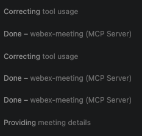{ width="450" style="display: block; margin: 0 auto; border: 1px solid lightgray; border-radius: 8px;"}

### 2 - Ask readiness question

Now, try it  for the same data a different way:

- Ask: *"Help me prepare for my upcoming webex meetings."*

    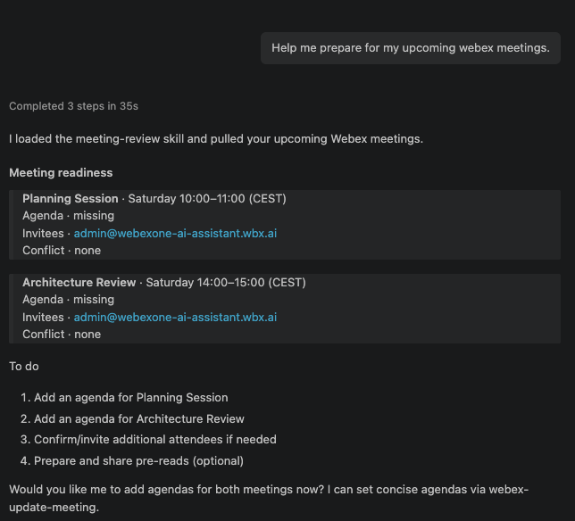{ width="450" style="display: block; margin: 0 auto; border: 1px solid lightgray; border-radius: 8px;"}

This phrasing matches the description, so the model should load the skill without being told. Check the steps at the top of the reply: you are looking for **Read skill · meeting-review**, followed by one or more calls to the Webex Meeting MCP server.

This is the interesting part of the lab, so run it two or three times in fresh chats and compare what you get. Because `AGENTS.md` tells the model to check for a skill before doing anything else, the skill should load on most runs — but as that step warned, it is guidance and not a guarantee.

### 3 - Name the skill yourself

One solution to make the skill take efect, it is too force it as context. for that, first write the `/meeting-review` in the chat:

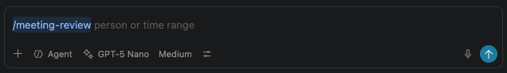{ width="450" style="display: block; margin: 0 auto; border: 1px solid lightgray; border-radius: 8px;"}

The leading `/meeting-review` loads the skill body into the request before the model ever sees your question, so activation stops being the model's decision. It no longer has to *recognise* that the skill applies, only follow it. 

Naming the skill removes all doubt about *loading*, but it does not guarantee *obedience*. What the skill asks for looks like this (your day and times will match whenever you scheduled the meetings):

- Now, ask: *"Help me prepare for my upcoming webex meetings."*

    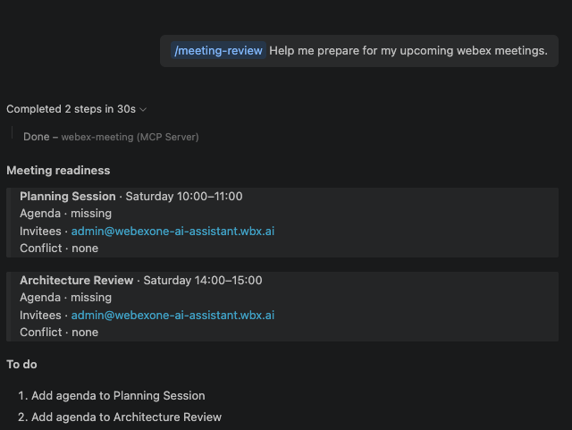{ width="450" style="display: block; margin: 0 auto; border: 1px solid lightgray; border-radius: 8px;"}

The template shows every check, whether it passes or fails. This makes it clear that the agent checked the agenda, invitees, and conflicts instead of accidentally skipping one.

!!! Note
    Even when you name the skill, a small model may not follow it to the letter. The layout can drift, or a check can be summarised in prose rather than listed. Compare your output against the block above; noticing that gap is part of the point.

### What the skill actually added

The two approaches ran on identical data: the same `webex-list-meetings` call, the same two meetings. Everything that differs came from the skill.

| | Ask for a list | Name the skill |
| --- | :---: | :---: |
| Lists your meetings | yes | yes |
| Checks each one for an agenda | — | yes |
| Checks who was invited | — | yes |
| Compares meetings for overlaps | — | yes |
| Reports what passed, not only what failed | — | yes |
| Ends with something you can act on | — | yes |

No new tools, no new API access. Just judgment applied to data the agent could already reach.

!!! Tip "Try the conflict flag"
    Schedule a third meeting that overlaps one of the first two, then re-run.
    The skill flags `CONFLICT` on **both** sides of the overlap.

## Exercise: Teach the skill a new rule

So far the skill has only *reported* things. Now you will let it make changes in Webex, watch it go further than you wanted, and pull it back by adding one sentence to `SKILL.md`.

### 1 - Let it act

!!! Note
    This exercise tests what the skill tells the agent to do, not whether the agent loads the skill on its own. That is why you name the skill explicitly: it avoids random results.

Type `/meeting-review` so the skill is loaded, then ask it to add the missing agendas:

- Ask: *"/meeting-review Add an agenda to my upcoming Webex meetings."*

    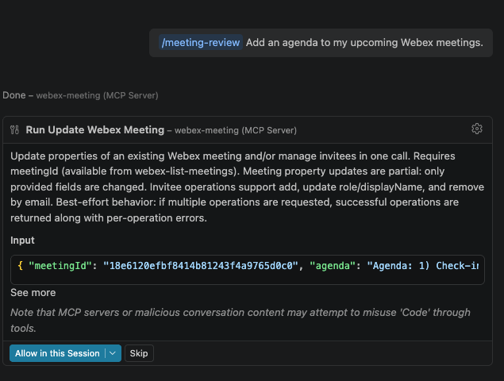{ width="450" style="display: block; margin: 0 auto; border: 1px solid lightgray; border-radius: 8px;"}

Watch what it does. The skill tells it how to update an agenda, but not who writes it. So the agent **writes agenda text it invented** and applies it straight away with `webex-update-meeting`, without showing you the text first. Your meetings are now updated with wording you never approved.

The tool call itself was correct. The problem is that a judgement call was made on your behalf, silently.
    
### 2 — Add a guardrail to the skill

Open your `meeting-review` skill (`/skills` → select it → edit) and add this line to the **Gotchas** section:

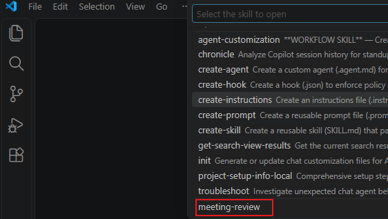{ width="450" style="display: block; margin: 0 auto; border: 1px solid lightgray; border-radius: 8px;"}

```markdown
- **Approval:** Never write agenda text you invented. Draft the wording, show it to
the user, and wait for explicit approval before calling `webex-update-meeting`.
```

Save the file, then **reload the window** (`Ctrl+Shift+P` → `Developer: Reload Window`).

### 3 — Re-run and compare

Ask exactly the same question again, in a new chat window:

- Ask: *"/meeting-review Add an agenda to my upcoming Webex meetings."*

    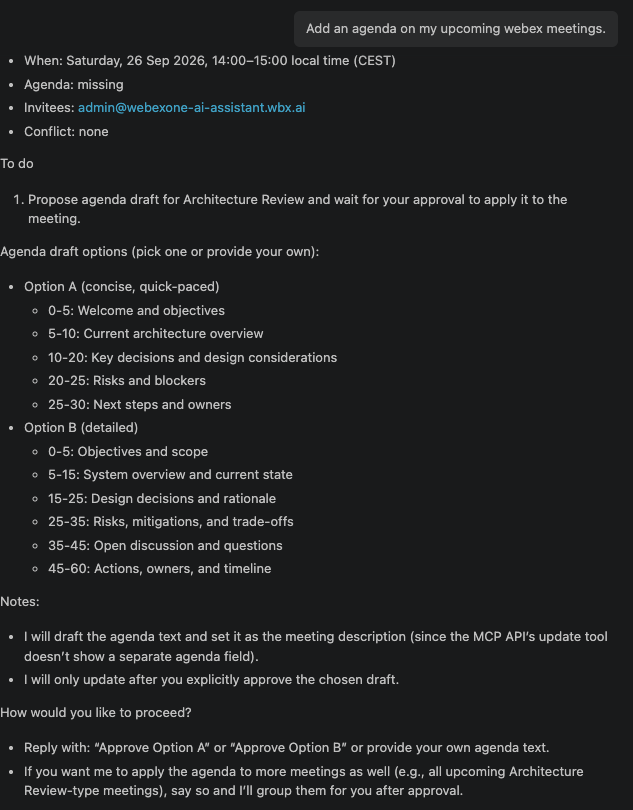{ width="750" style="display: block; margin: 0 auto; border: 1px solid lightgray; border-radius: 8px;"}

The agent now presents draft agenda text and **waits for your approval** before touching Webex. Approve it, and confirm the agenda is set.

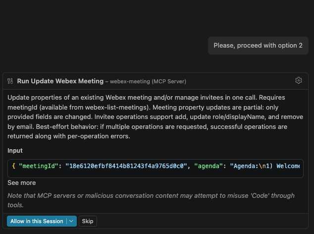{ width="450" style="display: block; margin: 0 auto; border: 1px solid lightgray; border-radius: 8px;"}

You just changed agent behaviour with one line of markdown. No code.

### Optional: schedule a meeting with an agenda

The skill's Gotchas record that `webex-create-meeting` has no agenda parameter, so a new meeting always starts without one. Test how the agent handles that:

- Ask: *"Schedule a meeting tomorrow at 4pm titled Budget Review, with the agenda: review Q4 spend."*

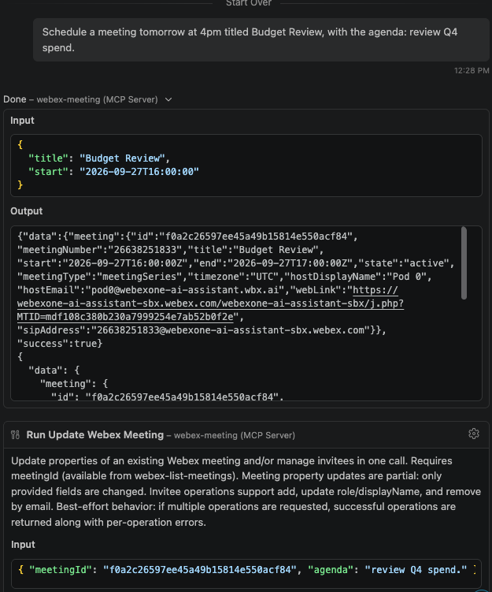{ width="850" style="display: block; margin: 0 auto; border: 1px solid lightgray; border-radius: 8px;"}

The agent creates the meeting first, then calls `webex-update-meeting` to add the agenda, because one tool cannot do both. Without that gotcha, an agent can create the meeting, drop the agenda, and still report the request as done.

!!! Tip "Key takeaway"
    Guardrails are simple lines of text in `SKILL.md`, not a separate feature. The most useful ones come from mistakes you have watched an agent make.
