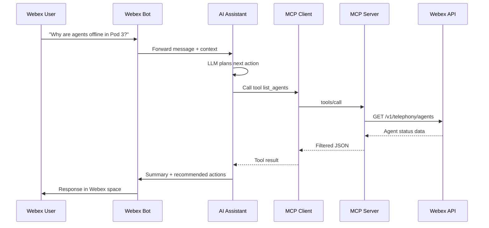

# Lab 1 - AI Assistants and Architecture

In this section, you will learn how AI assistants, agents, and MCP fit together in an operational Webex troubleshooting scenario.

## Learning Objectives

Upon completion of this section, you will be able to:

- Compare web chat, IDE-embedded assistance, and production AI agents
- Describe the lab architecture: User → Bot → Agent → MCP → Webex API
- Identify when to use Webex REST APIs directly versus Webex MCP servers

## Step 1.1: From web chat to operational agent

| Interface | Context | Best for |
| --- | --- | --- |
| Web chat (e.g., claude.ai) | Manual prompts and pasted content | Questions, brainstorming, one-off code |
| IDE assistant (Cursor, Copilot) | Open files, workspace, selected code | Development, refactoring, in-flow automation |
| AI agent | Tools, MCP, skills, guardrails | 24/7 operational tasks, multi-step workflows |

!!! Note
    A **bot** is the interaction channel in Webex. An **agent** is the system that reasons, plans, calls tools, and validates results behind the bot.

## Step 1.2: Lab architecture

## Step 1.3: The N × M problem MCP solves

Without a standard protocol, every AI application needs custom glue code for every backend system — creating fragile, exponential integration work.

MCP reduces this to **N + M** connections by providing a universal interface between AI hosts and platform capabilities.

## Step 1.4: When to use Webex APIs vs Webex MCP

| Choose Webex REST APIs when… | Choose Webex MCP when… |
| --- | --- |
| You need full control over every request | You want natural-language access from an AI client |
| Performance and custom business logic matter | You need rapid prototyping across MCP-compatible tools |
| You build enterprise apps with webhooks | You connect IDE or agent frameworks to Webex quickly |

## Exercise

Answer the following in your lab notes:

1. What triggers your assistant in this lab — a human message, an alert, or both?
2. Which Webex data would you need to troubleshoot "call queues backing up"?
3. Which component owns credentials — the LLM, the MCP server, or the MCP host?

!!! Note "Screenshot needed"
    Add architecture diagram slide asset from the session deck (User → Bot → Agent → MCP → API).

## Content still to define

- Session ID for cross-reference (BRKSEC-XXXX)
- Demo video or animated architecture walkthrough
