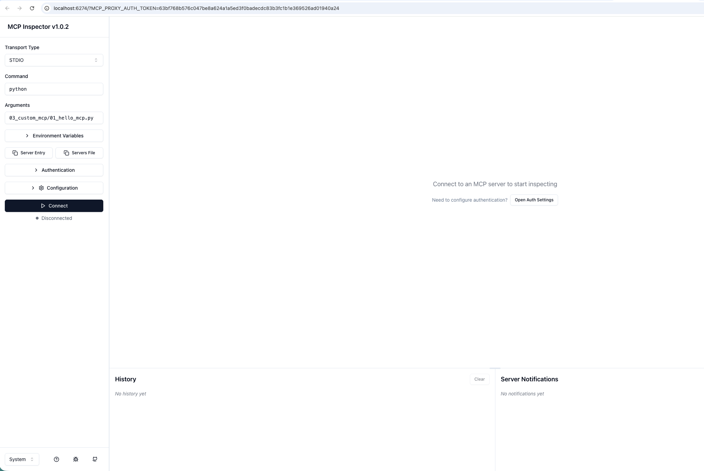
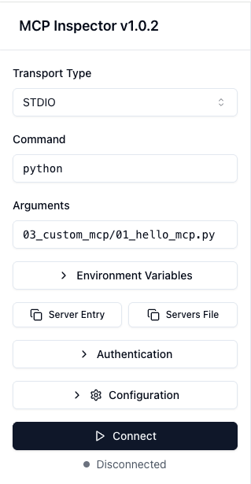
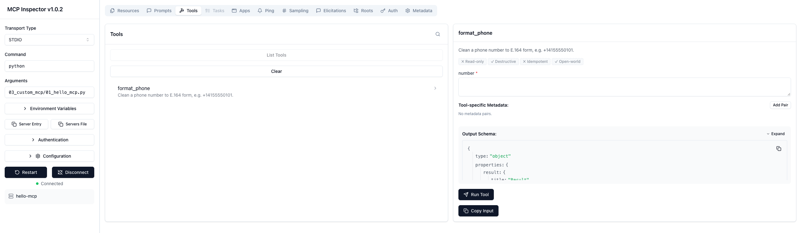
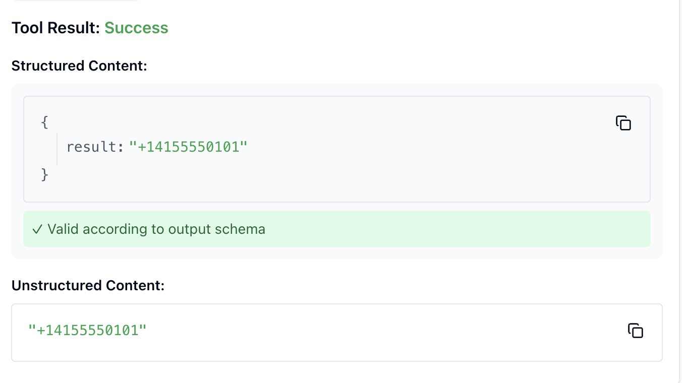
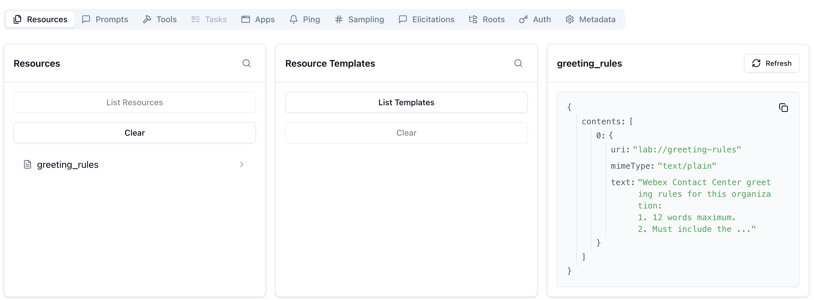
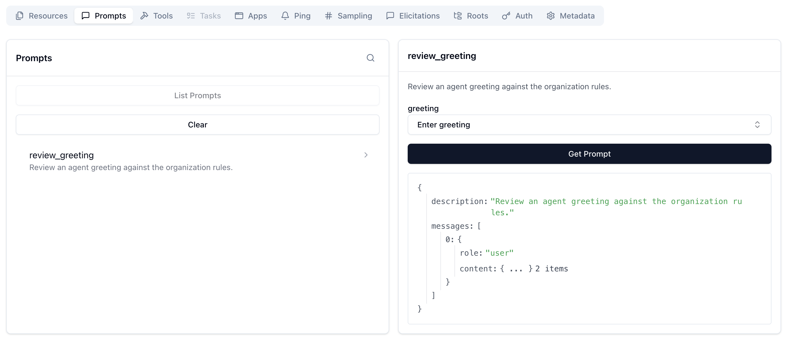
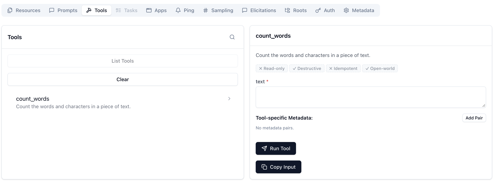

# Lab 3 - Build a Custom MCP Server

In this chapter you will build an MCP server that lets an AI assistant manage Webex Contact Center address books.

## Step 3.1: Defining and Implementing Tools

We will use the official `mcp` Python SDK to create our server. The SDK makes it incredibly easy to define tools and their execution logic using decorators.

### Your First MCP Server

In this section we are going to start wit the simpliest MCP server that does real work: one tool, no network, no token. It takes a messy phone number and returns it in E.164 format.

1. Navigate to `03_custom_mcp/01_hello_mcp.py` and review the code.

    ??? Tip "Python Code"
        ```python
        # Step 01 - the smallest MCP server: one tool, no network, no token.
        
        import logging
        import re
        from mcp.server import MCPServer
        
        logging.basicConfig(level=logging.INFO, format="%(asctime)s %(levelname)s %(message)s")
        log = logging.getLogger("hello-mcp")
        
        # Create an MCP server instance.
        mcp = MCPServer("hello-mcp")
        
        # Register a tool that cleans a phone number to E.164 format.
        @mcp.tool()
        async def format_phone(number: str) -> str:
            """Clean a phone number to E.164 form, e.g. +14155550101."""
            digits = re.sub(r"\D", "", number)
            if not number.startswith("+") and len(digits) == 10:
                digits = "1" + digits
            return "+" + digits
        
        # Start the server on stdio and wait for a client to connect.
        if __name__ == "__main__":
            log.info("hello-mcp running on stdio - waiting for a client (Ctrl+C to stop).")
            try:
                mcp.run()
            except KeyboardInterrupt:
                log.info("Stopped.")
        ```

    Everything a `@mcp.tool()` decorator does is on display here:
    
    1. **Discovery.** The client learns there is a tool called `format_phone`.
    2. **Description.** The docstring becomes the tool's description. This is not documentation for you — it is how the model decides whether this is the right tool to call. A vague or misleading docstring produces a tool the model misuses.
    3. **Schema.** The `number: str` annotation becomes the input schema, so the client knows to send one string argument.

2. In VS Code, make sure your terminal is in the correct folder:

    * cd ../03_custom_mcp

3. To test our MCP server we will be using a tool called **MCP Inspector**. It is the official, interactive debugging tool for MCP servers. It runs a local web interface where you can list tools, resources, and prompts, and execute them directly without needing an LLM in the loop.
    
    * npx @modelcontextprotocol/inspector python 01_hello_mcp.py
   
    !!! Note
        If it asks to install the `@modelcontextprotocol/inspector` package, press `y`.*

            ```terminal
            Need to install the following packages:
            @modelcontextprotocol/inspector@1.0.2
            Ok to proceed? (y) 
            ```

4. Once it starts, it should open a new tab for you, if not, it will provide a local URL (usually `http://localhost:6274`). Open that URL in your browser.

    { width="950" style="display: block; margin: 0 auto; border: 1px solid lightgray; border-radius: 8px;" }

5. Select the following and click `Connect`:

    |        	|           |
    |-----------------------	|--------------|
    | **Transport Type**       	| STDIO |
    | **Command**       	| Python |
    | **Arguments**       	| 01_hello_mcp.py |

    { width="950" style="display: block; margin: 0 auto; border: 1px solid lightgray; border-radius: 8px;" }

6. In the MCP Inspector web interface, click on the **Tools** tab, then **List Tools** and you will see the `format_phone` tool listed.

    { width="650" style="display: block; margin: 0 auto; border: 1px solid lightgray; border-radius: 8px;" }

7. Click on **format_phone**. In the arguments JSON editor, provide a messy phone number:
    ```json
    {
      "number": "(415) 555-0101"
    }
    ```

8. Click **Run Tool**. You should see the result `+14155550101` returned immediately.

    !!! Note
        You may need to scroll down

    { width="650" style="display: block; margin: 0 auto; border: 1px solid lightgray; border-radius: 8px;" }

    This confirms your server works perfectly in isolation! You can stop the MCP in your terminal with `Ctrl+C`, we will still use the MCP inspector in the next exercise.

### MCP Primitives: Tool, Resource, and Prompt

Next, we are going to build a single script that demonstrates the entire MCP architecture, which consists of three distinct primitives:

- **A tool** is an action the model calls. 
- **A resource** is context the client attaches, like handing the model a rulebook. 
- **A prompt** is the one primitive a human triggers directly — from a slash command or menu.
</br>
1. Navigate to `03_custom_mcp/02_hello_resource_prompt.py` and review the code:

    ??? Tip "Python Code"
        ```python
        # Step 02 - all three MCP primitives (tool, resource, prompt) without credentials.
        
        import logging
        from mcp.server import MCPServer
        
        logging.basicConfig(level=logging.INFO, format="%(asctime)s %(levelname)s %(message)s")
        log = logging.getLogger("hello-resource-prompt")
        
        # Create an MCP server instance.
        mcp = MCPServer("hello-resource-prompt")
        
        
        # Register a tool that counts words and characters in a piece of text.
        @mcp.tool()
        async def count_words(text: str) -> dict:
            """Count the words and characters in a piece of text."""
            words = text.split()
            return {"words": len(words), "characters": len(text)}
        
        
        # Register a resource with greeting rules the tool cannot know on its own.
        @mcp.resource("lab://greeting-rules")
        def greeting_rules() -> str:
            return (
                "Webex Contact Center greeting rules for this organization:\n"
                "1. 12 words maximum.\n"
                "2. Must include the agent's first name.\n"
                "3. Never use 'ASAP' or 'obviously'.\n"
            )
        
        
        # Register a prompt that chains the resource and the tool into a review workflow.
        @mcp.prompt()
        def review_greeting(greeting: str = "") -> str:
            """Review an agent greeting against the organization rules."""
            return (
                f"Review this agent greeting:\n\n"
                f"{greeting or '<paste a greeting here>'}\n\n"
                "1. Read the lab://greeting-rules resource for the org rules.\n"
                "2. Call count_words to measure the greeting.\n"
                "3. Tell me pass or fail, and why."
            )
        
        
        # Start the server on stdio and wait for a client to connect.
        if __name__ == "__main__":
            log.info("hello-resource-prompt running on stdio - waiting for a client (Ctrl+C to stop).")
            try:
                mcp.run()
            except KeyboardInterrupt:
                log.info("Stopped.")
        ```

2. Run your code with the following command:

    * python 02_hello_resource_prompt.py

3. Go to the MCP Inspector. Click on **Disconnect**.
4. Change **Arguments** to `02_hello_resource_prompt.py` and click **Connect**.
5. Click on **Resources** and then **List Resources**. You will see `lab://greeting-rules`. You can click it to read the greeting rules.
   ??? Note "Resources"
       { width="850" style="display: block; margin: 0 auto; border: 1px solid lightgray; border-radius: 8px;" }
6. Click on **Prompts** and then **List Prompts**. You will see `review_greeting`.
   ??? Note "Prompts"
       { width="850" style="display: block; margin: 0 auto; border: 1px solid lightgray; border-radius: 8px;" }
7. Click on **Tools** and then **List Tools**. You will see `count_words`. You can test it by providing a `"text"` argument.
   ??? Note "Tools"
       { width="850" style="display: block; margin: 0 auto; border: 1px solid lightgray; border-radius: 8px;" }

### Understand Webex Contact Center Address Book APIs

Before connecting to the real API, let's understand how Address Books work in Webex Contact Center. An address book is a named list of contacts that agents see in their desktop. 

Below is a screenshot showing how address books are seen in the agent desktop:

{ width="800" style="display: block; margin: 0 auto; border: 1px solid lightgray; border-radius: 8px;" }

#### Where are they configured?

They can only be configured by Administrators. In **Collaboration Control Hub** -> **Contact Center**, under **Desktop Experience** section, you have **Address Book**.

{ width="900" style="display: block; margin: 0 auto; border: 1px solid lightgray; border-radius: 8px;" }

One address book is assigned to an agent profile.

You can also configure it using an API, using the Service App we created before. 


You can explore Webex Contact Center APIs in the [Webex Developer Portal - WxCC APIs](https://developer.webex.com/webex-contact-center/docs/webex-contact-center).

{ width="500" style="display: block; margin: 0 auto; border: 1px solid lightgray; border-radius: 8px;" }
{ width="700" style="display: block; margin: 0 auto; border: 1px solid lightgray; border-radius: 8px;" }
{ width="650" style="display: block; margin: 0 auto; border: 1px solid lightgray; border-radius: 8px;" }
{ width="650" style="display: block; margin: 0 auto; border: 1px solid lightgray; border-radius: 8px;" }


### Reading from Webex Contact Center API

The first server that talks to the Webex Contact Center exposes two read-only tools — `list_address_books` and `list_entries`.

The server checks at startup for three values `ACCESS_TOKEN`, `WEBEX_ORG_ID` and `WXCC_CONFIG_API_BASE`.

??? Tip "ACCESS_TOKEN, WEBEX_ORG_ID & WXCC_CONFIG_API_BASE"
    - **`ACCESS_TOKEN`**: This is going to be the Service App token created in the previous task.
    - **`WEBEX_ORG_ID`** and **`WXCC_CONFIG_API_BASE`**: These are related to the sandbox and will be set up in advance for you, but here is how you could find them:
    
        For `WEBEX_ORG_ID`, you need to go in Collaboration Control Hub to Account:
    
        { width="650" style="display: block; margin: 0 auto; border: 1px solid lightgray; border-radius: 8px;" }
    
        For `WXCC_CONFIG_API_BASE`, you can find it using this information (in this case it will be `us1`):
    
        { width="650" style="display: block; margin: 0 auto; border: 1px solid lightgray; border-radius: 8px;" }
    
        While general Webex APIs use a global endpoint (`https://webexapis.com/v1`), Webex Contact Center (WxCC) specific data and agent APIs route through regional endpoints. [1](https://www.cisco.com/c/en/us/support/docs/contact-center/webex-contact-center/218418-configure-webex-contact-center-apis-with.html)
        
        The region can be identified through the following methods:
        
        1. **Check in Webex Control Hub**
           You can find your data residency/region directly inside the dashboard: [1](https://community.cisco.com/t5/webex-for-developers/programmatically-retrieve-the-data-center-instance-for-contact/m-p/5252255)
           - Log into Webex Control Hub.
           - Navigate to Services > Contact Center > Tenant Settings.
           - Go to General > Service Details.
           - Look for the Country of Operation or data center zone field. [1](https://cloud.cloverhound.com/docs/campaigns/integration), [2](https://community.cisco.com/t5/webex-for-developers/programmatically-retrieve-the-data-center-instance-for-contact/m-p/5252255)
           
        2. **Map Region to the Correct API Base URL**
           Once you know the country or code of operation, match it to the standard Webex Contact Center datacenter variables (`us1`, `eu1`, `eu2`, `anz1`, `jp1`, `sg1`): [1](https://help.webex.com/en-us/article/n1lsqvu/Integrate-Webex-Contact-Center-CRM-Connector-for-Microsoft-Dynamics-365-(Version2-New)), [2](https://www.cisco.com/c/en/us/support/docs/contact-center/webex-contact-center/218418-configure-webex-contact-center-apis-with.html)
           
           | Region / Operation Location | Datacenter Variable | API Base URL Example |
           | --- | --- | --- |
           | North America | `us1` | `https://api.wxcc-us1.cisco.com` |
           | United Kingdom | `eu1` | `https://api.wxcc-eu1.cisco.com` |
           | Europe | `eu2` | `https://api.wxcc-eu2.cisco.com` |
           | APJC (Australia / NZ) | `anz1` | `https://api.wxcc-anz1.cisco.com` |
           | Japan | `jp1` | `https://api.wxcc-jp1.cisco.com` |
           | Singapore | `sg1` | `https://api.wxcc-sg1.cisco.com` |

1. Navigate to `03_custom_mcp/03_read_books.py` and review the code:

    ??? Tip "Python Code"
        ```python
        # Step 03 - reading: list address books, then list entries inside one book.
        
        import logging
        import os
        import sys
        import httpx
        from dotenv import load_dotenv
        from mcp.server import MCPServer
        
        logging.basicConfig(level=logging.INFO, format="%(asctime)s %(levelname)s %(message)s")
        log = logging.getLogger("read-books")
        
        # Load credentials from .env.
        load_dotenv()
        
        TOKEN = os.environ.get("ACCESS_TOKEN")
        ORG_ID = os.environ.get("WEBEX_ORG_ID")
        CONFIG_API_BASE = os.environ.get("WXCC_CONFIG_API_BASE", "")
        
        # Stop early if any credential is missing.
        for _name, _value in (
            ("ACCESS_TOKEN", TOKEN),
            ("WEBEX_ORG_ID", ORG_ID),
            ("WXCC_CONFIG_API_BASE", CONFIG_API_BASE),
        ):
            if not _value:
                sys.exit(f"{_name} is not set. This lab needs Webex Contact Center - see .env.example.")
        
        # Build the API base URL and common headers.
        ORG = f"{CONFIG_API_BASE.rstrip('/')}/organization/{ORG_ID}"
        HEADERS = {"Authorization": f"Bearer {TOKEN}", "Accept": "application/json"}
        
        # Create an MCP server instance.
        mcp = MCPServer("read-books")
        
        
        # List all address books in the Contact Center organization.
        @mcp.tool()
        async def list_address_books(limit: int = 50) -> dict:
            """List the address books configured in this Contact Center organization."""
            async with httpx.AsyncClient(timeout=15) as http:
                response = await http.get(
                    f"{ORG}/v3/address-book", headers=HEADERS, params={"pageSize": limit}
                )
        
            if response.status_code != 200:
                return {"error": f"Webex Contact Center returned HTTP {response.status_code}."}
        
            books = [
                {"id": book.get("id"), "name": book.get("name"), "description": book.get("description")}
                for book in response.json().get("data", [])
            ]
            return {"count": len(books), "address_books": books}
        
        
        # List contacts inside one address book, using its id from list_address_books.
        @mcp.tool()
        async def list_entries(address_book_id: str, search: str = "") -> dict:
            """List the contacts inside one address book, optionally filtered by `search`.
        
            Pass the `address_book_id` returned by list_address_books.
            """
            params: dict = {"page": 0, "pageSize": 100}
            if search:
                params["search"] = search
        
            async with httpx.AsyncClient(timeout=15) as http:
                response = await http.get(
                    f"{ORG}/v2/address-book/{address_book_id}/entry", headers=HEADERS, params=params
                )
        
            if response.status_code != 200:
                return {"error": f"Webex Contact Center returned HTTP {response.status_code}."}
        
            entries = [
                {"id": entry.get("id"), "name": entry.get("name"), "number": entry.get("number")}
                for entry in response.json().get("data", [])
            ]
            return {"count": len(entries), "entries": entries}
        
        
        # Start the server on stdio and wait for a client to connect.
        if __name__ == "__main__":
            log.info("read-books running on stdio - waiting for a client (Ctrl+C to stop).")
            try:
                mcp.run()
            except KeyboardInterrupt:
                log.info("Stopped.")
        ```

### 5. Writing: Create and Fill an Address Book

This step writes to the API. It exposes exactly two tools: `create_address_book` and `add_entry`. 

Navigate to `03_custom_mcp/04_write_books.py` and review the code:

??? Tip "Python Code"
    ```python
        """
        Webex One 2026 - Troubleshoot and Manage Your Organization with an AI Assistant

        - Diego Manuel Jimenez Moreno
        - Mo Eyad Musallam
        """
        # Step 04 - writing: create an address book, then fill it with contacts.

        import os
        import sys
        import httpx
        from dotenv import load_dotenv
        from mcp.server import MCPServer

        # Load credentials from .env.
        load_dotenv()

        TOKEN = os.environ.get("ACCESS_TOKEN")
        ORG_ID = os.environ.get("WEBEX_ORG_ID")
        CONFIG_API_BASE = os.environ.get("WXCC_CONFIG_API_BASE", "")

        # Stop early if any credential is missing.
        for _name, _value in (
            ("ACCESS_TOKEN", TOKEN),
            ("WEBEX_ORG_ID", ORG_ID),
            ("WXCC_CONFIG_API_BASE", CONFIG_API_BASE),
        ):
            if not _value:
                sys.exit(f"{_name} is not set. This lab needs Webex Contact Center - see .env.example.")

        # Build the API base URL and common headers.
        ORG = f"{CONFIG_API_BASE.rstrip('/')}/organization/{ORG_ID}"
        HEADERS = {"Authorization": f"Bearer {TOKEN}", "Accept": "application/json"}

        # Create an MCP server instance.
        mcp = MCPServer("webex-mcp-lab-04")


        # Turn an HTTP failure into a sentence the model can relay to the user.
        def _fail(response: httpx.Response) -> dict:
            """Turn an HTTP failure into a sentence the model can pass on to the user."""
            if response.status_code == 401:
                return {"error": "Webex rejected the token. Check that it has not expired."}
            if response.status_code == 403:
                return {"error": "The token lacks Contact Center config permission (cjp:config_write)."}
            if response.status_code == 404:
                return {"error": "No such address book in this organization."}
            if response.status_code == 429:
                return {"error": "Rate limited by Webex. Wait a moment and try again."}
            return {"error": f"Webex Contact Center returned HTTP {response.status_code}."}


        # Create a new address book and return its id.
        @mcp.tool()
        async def create_address_book(name: str, description: str = "") -> dict:
            """Create a new address book. Returns its id, which add_entry then needs.

            The MCP client asks the user for approval before this runs.
            """
            async with httpx.AsyncClient(timeout=15) as http:
                response = await http.post(
                    f"{ORG}/v3/address-book",
                    headers=HEADERS,
                    json={"name": name, "description": description, "parentType": "ORGANIZATION"},)

            if response.status_code not in (200, 201):
                return _fail(response)

            book = response.json()
            return {"created": True, "address_book_id": book.get("id"), "name": book.get("name")}


        # Add a contact to an address book using the id from create_address_book.
        @mcp.tool()
        async def add_entry(address_book_id: str, name: str, number: str) -> dict:
            """Add a contact to an address book. `number` should be E.164, e.g. +14155550101.

            `address_book_id` is what create_address_book returned. The MCP client asks
            the user for approval before this runs.
            """
            async with httpx.AsyncClient(timeout=15) as http:
                response = await http.post(
                    f"{ORG}/address-book/{address_book_id}/entry",
                    headers=HEADERS,
                    json={"name": name, "number": number},
                )

            if response.status_code not in (200, 201):
                return _fail(response)

            return {"added": True, "entry_id": response.json().get("id"), "name": name}


        # Start the server on stdio and wait for a client to connect.
        if __name__ == "__main__":
            print(
                "webex-mcp-lab-04 running on stdio - waiting for a client (Ctrl+C to stop).",
                file=sys.stderr,
            )
            mcp.run()

    ```

## Step 3.2: Register in your IDE

In this section, you will add and test your custom MCP servers directly in VS Code.

1. Open the Command Palette (`Ctrl+Shift+P`) and type `MCP: Open User Configuration`.
2. Add the configuration to `mcp.json`. You can change the `args` array to point to the specific script you want to test (e.g., `01_hello_mcp.py`, `03_read_books.py`, etc.).

    ```json
    {
      "servers": {
        "webex-mcp-lab": {
          "command": "/absolute/path/to/webex-mcp-lab/.venv/Scripts/python.exe",
          "args": ["03_custom_mcp/01_hello_mcp.py"],
          "cwd": "/absolute/path/to/05-bots"
        }
      }
    }
    ```

    !!! Note
        Point `command` at the Python interpreter inside your `.venv`, and set `cwd` to the lab folder so the server finds your `.env`. No environment-file flag is needed — the server loads `.env` itself.

3. Start the MCP server. Click the "Start" button in the `mcp.json` file, or use the Command Palette (`Ctrl+Shift+P` -> `MCP: List Servers`).

    { width="850" style="display: block; margin: 0 auto; border: 1px solid lightgray; border-radius: 8px;" }
    { width="750" style="display: block; margin: 0 auto; border: 1px solid lightgray; border-radius: 8px;" }

    You will see MCP server logs in the output section automatically. 
    
    { width="750" style="display: block; margin: 0 auto; border: 1px solid lightgray; border-radius: 8px;" }

4. Open the VS Code Chat view and test your tools!

    **Testing 01_hello_mcp.py:**
    Ask: *"clean the number (415) 555-0101"*. 
    
    { width="750" style="display: block; margin: 0 auto; border: 1px solid lightgray; border-radius: 8px;" }

    **Testing 02_hello_resource_prompt.py:**
    Add Context -> MCP Resources -> `lab://greeting-rules`, and ask: *"What are the greeting rules?"*
    
    { width="650" style="display: block; margin: 0 auto; border: 1px solid lightgray; border-radius: 8px;" }
    { width="650" style="display: block; margin: 0 auto; border: 1px solid lightgray; border-radius: 8px;" }

    **Testing 03_read_books.py:**
    Ask: *"list my address books, then show me the entries in the first one"*
    
    { width="650" style="display: block; margin: 0 auto; border: 1px solid lightgray; border-radius: 8px;" }

    **Testing 04_write_books.py:**
    Ask the AI assistant to create an address book and entries there.
    
    { width="650" style="display: block; margin: 0 auto; border: 1px solid lightgray; border-radius: 8px;" }
    { width="650" style="display: block; margin: 0 auto; border: 1px solid lightgray; border-radius: 8px;" }

## Extra: Elicitation

We trusted the host to ask permission. This step explores what happens when the server itself needs to ask a question mid-call. The MCP protocol calls this **elicitation**: the server pauses, sends a form to the user, and resumes based on the answer.

The server exposes exactly two tools: `delete_address_book` and `delete_entry`. 

1. Update `.vscode/mcp.json` to point at `03_custom_mcp/05_delete_books.py` and restart.

??? Tip "Python Code"
    ```python
        """
        Webex One 2026 - Troubleshoot and Manage Your Organization with an AI Assistant

        - Diego Manuel Jimenez Moreno
        - Mo Eyad Musallam
        """
        # Step 05 - deleting with a safety net: elicitation asks "are you sure?" mid-call.

        import os
        import sys
        from typing import Annotated

        import httpx
        from dotenv import load_dotenv
        from mcp.server import MCPServer

        # Elicitation imports: the resolver pattern lets the server ask the user a question mid-call.
        from mcp.server.mcpserver import (
            AcceptedElicitation,
            CancelledElicitation,
            DeclinedElicitation,
            Elicit,
            ElicitationResult,
            Resolve,
        )
        from pydantic import BaseModel

        # Load credentials from .env.
        load_dotenv()

        TOKEN = os.environ.get("ACCESS_TOKEN")
        ORG_ID = os.environ.get("WEBEX_ORG_ID")
        CONFIG_API_BASE = os.environ.get("WXCC_CONFIG_API_BASE", "")

        # Stop early if any credential is missing.
        for _name, _value in (
            ("ACCESS_TOKEN", TOKEN),
            ("WEBEX_ORG_ID", ORG_ID),
            ("WXCC_CONFIG_API_BASE", CONFIG_API_BASE),
        ):
            if not _value:
                sys.exit(f"{_name} is not set. This lab needs Webex Contact Center - see .env.example.")

        # Build the API base URL and common headers.
        ORG = f"{CONFIG_API_BASE.rstrip('/')}/organization/{ORG_ID}"
        HEADERS = {"Authorization": f"Bearer {TOKEN}", "Accept": "application/json"}

        # Create an MCP server instance.
        mcp = MCPServer("webex-mcp-lab-05")


        # The confirmation form the user sees: one boolean field.
        class Confirm(BaseModel):
            ok: bool


        # Resolver for address book deletion — always asks before proceeding.
        async def confirm_delete_book(address_book_id: str) -> Elicit[Confirm]:
            return Elicit(f"Delete address book '{address_book_id}'? This cannot be undone.", Confirm)


        # Resolver for entry deletion — always asks before proceeding.
        async def confirm_delete_entry(address_book_id: str, entry_id: str) -> Elicit[Confirm]:
            return Elicit(
                f"Delete entry '{entry_id}' from book '{address_book_id}'? This cannot be undone.",
                Confirm,
            )


        # Delete an address book after the user confirms via elicitation.
        @mcp.tool()
        async def delete_address_book(
            address_book_id: str,
            confirm: Annotated[ElicitationResult[Confirm], Resolve(confirm_delete_book)],
        ) -> dict:
            """Delete an address book by id. The server asks you to confirm first."""
            match confirm:
                case AcceptedElicitation(data=Confirm(ok=True)):
                    async with httpx.AsyncClient(timeout=15) as http:
                        r = await http.delete(
                            f"{ORG}/v3/address-book/{address_book_id}", headers=HEADERS
                        )
                    if r.status_code not in (200, 204):
                        return {"error": f"Webex Contact Center returned HTTP {r.status_code}."}
                    return {"deleted": True, "address_book_id": address_book_id}
                case AcceptedElicitation():
                    return {"deleted": False, "reason": "You chose not to delete."}
                case DeclinedElicitation() | CancelledElicitation():
                    return {"deleted": False, "reason": "Confirmation was declined or dismissed."}


        # Delete a single contact after the user confirms via elicitation.
        @mcp.tool()
        async def delete_entry(
            address_book_id: str,
            entry_id: str,
            confirm: Annotated[ElicitationResult[Confirm], Resolve(confirm_delete_entry)],
        ) -> dict:
            """Delete a single contact from an address book. The server asks you to confirm first."""
            match confirm:
                case AcceptedElicitation(data=Confirm(ok=True)):
                    async with httpx.AsyncClient(timeout=15) as http:
                        r = await http.delete(
                            f"{ORG}/v2/address-book/{address_book_id}/entry/{entry_id}",
                            headers=HEADERS,
                        )
                    if r.status_code not in (200, 204):
                        return {"error": f"Webex Contact Center returned HTTP {r.status_code}."}
                    return {"deleted": True, "entry_id": entry_id}
                case AcceptedElicitation():
                    return {"deleted": False, "reason": "You chose not to delete."}
                case DeclinedElicitation() | CancelledElicitation():
                    return {"deleted": False, "reason": "Confirmation was declined or dismissed."}


        # Start the server on stdio and wait for a client to connect.
        if __name__ == "__main__":
            print(
                "webex-mcp-lab-05 running on stdio - waiting for a client (Ctrl+C to stop).",
                file=sys.stderr,
            )
            mcp.run()

    ```

2. Ask to delete a certain address book, it asks for the ID of that book, just click "Enter".

{ width="650" style="display: block; margin: 0 auto; border: 1px solid lightgray; border-radius: 8px;" }

This is the request from VS Code for tool execution approval:

{ width="650" style="display: block; margin: 0 auto; border: 1px solid lightgray; border-radius: 8px;" }

You will see another approval requested here which is what elicitation means:

{ width="650" style="display: block; margin: 0 auto; border: 1px solid lightgray; border-radius: 8px;" }

!!! Tip "Watch for"
    Two approval moments. First the host asks "call delete_address_book?", then the server's elicitation form asks "delete this specific book?". They are different layers.

Since we are not sure what the ID of that address book is, it returns 404.

{ width="650" style="display: block; margin: 0 auto; border: 1px solid lightgray; border-radius: 8px;" }

Now we can delete the speed dial with a specific ID.

{ width="650" style="display: block; margin: 0 auto; border: 1px solid lightgray; border-radius: 8px;" }

The confirmation requested by the MCP server which requested for elicitation:

{ width="650" style="display: block; margin: 0 auto; border: 1px solid lightgray; border-radius: 8px;" }

Successfully deleted.

{ width="650" style="display: block; margin: 0 auto; border: 1px solid lightgray; border-radius: 8px;" }

## Exercises

In this section, you can test your knowledge of what we have covered so far. If you need help, you can check the solution.

There is no official **Webex Calling** or **Control Hub troubleshooting** MCP server today. That is the gap a custom MCP server fills: you wrap the REST APIs you already used in Lab 2, register the server in VS Code (same as Lab 1), and ask the assistant in Chat.

Use the Service App token (`ACCESS_TOKEN`) from Lab 2. Follow the same pattern as `03_custom_mcp/03_read_books.py`: one tool per API, a short description, and a small JSON result the model can read.

### Relevant APIs

Use these as the starting catalog. You do not need to wrap all of them; pick a small set that answers a troubleshooting question.

#### Webex Calling

| API | What it is useful for | Documentation |
| --- | --- | --- |
| **Numbers** | List phone numbers in the org, see if they are assigned | [Numbers](https://developer.webex.com/calling/docs/api/v1/numbers){:target="_blank"} |
| **Locations** | Calling locations, which numbers and users belong where | [Locations](https://developer.webex.com/calling/docs/api/v1/locations){:target="_blank"} |
| **People (Calling settings)** | User calling features (DND, forwarding, numbers on the user) | [People](https://developer.webex.com/admin/docs/api/v1/people){:target="_blank"} · [Webex Calling provisioning](https://developer.webex.com/calling/docs/api/guides/webex-calling-provisioning-apis){:target="_blank"} |
| **Devices** | Phones and room devices registered in the org | [Devices](https://developer.webex.com/docs/api/v1/devices){:target="_blank"} |
| **Call queues / hunt groups** | Queue membership and routing (when investigating “calls not landing”) | [Webex Calling provisioning](https://developer.webex.com/calling/docs/api/guides/webex-calling-provisioning-apis){:target="_blank"} |
| **Detailed Call History** | Recent CDRs for a call-quality or “who called whom” investigation | [Detailed Call History](https://developer.webex.com/calling/docs/api/v1/reports-detailed-call-history){:target="_blank"} |

#### Control Hub management

| API | What it is useful for | Documentation |
| --- | --- | --- |
| **People** | List users, licenses on a user, status | [People](https://developer.webex.com/admin/docs/api/v1/people){:target="_blank"} |
| **Licenses** | What the org is entitled to, and remaining counts | [Licenses](https://developer.webex.com/admin/docs/api/v1/licenses){:target="_blank"} |
| **Roles** | Admin roles available in the org | [Roles](https://developer.webex.com/admin/docs/api/v1/roles){:target="_blank"} |
| **Workspaces** | Meeting rooms and desk areas | [Workspaces](https://developer.webex.com/calling/docs/api/v1/workspaces){:target="_blank"} |
| **Admin Audit Events** | Who changed what in Control Hub | [Admin Audit Events](https://developer.webex.com/admin/docs/api/v1/admin-audit-events){:target="_blank"} |

#### Troubleshooting / platform

| API | What it is useful for | Documentation |
| --- | --- | --- |
| **Webex Status** | Platform incidents before you blame the org | [Webex Status API](https://developer.webex.com/calling/docs/webex-status-api){:target="_blank"} |
| **Reports** | Usage and activity reports | [Reports](https://developer.webex.com/admin/docs/api/v1/reports){:target="_blank"} |
| **Troubleshooting guide** | Suggested diagnostic workflows | [API Troubleshooting Guide](https://developer.webex.com/explore/docs/api/guides/troubleshooting){:target="_blank"} |

!!! Note
    Exact paths and scopes can vary by license. Confirm each API on developer.webex.com and add the matching scopes to your Service App if a call returns `403`.

### Build the MCP server

Create a new file, for example `03_custom_mcp/06_calling_hub.py`, with at least **two tools**:

1. One Calling tool (for example list numbers, or numbers that are unassigned).
2. One Control Hub tool (for example list people, or recent admin audit events).

Keep each tool small: call one endpoint, return a short JSON list (id, name, status), not the full raw payload.

??? Solution

    Create a new file `03_custom_mcp/06_calling_hub.py` and paste this code:

    ```python
    import os
    import sys
    import httpx
    from dotenv import load_dotenv
    from mcp.server import MCPServer

    load_dotenv()
    TOKEN = os.environ.get("ACCESS_TOKEN")

    if not TOKEN:
        sys.exit("ACCESS_TOKEN is not set. Please set it in your .env file.")

    HEADERS = {"Authorization": f"Bearer {TOKEN}", "Accept": "application/json"}

    mcp = MCPServer("webex-calling-hub")

    @mcp.tool()
    async def list_numbers(max_results: int = 25) -> dict:
        """List phone numbers configured in the organization."""
        async with httpx.AsyncClient(timeout=15) as http:
            r = await http.get(
                "https://webexapis.com/v1/telephony/config/numbers",
                headers=HEADERS,
                params={"max": max_results}
            )
        if r.status_code != 200:
            return {"error": f"HTTP {r.status_code}: {r.text}"}
        
        numbers = r.json().get("phoneNumbers", [])
        return {
            "count": len(numbers),
            "numbers": [
                {"number": n.get("phoneNumber"), "state": n.get("state"), "location": n.get("location", {}).get("name")}
                for n in numbers
            ]
        }

    @mcp.tool()
    async def list_people(max_results: int = 10) -> dict:
        """List users (people) in the organization."""
        async with httpx.AsyncClient(timeout=15) as http:
            r = await http.get(
                "https://webexapis.com/v1/people",
                headers=HEADERS,
                params={"max": max_results}
            )
        if r.status_code != 200:
            return {"error": f"HTTP {r.status_code}: {r.text}"}
        
        people = r.json().get("items", [])
        return {
            "count": len(people),
            "people": [
                {"id": p.get("id"), "emails": p.get("emails"), "displayName": p.get("displayName")}
                for p in people
            ]
        }

    @mcp.tool()
    async def unresolved_incidents() -> dict:
        """Check Webex for any unresolved platform incidents."""
        async with httpx.AsyncClient(timeout=15) as http:
            r = await http.get("https://status.webex.com/api/v2/incidents/unresolved.json")
        if r.status_code != 200:
            return {"error": f"HTTP {r.status_code}: {r.text}"}
        
        incidents = r.json().get("incidents", [])
        return {"count": len(incidents), "incidents": incidents}

    if __name__ == "__main__":
        print("webex-calling-hub running on stdio.", file=sys.stderr)
        mcp.run()
    ```

### Register the server in your IDE

Add your new server to `.vscode/mcp.json` the same way you did in Step 3.2, start it, and confirm tools are discovered in the Output view.

??? Solution

    1. Open `.vscode/mcp.json` and add the new server configuration:

        ```json
        {
          "servers": {
            "webex-calling-hub": {
              "command": "/absolute/path/to/webex-mcp-lab/.venv/Scripts/python.exe",
              "args": ["03_custom_mcp/06_calling_hub.py"],
              "cwd": "/absolute/path/to/05-bots"
            }
          }
        }
        ```

    2. Reload the window if needed (`Developer: Reload Window`).
    3. Open the Command Palette (`Ctrl+Shift+P`), type **MCP: List Servers**, select `webex-calling-hub`, and click **Start Server**.
    4. In Output you should see tools discovered.

    { width="650" style="display: block; margin: 0 auto; border: 1px solid lightgray; border-radius: 8px;" }

### Ask the assistant

In Chat, ask a question that needs **both** tools, so the assistant has to chain them. For example:

- *List the phone numbers in this organization. Then tell me how many users we have, and whether Webex has any unresolved incidents.*

??? Solution

    1. Open **Chat: Open Chat (Agent)** and make sure your custom server is attached.
    2. Ask the question in natural language. You should see tool calls (numbers, then people or status).
    3. Allow the tools when VS Code prompts.
    4. The final answer should be written by the LLM from the tool results, not a hardcoded string.

    { width="650" style="display: block; margin: 0 auto; border: 1px solid lightgray; border-radius: 8px;" }

    If a tool returns `403`, the Service App is missing a scope. Add it in the developer portal, generate a new token, update `.env`, and restart the server.
