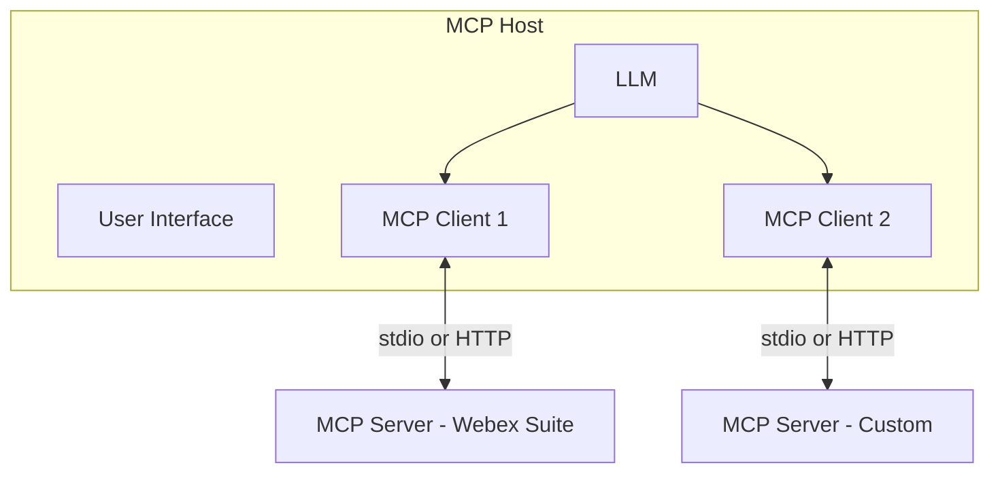

# Lab 2 - MCP Fundamentals

In this section, you will explore the Model Context Protocol (MCP): hosts, clients, servers, and the three core primitives — **tools**, **resources**, and **prompts**.

Reference: [Model Context Protocol](https://modelcontextprotocol.io){:target="_blank"}

## Learning Objectives

Upon completion of this section, you will be able to:

- Explain the roles of MCP host, client, and server
- Compare tools, resources, and prompts
- Describe tool discovery and execution lifecycles
- Understand stdio vs streamable HTTP transports

## Step 2.1: MCP components

| Component | Role | Analogy |
| --- | --- | --- |
| **Host** | Runs the LLM, UI, and one or more MCP clients | The office building |
| **Client** | Maintains a 1:1 session with one MCP server | The receptionist |
| **Server** | Exposes tools, resources, prompts; holds credentials | The department |



## Step 2.2: Tools, resources, and prompts

| Primitive | Controlled by | Purpose | Side effects |
| --- | --- | --- | --- |
| **Tools** | Model (on demand) | Take action — call APIs, run scripts | Yes |
| **Resources** | Client (automatic) | Read-only context — schemas, policies | No |
| **Prompts** | User (explicit) | Reusable multi-step workflow templates | No |

### Tool lifecycle

1. `initialize` → server advertises tool capability
2. `tools/list` → client receives name, description, JSON schema
3. Model selects a tool and supplies arguments
4. `tools/call` → server validates, injects credentials, calls backend
5. Filtered JSON returns to the model

### Prompt lifecycle

1. `prompts/list` → user sees available workflows in the UI
2. User selects a prompt and fills arguments
3. `prompts/get` → server renders the template
4. Rendered instructions enter the conversation; the model executes steps

## Step 2.3: Transport options

| Transport | Use case | Notes |
| --- | --- | --- |
| **stdio** | Local subprocess (Cursor, Claude Desktop) | Same machine, no TLS required |
| **Streamable HTTP** | Remote / shared infrastructure | Requires TLS, auth, CORS |

## Step 2.4: Elicitation and guardrails

For high-risk operations (deletes, bulk changes), MCP servers can **pause and ask the human** for confirmation before committing.

Example elicitation flow:

```text
User: "Delete the Sales Team address book"
→ Model calls delete tool
→ Server pauses and shows: "Confirm delete address book Sales Team? [Approve] [Decline]"
→ User approves
→ Server executes or aborts
```

## Exercise

In your IDE MCP logs (or documentation), identify:

- [ ] One tool that reads organization data
- [ ] One tool that performs a write operation
- [ ] Whether elicitation is required before writes

## Content still to define

- Hands-on discovery exercise using a live MCP server in the lab tenant
- Screenshot of tool catalog in the IDE
