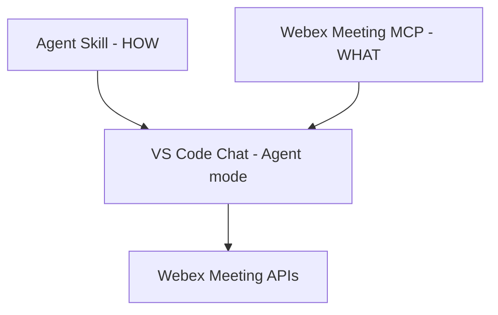

# Lab 4 - Agent Skills

In this section, you will use an **Agent Skill** to encode operational expertise —
*how* to review Webex meetings thoroughly — separately from MCP tool connectivity,
and run it directly inside **VS Code Chat (Agent mode)** with no code.

You cloned `WebexOne2026` in Getting Started. All files referenced here live in
that repository under `04_skills/`.

## Skills vs MCP

| Layer | Responsibility | Example |
| --- | --- | --- |
| **MCP server** | What the assistant *can do* — governed API access | Webex Meeting tools (list meetings, participants, summaries, recordings) |
| **Agent Skills** | *How* to use those tools — runbooks and judgment | "For every meeting, also check participants, summary, recording, transcript, then triage" |



A skill does not add tools. It tells the assistant to **use the tools it already
has, more thoroughly**.

## Step 4.1: Skill anatomy

A skill is a folder containing a `SKILL.md` file — an open standard defined by
[agentskills.io](https://agentskills.io/home).

In the cloned repo:

```text
04_skills/
  skills/
    meeting-review/
      SKILL.md
```

Open `04_skills/skills/meeting-review/SKILL.md` and look at the front matter:

```yaml
---
name: meeting-review
description: >-
  Use when a user asks about their meetings, schedule, or asks you to
  review or triage meetings for a person. Do not just list meetings —
  investigate each one across all available Webex Meeting tools...
---
```

Two rules from the agentskills.io specification:

- `name` must be lowercase-kebab and **match the folder name**.
- `description` says what the skill does **and when to use it** — this is what the
  agent reads to decide whether to load the skill.

The body below the front matter is the runbook: for each meeting, check
participants, summary, recording, and transcript; flag gaps; produce a
prioritized action list.

## Step 4.2: Progressive disclosure

Agent Skills load in three stages so many skills can be available cheaply:

1. **Discovery** — at startup, the agent loads only each skill's name and
   description (~100 tokens).
2. **Activation** — when a task matches, it reads the full `SKILL.md` body.
3. **Execution** — it follows the steps, calling MCP tools as instructed.

Full instructions load only when needed.

## Step 4.3: Point VS Code Chat at the skill

VS Code Chat (Agent mode) supports Agent Skills via the `chat.agentSkillsLocations`
setting. The cloned repo already contains `.vscode/settings.json`:

```json
{
  "chat.agentSkillsLocations": {
    "04_skills/skills": true
  }
}
```

Prerequisites:

| Requirement | How to set up |
| --- | --- |
| VS Code **>= 1.108** | `Help > About` |
| Agent Skills enabled | Settings → `chat.useAgentSkills` → enable |
| OpenAI model configured | Lab 1 Step 1.2 — `Chat: Manage Language Models` → OpenAI → enter API key |
| Webex Meeting MCP connected | Lab 1 — add the meeting server to `.vscode/mcp.json` |

!!! Note
    If the skill is not picked up, reload the window (`Developer: Reload Window`)
    after enabling `chat.useAgentSkills`.

## Step 4.4: Run a skill-guided scenario

1. Open **Chat** (`Ctrl+Shift+P` → `Chat: Open Chat (Agent)`).
2. Ensure the **Webex Meeting MCP** is started.
3. Ask:

```text
Review the meetings for user1@webexone-ai-assistant.wbx.ai. Check who joined the
past meetings, whether summaries and recordings exist, and flag anything missing.
For upcoming meetings, check if there's an agenda.
```

Expected behavior:

- The agent activates `meeting-review`.
- It calls **multiple** Webex Meeting tools per meeting (participants, summary,
  recording, transcript) — not just a flat list.
- It flags missing artifacts, triages missed meetings, and returns a prioritized
  action list.

You can also invoke it explicitly by typing `/meeting-review` in the chat.

## Step 4.5: See the difference

To feel the value, compare:

- **Without the skill** (temporarily remove the `chat.agentSkillsLocations` entry
  and reload): the agent lists meetings and stops — one tool call, one scope.
- **With the skill**: the agent investigates five scopes per meeting and produces
  actions.

```
WITHOUT skill              WITH skill
-------------              ----------
list meetings (done)       list meetings
                           + participants + summary + recording + transcript
                           + triage + prioritized actions
1 scope, 1 call            5 scopes, many calls
```

Same tools, same data — the skill supplies the judgment.

## Exercise

1. **Read the skill** — open `04_skills/skills/meeting-review/SKILL.md` and find
   the rule that tells the agent to check *all* dimensions.
2. **Edit the skill** — add one rule (for example: "flag any meeting longer than
   60 minutes with more than 8 attendees as a *review candidate*"). Save.
3. **Re-run** the scenario in Chat and confirm your new rule is applied — no
   code change required, just the edited `SKILL.md`.

## Next

In **Lab 7** you build the Python **skill loader** that does what VS Code did for
you here — reading the *same* `meeting-review/SKILL.md`, unchanged — and wire it
into a bot, then onboard a second skill. See `07_skills_bot/` in the cloned repo.
