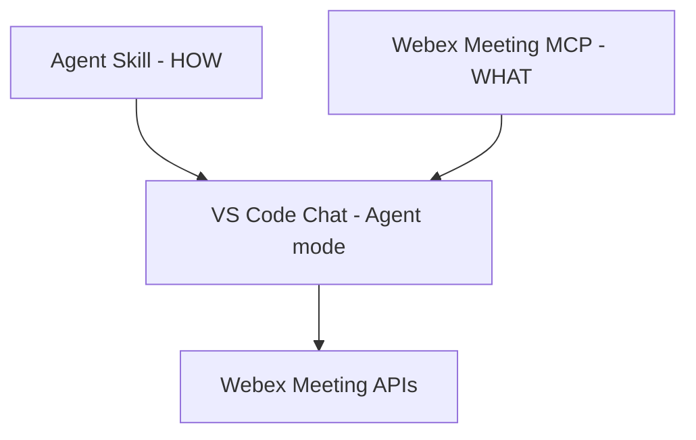

# Lab 4 - Agent Skills

In this section, you will use an **Agent Skill** to encode operational expertise —
*how* to review Webex meetings thoroughly — separately from MCP tool connectivity,
and run it directly inside **VS Code Chat (Agent mode)** with no code.

Skills aren't just fancy instructions — they're **portable, task-specific
workflows** that load only when you need them. Unlike custom instructions, which
define coding standards, skills bring scripts, examples, and automation into the
mix, making agents truly **action-oriented**.

You cloned `WebexOne2026` in Getting Started. For this focused skill test,
open the `.agents` folder as the VS Code workspace. This keeps the repository's
Python code out of the agent's active context so it does not distract from the
skill workflow.

## Skills vs MCP


| Layer            | Responsibility                                    | Example                                                                                   |
| ---------------- | ------------------------------------------------- | ----------------------------------------------------------------------------------------- |
| **MCP server**   | What the assistant *can do* — governed API access | Webex Meeting tools (list meetings, participants, summaries, recordings)                  |
| **Agent Skills** | *How* to use those tools — runbooks and judgment  | "For every meeting, also check participants, summary, recording, transcript, then triage" |





A skill does not add tools. It tells the assistant to **use the tools it already
has, more thoroughly**.

## Skills vs Custom Instructions

If you already use `.github/copilot-instructions.md` or custom instructions in
VS Code, you may wonder how skills differ. They serve different purposes:


| Feature      | Custom Instructions                  | Agent Skills                                                                          |
| ------------ | ------------------------------------ | ------------------------------------------------------------------------------------- |
| **Purpose**  | Coding standards and guidelines      | Task-specific workflows and runbooks                                                  |
| **Scope**    | Always applied to every conversation | Loaded on demand when the task matches                                                |
| **Content**  | Instructions only                    | Instructions + scripts + examples + resources                                         |
| **Standard** | VS Code–specific                     | Open standard ([agentskills.io](https://agentskills.io)) — portable across 30+ agents |


Use custom instructions for *"always format imports this way."*
Use skills for *"when reviewing meetings, check all five dimensions and triage."*

## Step 4.1: Isolate the skill workspace, configure MCP, and enable Agent Skills

Open `WebexOne2026/.agents/` in VS Code, not the full `WebexOne2026/`
repository. The full repository contains many Python files and bot
implementations useful for Lab 7, but unrelated code can mislead the agent
during this focused skill test.

Because `.vscode/mcp.json` is outside this focused workspace, configure the
Webex Meeting MCP at **user scope**:

1. Open the Command Palette.
2. Run **MCP: Open User Configuration**.
3. Add the Webex Meeting MCP using your lab token.
4. Start the server or reload VS Code.

Never commit a real token to the repository.

Before looking at the skill itself, make sure VS Code can discover it.

1. Open **Settings** (`Ctrl+,`) and search for `chat.useAgentSkills`.
2. **Enable** the checkbox.
  !!! Warning
        This setting must be enabled or skills will not load. If you skip this step,
        nothing else in this lab will work.
3. Reload the window: `Ctrl+Shift+P` → `Developer: Reload Window`.
4. Open **Chat** (`Ctrl+Shift+P` → `Chat: Open Chat (Agent)`).
5. **Verify discovery** — ask the agent:
  ```text
    What skills are available?
  ```

    The agent should list `meeting-review` with its description. If it does,
    skills are working and you can proceed.
    !!! Note
        If `meeting-review` does not appear:
  ```
    - Confirm `chat.useAgentSkills` is enabled (step 2)
    - Confirm the skill exists in the cloned repo at
      `.agents/skills/meeting-review/SKILL.md` (it appears as
      `skills/meeting-review/SKILL.md` from the focused `.agents` workspace)
    - Reload the window again (`Developer: Reload Window`)
  ```

VS Code automatically scans these project directories for skills
([VS Code docs](https://code.visualstudio.com/docs/agent-customization/agent-skills)):


| Location          | Convention                         |
| ----------------- | ---------------------------------- |
| `.agents/skills/` | agentskills.io cross-host standard |
| `.github/skills/` | GitHub convention                  |
| `.claude/skills/` | Anthropic convention               |


The cloned repo places the skill in `.agents/skills/` — the most portable
option. **No settings file is needed** for auto-discovery.

### Other prerequisites


| Requirement                 | How to set up                                                            |
| --------------------------- | ------------------------------------------------------------------------ |
| VS Code **>= 1.108**        | `Help > About`                                                           |
| OpenAI model configured     | Lab 1 Step 1.2 — `Chat: Manage Language Models` → OpenAI → enter API key |
| Webex Meeting MCP connected | Lab 1 — configure the server in the user MCP configuration |


## Step 4.2: Skill anatomy

A skill is a folder containing a `SKILL.md` file — an open standard defined by
[agentskills.io](https://agentskills.io/home).

In the cloned repository, the skill is at:

```text
.agents/skills/meeting-review/SKILL.md
```

Because the focused VS Code workspace is `.agents/`, the same file appears
inside that workspace as:

```text
skills/meeting-review/SKILL.md
```

Open it and look at the front matter:

```yaml
---
name: meeting-review
description: >-
  Use when a user asks to review or prepare for upcoming meetings.
  Check each meeting for agenda, invitees, and scheduling conflicts.
  Flag anything missing and produce a preparation checklist.
---
```

Two rules from the [agentskills.io specification](https://agentskills.io/specification):

- `name` must be lowercase letters, numbers, and hyphens, and **match the folder name**.
- `description` says what the skill does **and when to use it** — this is what the
  agent reads to decide whether to load the skill.

The body below the front matter is the runbook: check each upcoming meeting for
agenda, invitees, and conflicts; produce a preparation checklist.

## Step 4.3: Progressive disclosure

Agent Skills load in three stages so many skills can be available cheaply:

1. **Discovery** — at startup, the agent loads only each skill's name and
  description (~100 tokens).
2. **Activation** — when a task matches, it reads the full `SKILL.md` body.
3. **Execution** — it follows the steps, calling MCP tools as instructed.

Full instructions load only when needed.

## Step 4.4: Schedule meetings (data setup)

Schedule two meetings so there is data to review. Neither will have an agenda —
the Webex Meeting MCP scheduling tool does not expose an agenda parameter. That
limitation is intentional for this exercise: the skill will flag the gap.

1. Open **Chat** (`Ctrl+Shift+P` → `Chat: Open Chat (Agent)`).
2. Ensure the **Webex Meeting MCP** is started.
3. Schedule the first meeting:

```text
Schedule a meeting with admin@webexone-ai-assistant.wbx.ai tomorrow at 10am.
Title: Planning Session. Do not create any local files.
```

4. Schedule the second meeting:

```text
Schedule a meeting with admin@webexone-ai-assistant.wbx.ai tomorrow at 2pm.
Title: Architecture Review. Do not create any local files.
```

You now have two upcoming meetings, both without agendas.

## Step 4.5: List meetings without the skill

Temporarily disable the skill: rename the `skills` folder inside `.agents/`
(for example to `skills-off`), then reload the window.

Ask:

```text
What meetings do I have scheduled?
```

The agent lists them — title, time, host. No flags, no readiness check, no
actions. That is all it does without the skill.

## Step 4.6: Use the skill

Re-enable the skill: rename the folder back to `skills`, then reload.

Invoke the skill:

```text
/meeting-review
Help me prepare for my upcoming meetings.
```

The skill checks each meeting for agenda, invitees, and conflicts:

```text
UPCOMING — Planning Session | tomorrow 10:00
  Agenda: NO AGENDA
  --> Add an agenda before the meeting.

UPCOMING — Architecture Review | tomorrow 14:00
  Agenda: NO AGENDA
  --> Add an agenda before the meeting.

PREPARATION CHECKLIST
1. Add agendas to both meetings.
```

The difference between Step 4.5 and Step 4.6 is the skill's value: the same
tools, the same data, but the skill added judgment.

```
WITHOUT skill              WITH skill
-------------              ----------
list meetings (done)       list meetings
                           + check agenda per meeting
                           + flag NO AGENDA
                           + preparation checklist
plain listing              actionable preparation
```

## Exercise: Skills as guardrails

### Part A — Observe a problem

Ask the agent to add an agenda:

```text
Add an agenda to the Planning Session meeting.
Set it to: review project milestones and assign action items.
```

Watch what the agent does. It may:

- Use the `webex-update-meeting` tool to set the agenda in Webex ✓
- Create a local text file for the agenda ✗

If the agent tries to create a file, **decline the action**. That is the wrong
behavior — the agenda should be stored in Webex, not on disk.

### Part B — Add a guardrail to the skill

Open `skills/meeting-review/SKILL.md` and add a new section at the bottom:

```markdown
## Guardrails

- Never create, edit, or save local files for agendas or meeting data.
- Use only Webex Meeting MCP tools for meeting operations.
- If a tool does not support the requested field, report the limitation
  instead of creating a file.
```

Save the file.

### Part C — Re-run and compare

Ask the same question again. The agent should now either use the MCP update
tool or report the limitation — instead of creating a file.

You just used a skill to fix agent behavior. No code change. One markdown edit.

!!! Tip "What you learned"
    Skills are not just workflows. They are also **guardrails**. A skill can
    tell the agent what to do, how to do it, and what **not** to do.

## Next

In **Lab 7** you build the Python **skill loader** that reads a more advanced
version of this skill — one that also reviews past meetings for attendance,
summaries, recordings, and transcripts. See `07_skills_bot/` in the cloned repo.