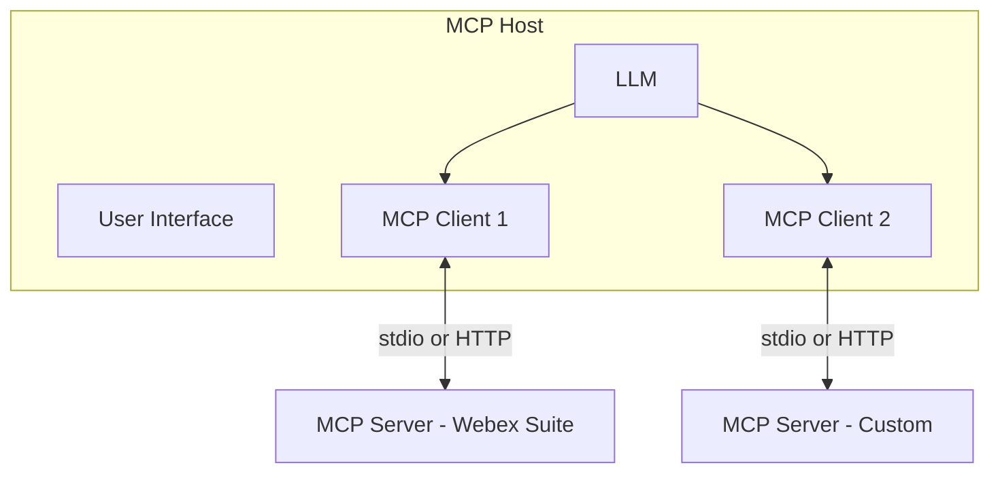

# Lab 4 - MCP Servers in AI Assistant

Now that we have already build our AI assistant, we need to give it MCP capabilities to access our organization.

## Step 4.1: Build the MCP Client

MCP components

| Component | Role | Analogy |
| --- | --- | --- |
| **Host** | Runs the LLM, UI, and one or more MCP clients | The office building |
| **Client** | Maintains a 1:1 session with one MCP server | The receptionist |
| **Server** | Exposes tools, resources, prompts; holds credentials | The department |



To be able to integrate the Webex MCP Clients into your Assistant, you need to have a MCP Client.


## Step 4.2: Servie App

Till now, you have been using your own token from developer.webex.com. This token is associated with you, and it lives only 12 hours, so it is not a long term solution for building the assistant. 

**Service Apps** are machine accounts that operate on behalf of an organization, independent of specific Webex user accounts.

You will now create a **Service App** with access to **read people from your organization** and **create devices**.

Go to **Webex for Developers**, select **My Webex Apps** and click **Create a New app**:

{ width="850" style="display: block; margin: 0 auto; border: 1px solid lightgray; border-radius: 8px;"}

Then, select **Service App**:

{ width="450" style="display: block; margin: 0 auto; border: 1px solid lightgray; border-radius: 8px;"}

Enter the following information:

|        	|                                     	      |
|-----------------------	|-------------------------------------------------|
| **App name**       	| CiscoLive***XXXX***                  |
| **Icon**       	| Choose one of the available options                     |
| **Description**       	| Service App for Cisco Live                      |
| **Contact Email**       	| cholland@***domain*** |
| **Scopes** | |

!!! Note
    Scopes are going to be dependant on which MCP server do you want to use.

Once you have entered the information, your screen should look similar to this:
{ width="700" style="display: block; margin: 0 auto; border: 1px solid lightgray; border-radius: 8px;"}

!!! Warning
    From this page, copy and save the **Client ID**, **Client Secret** and **Service App ID**, as you may need them later:
    { width="700" style="display: block; margin: 0 auto; border: 1px solid lightgray; border-radius: 8px;"}

    You can already save them in your .env file:

    { width="500" style="display: block; margin: 0 auto; border: 1px solid lightgray; border-radius: 8px;"}

### Authorize your Service App in your organization

Once the Service App is created, you will need to authorize it. Navigate to:

- [Webex Control Hub](https://admin.webex.com){:target="_blank"}

Log in using the same credentials as before:
   
| Email       	| Password                                    	      |
|-----------------------	|-------------------------------------------------|
| cholland@***domain***         	| dCloud***XXXX***!                     |

Navigate to **Management > Apps > Service Apps** select the Service App you created, and click **Authorize** and **Save**:<br/>

{ width="950" style="display: block; margin: 0 auto; border: 1px solid lightgray; border-radius: 8px;"}

To use the newly created **Service App**, you will need to get an **Access token**. 

### Access Token

Return to **Webex for Developers**, go to **My Webex Apps** and select the newly created **Service App**:

{ width="800" style="display: block; margin: 0 auto; border: 1px solid lightgray; border-radius: 8px;"}

In the section **Org Authorizations**, select your Organization from the dropdown. 

!!! Warning "If this section does not appear, refresh the page."

A text box to enter your **Client Secret** will appear. This way, you can generate an **access_token** for this organization:

{ width="900" style="display: block; margin: 0 auto; border: 1px solid lightgray; border-radius: 8px;"}

!!! Warning
    Now you can save those values in your .env file. You must have already all the needed variables:

    { width="500" style="display: block; border: 1px solid lightgray; border-radius: 8px;"}

!!! Note
    The expiration time for the access token is 14 days, while the refresh token expires in 90 days.


## Step 4.3: Webex MCP Integration

1. Start the bot handler:

    ```bash
    cd bot
    python handler.py
    ```

2. Wait for **WebSocket connected** in the console.
3. In Webex, message your bot:

    ```text
    List my Webex spaces and tell me which one is the lab space.
    ```

4. Verify the assistant response appears in the conversation.
