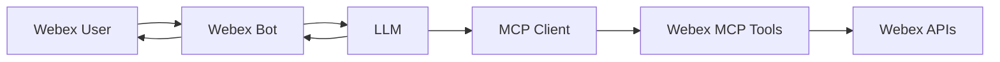
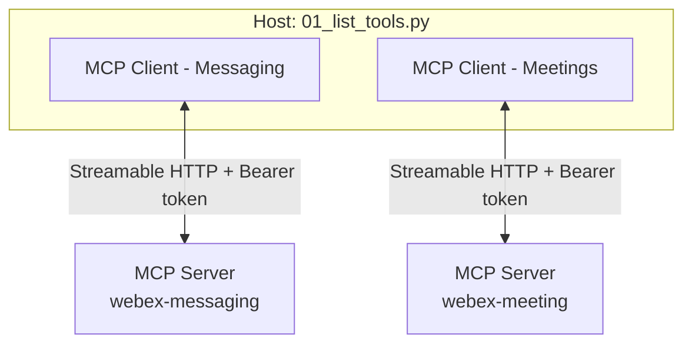

# Lab 4 - MCP Servers in AI Assistant

Now that we have already build our AI assistant, we need to give it MCP capabilities to access our organization.

## Architecture



## Step 4.1: Build the MCP Client

These are the MCP components used in this section:

| Component | Role | In this section |
| --- | --- | --- |
| **Host** | App that creates MCP clients (later also LLM / bot) | `01_list_tools.py` |
| **Client** | One session, one server, one token | `McpClient` |
| **Server** | Exposes tools (and resources/prompts) | Hosted Webex Messaging MCP and Meetings MCP |



To be able to integrate the Webex MCP Clients into your Assistant, you need to have a MCP Client.

1. Navigate to 04_mcp/mcp_client.py and review the code:

   ```python
   from contextlib import asynccontextmanager

    from mcp import ClientSession
    from mcp.client.streamable_http import streamable_http_client
    from mcp.shared._httpx_utils import create_mcp_http_client
    from mcp.shared.exceptions import MCPError
    
    def _first_mcp_error(exc):
        # The SDK wraps MCPError in anyio TaskGroup ExceptionGroups.
        if isinstance(exc, MCPError):
            return exc
        if isinstance(exc, BaseExceptionGroup):
            for inner in exc.exceptions:
                found = _first_mcp_error(inner)
                if found:
                    return found
        return None
    
    
    class McpClient:
        """One MCP session = one server URL + that server's token."""
    
        def __init__(self, access_token, url):
            self.access_token = access_token
            self.url = url
    
        @asynccontextmanager
        async def session(self):
            http = create_mcp_http_client(headers={"Authorization": f"Bearer {self.access_token}"})
            async with http:
                async with streamable_http_client(self.url, http_client=http) as (read, write):
                    async with ClientSession(read, write) as session:
                        await session.initialize()
                        yield session
    
        async def list_tools(self):
            try:
                async with self.session() as session:
                    return (await session.list_tools()).tools
            except BaseExceptionGroup as eg:
                if err := _first_mcp_error(eg):
                    raise err from None
                raise
    
        async def call_tool(self, name, arguments=None):
            try:
                async with self.session() as session:
                    result = await session.call_tool(name, arguments or {})
                    texts = [c.text for c in result.content if getattr(c, "type", None) == "text"]
                    return "\n".join(texts) if texts else str(result.content)
            except BaseExceptionGroup as eg:
                if err := _first_mcp_error(eg):
                    raise err from None
                raise
    ```

   This MCP client allows you to connect to any MCP server.


## Step 4.2: List tools

Now, we will 

1. Navigate to 04_mcp/01_list_tools.py and review the code:

   ```python

    MESSAGING_MCP_URL = "https://mcp.webexapis.com/mcp/webex-messaging"
    MEETING_MCP_URL = "https://mcp.webexapis.com/mcp/webex-meeting"
    
    import asyncio
    import logging
    import os
    
    from dotenv import load_dotenv
    from mcp.shared.exceptions import MCPError
    
    from mcp_client import McpClient
    
    try:
        import truststore
    
        truststore.inject_into_ssl()
    except ImportError:
        pass
    
    logging.basicConfig(level=logging.INFO, format="%(asctime)s %(levelname)s %(message)s")
    log = logging.getLogger("mcp-list-tools")
    
    load_dotenv()
    
    MESSAGING_TOKEN = os.getenv("WEBEX_MESSAGING_MCP_TOKEN")
    MEETING_TOKEN = os.getenv("WEBEX_MEETING_MCP_TOKEN")
    
    
    async def list_server(name, url, token):
        if not token:
            log.warning(f"Skipping {name}: set the token in your .env file")
            return
        try:
            tools = await McpClient(token, url).list_tools()
        except MCPError as exc:
            log.error(f"{name} handshake failed: {exc}")
            return
        log.info(f"{name}: {len(tools)} tool(s) from {url}")
        for tool in tools:
            log.info(f"  - {tool.name}: {tool.description}")
    
    
    async def main():
        if not MESSAGING_TOKEN and not MEETING_TOKEN:
            raise SystemExit(
                "Set WEBEX_MESSAGING_MCP_TOKEN and/or WEBEX_MEETING_MCP_TOKEN in your .env file"
            )
        await list_server("Messaging MCP", MESSAGING_MCP_URL, MESSAGING_TOKEN)
        await list_server("Meetings MCP", MEETING_MCP_URL, MEETING_TOKEN)
    
    
    if __name__ == "__main__":
        asyncio.run(main())
   ```

2. In VS Code, change the terminal right folder:

    * cd ../04_mcp

3. Copy the example .venv file:

    * cp .env.example .env

4. Copy the Webex MCP Tokens into `.env`:

    ```env
    WEBEX_MESSAGING_MCP_TOKEN=your_messaging_mcp_token
    WEBEX_MEETING_MCP_TOKEN=your_meetings_mcp_token

5. Run your code with the following command:

    * python 01_list_tools.py


## Step 4.3: Webex MCP Integration

1. Start the bot handler:

    ```bash
    cd bot
    python handler.py
    ```

2. Wait for **WebSocket connected** in the console.
3. In Webex, message your bot:

    ```text
    List my Webex spaces and tell me which one is the lab space.
    ```

4. Verify the assistant response appears in the conversation.


<!--
## Service apps 

Till now, you have been using your own token from developer.webex.com. This token is associated with you, and it lives only 12 hours, so it is not a long term solution for building the assistant. 

**Service Apps** are machine accounts that operate on behalf of an organization, independent of specific Webex user accounts.

You will now create a **Service App** with access to **read people from your organization** and **create devices**.

Go to **Webex for Developers**, select **My Webex Apps** and click **Create a New app**:

{ width="850" style="display: block; margin: 0 auto; border: 1px solid lightgray; border-radius: 8px;"}

Then, select **Service App**:

{ width="450" style="display: block; margin: 0 auto; border: 1px solid lightgray; border-radius: 8px;"}

Enter the following information:

|        	|                                     	      |
|-----------------------	|-------------------------------------------------|
| **App name**       	| CiscoLive***XXXX***                  |
| **Icon**       	| Choose one of the available options                     |
| **Description**       	| Service App for Cisco Live                      |
| **Contact Email**       	| cholland@***domain*** |
| **Scopes** | |

!!! Note
    Scopes are going to be dependant on which MCP server do you want to use.

Once you have entered the information, your screen should look similar to this:
{ width="700" style="display: block; margin: 0 auto; border: 1px solid lightgray; border-radius: 8px;"}

!!! Warning
    From this page, copy and save the **Client ID**, **Client Secret** and **Service App ID**, as you may need them later:
    { width="700" style="display: block; margin: 0 auto; border: 1px solid lightgray; border-radius: 8px;"}

    You can already save them in your .env file:

    { width="500" style="display: block; margin: 0 auto; border: 1px solid lightgray; border-radius: 8px;"}

### Authorize your Service App in your organization

Once the Service App is created, you will need to authorize it. Navigate to:

- [Webex Control Hub](https://admin.webex.com){:target="_blank"}

Log in using the same credentials as before:
   
| Email       	| Password                                    	      |
|-----------------------	|-------------------------------------------------|
| cholland@***domain***         	| dCloud***XXXX***!                     |

Navigate to **Management > Apps > Service Apps** select the Service App you created, and click **Authorize** and **Save**:<br/>

{ width="950" style="display: block; margin: 0 auto; border: 1px solid lightgray; border-radius: 8px;"}

To use the newly created **Service App**, you will need to get an **Access token**. 

### Access Token

Return to **Webex for Developers**, go to **My Webex Apps** and select the newly created **Service App**:

{ width="800" style="display: block; margin: 0 auto; border: 1px solid lightgray; border-radius: 8px;"}

In the section **Org Authorizations**, select your Organization from the dropdown. 

!!! Warning "If this section does not appear, refresh the page."

A text box to enter your **Client Secret** will appear. This way, you can generate an **access_token** for this organization:

{ width="900" style="display: block; margin: 0 auto; border: 1px solid lightgray; border-radius: 8px;"}

!!! Warning
    Now you can save those values in your .env file. You must have already all the needed variables:

    { width="500" style="display: block; border: 1px solid lightgray; border-radius: 8px;"}

!!! Note
    The expiration time for the access token is 14 days, while the refresh token expires in 90 days.
-->
