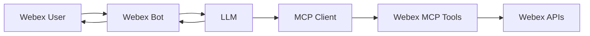
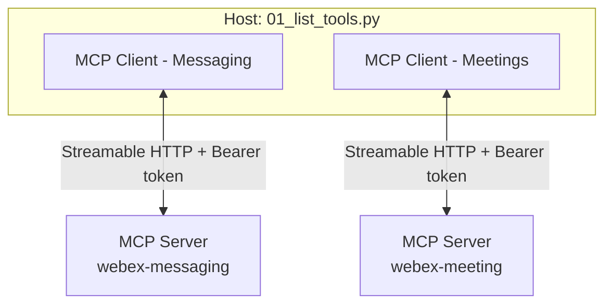

# Lab 4 - MCP Servers in AI Assistant

Now that we have already build our AI assistant, we need to give it MCP capabilities to access our organization.

## Architecture



## Step 4.1: Build the MCP Client

These are the MCP components used in this section:

| Component | Role | In this section |
| --- | --- | --- |
| **Host** | App that creates MCP clients (later also LLM / bot) | `01_list_tools.py` |
| **Client** | One session, one server, one token | `McpClient` |
| **Server** | Exposes tools (and resources/prompts) | Hosted Webex Messaging MCP and Meetings MCP |



To be able to integrate the Webex MCP Clients into your Assistant, you need to have a MCP Client.

1. Navigate to 04_mcp/mcp_client.py and review the code:

   ```python
   from contextlib import asynccontextmanager

    from mcp import ClientSession
    from mcp.client.streamable_http import streamable_http_client
    from mcp.shared._httpx_utils import create_mcp_http_client
    from mcp.shared.exceptions import MCPError
    
    def _first_mcp_error(exc):
        # The SDK wraps MCPError in anyio TaskGroup ExceptionGroups.
        if isinstance(exc, MCPError):
            return exc
        if isinstance(exc, BaseExceptionGroup):
            for inner in exc.exceptions:
                found = _first_mcp_error(inner)
                if found:
                    return found
        return None
    
    
    class McpClient:
        """One MCP session = one server URL + that server's token."""
    
        def __init__(self, access_token, url):
            self.access_token = access_token
            self.url = url
    
        @asynccontextmanager
        async def session(self):
            http = create_mcp_http_client(headers={"Authorization": f"Bearer {self.access_token}"})
            async with http:
                async with streamable_http_client(self.url, http_client=http) as (read, write):
                    async with ClientSession(read, write) as session:
                        await session.initialize()
                        yield session
    
        async def list_tools(self):
            try:
                async with self.session() as session:
                    return (await session.list_tools()).tools
            except BaseExceptionGroup as eg:
                if err := _first_mcp_error(eg):
                    raise err from None
                raise
    
        async def call_tool(self, name, arguments=None):
            try:
                async with self.session() as session:
                    result = await session.call_tool(name, arguments or {})
                    texts = [c.text for c in result.content if getattr(c, "type", None) == "text"]
                    return "\n".join(texts) if texts else str(result.content)
            except BaseExceptionGroup as eg:
                if err := _first_mcp_error(eg):
                    raise err from None
                raise
    ```

   This MCP client allows you to connect to any MCP server.


## Step 4.2: List tools

Now, we will 

1. Navigate to 04_mcp/01_list_tools.py and review the code:

   ```python

    MESSAGING_MCP_URL = "https://mcp.webexapis.com/mcp/webex-messaging"
    MEETING_MCP_URL = "https://mcp.webexapis.com/mcp/webex-meeting"
    
    import asyncio
    import logging
    import os
    
    from dotenv import load_dotenv
    from mcp.shared.exceptions import MCPError
    
    from mcp_client import McpClient
    
    try:
        import truststore
    
        truststore.inject_into_ssl()
    except ImportError:
        pass
    
    logging.basicConfig(level=logging.INFO, format="%(asctime)s %(levelname)s %(message)s")
    log = logging.getLogger("mcp-list-tools")
    
    load_dotenv()
    
    MESSAGING_TOKEN = os.getenv("WEBEX_MESSAGING_MCP_TOKEN")
    MEETING_TOKEN = os.getenv("WEBEX_MEETING_MCP_TOKEN")
    
    
    async def list_server(name, url, token):
        if not token:
            log.warning(f"Skipping {name}: set the token in your .env file")
            return
        try:
            tools = await McpClient(token, url).list_tools()
        except MCPError as exc:
            log.error(f"{name} handshake failed: {exc}")
            return
        log.info(f"{name}: {len(tools)} tool(s) from {url}")
        for tool in tools:
            log.info(f"  - {tool.name}: {tool.description}")
    
    
    async def main():
        if not MESSAGING_TOKEN and not MEETING_TOKEN:
            raise SystemExit(
                "Set WEBEX_MESSAGING_MCP_TOKEN and/or WEBEX_MEETING_MCP_TOKEN in your .env file"
            )
        await list_server("Messaging MCP", MESSAGING_MCP_URL, MESSAGING_TOKEN)
        await list_server("Meetings MCP", MEETING_MCP_URL, MEETING_TOKEN)
    
    
    if __name__ == "__main__":
        asyncio.run(main())
   ```

2. In VS Code, change the terminal right folder:

    * cd ../04_mcp

3. Copy the example .venv file:

    * cp .env.example .env

4. Copy the Webex MCP Tokens into `.env`:

    ```env
    WEBEX_MESSAGING_MCP_TOKEN=your_messaging_mcp_token
    WEBEX_MEETING_MCP_TOKEN=your_meetings_mcp_token
    ```

5. Run your code with the following command:

    * python 01_list_tools.py

6. You will see in the terminal the following:

   ```terminal
    python 01_list_tools.py 
    2026-09-14 19:20:31,894 INFO HTTP Request: POST https://mcp.webexapis.com/mcp/webex-messaging "HTTP/1.1 200 OK"
    2026-09-14 19:20:31,895 INFO Received session ID: 648358b0-9721-4c96-b883-0ba9ce055756
    2026-09-14 19:20:32,156 INFO HTTP Request: POST https://mcp.webexapis.com/mcp/webex-messaging "HTTP/1.1 202 Accepted"
    2026-09-14 19:20:33,086 INFO HTTP Request: POST https://mcp.webexapis.com/mcp/webex-messaging "HTTP/1.1 200 OK"
    2026-09-14 19:20:34,097 INFO HTTP Request: GET https://mcp.webexapis.com/mcp/webex-messaging "HTTP/1.1 200 OK"
    2026-09-14 19:20:34,099 INFO GET stream disconnected, reconnecting in 1000ms...
    2026-09-14 19:20:34,101 INFO HTTP Request: DELETE https://mcp.webexapis.com/mcp/webex-messaging "HTTP/1.1 200 OK"
    2026-09-14 19:20:34,103 INFO Messaging MCP: 24 tool(s) from https://mcp.webexapis.com/mcp/webex-messaging
    2026-09-14 19:20:34,103 INFO   - webex-create-message: Creates a new message in a Webex space or as a direct message. Provide exactly one destination (roomId, toPersonEmail, or toPersonId) and at least one content payload (text, markdown, file URLs in files, or adaptive card attachments). Optional html and parentId for threaded replies.
    2026-09-14 19:20:34,103 INFO   - webex-edit-message: Edits an existing message in a Webex space. Requires authentication via bearer token. You must specify the messageId and roomId, along with the new text or markdown content. The Webex API does not accept html in edit requests; use text or markdown only. Edits of messages with files/attachments are not supported. Maximum 10 edits per message.
    2026-09-14 19:20:34,103 INFO   - webex-delete-message: Deletes a message from a Webex space. Requires authentication via bearer token. You must specify the messageId of the message to delete. This is a destructive operation and cannot be undone. Works for both 1:1 and group spaces.
    2026-09-14 19:20:34,103 INFO   - webex-get-message: Retrieves messages from Webex spaces with full pagination, rate limit retry, and streaming. Single-message mode: provide messageId. List mode: provide roomId to fetch all messages (or up to max). Messages are streamed as result chunks per page and included in the final response. All API calls include automatic HTTP 429 retry. Provide either messageId or roomId. Works for 1:1 and group spaces; for bot tokens in group spaces when listing, include mentionedPeople (typically &#39;me&#39;).
    2026-09-14 19:20:34,104 INFO   - webex-create-space: Creates a new Webex space (room). Requires authentication via bearer token. You must specify the title. Optionally specify teamId, isLocked, isAnnouncementOnly, or classificationId.
    2026-09-14 19:20:34,104 INFO   - webex-get-space: Gets a single space when roomId is provided, or lists spaces when roomId is omitted. List mode uses full Link: rel&#61;&#34;next&#34; pagination with automatic HTTP 429 retry and result chunk streaming. Supports optional filters (type, teamId, sortBy). If max is not provided, all spaces are fetched via pagination. If max is provided, exactly that many spaces are returned.
    2026-09-14 19:20:34,104 INFO   - webex-update-space: Updates a Webex space. Requires roomId and title (title is required by the Webex API). Optionally specify isLocked, isAnnouncementOnly, isReadOnly, isPublic, description, classificationId, or teamId. Note: announcement mode requires the space to be locked first.
    2026-09-14 19:20:34,104 INFO   - webex-delete-space: Removes a Webex space. Requires authentication via bearer token. You must specify the roomId. Behavior depends on caller role: the space creator can permanently delete the space; non-creators are removed from the space instead. For 1:1 spaces, this hides the space (conversation history is preserved).
    2026-09-14 19:20:34,104 INFO   - webex-add-membership: Adds a member to a Webex space. Requires authentication via bearer token. You must specify roomId and either personId or personEmail. Optionally set isModerator to true for moderator privileges.
    2026-09-14 19:20:34,104 INFO   - webex-get-membership: Gets a single membership when membershipId is provided, or lists memberships for a room when roomId is provided. List mode supports optional personId, personEmail, and max.
    2026-09-14 19:20:34,105 INFO   - webex-update-membership: Updates a membership in a Webex space. Requires membershipId and isModerator (promote or demote moderator). Optional isRoomHidden to show or hide the space for the member.
    2026-09-14 19:20:34,105 INFO   - webex-remove-membership: Removes a member from a Webex space. Requires authentication via bearer token. You must specify the membershipId of the membership to remove. This is a destructive operation and cannot be undone.
    2026-09-14 19:20:34,105 INFO   - webex-search-messages: Searches messages in a Webex space with full pagination, rate limit retry, and streaming. Requires roomId. Optionally filter by query (keyword in text/markdown, case-insensitive client-side). If max is not provided, all messages are fetched. Messages are streamed as result chunks per page (after filtering) and included in the final response. All API calls include automatic HTTP 429 retry.
    2026-09-14 19:20:34,105 INFO   - webex-search-spaces: Lists Webex spaces (rooms) via GET /v1/rooms with full Link: rel&#61;&#34;next&#34; pagination, automatic HTTP 429 retry, and result chunk streaming. The title parameter triggers client-side case-insensitive substring matching against returned space titles. Other server-side filters: type (direct/group), teamId, sortBy (id/lastactivity/created), orgPublicSpaces, from, to. If max is not provided, all matching spaces are fetched via pagination. If max is provided, exactly that many filtered spaces are returned.
    2026-09-14 19:20:34,105 INFO   - webex-create-webhook: Creates a new webhook to receive real-time notifications for Webex events. Requires authentication via bearer token. You must specify the webhook name, target URL, resource type, and event type. Optionally set a filter expression and HMAC secret for payload verification.
    2026-09-14 19:20:34,105 INFO   - webex-get-webhook: Retrieves a single webhook when webhookId is provided, or lists webhooks via paginated API calls when webhookId is omitted. Supports streaming of intermediate result chunks per page. If max is not provided in list mode, all webhooks are fetched via pagination. Automatic retry on HTTP 429 rate limits.
    2026-09-14 19:20:34,105 INFO   - webex-update-webhook: Updates a Webex webhook. Requires webhookId, name, and targetUrl. Optionally specify secret and status (active/inactive).
    2026-09-14 19:20:34,105 INFO   - webex-delete-webhook: Deletes a Webex webhook by webhookId (DELETE /v1/webhooks/{webhookId}). Destructive and cannot be undone.
    2026-09-14 19:20:34,105 INFO   - webex-share-file: Shares one or more public file URLs via the Webex Messages API (POST /v1/messages). Provide exactly one destination (roomId, toPersonEmail, or toPersonId) and at least one file source (fileUrl or non-empty files array). Optional text or markdown.
    2026-09-14 19:20:34,105 INFO   - webex-upload-file: Uploads a base64-encoded file via multipart/form-data POST to /v1/messages. Requires fileContent, fileName, and contentType, plus exactly one destination (roomId, toPersonEmail, or toPersonId). Optional text or markdown.
    2026-09-14 19:20:34,105 INFO   - webex-get-file-details: Makes a HEAD request to the file content URL from a Webex message. Extracts Content-Type, Content-Length, Content-Disposition headers. Requires bearer token.
    2026-09-14 19:20:34,105 INFO   - webex-download-file: Downloads file content from a Webex message file URL via authenticated GET request. Returns base64-encoded content.
    2026-09-14 19:20:34,105 INFO   - webex-create-thread-reply: Creates a threaded reply in a Webex space via POST /v1/messages. Requires roomId, parentId, and at least one of text or markdown.
    2026-09-14 19:20:34,105 INFO   - webex-get-thread: Retrieves threaded replies for a parent message via paginated API calls. Supports streaming of intermediate result chunks per page. If max is not provided, all replies are fetched via pagination. Automatic retry on HTTP 429 rate limits.
    2026-09-14 19:20:35,431 INFO HTTP Request: POST https://mcp.webexapis.com/mcp/webex-meeting "HTTP/1.1 200 OK"
    2026-09-14 19:20:35,432 INFO Received session ID: 1ccdeefd-85cf-4efd-be4b-a121bf90075c
    2026-09-14 19:20:35,675 INFO HTTP Request: POST https://mcp.webexapis.com/mcp/webex-meeting "HTTP/1.1 202 Accepted"
    2026-09-14 19:20:36,598 INFO HTTP Request: POST https://mcp.webexapis.com/mcp/webex-meeting "HTTP/1.1 200 OK"
    2026-09-14 19:20:37,565 INFO HTTP Request: GET https://mcp.webexapis.com/mcp/webex-meeting "HTTP/1.1 200 OK"
    2026-09-14 19:20:37,567 INFO GET stream disconnected, reconnecting in 1000ms...
    2026-09-14 19:20:37,568 INFO HTTP Request: DELETE https://mcp.webexapis.com/mcp/webex-meeting "HTTP/1.1 200 OK"
    2026-09-14 19:20:37,569 INFO Meetings MCP: 8 tool(s) from https://mcp.webexapis.com/mcp/webex-meeting
    2026-09-14 19:20:37,569 INFO   - webex-list-meetings: List Webex meetings for the authenticated user. Returns meeting details including meeting number, topic, start/end time, host info, and optionally the full invitee list with pagination. Meetings are streamed progressively as result chunks during fetch and returned as a complete array in the final response. Filter by date range, meeting number, topic keyword, meetingType, or state. The returned &#39;id&#39; field is the meetingId used to identify a specific meeting. Use meetingType&#61;&#39;meeting&#39; and state&#61;&#39;ended&#39; to find ended meeting instances. Default meetingType is &#39;meetingSeries&#39; which returns upcoming recurring meetings. Invitees are fully paginated (no truncation). Rate-limited API calls are retried automatically.
    2026-09-14 19:20:37,569 INFO   - webex-create-meeting: Create a new Webex meeting. Requires a title and start time. Optionally specify end time or duration, invitees, recurrence pattern, timezone, and meeting password. Returns the created meeting details including meeting number, join link, and SIP address.
    2026-09-14 19:20:37,570 INFO   - webex-update-meeting: Update properties of an existing Webex meeting and/or manage invitees in one call. Requires meetingId (available from webex-list-meetings). Meeting property updates are partial: only provided fields are changed. Invitee operations support add, update role/displayName, and remove by email. Best-effort behavior: if multiple operations are requested, successful operations are returned along with per-operation errors.
    2026-09-14 19:20:37,570 INFO   - webex-delete-meeting: Delete a scheduled Webex meeting by meeting ID (available from webex-list-meetings). Optionally send cancellation email to attendees (sendEmail, default true). Admin users can delete on behalf of a host using hostEmail.
    2026-09-14 19:20:37,570 INFO   - webex-get-meeting-status: Retrieve meeting details and optionally fetch all participants. Supported meetingId types are meeting series ID, scheduled meeting ID, and meeting instance ID (in-progress or ended). When participants are included, all participants are fetched across all pages and streamed as result chunks. Participant data is available when the caller is the meeting host; attendees may not have access to participant details even when meeting details are visible. Use includeParticipants&#61;false to fetch meeting status only when participant access is restricted.
    2026-09-14 19:20:37,570 INFO   - webex-get-meeting-summary: Retrieve the AI-generated summary and action items for an ended Webex meeting. Requires a meetingId from an ended meeting instance (available from webex-list-meetings with meetingType&#61;&#39;meeting&#39; and state&#61;&#39;ended&#39;). Returns HTML summary notes and a list of action items in plaintext. Only works for meetings where Webex AI Assistant was enabled. Not supported for Webex for Government (FedRAMP). Only summaries for meetings hosted by or shared with the authenticated user can be retrieved. Summaries for meetings the user merely attended (but did not host) are not accessible unless the host has explicitly shared the meeting content.
    2026-09-14 19:20:37,570 INFO   - webex-list-recordings: List meeting recording metadata and access URLs (playback link, download link). Returns metadata only — not video content. Automatically paginates through all results using Link:rel&#61;next until the total reaches the &#39;max&#39; limit. Each recording is streamed as a chunk for real-time progress, and the full array is included in the final response. Retries automatically on rate limits (HTTP 429). Filter by meetingId to find recordings for a specific meeting (accepts any ID type: series, scheduled, or instance; available from webex-list-meetings). Only recordings of meetings hosted by or shared with the authenticated user are returned. Recordings for meetings the user merely attended (but did not host) will not appear unless the host has explicitly shared the recording.
    2026-09-14 19:20:37,570 INFO   - webex-list-transcripts: List all accessible transcripts, including Meeting Transcripts generated by Webex/Cisco AI Assistant or Closed Captions and transcripts attached to meeting recordings. For Meeting Transcript content, the tool downloads and locally parses the complete VTT from the exact vttDownloadLink returned by Webex; only if that fails does it paginate the snippets API. It then lists recordings and retrieves recording details only for meetings without a usable Meeting Transcript. Meeting Transcripts take precedence so the same meeting is not returned again from the recording source. If both VTT and snippets content retrieval fail, an available recording transcript replaces it as fallback. Multiple recording parts for one meeting are combined chronologically into one result. If recording discovery is unavailable after Meeting Transcripts were retrieved, those results are preserved and data.warnings reports that recording-backed results may be incomplete. Automatically paginates list APIs up to &#39;max&#39;, retries HTTP 429 responses, and optionally includes transcript content. Only meetings hosted by or shared with the authenticated user are returned.
    ```

   
## Step 4.2: Call a tool - List meetings


1. Navigate to 04_mcp/02_list_meetings.py and review the code:

   ```python
    import asyncio
    import json
    import logging
    import os
    from datetime import datetime, timedelta, timezone
    
    from dotenv import load_dotenv
    from mcp.shared.exceptions import MCPError
    
    from mcp_client import McpClient
    
    try:
        import truststore
    
        truststore.inject_into_ssl()
    except ImportError:
        pass
    
    MEETING_MCP_URL = "https://mcp.webexapis.com/mcp/webex-meeting"
    
    logging.basicConfig(level=logging.INFO, format="%(asctime)s %(levelname)s %(message)s")
    log = logging.getLogger("mcp-list-meetings")
    
    load_dotenv()
    
    MEETING_TOKEN = os.getenv("WEBEX_MEETING_MCP_TOKEN")
    if not MEETING_TOKEN:
        raise SystemExit("Set WEBEX_MEETING_MCP_TOKEN in your .env file")
    
    
    async def main():
        now = datetime.now(timezone.utc)
        arguments = {
            "from": now.strftime("%Y-%m-%dT00:00:00Z"),
            "to": (now + timedelta(days=7)).strftime("%Y-%m-%dT23:59:59Z"),
            "meetingType": "scheduledMeeting",
        }
        log.info(f"Calling webex-list-meetings {arguments}")
        try:
            result = await McpClient(MEETING_TOKEN, MEETING_MCP_URL).call_tool(
                "webex-list-meetings",
                arguments,
            )
        except MCPError as exc:
            log.error(f"Meetings MCP call failed: {exc}")
            return
    
        meetings = json.loads(result).get("data", {}).get("meetings", [])
        log.info(f"{len(meetings)} scheduled meeting(s):")
        for meeting in meetings:
            log.info(f"  {meeting['start']} - {meeting['end']}  {meeting['title']}")
    
    
    if __name__ == "__main__":
        asyncio.run(main())
    ```

2. Run your code with the following command:

    * python 02_list_meetings.py

3. You should the meeting scheduled in Lab 1:

   ```terminal
   2026-09-14 19:28:03,729 INFO {"data":{"meetings":[{"id":"cd9966d90d5a43bfa8e002f6e8b6aa4e","meetingNumber":"26604791633","title":"Meeting with user1@webexone-ai-assistant.wbx.ai","start":"2026-09-15T16:00:00Z","end":"2026-09-15T17:00:00Z","state":"ready","meetingType":"scheduledMeeting","timezone":"UTC","hostDisplayName":"admin@webexone-ai-assistant.wbx.ai","hostEmail":"admin@webexone-ai-assistant.wbx.ai","webLink":"https://webexone-ai-assistant-sbx.webex.com/webexone-ai-assistant-sbx/j.php?MTID=mea0739a573d6ff87dbab949d46715c08","sipAddress":"26604791633@webexone-ai-assistant-sbx.webex.com","invitees":[{"id":"cd9966d90d5a43bfa8e002f6e8b6aa4e_4266817701","email":"user1@webexone-ai-assistant.wbx.ai","displayName":"user1@webexone-ai-assistant.wbx.ai","coHost":false,"panelist":false}]}],"count":1,"totalMeetings":1},"success":true}
   ```

## Step 4.3: Use an LLM to call

1. Navigate to 04_mcp/03_llm.py and review the code:

    ```python

    ```

2. Set the OPENAI_API_KEY in `.env`:

    ```env
    OPENAI_API_KEY=
    ```

3. Run your code with the following command:

    * python 03_llm.py

## Step 4.4: Integration with the Bot

1. Navigate to 04_mcp/04_bot.py and review the code:

    ```python
    import asyncio
    import logging
    import os
    import sys
    from datetime import datetime, timedelta, timezone
    from pathlib import Path
    
    from dotenv import load_dotenv
    from mcp.shared.exceptions import MCPError
    
    from mcp_client import McpClient
    
    sys.path.insert(0, str(Path(__file__).resolve().parent.parent / "03_bot"))
    from websocket_client import WebSocketClient
    
    try:
        import truststore
    
        truststore.inject_into_ssl()
    except ImportError:
        pass
    
    MEETING_MCP_URL = "https://mcp.webexapis.com/mcp/webex-meeting"
    ERROR_REPLY = "Sorry, I could not list meetings right now. Please try again in a moment."
    
    logging.basicConfig(level=logging.INFO, format="%(asctime)s %(levelname)s %(message)s")
    log = logging.getLogger("mcp-bot")
    
    load_dotenv()
    
    BOT_TOKEN = os.getenv("BOT_TOKEN")
    MEETING_TOKEN = os.getenv("WEBEX_MEETING_MCP_TOKEN")
    if not BOT_TOKEN:
        raise SystemExit("Set BOT_TOKEN in your .env file")
    if not MEETING_TOKEN:
        raise SystemExit("Set WEBEX_MEETING_MCP_TOKEN in your .env file")
    
    
    async def list_meetings():
        now = datetime.now(timezone.utc)
        arguments = {
            "from": now.strftime("%Y-%m-%dT00:00:00Z"),
            "to": (now + timedelta(days=7)).strftime("%Y-%m-%dT23:59:59Z"),
            "meetingType": "scheduledMeeting",
        }
        return await McpClient(MEETING_TOKEN, MEETING_MCP_URL).call_tool(
            "webex-list-meetings",
            arguments,
        )
    
    
    def handle_message(message):
        text = (message.get("text") or "").strip()
        if not text:
            return
    
        sender = message["personEmail"]
        log.info(f"Received from {sender}: {text}")
        asyncio.create_task(reply_with_meetings(message, sender))
    
    
    async def reply_with_meetings(message, sender):
        try:
            reply = await list_meetings()
        except MCPError:
            log.exception("Meetings MCP call failed")
            reply = ERROR_REPLY
        if len(reply) > 6000:
            reply = reply[:6000] + "\n…"
        bot.send_message(message["roomId"], reply)
        log.info(f"Sent to {sender}: {reply}")
    
    
    if __name__ == "__main__":
        bot = WebSocketClient(access_token=BOT_TOKEN, on_message=handle_message)
        log.info(f"Listening as {bot.me['emails'][0]} via WebSocket... (Ctrl+C to stop)")
        try:
            bot.run()
        except KeyboardInterrupt:
            log.info("Stopped.")
    ```

2. Set the BOT_TOKEN in `.env`:

    ```env
    BOT_TOKEN=
    ```

3. Run your code with the following command:

    * python 04_bot.py

---

Now you have a bot that can access the Webex MCP servers. This still give us some limitations, we need to adapt to the tools available, but also, token will expire after 12 hours. In the next sections we will explore how to work with those.

<!--
## Service apps 

Till now, you have been using your own token from developer.webex.com. This token is associated with you, and it lives only 12 hours, so it is not a long term solution for building the assistant. 

**Service Apps** are machine accounts that operate on behalf of an organization, independent of specific Webex user accounts.

You will now create a **Service App** with access to **read people from your organization** and **create devices**.

Go to **Webex for Developers**, select **My Webex Apps** and click **Create a New app**:

{ width="850" style="display: block; margin: 0 auto; border: 1px solid lightgray; border-radius: 8px;"}

Then, select **Service App**:

{ width="450" style="display: block; margin: 0 auto; border: 1px solid lightgray; border-radius: 8px;"}

Enter the following information:

|        	|                                     	      |
|-----------------------	|-------------------------------------------------|
| **App name**       	| CiscoLive***XXXX***                  |
| **Icon**       	| Choose one of the available options                     |
| **Description**       	| Service App for Cisco Live                      |
| **Contact Email**       	| cholland@***domain*** |
| **Scopes** | |

!!! Note
    Scopes are going to be dependant on which MCP server do you want to use.

Once you have entered the information, your screen should look similar to this:
{ width="700" style="display: block; margin: 0 auto; border: 1px solid lightgray; border-radius: 8px;"}

!!! Warning
    From this page, copy and save the **Client ID**, **Client Secret** and **Service App ID**, as you may need them later:
    { width="700" style="display: block; margin: 0 auto; border: 1px solid lightgray; border-radius: 8px;"}

    You can already save them in your .env file:

    { width="500" style="display: block; margin: 0 auto; border: 1px solid lightgray; border-radius: 8px;"}

### Authorize your Service App in your organization

Once the Service App is created, you will need to authorize it. Navigate to:

- [Webex Control Hub](https://admin.webex.com){:target="_blank"}

Log in using the same credentials as before:
   
| Email       	| Password                                    	      |
|-----------------------	|-------------------------------------------------|
| cholland@***domain***         	| dCloud***XXXX***!                     |

Navigate to **Management > Apps > Service Apps** select the Service App you created, and click **Authorize** and **Save**:<br/>

{ width="950" style="display: block; margin: 0 auto; border: 1px solid lightgray; border-radius: 8px;"}

To use the newly created **Service App**, you will need to get an **Access token**. 

### Access Token

Return to **Webex for Developers**, go to **My Webex Apps** and select the newly created **Service App**:

{ width="800" style="display: block; margin: 0 auto; border: 1px solid lightgray; border-radius: 8px;"}

In the section **Org Authorizations**, select your Organization from the dropdown. 

!!! Warning "If this section does not appear, refresh the page."

A text box to enter your **Client Secret** will appear. This way, you can generate an **access_token** for this organization:

{ width="900" style="display: block; margin: 0 auto; border: 1px solid lightgray; border-radius: 8px;"}

!!! Warning
    Now you can save those values in your .env file. You must have already all the needed variables:

    { width="500" style="display: block; border: 1px solid lightgray; border-radius: 8px;"}

!!! Note
    The expiration time for the access token is 14 days, while the refresh token expires in 90 days.
-->
