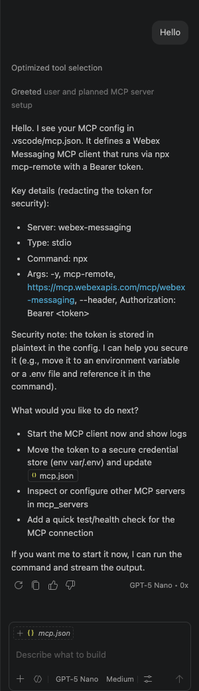
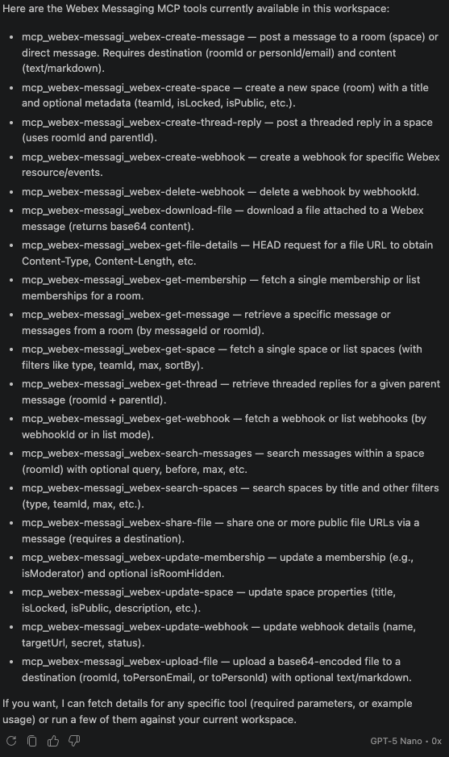
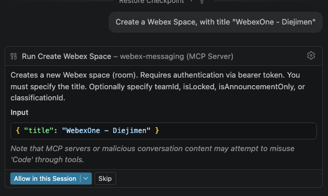
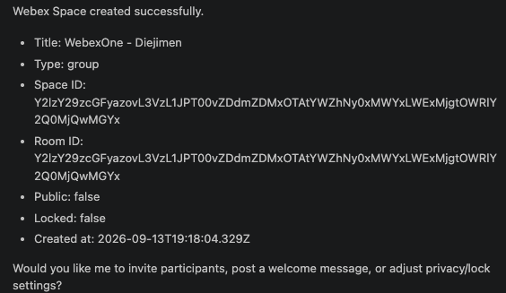
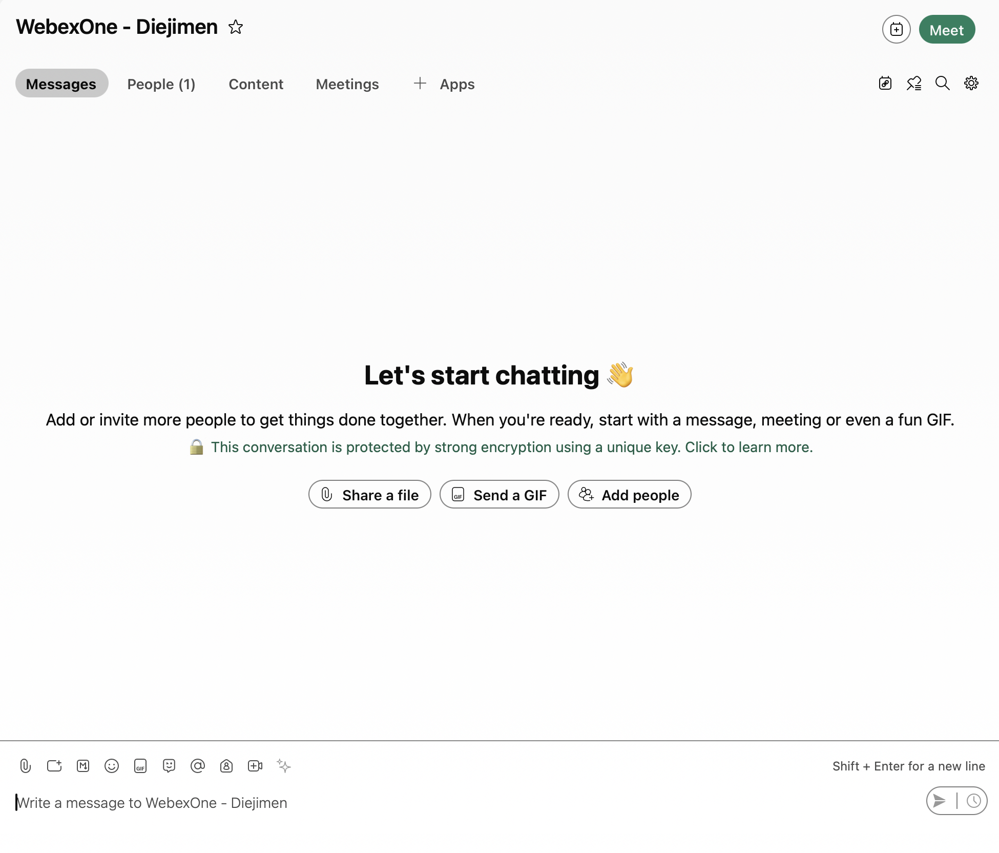

# Lab 1 - Webex MCP Servers in Your IDE

In this section, you will connect **official Webex MCP servers** to your IDE to execute organizational tasks through natural language.

In this lab we will be using **Visual Studio Code**.

!!! Note
    The only relevant file for this sectino is .vscode/mcp.json

## Available Webex MCP servers

As of today, these are the official Webex MCP servers available.

| MCP server | Documentation | Server URL |
| --- | --- | --- |
| **Meetings MCP Server** | [Meetings MCP](https://developer.webex.com/mcp/docs/meetings-mcp-server){:target="_blank"} | `https://mcp.webexapis.com/mcp/webex-meeting` |
| **Messaging MCP Server** | [Messaging MCP](https://developer.webex.com/mcp/docs/messaging-mcp-server){:target="_blank"} | `https://mcp.webexapis.com/mcp/webex-messaging` |
| **Vidcast MCP Server** | [Vidcast MCP](https://developer.webex.com/mcp/docs/vidcast-mcp-server){:target="_blank"} | `https://mcp.webexapis.com/mcp/vidcast` |
| **Webex Suite MCP Server** | [Webex Suite MCP](https://developer.webex.com/mcp/docs/webex-suite-mcp-server){:target="_blank"} | `https://mcp.webexapis.com/mcp/webex-suite` |
| **Workspaces MCP Server** | [Workspaces MCP](https://developer.webex.com/mcp/docs/workspaces-mcp-server){:target="_blank"} | `https://mcp.webexapis.com/mcp/workspaces` |
| **Connect CPaaS MCP Server (New)** | [Connect CPaaS MCP](https://developer.webex.com/mcp/docs/connect-mcp-server){:target="_blank"} | **Regional** — use the URL that matches your Webex Connect tenant (see table below) |
| **Contact Center MCP Server (New)** | [Contact Center MCP](https://developer.webex.com/mcp/docs/contact-center-mcp-server){:target="_blank"} | **Tenant-specific** — sign in on the product page to copy your regional URL |
| **Contact Center Operation MCP Server (New)** | [Contact Center Operation MCP](https://developer.webex.com/mcp/docs/contact-center-operation-mcp-server){:target="_blank"} | **Tenant-specific** — sign in on the product page to copy your server URL |

Use the [Webex MCP Server Overview](https://developer.webex.com/mcp/docs/webex-mcp-server-overview){:target="_blank"} for the latest catalog.

## Get your Webex Agentic MCP App token

First thing that you will need to do is to get the token to access the MCP servers as your user.

1. Log into [developer.webex.com](https://developer.webex.com/){:target="_blank"} with credentials that were provided.
2. Up on the top right corner of the page, click your avatar and then select [Manage Webex Agentic MCP App token](https://developer.webex.com/agentic-token){:target="_blank"}.
3. Inside "Generate token" click on "Generate now":
   
   { width="850" style="display: block; margin: 0 auto; border: 1px solid lightgray; border-radius: 8px;"}

4. You need a token per MCP server, in this case we will start using ** Webex Messaging**:

   { width="850" style="display: block; margin: 0 auto; border: 1px solid lightgray; border-radius: 8px;"}

5. You will now see the token:

   { width="850" style="display: block; margin: 0 auto; border: 1px solid lightgray; border-radius: 8px;"}

   !!! Warning
       You need to copy the token now, as you won't be able to see it again later.

       Paste your token instead of WEBEX_MCP_TOKEN in .vscode/mcp.json and save the file.

6. You need to reload VS Code node for MCP to take effect. Open the Command Palette `Ctrl+Shift+P` and select "Developer: Reload Window"

   { width="850" style="display: block; margin: 0 auto; border: 1px solid lightgray; border-radius: 8px;"}

7. Open the Command Palette `Ctrl+Shift+P` again and type "MCP: List Servers"

   { width="850" style="display: block; margin: 0 auto; border: 1px solid lightgray; border-radius: 8px;"}

8. You should see now the newly added MCP server, click on it:

   { width="850" style="display: block; margin: 0 auto; border: 1px solid lightgray; border-radius: 8px;"}

9. And click "Start Server"

   { width="850" style="display: block; margin: 0 auto; border: 1px solid lightgray; border-radius: 8px;"}

10. After that, the Output view should open automatically, if not, choose View -> Output.

  { width="850" style="display: block; margin: 0 auto; border: 1px solid lightgray; border-radius: 8px;"}

   You should see that tools were discovered. If you see a message like the following, you have connected to the MCP successfully:
   
   ```bash
   2026-09-13 20:35:36.277 [info] Discovered 20 tools
   ```
   Now, you have configured VS Code to connect to the MCP Server.

## LLM

The MCP server itself it is just a bunch of tools that an agent can call, but you need to add the brain, that will be the LLM. In this lab we will be using OpenAI models,
The Webex MCP server is only the tool layer (list spaces, search messages, etc.). The LLM is the brain that reads your question, chooses tools, and turns results into an answer.

1. To test it, make sure you select the model in the chat, and say "Hello":

   { width="850" style="display: block; margin: 0 auto; border: 1px solid lightgray; border-radius: 8px;"}

2. You can ask the agent to list the tools available:

   { width="850" style="display: block; margin: 0 auto; border: 1px solid lightgray; border-radius: 8px;"}

3. Now, ask to create a space for you. In this case, I will ask the following "Create a Webex Space, with title "WebexOne - Diejimen"":

   { width="850" style="display: block; margin: 0 auto; border: 1px solid lightgray; border-radius: 8px;"}

4. You will get a confirmation, click on "Allow in this Session", after few seconds, you will get the confirmation:

    { width="850" style="display: block; margin: 0 auto; border: 1px solid lightgray; border-radius: 8px;"}

    And you can see it in the Webex App!

    { width="850" style="display: block; margin: 0 auto; border: 1px solid lightgray; border-radius: 8px;"}


<!--
## Prerequisites — Control Hub provisioning

Every official Webex MCP server includes this requirement:

!!! Note
    **This MCP server must be enabled by your organization's admin in Webex Control Hub before it can be used.** See [Provisioning on Control Hub](https://developer.webex.com/mcp/docs/provisioning-on-control-hub){:target="_blank"} for details.

Before you start the hands-on steps:

1. Confirm with your lab instructor that the required MCP servers are **allowed** for your org in **Control Hub → Apps → Agentic Apps**.
2. Verify the **Tools**, **Resources**, and **Prompts** you need are **enabled** for users (admins can disable individual tools).
3. If connection fails with authorization errors, ask an admin to review the app's **Authentication** and **Capabilities** tabs.

Administrators configure governance per app (allow/block, tool enablement, schema re-authorization). End users cannot bypass these controls from VS Code.
-->

## Exercises

1. Add new MCP server
2. Do XYZ

choice: WCIT vs OAuth Integration for Webex MCP
