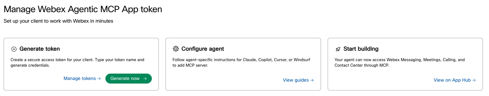
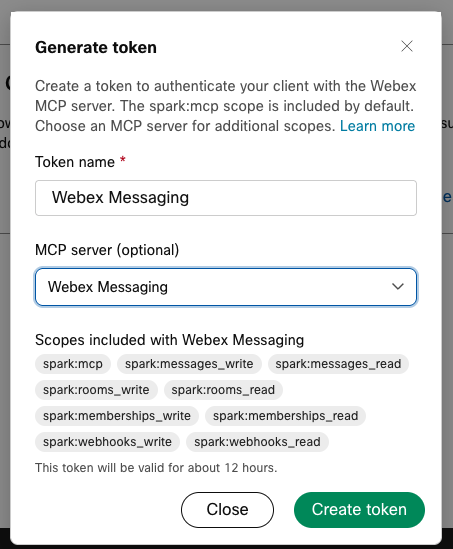
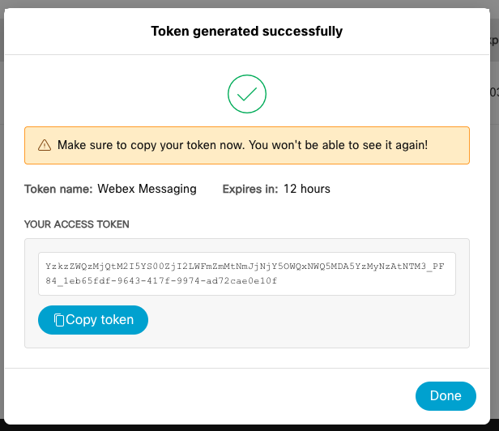
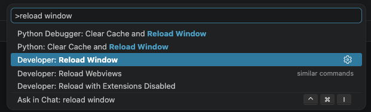
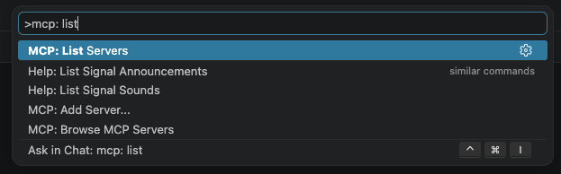
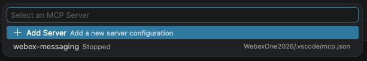
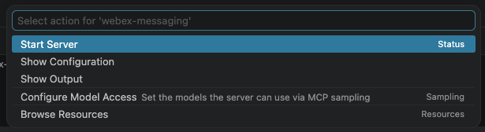
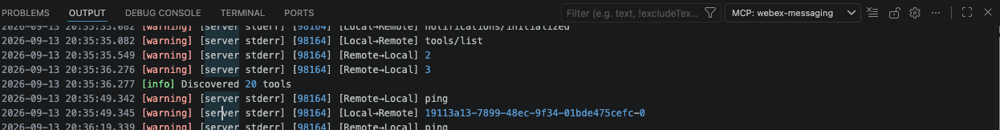

# Lab 3 - Webex MCP Servers in Your IDE

In this section, you will connect **official Webex MCP servers** to your IDE to execute organizational tasks through natural language.

In this lab we will be using **Visual Studio Code**.

## Visual Studio

Visual Studio Code will be used for Python-based bot development, service app configuration, and the agentic app and MCP server exercises.

1. Open Visual Studio Code from the desktop:

   { width="150" style="display: block; margin: 0 auto; border: 1px solid lightgray; border-radius: 8px;"}

2. Go to the **Source Control** tab and click **Clone Repository**:

    { width="500" style="display: block; margin: 0 auto; border: 1px solid lightgray; border-radius: 8px;"}

3. Type the following:

    - https://github.com/diegomjimenez/WebexOne2026.git

    { width="700" style="display: block; margin: 0 auto; border: 1px solid lightgray; border-radius: 8px;"}

4. Select a directory to save the project.
5. Click on **Yes, I trust the authors** if a pop-up appears.

!!! Note
    This contains all the exercises in this lab, but for now, the only relevant file is .vscode/mcp.json

## Available Webex MCP servers

As of today, these are the official Webex MCP servers available.

| MCP server | Documentation | Server URL |
| --- | --- | --- |
| **Connect CPaaS MCP Server** | [Connect CPaaS MCP](https://developer.webex.com/mcp/docs/connect-mcp-server){:target="_blank"} | **Regional** — use the URL that matches your Webex Connect tenant (see table below) |
| **Contact Center MCP Server** | [Contact Center MCP](https://developer.webex.com/mcp/docs/contact-center-mcp-server){:target="_blank"} | **Tenant-specific** — sign in on the product page to copy your regional URL |
| **Contact Center Operation MCP Server** | [Contact Center Operation MCP](https://developer.webex.com/mcp/docs/contact-center-operation-mcp-server){:target="_blank"} | **Tenant-specific** — sign in on the product page to copy your server URL |
| **Meetings MCP Server** | [Meetings MCP](https://developer.webex.com/mcp/docs/meetings-mcp-server){:target="_blank"} | `https://mcp.webexapis.com/mcp/webex-meeting` |
| **Messaging MCP Server** | [Messaging MCP](https://developer.webex.com/mcp/docs/messaging-mcp-server){:target="_blank"} | `https://mcp.webexapis.com/mcp/webex-messaging` |
| **Vidcast MCP Server** | [Vidcast MCP](https://developer.webex.com/mcp/docs/vidcast-mcp-server){:target="_blank"} | `https://mcp.webexapis.com/mcp/vidcast` |
| **Webex Suite MCP Server** | [Webex Suite MCP](https://developer.webex.com/mcp/docs/webex-suite-mcp-server){:target="_blank"} | `https://mcp.webexapis.com/mcp/webex-suite` |
| **Workspaces MCP Server** | [Workspaces MCP](https://developer.webex.com/mcp/docs/workspaces-mcp-server){:target="_blank"} | `https://mcp.webexapis.com/mcp/workspaces` |

Use the [Webex MCP Server Overview](https://developer.webex.com/mcp/docs/webex-mcp-server-overview){:target="_blank"} for the latest catalog.

## Get your Webex Agentic MCP App token

First thing that you will need to do is to get the token to access the MCP servers as your user.

1. Log into [developer.webex.com](https://developer.webex.com/){:target="_blank"} with credentials that were provided.
2. Up on the top right corner of the page, click your avatar and then select [Manage Webex Agentic MCP App token](https://developer.webex.com/agentic-token){:target="_blank"}.
3. Inside "Generate token" click on "Generate now":
   
   { width="850" style="display: block; margin: 0 auto; border: 1px solid lightgray; border-radius: 8px;"}

4. You need a token per MCP server, in this case we will start using ** Webex Messaging**:

   { width="850" style="display: block; margin: 0 auto; border: 1px solid lightgray; border-radius: 8px;"}

5. You will now see the token:

   { width="850" style="display: block; margin: 0 auto; border: 1px solid lightgray; border-radius: 8px;"}

   !!! Warning
       You need to copy the token now, as you won't be able to see it again later.

       Paste your token instead of WEBEX_MCP_TOKEN in .vscode/mcp.json and save the file.

6. You need to reload VS Code node for MCP to take effect. Open the Command Palette `Ctrl+Shift+P` and select "Developer: Reload Window"

   { width="850" style="display: block; margin: 0 auto; border: 1px solid lightgray; border-radius: 8px;"}

7. Open the Command Palette `Ctrl+Shift+P` again and type "MCP: List Servers"

   { width="850" style="display: block; margin: 0 auto; border: 1px solid lightgray; border-radius: 8px;"}

8. You should see now the newly added MCP server, click on it:

   { width="850" style="display: block; margin: 0 auto; border: 1px solid lightgray; border-radius: 8px;"}

9. And click "Start Server"

   { width="850" style="display: block; margin: 0 auto; border: 1px solid lightgray; border-radius: 8px;"}

10. After that, the Output view should open automatically, if not, choose View -> Output.

  { width="850" style="display: block; margin: 0 auto; border: 1px solid lightgray; border-radius: 8px;"}

   You should see that tools were discovered. If you see a message like the following, you have connected to the MCP successfully:
   
   ```bash
   2026-09-13 20:35:36.277 [info] Discovered 20 tools
   ```
   Now, you have configured VS Code to connect to the MCP Server.

## LLM

The MCP server itself it is just a bunch of tools that an agent can call, but you need to add the brain, that will be the LLM. In this lab we will be using OpenAI models,
The Webex MCP server is only the tool layer (list spaces, search messages, etc.). The LLM is the brain that reads your question, chooses tools, and turns results into an answer.


## Prerequisites — Control Hub provisioning

Every official Webex MCP server includes this requirement:

!!! Note
    **This MCP server must be enabled by your organization's admin in Webex Control Hub before it can be used.** See [Provisioning on Control Hub](https://developer.webex.com/mcp/docs/provisioning-on-control-hub){:target="_blank"} for details.

Before you start the hands-on steps:

1. Confirm with your lab instructor that the required MCP servers are **allowed** for your org in **Control Hub → Apps → Agentic Apps**.
2. Verify the **Tools**, **Resources**, and **Prompts** you need are **enabled** for users (admins can disable individual tools).
3. If connection fails with authorization errors, ask an admin to review the app's **Authentication** and **Capabilities** tabs.

Administrators configure governance per app (allow/block, tool enablement, schema re-authorization). End users cannot bypass these controls from VS Code.

### Lab recommendation

- **Start with Webex Suite MCP Server** for general collaboration workflows (meetings, messaging, calling, core Vidcast).
Every server requires **`spark:mcp`** to connect. Additional scopes depend on the tools you invoke (listed on each server's documentation page).

## Authentication — what is available?

There are two layers to understand: **how you authenticate from VS Code** (developer) and **how admins configure the app in Control Hub** (governance).

### A. Connecting from VS Code (developer)

Webex documents **two authorization methods** for AI clients:

| Method | Best for | How it works |
| --- | --- | --- |
| **1. Token-based (WCIT)** | Quick personal setup; works with MCP clients that support **elicitation** | Generate a **WCIT** on [Webex Agentic Token](https://developer.webex.com/agentic-token){:target="_blank"} (`spark:mcp` only; extra scopes via elicitation at tool time). |
| **2. OAuth 2.0 (Integration)** | **Recommended for this lab** when not using GitHub Copilot | Create a **Webex Integration** with `spark:mcp` and the tool scopes you need; connect via `mcp-remote` in VS Code. Avoids relying on a Copilot-style elicitation UI. |

Reference: [Authentication](https://developer.webex.com/mcp/docs/webex-agentic-mcp-servers#authentication){:target="_blank"}

!!! Note
    A **developer portal personal access token** (the short-lived token on the Webex for Developers homepage) and a **bot token** are **not** the documented way to authenticate to hosted Webex MCP servers. For VS Code in this lab, use **WCIT** or **OAuth Integration**.

### B. Control Hub authentication settings (admin)

When an admin configures an Agentic App in Control Hub, supported authentication methods include:

| Method | What the admin provides |
| --- | --- |
| OAuth 2.0 – Client Credentials | Client ID, Client Secret, token endpoint settings, scope |
| OAuth 2.0 – Authorization Code | Client ID, Client Secret, authorization endpoints, scope |
| **User Token** | No extra input (Cisco official servers use default configuration) |
| API Key | API key value |
| Custom Headers | Up to five header key–value pairs |

Reference: [Provisioning on Control Hub — Authentication](https://developer.webex.com/mcp/docs/provisioning-on-control-hub#authentication){:target="_blank"}

**User Token** here means an org-level Control Hub setting for the app — not a token you paste into VS Code. For hands-on work in VS Code, you still use **WCIT** or **OAuth** as described in the developer guide.

### Which Webex auth method should this lab use?

| Scenario | Recommendation |
| --- | --- |
| **LAB-31123 (VS Code + OpenAI, no Copilot)** | **OAuth Integration** for MCP (Step 3.6), or **WCIT** if your instructor confirms elicitation works in your MCP setup |
| Instructor provides only WCIT and a simple MCP connectivity check | **WCIT** (Step 3.1–3.2) |
| Tool calls fail with scope errors | OAuth Integration with full scopes from the server product page |
| Production shared bot / service account | OAuth Integration or Service App (Lab 5) |

### OpenAI authentication (separate from Webex)

The **OpenAI API key** is independent of Webex MCP:

| Variable | Purpose |
| --- | --- |
| `OPENAI_API_KEY` | Instructor-provided key for chat completions in lab Python (`05-bots/02_llm.py` and later) |
| `OPENAI_MODEL` | Model id (for example `gpt-5-nano` — use the value specified for your pod) |

Configure these in `.env` during Getting Started. The OpenAI key is **never** sent to Webex MCP servers.

## Step 3.1: Generate a WCIT token (lab default)

A **WCIT** (Webex Client Identity Token) is the token-based credential for Webex MCP servers. Generate it on the official **Webex Agentic Token** page — not from the short-lived bearer token on the Developer Portal homepage.

1. Sign in to [Webex for Developers](https://developer.webex.com){:target="_blank"} with your **lab user** account (same identity you use for Webex Client).
2. Open **[Webex Agentic Token](https://developer.webex.com/agentic-token){:target="_blank"}**.
3. Enter a descriptive name, for example `WebexOne-LAB-31123-VSCode`.
4. Click **Generate New Token** (or the equivalent action on the page).
5. **Copy the token immediately** and store it securely. You may not be able to view the full token again later.
6. Paste it into your local `.env` for lab scripts (optional) and into the VS Code MCP connection in Step 3.2.

```env
# .env (local only — never commit)
WEBEX_WCIT_TOKEN=your_wcit_token_here
```

**Manage or revoke tokens:** return to [Webex Agentic Token](https://developer.webex.com/agentic-token){:target="_blank"}, locate your token in the list, and delete/revoke it if compromised or no longer needed. Any VS Code MCP server using that token will lose access immediately.

See also: [Integrate Webex MCP — Token-Based Authentication](https://developer.webex.com/mcp/docs/webex-agentic-mcp-servers#authentication){:target="_blank"}.

## Step 3.2: Connect Webex Suite MCP in VS Code

Prerequisites:

- [Node.js](https://nodejs.org/){:target="_blank"} installed (`npx` available for `mcp-remote`)
- VS Code with MCP support (use the version documented for your event image)
- **Webex:** WCIT (Step 3.1) **or** OAuth Integration (Step 3.6)

Official reference: [VS Code + Webex MCP](https://developer.webex.com/mcp/docs/webex-agentic-mcp-servers-vscode){:target="_blank"} (Cisco also documents a Copilot-based flow; this lab uses **OpenAI in Python** instead of Copilot Chat).

### Option A — WCIT + manual `mcp.json` (token-based)

Follow [VS Code — Method 1: Token-based (WCIT)](https://developer.webex.com/mcp/docs/webex-agentic-mcp-servers-vscode){:target="_blank"} if you use WCIT:

1. Use the install widget on the doc page **or** add the workspace file below.
2. In VS Code, open the **Command Palette** and run **MCP: List Servers** (or your build’s equivalent).
3. Start the **webex-suite** server and confirm it reports connected.

!!! Note "Screenshot needed"
    Add screenshot of VS Code MCP view showing **webex-suite** connected.

Add a workspace file `.vscode/mcp.json` (or edit your user-level `mcp.json`):

```json
{
  "servers": {
    "webex-suite": {
      "type": "stdio",
      "command": "npx",
      "args": [
        "-y",
        "mcp-remote",
        "https://mcp.webexapis.com/mcp/webex-suite",
        "--header",
        "Authorization: Bearer YOUR_WCIT_TOKEN"
      ]
    }
  }
}
```

Replace `YOUR_WCIT_TOKEN` with your WCIT. Reload the VS Code window after saving.

!!! Note
    Exact `mcp-remote` flags may vary by version. Prefer the **one-click install** from the official VS Code guide if manual JSON fails.

## Step 3.3: Scope elicitation (WCIT only)

If you use **WCIT**, tools that need more than `spark:mcp` may trigger **MCP elicitation** (scope approval in the MCP client).

1. When your MCP client prompts you, review requested scopes and approve.
2. If nothing prompts you and tools fail, switch to **OAuth Integration** (Step 3.6).

If you use **OAuth Integration** with scopes pre-selected on the Integration, you typically **skip** elicitation for those scopes.

## Step 3.4: Verify connectivity

### A. Confirm the MCP server in VS Code

1. **MCP: List Servers** — `webex-suite` appears and can start without errors.
2. Check the MCP output log for authentication success (no repeated 401 errors).

### B. Confirm OpenAI (for the assistant path)

From the lab repo root with your venv active:

```bash
python -c "import os; from dotenv import load_dotenv; load_dotenv(); assert os.getenv('OPENAI_API_KEY'), 'Set OPENAI_API_KEY in .env'"
```

You will run natural-language + MCP tool workflows through the **Python bot** in Lab 5 (`05-bots/02_llm.py` and following steps), not through Copilot Chat.

**Sample user messages to try in Webex after Lab 5 MCP integration:**

```text
List my Webex spaces and show the title and ID for each one.
```

```text
List my upcoming Webex meetings for the next 7 days.
```

Optional REST smoke test (uses the same user OAuth ecosystem, not a substitute for WCIT on MCP):

```bash
# Only if you have a valid user access token with people_read — not required when using WCIT in VS Code
curl -s -H "Authorization: Bearer $WEBEX_ACCESS_TOKEN" \
  https://webexapis.com/v1/people/me | python -m json.tool
```

## Step 3.5: Connect an additional server (optional)

To add **Messaging-only** or **Vidcast-only** servers, repeat Step 3.2 with:

| Server | URL |
| --- | --- |
| Messaging | `https://mcp.webexapis.com/mcp/webex-messaging` |
| Vidcast | `https://mcp.webexapis.com/mcp/vidcast` |

Use separate MCP server entries in VS Code (for example `webex-messaging`, `webex-vidcast`).

## Step 3.6: OAuth Integration (recommended without GitHub Copilot)

Use this path when:

- You are **not** using GitHub Copilot for MCP chat (this lab)
- You need all scopes pre-authorized for demos or automation
- Your security team requires a registered Integration with redirect URI control

High-level steps:

1. Create a [Webex Integration](https://developer.webex.com/my-apps){:target="_blank"}:
   - **Redirect URI:** match the callback used by `mcp-remote` (for example `http://localhost:PORT/oauth/callback` — see VS Code doc)
   - **Scopes:** `spark:mcp` plus scopes listed on your server's product page (for Suite, see [Webex Suite MCP scopes](https://developer.webex.com/mcp/docs/webex-suite-mcp-server#scopes){:target="_blank"})
2. Copy **Client ID** and **Client Secret** (secret is shown once).
3. Add OAuth configuration per [VS Code — Method 2: OAuth via mcp-remote](https://developer.webex.com/mcp/docs/webex-agentic-mcp-servers-vscode){:target="_blank"}:

```json
{
  "servers": {
    "webex-suite-oauth": {
      "type": "stdio",
      "command": "npx",
      "args": [
        "mcp-remote",
        "https://mcp.webexapis.com/mcp/webex-suite",
        "3334",
        "--static-oauth-client-info",
        "{\"client_id\":\"YOUR_CLIENT_ID\",\"client_secret\":\"YOUR_CLIENT_SECRET\"}"
      ]
    }
  }
}
```

Register `http://localhost:3334/oauth/callback` (or your chosen port) on the Integration.

Complete the browser login when VS Code starts the server.

## Appendix — Why OAuth Integration is often best practice for production

| Topic | WCIT (token-based) | OAuth Integration |
| --- | --- | --- |
| Setup time | Minutes | More setup (Integration + redirect URI) |
| Scope management | Runtime elicitation | Pre-selected scopes on Integration |
| Rotation / revocation | Per-user WCIT in Developer Portal | Client secret + token lifecycle policies |
| Multi-user / shared agents | Each user generates WCIT | One Integration; each user completes OAuth |
| Audit and compliance | User-bound tokens | Clear app registration in Control Hub |

**Lab:** Use **OAuth Integration** for Webex MCP if you are on **OpenAI + Python** only; use **WCIT** if your instructor standardizes on token-based MCP connectivity checks.

**Production assistants** (shared bots, 24/7 agents, strict governance) usually standardize on **OAuth Integration** (or org-configured OAuth in Control Hub) so scopes, redirect URIs, and app ownership are explicit.

To build an Integration for later labs:

1. [Create an Integration](https://developer.webex.com/create/docs/integrations){:target="_blank"}
2. Request only scopes your workflow needs, plus **`spark:mcp`**
3. Store Client ID and Client Secret in a secrets manager
4. Register the Integration in Control Hub if your org requires admin approval for Agentic Apps

## Exercise checklist

- [ ] Admin confirmed MCP servers enabled in Control Hub
- [ ] `OPENAI_API_KEY` and `OPENAI_MODEL` set in `.env`
- [ ] WCIT **or** OAuth Integration configured for Webex MCP
- [ ] `webex-suite` server started successfully in VS Code
- [ ] Ready for Lab 5 bot + OpenAI + MCP exercises
- [ ] Notes on whether OAuth Integration would be better for your org's production assistant

## Troubleshooting

| Problem | Things to check |
| --- | --- |
| Connection failed | Server URL, WCIT not expired, internet access |
| 401 Unauthorized | Generate a new WCIT on [agentic-token](https://developer.webex.com/agentic-token){:target="_blank"}; verify `Bearer` prefix; confirm token was not revoked |
| Tools not listed | Valid JSON in `mcp.json`, reload VS Code, Node/`mcp-remote` installed |
| OpenAI 401 / 403 | Check instructor key and `OPENAI_MODEL`; do not commit `.env` |
| Tool fails after connect | Scope not granted — approve elicitation or use OAuth with full scopes |
| Server not visible at all | **Control Hub** — app blocked or tools disabled for org |

More detail: [Integrate Webex MCP — Troubleshooting](https://developer.webex.com/mcp/docs/webex-agentic-mcp-servers){:target="_blank"}

## Content still to define

- Lab-specific Control Hub screenshots (Agentic Apps → Webex Suite → Tools enabled)
- Confirmed `mcp-remote` and VS Code versions for event workstations
- Standard pod choice: WCIT vs OAuth Integration for Webex MCP
