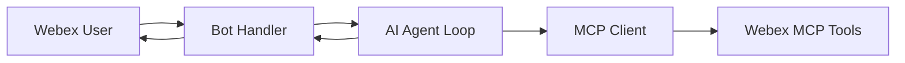

# Lab 5 - Integrate an AI Assistant with a Webex Bot

In this section, you will connect a Webex Bot to your AI assistant so users can manage and troubleshoot the organization from a Webex space.

Reference: [Webex Bots Guide](https://developer.webex.com/messaging/docs/bots){:target="_blank"}

## Learning Objectives

Upon completion of this section, you will be able to:

- Create a Webex Bot and store its access token securely
- Receive user messages via WebSocket (Mercury) or webhooks
- Forward bot messages to an AI agent that calls MCP tools
- Post assistant responses back to Webex

## Architecture



The bot handles **transport**. The agent handles **reasoning and tool selection**.

## Step 5.1: Create your lab bot

1. Log into [Webex for Developers](https://developer.webex.com/my-apps){:target="_blank"}.
2. Create a bot named **WebexOne-AI-*USERNAME***.
3. Copy the bot access token into `.env`:

    ```env
    BOT_TOKEN=your_bot_access_token
    LAB_SPACE_ID=your_lab_space_id
    ```

!!! Note "Screenshot needed"
    Add screenshot of bot registration in the Developer Portal.

## Step 5.2: Bot message handler

Review `bot/handler.py` in the lab repository:

```python
"""Receive Webex messages and forward them to the AI assistant."""

from websocket_client import WebSocketClient
from agent import run_assistant_turn

def handle_message(message, activity) -> None:
    room_id = message.roomId
    user_text = getattr(message, "text", "") or ""
    person_email = getattr(message, "personEmail", "")

    if not user_text.strip():
        return

    reply = run_assistant_turn(
        user_message=user_text,
        user_email=person_email,
        room_id=room_id,
    )
    send_message(api, room_id, reply)


if __name__ == "__main__":
    bot = WebSocketClient(
        access_token=BOT_TOKEN,
        bot_name="WebexOne-AI-Assistant",
        on_message=handle_message,
    )
    bot.run()
```

!!! Note
    This lab uses **WebSockets (Mercury)** so no public URL or ngrok tunnel is required. For production, you may use [webhooks](https://developer.webex.com/messaging/docs/api/guides/webhooks){:target="_blank"} instead.

## Step 5.3: AI agent loop

Review `agent/run.py`:

```python
"""One turn of the assistant: plan → MCP tools → respond."""

def run_assistant_turn(user_message: str, user_email: str, room_id: str) -> str:
    # 1. Build context (user, space, org policies from skills)
    # 2. Call LLM with available MCP tool definitions
    # 3. Execute tool calls through MCP client
    # 4. Return human-readable summary for Webex
    return "Placeholder: connect LLM + MCP client here."
```

Replace the placeholder with your lab LLM and MCP client integration.

## Step 5.4: Test the integration

1. Start the bot handler:

    ```bash
    cd bot
    python handler.py
    ```

2. Wait for **WebSocket connected** in the console.
3. In Webex, message your bot:

    ```text
    List my Webex spaces and tell me which one is the lab space.
    ```

4. Verify the assistant response appears in the conversation.

## Step 5.5: Optional — webhook alternative

For webhook-based bots, you need a publicly reachable HTTPS endpoint. Tools like ngrok or Localtunnel can expose a local server during development.

!!! Note "Content still to define"
    Document webhook URL registration steps if the lab offers a hosted tunnel service.

## Exercise checklist

- [ ] Bot created and token stored in `.env`
- [ ] Bot receives messages over WebSocket
- [ ] At least one MCP tool invoked in response to a user question
- [ ] Reply posted back to the Webex space

## Content still to define

- Final `run_assistant_turn()` implementation (OpenAI, Azure OpenAI, or lab-provided LLM)
- Rate limits and max tool calls per user message
- Allowed sender domain restrictions for the lab bot
