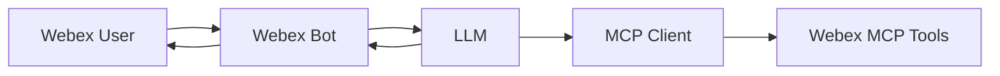
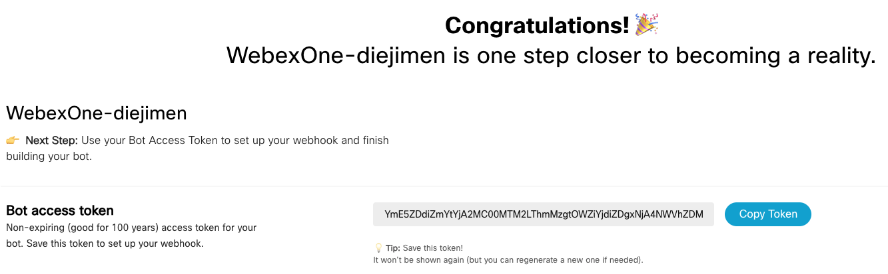
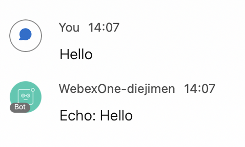
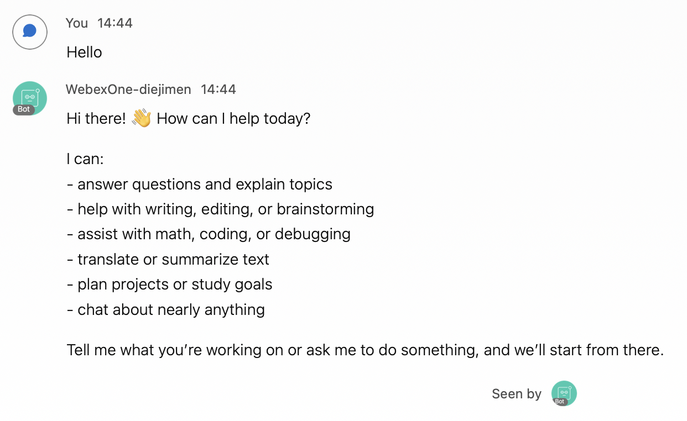

# Lab 5 - Integrate an AI Assistant with a Webex Bot

In this section, you will connect a Webex Bot to your AI assistant so users can manage and troubleshoot the organization from a Webex space.

Reference: [Webex Bots Guide](https://developer.webex.com/messaging/docs/bots){:target="_blank"}

## Learning Objectives

Upon completion of this section, you will be able to:

1. Create a **Bot** in Webex.
2. Receive user messages via WebSocket (Mercury).
3. Forward bot messages to an LLM.
4. Integrate MCP servers with teh LLM.
5. Post assistant responses back to Webex.

## Architecture



The bot handles **transport**. The agent handles **reasoning and tool selection**.

## Step 5.1: Create a Bot

First you need to create your bot:

1. Log into [developer.webex.com](https://developer.webex.com/){:target="_blank"} with credentials that were provided.
2. Up on the top right corner of the page, click your avatar and then select [My Webex Apps](https://developer.webex.com/my-apps){:target="_blank"}.
3. On the ‘Create a New App’ page, find the Bot card and click the ‘Create a Bot’ button.

{ width="850" style="display: block; margin: 0 auto; border: 1px solid lightgray; border-radius: 8px;" }

4. Fill out the webform to register a new service app.  
   1. **Bot Name:** WebexOne-*USERNAME*
   2. **Bot Username:** WebexOne-*USERNAME*
   3. **Icon:** *Select any color icon*.
   4. **Description**: “Bot for WebexOne”

{ width="850" style="display: block; margin: 0 auto; border: 1px solid lightgray; border-radius: 8px;" }

5. Copy the bot access token into `.env`:

    ```env
    BOT_TOKEN=your_bot_access_token
    ```

## Step 5.2: WebSocket Client

1. Navigate to 05-bots/websocket_client.py and review the code:

    ```python
    import asyncio
    import base64
    import json
    import ssl
    import uuid
    
    import certifi
    import requests
    import websockets
    
    API_URL = "https://webexapis.com/v1"
    # Host map for the org: used to find the WDM URL that issues WebSocket devices.
    CATALOG_URL = "https://u2c.wbx2.com/u2c/api/v1/catalog?format=hostmap"
    # Payload Webex expects when creating a desktop "device" that can open Mercury.
    DEVICE_DATA = {
        "deviceName": "pywebsocket-client",
        "deviceType": "DESKTOP",
        "localizedModel": "python",
        "model": "python",
        "name": "python-spark-client",
        "systemName": "python-spark-client",
        "systemVersion": "0.1",
    }
    
    
    class WebSocketClient:
        """Opens a Webex Mercury WebSocket and calls on_message(message) for each new post."""
    
        def __init__(self, access_token, on_message):
            self.access_token = access_token
            self.on_message = on_message  # callback(message) for each incoming post
            self.session = requests.Session()
            self.session.headers.update({"Authorization": f"Bearer {access_token}"})
            self.me = self.session.get(f"{API_URL}/people/me").json()
            # REST ids are base64 of "ciscospark://<cluster>/<type>/<uuid>"; the socket uses bare uuids.
            self.cluster, _, self.person_uuid = base64.b64decode(self.me["id"] + "==").decode().split("/")[2:]
    
        def get_message(self, activity_uuid):
            # The socket only carries encrypted text, so read the plaintext back from the REST API.
            message_id = base64.b64encode(f"ciscospark://{self.cluster}/MESSAGE/{activity_uuid}".encode()).decode()
            return self.session.get(f"{API_URL}/messages/{message_id}").json()
    
        def send_message(self, room_id, text):
            # POST a text message back into the same space.
            self.session.post(f"{API_URL}/messages", json={"roomId": room_id, "text": text})
    
        async def listen(self):
            # 1) Ask the catalog where device registration lives for this org.
            wdm_url = self.session.get(CATALOG_URL).json()["serviceLinks"]["wdm"]
            # 2) Register a device; the response includes the Mercury WebSocket URL.
            device = self.session.post(f"{wdm_url}/devices", json=DEVICE_DATA).json()
            # 3) Verify TLS with certifi (Python's default store often misses these CAs).
            ssl_context = ssl.create_default_context(cafile=certifi.where())
    
            async with websockets.connect(device["webSocketUrl"], ssl=ssl_context) as ws:
                # 4) Authorize the socket with the bot token before events start flowing.
                await ws.send(json.dumps({
                    "id": str(uuid.uuid4()),
                    "type": "authorization",
                    "data": {"token": f"Bearer {self.access_token}"},
                }))
                # 5) Fetch each new post in plaintext and hand it to the bot.
                async for raw in ws:
                    data = json.loads(raw).get("data", {})
                    if data.get("eventType") != "conversation.activity":
                        continue
                    activity = data["activity"]
                    # Only new posts, and never the bot's own replies (avoids an echo loop).
                    if activity["verb"] != "post" or activity["actor"]["id"] == self.person_uuid:
                        continue
                    self.on_message(self.get_message(activity["id"]))
    
        def run(self):
            asyncio.run(self.listen())
    ```

!!! Note
    This lab uses **WebSockets (Mercury)** so no public URL or ngrok tunnel is required. For production, you may use [webhooks](https://developer.webex.com/messaging/docs/api/guides/webhooks){:target="_blank"} instead.

## Step 5.3: Echo

1. Navigate to 05-bots/01_echo.py and review the code:

    ```python
    import logging
    import os
    
    from dotenv import load_dotenv
    
    from websocket_client import WebSocketClient
    
    logging.basicConfig(level=logging.INFO, format="%(asctime)s %(levelname)s %(message)s")
    log = logging.getLogger("echo-bot")
    
    load_dotenv()
    
    BOT_TOKEN = os.getenv("BOT_TOKEN")
    if not BOT_TOKEN:
        raise SystemExit("Set BOT_TOKEN in your .env file")
    
    
    def handle_message(activity):
        # Ignore non-posts and the bot's own replies (avoids an echo loop).
        if activity["verb"] != "post" or activity["actor"]["id"] == bot.person_uuid:
            return
    
        text = activity["object"].get("displayName", "").strip()
        if not text:
            return
    
        sender = activity["actor"]["emailAddress"]
        log.info(f"Received from {sender}: {text}")
    
        reply = f"Echo: {text}"
        bot.send_message(activity["target"]["id"], reply)  # target.id is the room UUID
        log.info(f"Sent to {sender}: {reply}")
    
    
    if __name__ == "__main__":
        bot = WebSocketClient(access_token=BOT_TOKEN, on_message=handle_message)
        log.info(f"Listening as {bot.me['emails'][0]} via WebSocket... (Ctrl+C to stop)")
        try:
            bot.run()
        except KeyboardInterrupt:
            log.info("Stopped.")
    ```

2. Make sure that in your terminal you are in the right folder:

   * cd 03-bots

3. Run your code with the following command:

   * python 01_echo.py

4. You should instantly get an answer:

    { width="850" style="display: block; margin: 0 auto; border: 1px solid lightgray; border-radius: 8px;" }

5. You can see something similar in the terminal:

    ```bash
    2026-09-09 14:07:21,970 INFO Listening as webexone-diejimen@webex.bot via WebSocket... (Ctrl+C to stop)
    2026-09-09 14:07:29,407 INFO Received from diejimen@cisco.com: Hello
    2026-09-09 14:07:29,925 INFO Sent to diejimen@cisco.com: Echo: Hello
    ```

## Step 5.4: LLM

Now, we will integrate the bot with an LLM. In this scenario we will be using OpenAI models.

1. Make sure you have your key in `.env`:

    ```env
    BOT_TOKEN=your_bot_access_token
    OPENAI_API_KEY=your_openai_api_key
    ```
    
2. Navigate to 05-bots/02_llm.py and review the code:

    ```python
    import logging
    import os
    
    import requests
    from dotenv import load_dotenv
    
    from websocket_client import WebSocketClient
    
    # Prefer the OS trust store (Windows/macOS/Linux) so company HTTPS inspection, whose CA
    # lives there but not in certifi, still verifies. Falls back to certifi if unavailable.
    try:
        import truststore
    
        truststore.inject_into_ssl()
    except ImportError:
        pass
    
    load_dotenv()
    
    OPENAI_URL = "https://api.openai.com/v1/chat/completions"
    OPENAI_MODEL = os.getenv("OPENAI_MODEL", "gpt-5-nano")
    ERROR_REPLY = "Sorry, I could not reach the AI service right now. Please try again in a moment."
    
    logging.basicConfig(level=logging.INFO, format="%(asctime)s %(levelname)s %(message)s")
    log = logging.getLogger("llm-bot")
    
    BOT_TOKEN = os.getenv("BOT_TOKEN")
    OPENAI_API_KEY = os.getenv("OPENAI_API_KEY")
    if not BOT_TOKEN:
        raise SystemExit("Set BOT_TOKEN in your .env file")
    if not OPENAI_API_KEY:
        raise SystemExit("Set OPENAI_API_KEY in your .env file")
    
    
    def ask_llm(user_text: str) -> str:
        response = requests.post(
            OPENAI_URL,
            headers={
                "Authorization": f"Bearer {OPENAI_API_KEY}",
                "Content-Type": "application/json",
            },
            json={
                "model": OPENAI_MODEL,
                "messages": [{"role": "user", "content": user_text}],
            },
            timeout=60,
        )
        response.raise_for_status()
        return response.json()["choices"][0]["message"]["content"]
    
    
    def handle_message(message):
        text = (message.get("text") or "").strip()
        if not text:
            return
    
        sender = message["personEmail"]
        log.info(f"Received from {sender}: {text}")
    
        # Details stay in the terminal; the user only ever sees ERROR_REPLY.
        try:
            reply = ask_llm(text)
        except requests.exceptions.SSLError:
            log.error(
                "TLS verification failed. If your company inspects HTTPS traffic, install the "
                "requirements (truststore) or point SSL_CERT_FILE at your corporate CA bundle."
            )
            reply = ERROR_REPLY
        except Exception:
            log.exception("LLM call failed")
            reply = ERROR_REPLY
    
        bot.send_message(message["roomId"], reply)
        log.info(f"Sent to {sender}: {reply}")
    
    
    if __name__ == "__main__":
        bot = WebSocketClient(access_token=BOT_TOKEN, on_message=handle_message)
        log.info(f"Listening as {bot.me['emails'][0]} via WebSocket... (Ctrl+C to stop)")
        log.info(f"OpenAI model: {OPENAI_MODEL}")
        try:
            bot.run()
        except KeyboardInterrupt:
            log.info("Stopped.")
    ```

    !!! Warning "Model"
        Note that for this lab "gpt-5-nano" model is forced. If you try to change it you will get 403.


3. Run your code with the following command:

   * python 02_llm.py

4. You should instantly get an answer:

    { width="850" style="display: block; margin: 0 auto; border: 1px solid lightgray; border-radius: 8px;" }

5. You can see something similar in the terminal:

    ```bash
    2026-09-13 14:44:01,915 INFO Received from diejimen@cisco.com: Hello
    2026-09-13 14:44:05,830 INFO Sent to diejimen@cisco.com: Hi there! 👋 How can I help today?
    
    I can: 
    - answer questions and explain topics
    - help with writing, editing, or brainstorming
    - assist with math, coding, or debugging
    - translate or summarize text
    - plan projects or study goals
    - chat about nearly anything
    
    Tell me what you’re working on or ask me to do something, and we’ll start from there.
    ```

## Step 5.5: Build the MCP Client

To be able to integrate the Webex MCP Clients into your Assistant, you need to have a MCP Client.


Replace the placeholder with your lab LLM and MCP client integration.

## Step 5.6: Webex MCP Integration

1. Start the bot handler:

    ```bash
    cd bot
    python handler.py
    ```

2. Wait for **WebSocket connected** in the console.
3. In Webex, message your bot:

    ```text
    List my Webex spaces and tell me which one is the lab space.
    ```

4. Verify the assistant response appears in the conversation.


## Extra: Security

So far, we have not introduce any security, therefore any user in or outsite your organization is able right now to run queries against your assistant.

You may want to introduce some security, to not only do not allow users outside your organization to access it, but also to only allow admin to run specific calls.

- Allowed sender domain restrictions for the lab bot
