# Lab 6 - Build a Custom MCP Server

In this chapter you will build an MCP server step by step, one file at a time that lets an AI assistant manage Webex Contact Center address books.

## Step 6.1: Defining and Implementing Tools

We will use the official `mcp` Python SDK to create our server. The SDK makes it incredibly easy to define tools and their execution logic using decorators. We will build our server in iterations.

### 1. Your First MCP Server

In this section we are going to start wit the simpliest MCP server that does real work: one tool, no network, no token. It takes a messy phone number and returns it in E.164 format.

1. Navigate to `06_custom_mcp/01_hello_mcp.py` and review the code.

    ??? Tip "Python Code"
        ```python
            # Step 01 - the smallest MCP server: one tool, no network, no token.
    
            import re
            import sys
            from mcp.server import MCPServer
    
            # Create an MCP server instance.
            mcp = MCPServer("webex-mcp-lab-01")
    
    
            # Register a tool that cleans a phone number to E.164 format.
            @mcp.tool()
            async def format_phone(number: str) -> str:
                """Clean a phone number to E.164 form, e.g. +14155550101."""
                digits = re.sub(r"\D", "", number)
                if not number.startswith("+") and len(digits) == 10:
                    digits = "1" + digits
                return "+" + digits
    
    
            # Start the server on stdio and wait for a client to connect.
            if __name__ == "__main__":
                print(
                    "webex-mcp-lab-01 running on stdio - waiting for a client (Ctrl+C to stop).",
                    file=sys.stderr,
                )
                mcp.run()
    
        ```

    Everything a `@mcp.tool()` decorator does is on display here:
    
    1. **Discovery.** The client learns there is a tool called `format_phone`.
    2. **Description.** The docstring becomes the tool's description. This is not documentation for you — it is how the model decides whether this is the right tool to call. A vague or misleading docstring produces a tool the model misuses.
    3. **Schema.** The `number: str` annotation becomes the input schema, so the client knows to send one string argument.

2. To test our MCP server we will be using a tool called MCP Inspector.

### 2. MCP Primitives: Tool, Resource, and Prompt

Next, we are going to build a single script that demonstrates the entire MCP architecture, which consists of three distinct primitives:

- **A tool** is an action the model calls. 
- **A resource** is context the client attaches, like handing the model a rulebook. 
- **A prompt** is the one primitive a human triggers directly — from a slash command or menu.

- Navigate to `06_custom_mcp/02_hello_resource_prompt.py` and review the code:

    ??? Tip "Python Code"
        ```python
            # Step 02 - all three MCP primitives (tool, resource, prompt) without credentials.
    
            import sys
            from mcp.server import MCPServer
    
            # Create an MCP server instance.
            mcp = MCPServer("webex-mcp-lab-02")
    
    
            # Register a tool that counts words and characters in a piece of text.
            @mcp.tool()
            async def count_words(text: str) -> dict:
                """Count the words and characters in a piece of text."""
                words = text.split()
                return {"words": len(words), "characters": len(text)}
    
    
            # Register a resource with greeting rules the tool cannot know on its own.
            @mcp.resource("lab://greeting-rules")
            def greeting_rules() -> str:
                return (
                    "Webex Contact Center greeting rules for this organization:\n"
                    "1. 12 words maximum.\n"
                    "2. Must include the agent's first name.\n"
                    "3. Never use 'ASAP' or 'obviously'.\n"
                )
    
    
            # Register a prompt that chains the resource and the tool into a review workflow.
            @mcp.prompt()
            def review_greeting(greeting: str = "") -> str:
                """Review an agent greeting against the organization rules."""
                return (
                    f"Review this agent greeting:\n\n"
                    f"{greeting or '<paste a greeting here>'}\n\n"
                    "1. Read the lab://greeting-rules resource for the org rules.\n"
                    "2. Call count_words to measure the greeting.\n"
                    "3. Tell me pass or fail, and why."
                )
    
    
            # Start the server on stdio and wait for a client to connect.
            if __name__ == "__main__":
                print(
                    "webex-mcp-lab-02 running on stdio - waiting for a client (Ctrl+C to stop).",
                    file=sys.stderr,
                )
                mcp.run()
    
        ```

### 3. Understand Webex Contact Center Address Book APIs

Before connecting to the real API, let's understand how Address Books work in Webex Contact Center. An address book is a named list of contacts that agents see in their desktop. 

Below is a screenshot showing how address books are seen in the agent desktop:

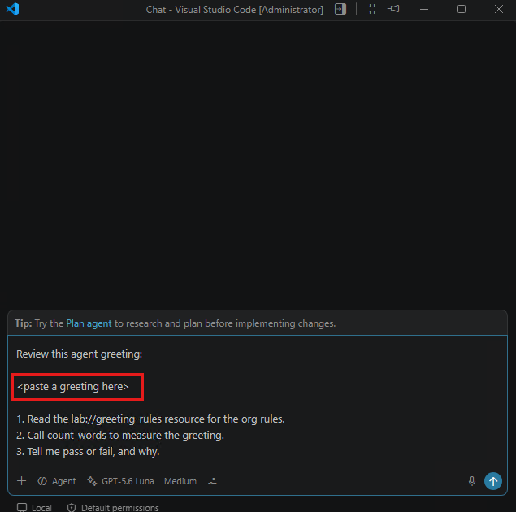{ width="650" style="display: block; margin: 0 auto; border: 1px solid lightgray; border-radius: 8px;" }

**Where are they configured?**
Use the same user credential to log in to Collaboration Control Hub: `https://admin.webex.com` and navigate to Contact Center. Scroll down and select Address Book.

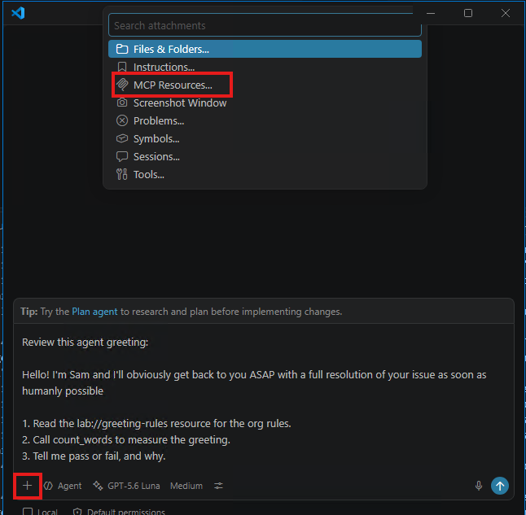{ width="650" style="display: block; margin: 0 auto; border: 1px solid lightgray; border-radius: 8px;" }

One address book is assigned to an agent profile:

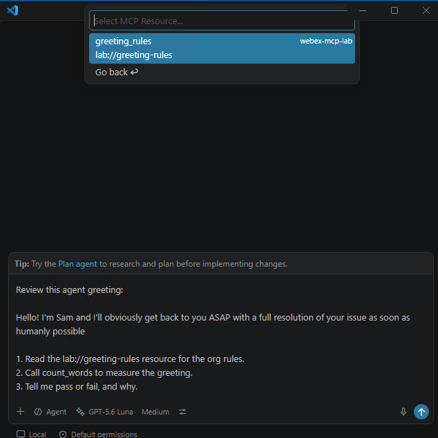{ width="650" style="display: block; margin: 0 auto; border: 1px solid lightgray; border-radius: 8px;" }

You can explore the APIs in the [Webex Developer Portal](https://developer.webex.com/).

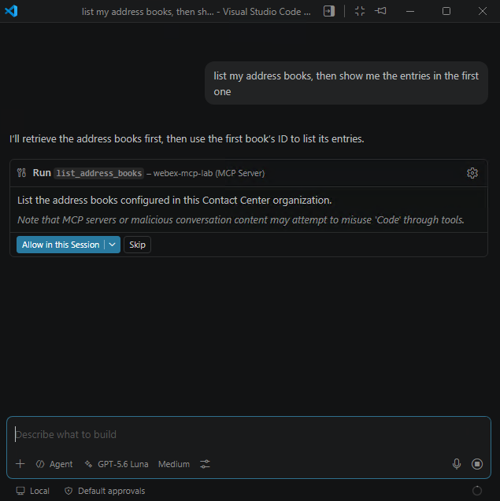{ width="500" style="display: block; margin: 0 auto; border: 1px solid lightgray; border-radius: 8px;" }
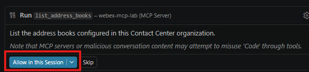{ width="700" style="display: block; margin: 0 auto; border: 1px solid lightgray; border-radius: 8px;" }
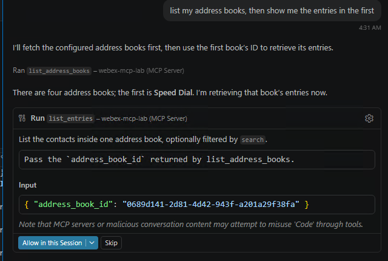{ width="650" style="display: block; margin: 0 auto; border: 1px solid lightgray; border-radius: 8px;" }

### 4. Reading from Webex Contact Center API

The first server that talks to the Webex Contact Center exposes two read-only tools — `list_address_books` and `list_entries`.

The server checks at startup for three values (`ACCESS_TOKEN`, `WEBEX_ORG_ID`, `WXCC_CONFIG_API_BASE`).

!!! Note
    - **`ACCESS_TOKEN`**: This is going to be the access token. We will actually use the Service App token for this task.
    - **`WEBEX_ORG_ID`** and **`WXCC_CONFIG_API_BASE`**: These are related to the sandbox and will be set up in advance for you, but here is how you can find them:
    
        For `WEBEX_ORG_ID`, you need to go in Collaboration Control Hub to Account:
    
        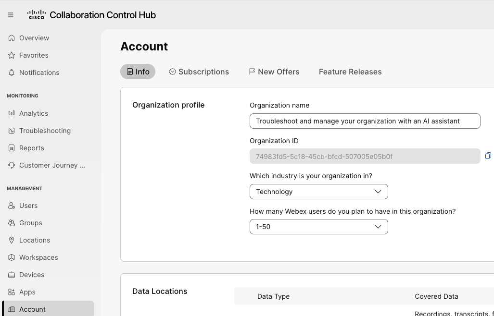{ width="650" style="display: block; margin: 0 auto; border: 1px solid lightgray; border-radius: 8px;" }
    
        For `WXCC_CONFIG_API_BASE`, you can find it using this information (in this case it will be `us1`):
    
        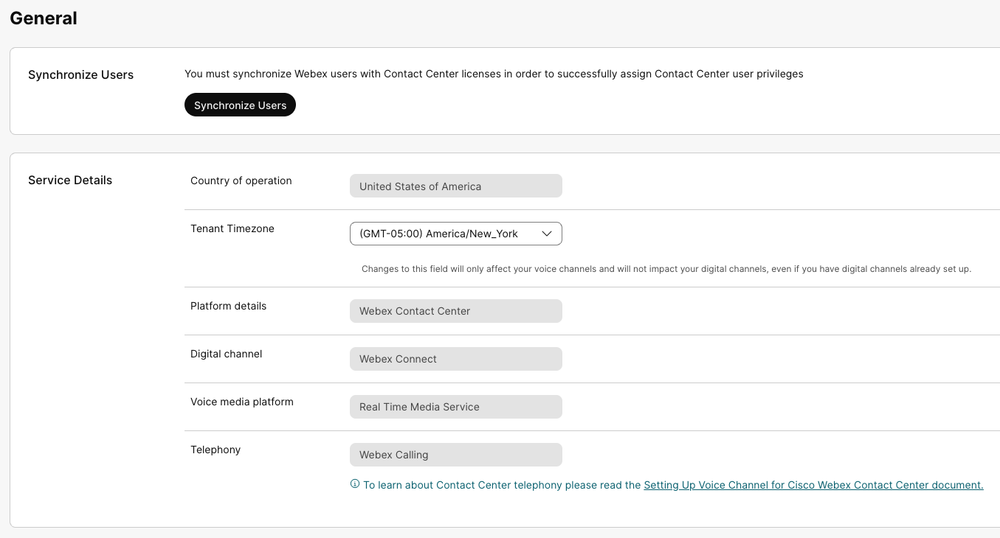{ width="650" style="display: block; margin: 0 auto; border: 1px solid lightgray; border-radius: 8px;" }
    
        While general Webex APIs use a global endpoint (`https://webexapis.com/v1`), Webex Contact Center (WxCC) specific data and agent APIs route through regional endpoints. [1](https://www.cisco.com/c/en/us/support/docs/contact-center/webex-contact-center/218418-configure-webex-contact-center-apis-with.html)
        
        The region can be identified through the following methods:
        
        1. **Check in Webex Control Hub**
           You can find your data residency/region directly inside the dashboard: [1](https://community.cisco.com/t5/webex-for-developers/programmatically-retrieve-the-data-center-instance-for-contact/m-p/5252255)
           - Log into Webex Control Hub.
           - Navigate to Services > Contact Center > Tenant Settings.
           - Go to General > Service Details.
           - Look for the Country of Operation or data center zone field. [1](https://cloud.cloverhound.com/docs/campaigns/integration), [2](https://community.cisco.com/t5/webex-for-developers/programmatically-retrieve-the-data-center-instance-for-contact/m-p/5252255)
           
        2. **Map Region to the Correct API Base URL**
           Once you know the country or code of operation, match it to the standard Webex Contact Center datacenter variables (`us1`, `eu1`, `eu2`, `anz1`, `jp1`, `sg1`): [1](https://help.webex.com/en-us/article/n1lsqvu/Integrate-Webex-Contact-Center-CRM-Connector-for-Microsoft-Dynamics-365-(Version2-New)), [2](https://www.cisco.com/c/en/us/support/docs/contact-center/webex-contact-center/218418-configure-webex-contact-center-apis-with.html)
           
           | Region / Operation Location | Datacenter Variable | API Base URL Example |
           | --- | --- | --- |
           | North America | `us1` | `https://api.wxcc-us1.cisco.com` |
           | United Kingdom | `eu1` | `https://api.wxcc-eu1.cisco.com` |
           | Europe | `eu2` | `https://api.wxcc-eu2.cisco.com` |
           | APJC (Australia / NZ) | `anz1` | `https://api.wxcc-anz1.cisco.com` |
           | Japan | `jp1` | `https://api.wxcc-jp1.cisco.com` |
           | Singapore | `sg1` | `https://api.wxcc-sg1.cisco.com` |

Navigate to `06_custom_mcp/03_read_books.py` and review the code:

??? Tip "Python Code"
    ```python
        """
        Webex One 2026 - Troubleshoot and Manage Your Organization with an AI Assistant

        - Diego Manuel Jimenez Moreno
        - Mo Eyad Musallam
        """
        # Step 03 - reading: list address books, then list entries inside one book.

        import os
        import sys
        import httpx
        from dotenv import load_dotenv
        from mcp.server import MCPServer

        # Load credentials from .env.
        load_dotenv()

        TOKEN = os.environ.get("ACCESS_TOKEN")
        ORG_ID = os.environ.get("WEBEX_ORG_ID")
        CONFIG_API_BASE = os.environ.get("WXCC_CONFIG_API_BASE", "")

        # Stop early if any credential is missing.
        for _name, _value in (
            ("ACCESS_TOKEN", TOKEN),
            ("WEBEX_ORG_ID", ORG_ID),
            ("WXCC_CONFIG_API_BASE", CONFIG_API_BASE),
        ):
            if not _value:
                sys.exit(f"{_name} is not set. This lab needs Webex Contact Center - see .env.example.")

        # Build the API base URL and common headers.
        ORG = f"{CONFIG_API_BASE.rstrip('/')}/organization/{ORG_ID}"
        HEADERS = {"Authorization": f"Bearer {TOKEN}", "Accept": "application/json"}

        # Create an MCP server instance.
        mcp = MCPServer("webex-mcp-lab-03")


        # List all address books in the Contact Center organization.
        @mcp.tool()
        async def list_address_books(limit: int = 50) -> dict:
            """List the address books configured in this Contact Center organization."""
            async with httpx.AsyncClient(timeout=15) as http:
                response = await http.get(
                    f"{ORG}/v3/address-book", headers=HEADERS, params={"pageSize": limit}
                )

            if response.status_code != 200:
                return {"error": f"Webex Contact Center returned HTTP {response.status_code}."}

            books = [
                {"id": book.get("id"), "name": book.get("name"), "description": book.get("description")}
                for book in response.json().get("data", [])
            ]
            return {"count": len(books), "address_books": books}


        # List contacts inside one address book, using its id from list_address_books.
        @mcp.tool()
        async def list_entries(address_book_id: str, search: str = "") -> dict:
            """List the contacts inside one address book, optionally filtered by `search`.

            Pass the `address_book_id` returned by list_address_books.
            """
            params: dict = {"page": 0, "pageSize": 100}
            if search:
                params["search"] = search

            async with httpx.AsyncClient(timeout=15) as http:
                response = await http.get(
                    f"{ORG}/v2/address-book/{address_book_id}/entry", headers=HEADERS, params=params
                )

            if response.status_code != 200:
                return {"error": f"Webex Contact Center returned HTTP {response.status_code}."}

            entries = [
                {"id": entry.get("id"), "name": entry.get("name"), "number": entry.get("number")}
                for entry in response.json().get("data", [])
            ]
            return {"count": len(entries), "entries": entries}


        # Start the server on stdio and wait for a client to connect.
        if __name__ == "__main__":
            print(
                "webex-mcp-lab-03 running on stdio - waiting for a client (Ctrl+C to stop).",
                file=sys.stderr,
            )
            mcp.run()

    ```

### 5. Writing: Create and Fill an Address Book

This step writes to the API. It exposes exactly two tools: `create_address_book` and `add_entry`. 

Navigate to `06_custom_mcp/04_write_books.py` and review the code:

??? Tip "Python Code"
    ```python
        """
        Webex One 2026 - Troubleshoot and Manage Your Organization with an AI Assistant

        - Diego Manuel Jimenez Moreno
        - Mo Eyad Musallam
        """
        # Step 04 - writing: create an address book, then fill it with contacts.

        import os
        import sys
        import httpx
        from dotenv import load_dotenv
        from mcp.server import MCPServer

        # Load credentials from .env.
        load_dotenv()

        TOKEN = os.environ.get("ACCESS_TOKEN")
        ORG_ID = os.environ.get("WEBEX_ORG_ID")
        CONFIG_API_BASE = os.environ.get("WXCC_CONFIG_API_BASE", "")

        # Stop early if any credential is missing.
        for _name, _value in (
            ("ACCESS_TOKEN", TOKEN),
            ("WEBEX_ORG_ID", ORG_ID),
            ("WXCC_CONFIG_API_BASE", CONFIG_API_BASE),
        ):
            if not _value:
                sys.exit(f"{_name} is not set. This lab needs Webex Contact Center - see .env.example.")

        # Build the API base URL and common headers.
        ORG = f"{CONFIG_API_BASE.rstrip('/')}/organization/{ORG_ID}"
        HEADERS = {"Authorization": f"Bearer {TOKEN}", "Accept": "application/json"}

        # Create an MCP server instance.
        mcp = MCPServer("webex-mcp-lab-04")


        # Turn an HTTP failure into a sentence the model can relay to the user.
        def _fail(response: httpx.Response) -> dict:
            """Turn an HTTP failure into a sentence the model can pass on to the user."""
            if response.status_code == 401:
                return {"error": "Webex rejected the token. Check that it has not expired."}
            if response.status_code == 403:
                return {"error": "The token lacks Contact Center config permission (cjp:config_write)."}
            if response.status_code == 404:
                return {"error": "No such address book in this organization."}
            if response.status_code == 429:
                return {"error": "Rate limited by Webex. Wait a moment and try again."}
            return {"error": f"Webex Contact Center returned HTTP {response.status_code}."}


        # Create a new address book and return its id.
        @mcp.tool()
        async def create_address_book(name: str, description: str = "") -> dict:
            """Create a new address book. Returns its id, which add_entry then needs.

            The MCP client asks the user for approval before this runs.
            """
            async with httpx.AsyncClient(timeout=15) as http:
                response = await http.post(
                    f"{ORG}/v3/address-book",
                    headers=HEADERS,
                    json={"name": name, "description": description, "parentType": "ORGANIZATION"},)

            if response.status_code not in (200, 201):
                return _fail(response)

            book = response.json()
            return {"created": True, "address_book_id": book.get("id"), "name": book.get("name")}


        # Add a contact to an address book using the id from create_address_book.
        @mcp.tool()
        async def add_entry(address_book_id: str, name: str, number: str) -> dict:
            """Add a contact to an address book. `number` should be E.164, e.g. +14155550101.

            `address_book_id` is what create_address_book returned. The MCP client asks
            the user for approval before this runs.
            """
            async with httpx.AsyncClient(timeout=15) as http:
                response = await http.post(
                    f"{ORG}/address-book/{address_book_id}/entry",
                    headers=HEADERS,
                    json={"name": name, "number": number},
                )

            if response.status_code not in (200, 201):
                return _fail(response)

            return {"added": True, "entry_id": response.json().get("id"), "name": name}


        # Start the server on stdio and wait for a client to connect.
        if __name__ == "__main__":
            print(
                "webex-mcp-lab-04 running on stdio - waiting for a client (Ctrl+C to stop).",
                file=sys.stderr,
            )
            mcp.run()

    ```

## Step 6.2: Register in your IDE

In this section, you will add and test your custom MCP servers directly in VS Code.

1. Open the Command Palette (`Ctrl+Shift+P`) and type `MCP: Open User Configuration`.
2. Add the configuration to `mcp.json`. You can change the `args` array to point to the specific script you want to test (e.g., `01_hello_mcp.py`, `03_read_books.py`, etc.).

    ```json
    {
      "servers": {
        "webex-mcp-lab": {
          "command": "/absolute/path/to/webex-mcp-lab/.venv/Scripts/python.exe",
          "args": ["06_custom_mcp/01_hello_mcp.py"],
          "cwd": "/absolute/path/to/05-bots"
        }
      }
    }
    ```

    !!! Note
        Point `command` at the Python interpreter inside your `.venv`, and set `cwd` to the lab folder so the server finds your `.env`. No environment-file flag is needed — the server loads `.env` itself.

3. Start the MCP server. Click the "Start" button in the `mcp.json` file, or use the Command Palette (`Ctrl+Shift+P` -> `MCP: List Servers`).

    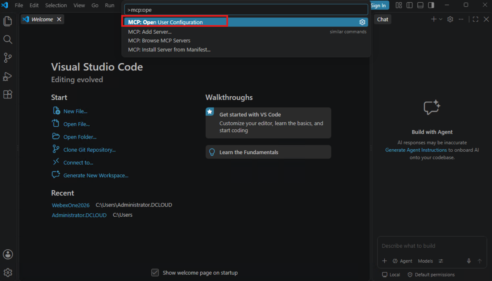{ width="850" style="display: block; margin: 0 auto; border: 1px solid lightgray; border-radius: 8px;" }
    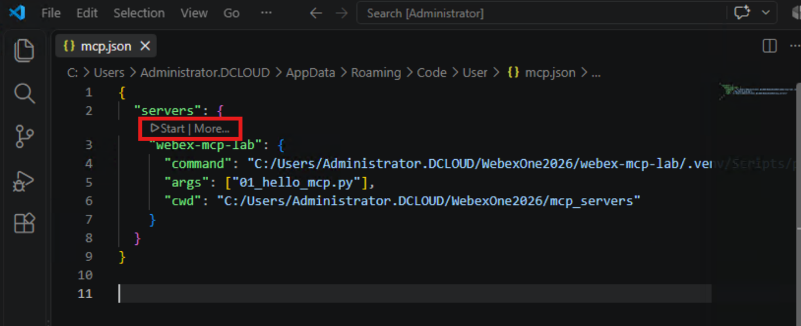{ width="750" style="display: block; margin: 0 auto; border: 1px solid lightgray; border-radius: 8px;" }

    You will see MCP server logs in the output section automatically. 
    
    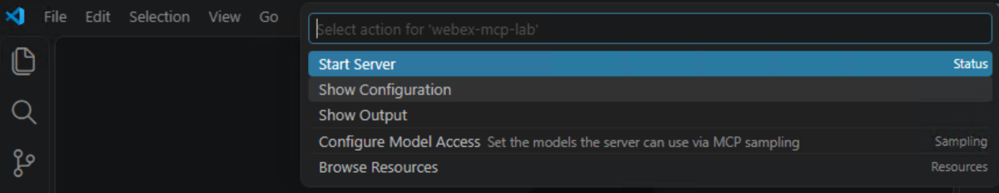{ width="750" style="display: block; margin: 0 auto; border: 1px solid lightgray; border-radius: 8px;" }

4. Open the VS Code Chat view and test your tools!

    **Testing 01_hello_mcp.py:**
    Ask: *"clean the number (415) 555-0101"*. 
    
    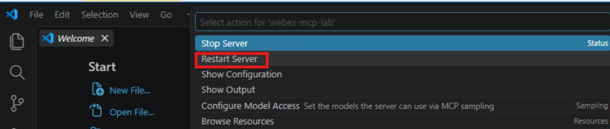{ width="750" style="display: block; margin: 0 auto; border: 1px solid lightgray; border-radius: 8px;" }

    **Testing 02_hello_resource_prompt.py:**
    Add Context -> MCP Resources -> `lab://greeting-rules`, and ask: *"What are the greeting rules?"*
    
    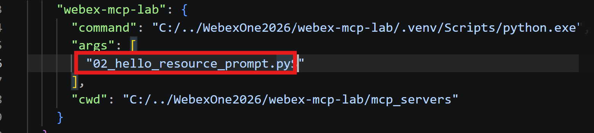{ width="650" style="display: block; margin: 0 auto; border: 1px solid lightgray; border-radius: 8px;" }
    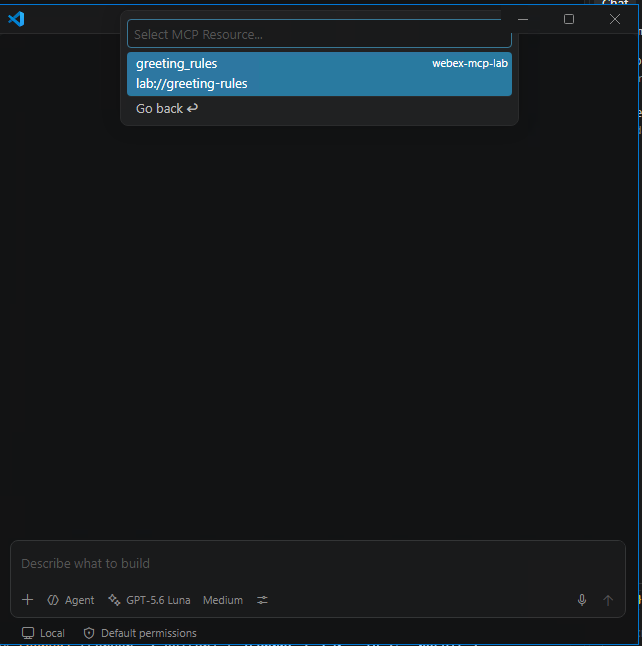{ width="650" style="display: block; margin: 0 auto; border: 1px solid lightgray; border-radius: 8px;" }

    **Testing 03_read_books.py:**
    Ask: *"list my address books, then show me the entries in the first one"*
    
    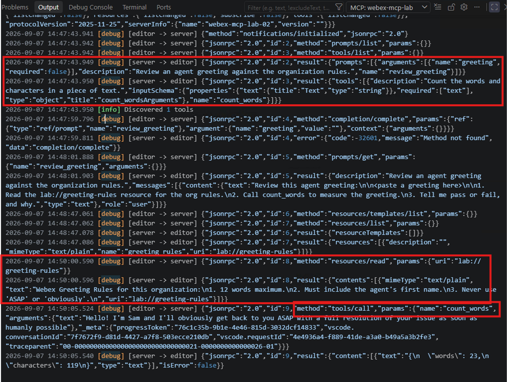{ width="650" style="display: block; margin: 0 auto; border: 1px solid lightgray; border-radius: 8px;" }

    **Testing 04_write_books.py:**
    Ask the AI assistant to create an address book and entries there.
    
    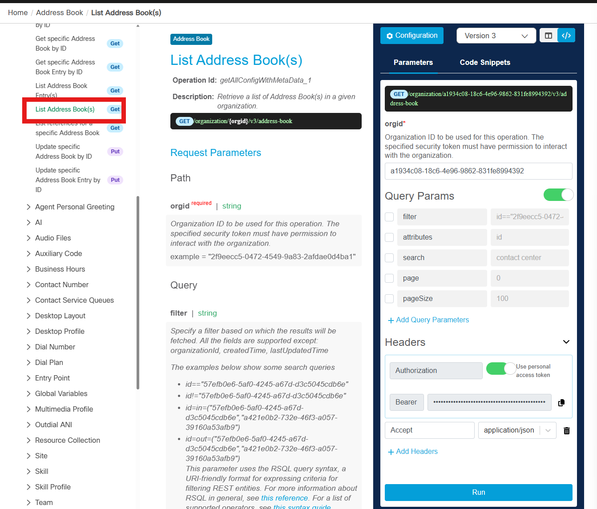{ width="650" style="display: block; margin: 0 auto; border: 1px solid lightgray; border-radius: 8px;" }
    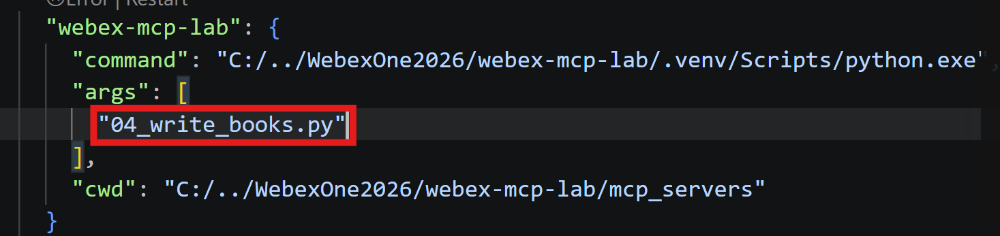{ width="650" style="display: block; margin: 0 auto; border: 1px solid lightgray; border-radius: 8px;" }

## Step 6.3: Integrate with your AI Assistant

Now, you will add your custom MCP server to your AI assistant. 

Unlike the official Webex MCP servers which run remotely and connect via HTTP (Server-Sent Events), our custom server runs locally over standard input/output (`stdio`). 

!!! Warning "Placeholder: Bot Integration"
    [PLACEHOLDER: In the final lab, we will provide the code to integrate this local `stdio` custom MCP server with the Webex Bot using the `McpHub` and `McpClient` classes, similar to what was done in Lab 4. This will allow users to interact with the Contact Center Address Books directly from their Webex App.]

## Extra: Elicitation

We trusted the host to ask permission. This step explores what happens when the server itself needs to ask a question mid-call. The MCP protocol calls this **elicitation**: the server pauses, sends a form to the user, and resumes based on the answer.

The server exposes exactly two tools: `delete_address_book` and `delete_entry`. 

1. Update `.vscode/mcp.json` to point at `06_custom_mcp/05_delete_books.py` and restart.

??? Tip "Python Code"
    ```python
        """
        Webex One 2026 - Troubleshoot and Manage Your Organization with an AI Assistant

        - Diego Manuel Jimenez Moreno
        - Mo Eyad Musallam
        """
        # Step 05 - deleting with a safety net: elicitation asks "are you sure?" mid-call.

        import os
        import sys
        from typing import Annotated

        import httpx
        from dotenv import load_dotenv
        from mcp.server import MCPServer

        # Elicitation imports: the resolver pattern lets the server ask the user a question mid-call.
        from mcp.server.mcpserver import (
            AcceptedElicitation,
            CancelledElicitation,
            DeclinedElicitation,
            Elicit,
            ElicitationResult,
            Resolve,
        )
        from pydantic import BaseModel

        # Load credentials from .env.
        load_dotenv()

        TOKEN = os.environ.get("ACCESS_TOKEN")
        ORG_ID = os.environ.get("WEBEX_ORG_ID")
        CONFIG_API_BASE = os.environ.get("WXCC_CONFIG_API_BASE", "")

        # Stop early if any credential is missing.
        for _name, _value in (
            ("ACCESS_TOKEN", TOKEN),
            ("WEBEX_ORG_ID", ORG_ID),
            ("WXCC_CONFIG_API_BASE", CONFIG_API_BASE),
        ):
            if not _value:
                sys.exit(f"{_name} is not set. This lab needs Webex Contact Center - see .env.example.")

        # Build the API base URL and common headers.
        ORG = f"{CONFIG_API_BASE.rstrip('/')}/organization/{ORG_ID}"
        HEADERS = {"Authorization": f"Bearer {TOKEN}", "Accept": "application/json"}

        # Create an MCP server instance.
        mcp = MCPServer("webex-mcp-lab-05")


        # The confirmation form the user sees: one boolean field.
        class Confirm(BaseModel):
            ok: bool


        # Resolver for address book deletion — always asks before proceeding.
        async def confirm_delete_book(address_book_id: str) -> Elicit[Confirm]:
            return Elicit(f"Delete address book '{address_book_id}'? This cannot be undone.", Confirm)


        # Resolver for entry deletion — always asks before proceeding.
        async def confirm_delete_entry(address_book_id: str, entry_id: str) -> Elicit[Confirm]:
            return Elicit(
                f"Delete entry '{entry_id}' from book '{address_book_id}'? This cannot be undone.",
                Confirm,
            )


        # Delete an address book after the user confirms via elicitation.
        @mcp.tool()
        async def delete_address_book(
            address_book_id: str,
            confirm: Annotated[ElicitationResult[Confirm], Resolve(confirm_delete_book)],
        ) -> dict:
            """Delete an address book by id. The server asks you to confirm first."""
            match confirm:
                case AcceptedElicitation(data=Confirm(ok=True)):
                    async with httpx.AsyncClient(timeout=15) as http:
                        r = await http.delete(
                            f"{ORG}/v3/address-book/{address_book_id}", headers=HEADERS
                        )
                    if r.status_code not in (200, 204):
                        return {"error": f"Webex Contact Center returned HTTP {r.status_code}."}
                    return {"deleted": True, "address_book_id": address_book_id}
                case AcceptedElicitation():
                    return {"deleted": False, "reason": "You chose not to delete."}
                case DeclinedElicitation() | CancelledElicitation():
                    return {"deleted": False, "reason": "Confirmation was declined or dismissed."}


        # Delete a single contact after the user confirms via elicitation.
        @mcp.tool()
        async def delete_entry(
            address_book_id: str,
            entry_id: str,
            confirm: Annotated[ElicitationResult[Confirm], Resolve(confirm_delete_entry)],
        ) -> dict:
            """Delete a single contact from an address book. The server asks you to confirm first."""
            match confirm:
                case AcceptedElicitation(data=Confirm(ok=True)):
                    async with httpx.AsyncClient(timeout=15) as http:
                        r = await http.delete(
                            f"{ORG}/v2/address-book/{address_book_id}/entry/{entry_id}",
                            headers=HEADERS,
                        )
                    if r.status_code not in (200, 204):
                        return {"error": f"Webex Contact Center returned HTTP {r.status_code}."}
                    return {"deleted": True, "entry_id": entry_id}
                case AcceptedElicitation():
                    return {"deleted": False, "reason": "You chose not to delete."}
                case DeclinedElicitation() | CancelledElicitation():
                    return {"deleted": False, "reason": "Confirmation was declined or dismissed."}


        # Start the server on stdio and wait for a client to connect.
        if __name__ == "__main__":
            print(
                "webex-mcp-lab-05 running on stdio - waiting for a client (Ctrl+C to stop).",
                file=sys.stderr,
            )
            mcp.run()

    ```

2. Ask to delete a certain address book, it asks for the ID of that book, just click "Enter".

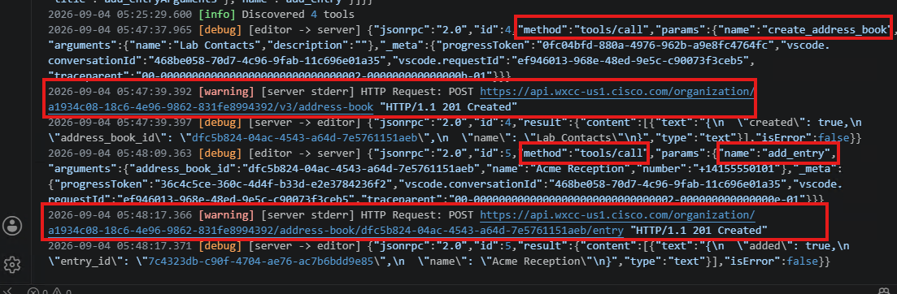{ width="650" style="display: block; margin: 0 auto; border: 1px solid lightgray; border-radius: 8px;" }

This is the request from VS Code for tool execution approval:

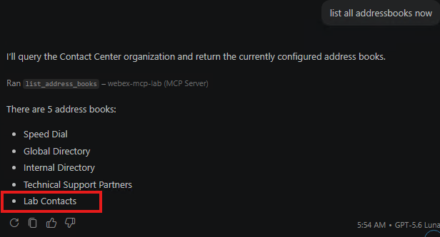{ width="650" style="display: block; margin: 0 auto; border: 1px solid lightgray; border-radius: 8px;" }

You will see another approval requested here which is what elicitation means:

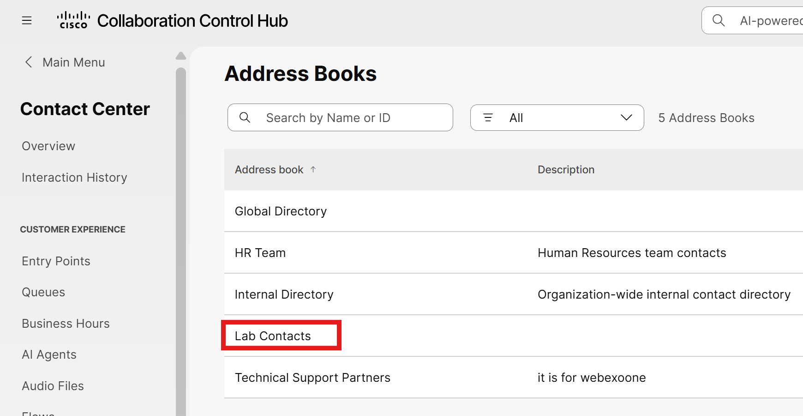{ width="650" style="display: block; margin: 0 auto; border: 1px solid lightgray; border-radius: 8px;" }

!!! Tip "Watch for"
    Two approval moments. First the host asks "call delete_address_book?", then the server's elicitation form asks "delete this specific book?". They are different layers.

Since we are not sure what the ID of that address book is, it returns 404.

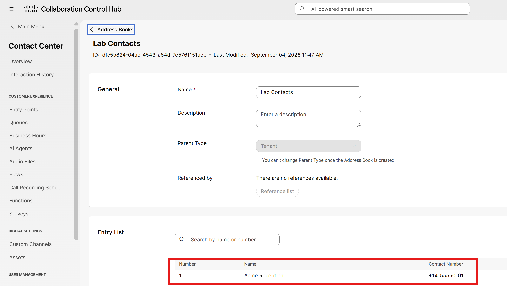{ width="650" style="display: block; margin: 0 auto; border: 1px solid lightgray; border-radius: 8px;" }

Now we can delete the speed dial with a specific ID.

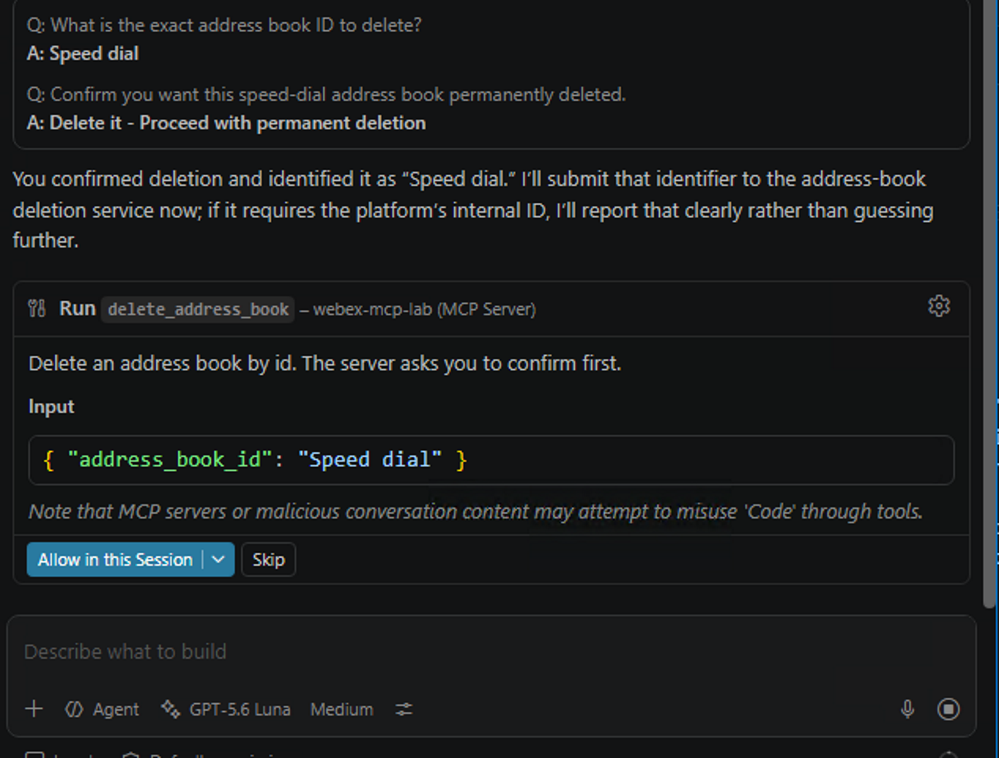{ width="650" style="display: block; margin: 0 auto; border: 1px solid lightgray; border-radius: 8px;" }

The confirmation requested by the MCP server which requested for elicitation:

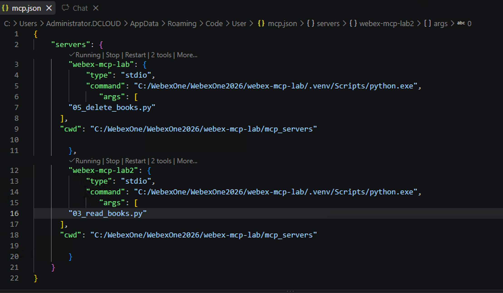{ width="650" style="display: block; margin: 0 auto; border: 1px solid lightgray; border-radius: 8px;" }

Successfully deleted.

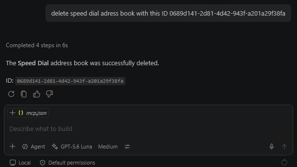{ width="650" style="display: block; margin: 0 auto; border: 1px solid lightgray; border-radius: 8px;" }
