# Lab 6 - Build a Custom MCP Server

In this chapter you will build an MCP server step by step, one file at a time that lets an AI assistant manage Webex Contact Center address books. You will start with the smallest possible server (one tool, no network, no token), add MCP primitives, connect to the real Webex API.

The whole lab lives in one domain: address books. Every MCP idea — tools, resources, prompts, and elicitation — is taught with that single API. One domain, one set of credentials, one mental model, start to finish.

Upon completion of this chapter, you will be able to:

- Build an MCP server that exposes Python functions as tools an AI assistant can call
- Distinguish the three MCP primitives — tools, resources, and prompts and know when to use each
- Connect an MCP server to a real Webex Contact Center API with proper credential handling
- Chain tool calls so the output of one becomes the input of the next
- Use elicitation to ask the user for confirmation inside a tool call

## Step 6.1: Your First MCP Server

The smallest MCP server that does real work: one tool, no network, no token. It takes a messy phone number and returns it in E.164 format. By the end of this step you will understand what a tool decorator does, what the docstring controls, and what happens when you change both.

1. Navigate to `06_custom_mcp/01_hello_mcp.py` and review the code.

    ??? Tip "Python Code"
        ```python
        # Step 01 - the smallest MCP server: one tool, no network, no token.

        import re
        import sys
        from mcp.server import MCPServer

        # Create an MCP server instance.
        mcp = MCPServer("webex-mcp-lab-01")


        # Register a tool that cleans a phone number to E.164 format.
        @mcp.tool()
        async def format_phone(number: str) -> str:
            """Clean a phone number to E.164 form, e.g. +14155550101."""
            digits = re.sub(r"\D", "", number)
            if not number.startswith("+") and len(digits) == 10:
                digits = "1" + digits
            return "+" + digits


        # Start the server on stdio and wait for a client to connect.
        if __name__ == "__main__":
            print(
                "webex-mcp-lab-01 running on stdio - waiting for a client (Ctrl+C to stop).",
                file=sys.stderr,
            )
            mcp.run()

        ```

Everything a `@mcp.tool()` decorator does is on display here:

1. **Discovery.** The client learns there is a tool called `format_phone`.
2. **Description.** The docstring becomes the tool's description. This is not documentation for you — it is how the model decides whether this is the right tool to call. A vague or misleading docstring produces a tool the model misuses.
3. **Schema.** The `number: str` annotation becomes the input schema, so the client knows to send one string argument.

2. We need to define the MCP server `01_hello_mcp.py` in `mcp.json`. Open the Command Palette (`Ctrl+Shift+P`) and type `MCP: Open User Configuration`.

3. Add this configuration to `mcp.json`:

```json
{
  "servers": {
    "webex-mcp-lab": {
      "command": "/absolute/path/to/webex-mcp-lab/.venv/Scripts/python.exe",
      "args": ["06_custom_mcp/01_hello_mcp.py"],
      "cwd": "/absolute/path/to/05-bots"
    }
  }
}
```

!!! Note
    Point `command` at the Python interpreter inside your `.venv`, and set `cwd` to the lab folder so the server finds your `.env`. On macOS and Linux the interpreter is `.venv/bin/python` instead of `.venv/Scripts/python.exe`.
    Replace both paths with your own, and change the script name as you work through the steps. Use forward slashes on every platform, including Windows. No environment-file flag is needed — the server loads `.env` itself.

4. Start the MCP server as you see below. Click the "Start" button in the `mcp.json` file.

{ width="650" style="display: block; margin: 0 auto; border: 1px solid lightgray; border-radius: 8px;" }

There is an alternative way to start the registered MCP server (`Ctrl+Shift+P` -> `MCP: List Servers`).

{ width="650" style="display: block; margin: 0 auto; border: 1px solid lightgray; border-radius: 8px;" }

Click on `webex-mcp-lab` and start it.

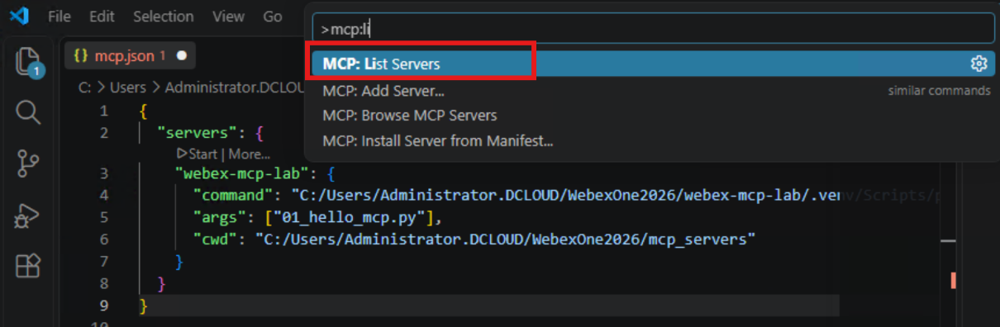{ width="650" style="display: block; margin: 0 auto; border: 1px solid lightgray; border-radius: 8px;" }
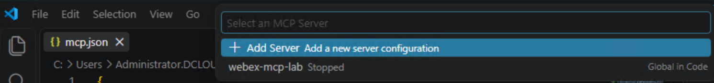{ width="650" style="display: block; margin: 0 auto; border: 1px solid lightgray; border-radius: 8px;" }

You will see MCP server logs in the output section automatically. If not, click on the output as below:

{ width="650" style="display: block; margin: 0 auto; border: 1px solid lightgray; border-radius: 8px;" }

If you want to check the logs in debug level then you can follow the below steps by clicking on the gear box:

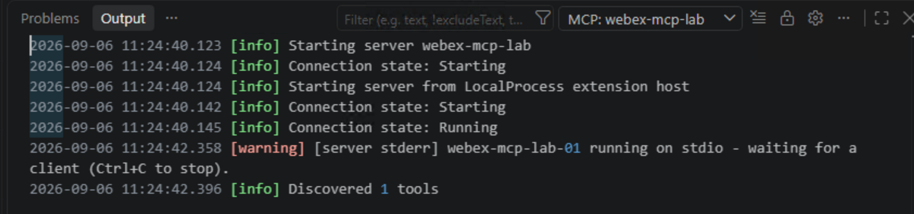{ width="650" style="display: block; margin: 0 auto; border: 1px solid lightgray; border-radius: 8px;" }

Then restart the MCP server by clicking again on `Ctrl+Shift+P` -> `MCP: List Servers`.

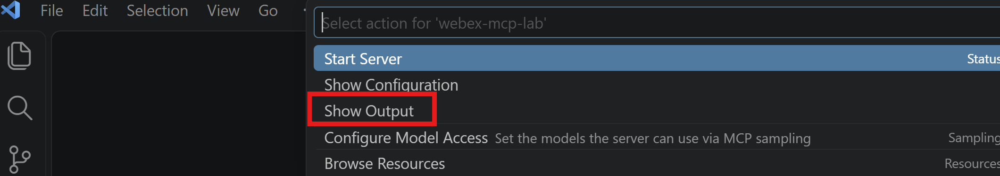{ width="650" style="display: block; margin: 0 auto; border: 1px solid lightgray; border-radius: 8px;" }

Select the running server:

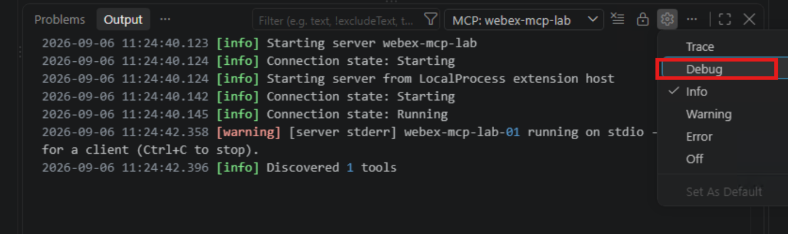{ width="650" style="display: block; margin: 0 auto; border: 1px solid lightgray; border-radius: 8px;" }

Click on restarting the server:

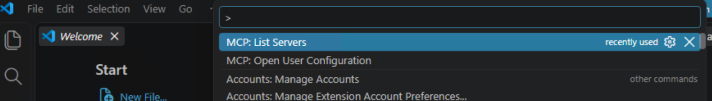{ width="650" style="display: block; margin: 0 auto; border: 1px solid lightgray; border-radius: 8px;" }

Check the output, you will see that the server sent the tool defined under the decorator to the MCP client which is the VS Code editor in this case. (`tools/list`)

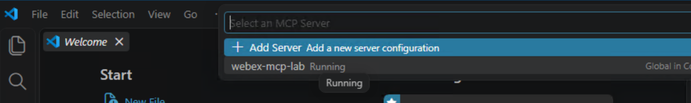{ width="650" style="display: block; margin: 0 auto; border: 1px solid lightgray; border-radius: 8px;" }

5. Open the VS Code Chat view and ask: *"clean the number (415) 555-0101"*. Allow the tool calling from VS Code and you will see it is formatted.

{ width="650" style="display: block; margin: 0 auto; border: 1px solid lightgray; border-radius: 8px;" }

VS Code starts the server, discovers `format_phone`, and asks for your approval before calling it. The server strips the punctuation and returns `+14155550101`.

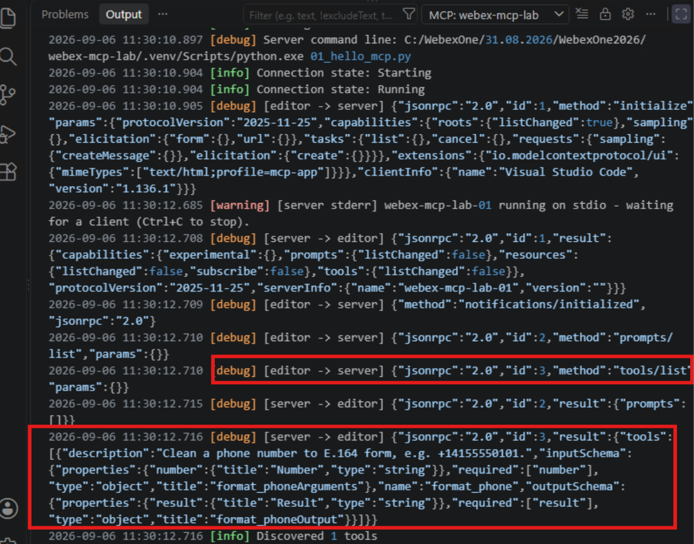{ width="650" style="display: block; margin: 0 auto; border: 1px solid lightgray; border-radius: 8px;" }

From the MCP logs you will see the tool called using `tools/call` with the entered number as an argument.

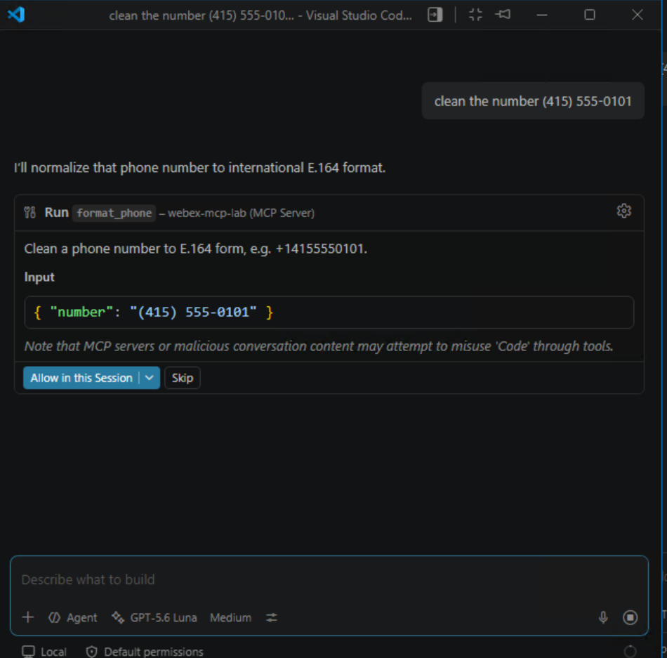{ width="650" style="display: block; margin: 0 auto; border: 1px solid lightgray; border-radius: 8px;" }

!!! Note
    The number above is just an example or arbitrary number to showcase how the MCP tool works in action.

## Step 6.2: MCP Primitives: Tool, Resource, and Prompt

Still no Webex, still no credentials. This step puts all three MCP primitives — tool, resource, and prompt — into one short file. By the end you will understand what each primitive is, who invokes it, and why you need all three even though a tool can technically do anything.

Three MCP primitives:

- **A tool** is an action the model calls. `count_words` counts — that is all it knows. It has no idea what the limits should be, or which words are banned.
- **A resource** is context the client attaches, like handing the model a rulebook. The tool cannot know these rules. `count_words` returns 7 for any 7-word text; only the resource says the limit is 12 and "ASAP" is banned. That is why a resource matters: it carries rules the tool itself does not encode.
- **A prompt** is the one primitive a human triggers directly — from a slash command or menu. It returns the opening message the model sees, wiring the resource and the tool into a single review workflow.

1. Update `.vscode/mcp.json` to point at `06_custom_mcp/02_hello_resource_prompt.py`.

    ??? Tip "Python Code"
        ```python
        # Step 02 - all three MCP primitives (tool, resource, prompt) without credentials.

        import sys
        from mcp.server import MCPServer

        # Create an MCP server instance.
        mcp = MCPServer("webex-mcp-lab-02")


        # Register a tool that counts words and characters in a piece of text.
        @mcp.tool()
        async def count_words(text: str) -> dict:
            """Count the words and characters in a piece of text."""
            words = text.split()
            return {"words": len(words), "characters": len(text)}


        # Register a resource with greeting rules the tool cannot know on its own.
        @mcp.resource("lab://greeting-rules")
        def greeting_rules() -> str:
            return (
                "Webex Contact Center greeting rules for this organization:\n"
                "1. 12 words maximum.\n"
                "2. Must include the agent's first name.\n"
                "3. Never use 'ASAP' or 'obviously'.\n"
            )


        # Register a prompt that chains the resource and the tool into a review workflow.
        @mcp.prompt()
        def review_greeting(greeting: str = "") -> str:
            """Review an agent greeting against the organization rules."""
            return (
                f"Review this agent greeting:\n\n"
                f"{greeting or '<paste a greeting here>'}\n\n"
                "1. Read the lab://greeting-rules resource for the org rules.\n"
                "2. Call count_words to measure the greeting.\n"
                "3. Tell me pass or fail, and why."
            )


        # Start the server on stdio and wait for a client to connect.
        if __name__ == "__main__":
            print(
                "webex-mcp-lab-02 running on stdio - waiting for a client (Ctrl+C to stop).",
                file=sys.stderr,
            )
            mcp.run()

        ```

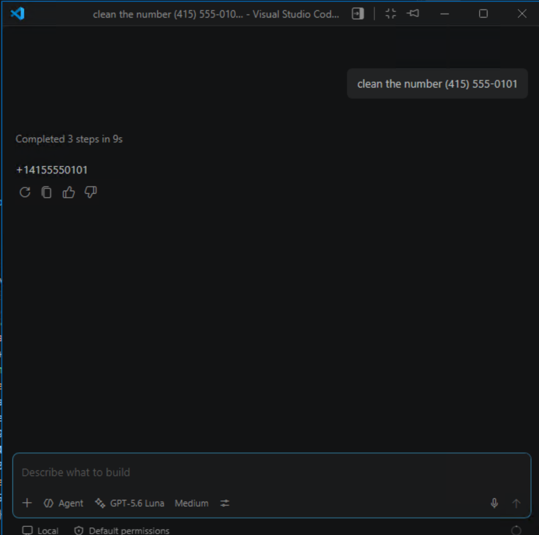{ width="650" style="display: block; margin: 0 auto; border: 1px solid lightgray; border-radius: 8px;" }

2. Restart/start the MCP server as we have done in the previous example.

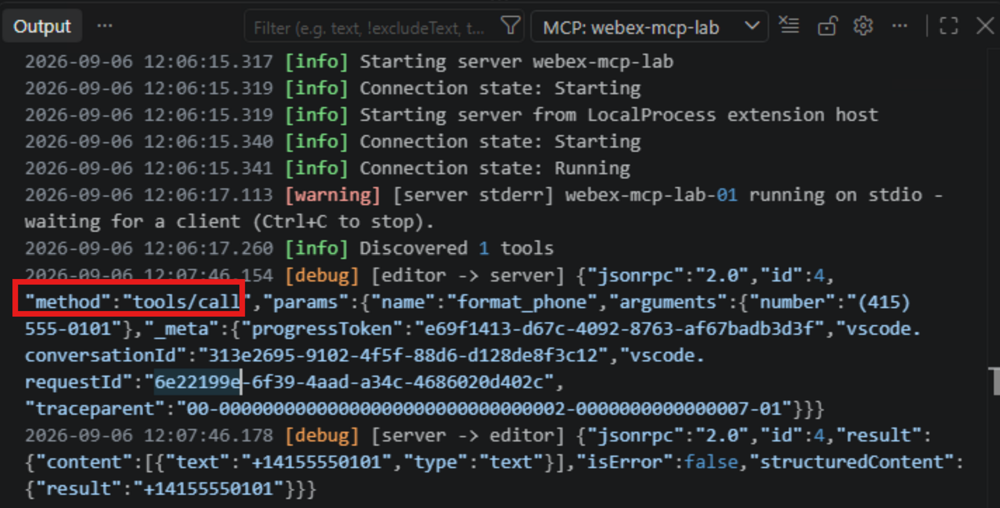{ width="650" style="display: block; margin: 0 auto; border: 1px solid lightgray; border-radius: 8px;" }

3. Go to the agent chat and add Context -> MCP Resources -> `lab://greeting-rules`.

{ width="650" style="display: block; margin: 0 auto; border: 1px solid lightgray; border-radius: 8px;" }
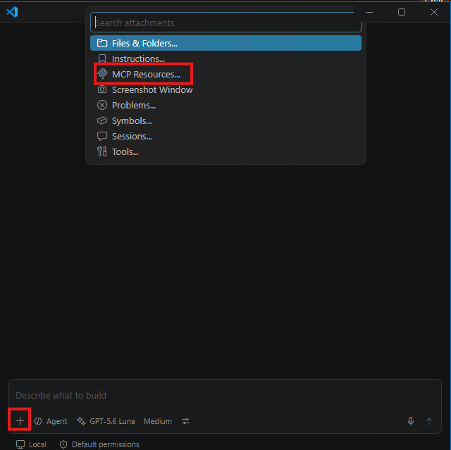{ width="650" style="display: block; margin: 0 auto; border: 1px solid lightgray; border-radius: 8px;" }

4. Ask: *"What are the greeting rules?"*

{ width="650" style="display: block; margin: 0 auto; border: 1px solid lightgray; border-radius: 8px;" }

Check the MCP logs output, you will see:

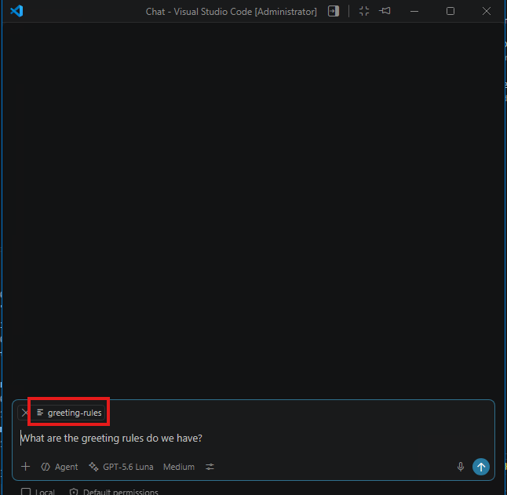{ width="650" style="display: block; margin: 0 auto; border: 1px solid lightgray; border-radius: 8px;" }

5. In the VS Code agent chat, type `/mcp.webex-mcp-lab.review_greeting`.

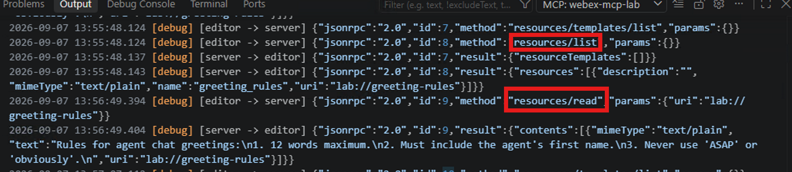{ width="650" style="display: block; margin: 0 auto; border: 1px solid lightgray; border-radius: 8px;" }

Paste: *"Hello! I'm Sam and I'll obviously get back to you ASAP with a full resolution of your issue as soon as humanly possible"*

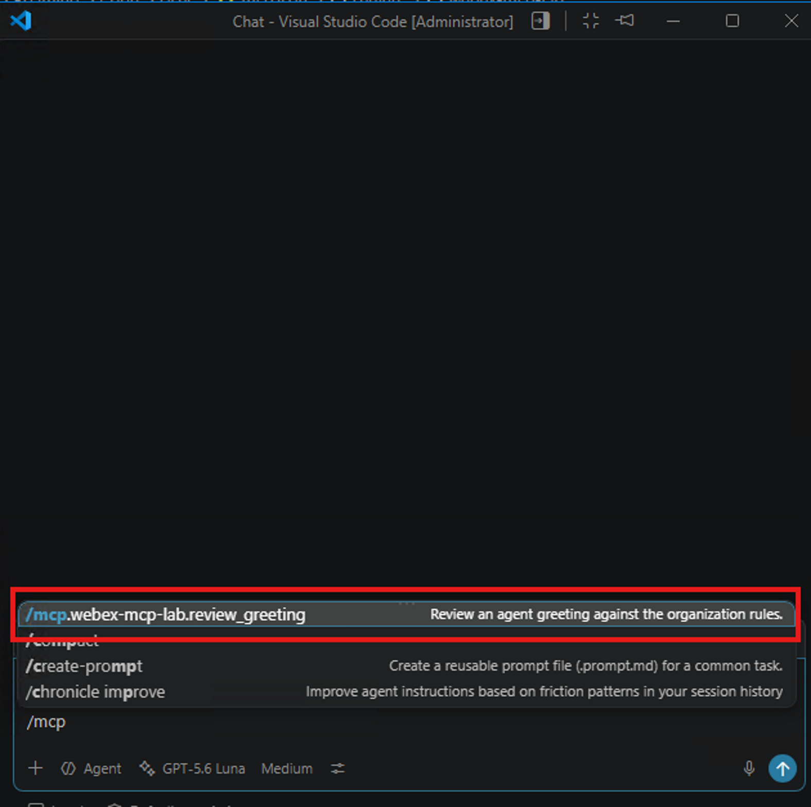{ width="650" style="display: block; margin: 0 auto; border: 1px solid lightgray; border-radius: 8px;" }

Once you check the MCP log:

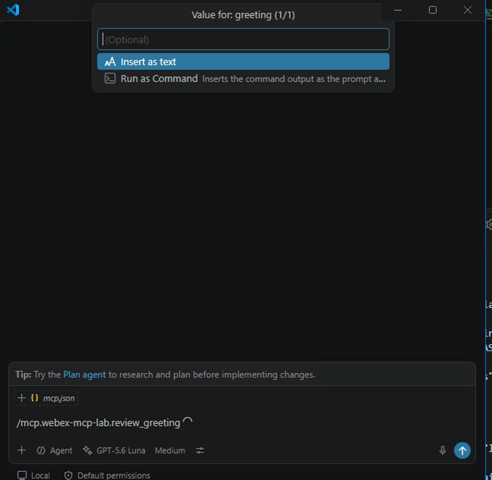{ width="650" style="display: block; margin: 0 auto; border: 1px solid lightgray; border-radius: 8px;" }

## Step 6.3: Reading from Webex Contact Center API

The first server that talks to the Webex Contact Center. It exposes two read-only tools — `list_address_books` and `list_entries` — and teaches you how to shape API responses for a language model and how to chain the output of one tool into the input of the next.

**What are address books?**
In Webex Contact Center, an address book is a named list of contacts — phone numbers with display names — that agents see in their desktop. When a customer calls and the agent needs to transfer or conference, the address book provides the list to choose from.
Address books are managed through the Contact Center Configuration API. This lab uses that API exclusively: every tool you build reads, creates, or deletes address books and their entries.

Below is a screenshot showing how address books are seen in the agent desktop:

{ width="650" style="display: block; margin: 0 auto; border: 1px solid lightgray; border-radius: 8px;" }

**Where are they configured?**
Use the same user credential to log in to Collaboration Control Hub: `https://admin.webex.com` and navigate to Contact Center. Scroll down and select Address Book.

{ width="650" style="display: block; margin: 0 auto; border: 1px solid lightgray; border-radius: 8px;" }

One address book is assigned to an agent profile:

{ width="650" style="display: block; margin: 0 auto; border: 1px solid lightgray; border-radius: 8px;" }

The server checks at startup for three values (`ACCESS_TOKEN`, `WEBEX_ORG_ID`, `WXCC_CONFIG_API_BASE`) and names any variable that is missing. Checking at startup rather than inside the tool is deliberate. A server that refuses to start and names the missing variable is diagnosed by reading one line. A server that starts fine and then fails on every call requires HTTP status codes.

- **`ACCESS_TOKEN`**: This is going to be the access token. We will actually use the Service App token for this task.
- **`WEBEX_ORG_ID`** and **`WXCC_CONFIG_API_BASE`**: These are related to the sandbox and will be set up in advance for you, but here is how you can find them:

    For `WEBEX_ORG_ID`, you need to go in Collaboration Control Hub to Account:

    { width="650" style="display: block; margin: 0 auto; border: 1px solid lightgray; border-radius: 8px;" }

    For `WXCC_CONFIG_API_BASE`, you can find it using this information (in this case it will be `us1`):

    { width="650" style="display: block; margin: 0 auto; border: 1px solid lightgray; border-radius: 8px;" }

    While general Webex APIs use a global endpoint (`https://webexapis.com/v1`), Webex Contact Center (WxCC) specific data and agent APIs route through regional endpoints. [1](https://www.cisco.com/c/en/us/support/docs/contact-center/webex-contact-center/218418-configure-webex-contact-center-apis-with.html)
    
    The region can be identified through the following methods:
    
    1. **Check in Webex Control Hub**
       You can find your data residency/region directly inside the dashboard: [1](https://community.cisco.com/t5/webex-for-developers/programmatically-retrieve-the-data-center-instance-for-contact/m-p/5252255)
       - Log into Webex Control Hub.
       - Navigate to Services > Contact Center > Tenant Settings.
       - Go to General > Service Details.
       - Look for the Country of Operation or data center zone field. [1](https://cloud.cloverhound.com/docs/campaigns/integration), [2](https://community.cisco.com/t5/webex-for-developers/programmatically-retrieve-the-data-center-instance-for-contact/m-p/5252255)
       
    2. **Map Region to the Correct API Base URL**
       Once you know the country or code of operation, match it to the standard Webex Contact Center datacenter variables (`us1`, `eu1`, `eu2`, `anz1`, `jp1`, `sg1`): [1](https://help.webex.com/en-us/article/n1lsqvu/Integrate-Webex-Contact-Center-CRM-Connector-for-Microsoft-Dynamics-365-(Version2-New)), [2](https://www.cisco.com/c/en/us/support/docs/contact-center/webex-contact-center/218418-configure-webex-contact-center-apis-with.html)
       
       | Region / Operation Location | Datacenter Variable | API Base URL Example |
       | --- | --- | --- |
       | North America | `us1` | `https://api.wxcc-us1.cisco.com` |
       | United Kingdom | `eu1` | `https://api.wxcc-eu1.cisco.com` |
       | Europe | `eu2` | `https://api.wxcc-eu2.cisco.com` |
       | APJC (Australia / NZ) | `anz1` | `https://api.wxcc-anz1.cisco.com` |
       | Japan | `jp1` | `https://api.wxcc-jp1.cisco.com` |
       | Singapore | `sg1` | `https://api.wxcc-sg1.cisco.com` |

1. Point the MCP server to `06_custom_mcp/03_read_books.py` in `mcp.json`.

    ??? Tip "Python Code"
        ```python
        # Step 03 - reading: list address books, then list entries inside one book.

        import os
        import sys
        import httpx
        from dotenv import load_dotenv
        from mcp.server import MCPServer

        # Load credentials from .env.
        load_dotenv()

        TOKEN = os.environ.get("ACCESS_TOKEN")
        ORG_ID = os.environ.get("WEBEX_ORG_ID")
        CONFIG_API_BASE = os.environ.get("WXCC_CONFIG_API_BASE", "")

        # Stop early if any credential is missing.
        for _name, _value in (
            ("ACCESS_TOKEN", TOKEN),
            ("WEBEX_ORG_ID", ORG_ID),
            ("WXCC_CONFIG_API_BASE", CONFIG_API_BASE),
        ):
            if not _value:
                sys.exit(f"{_name} is not set. This lab needs Webex Contact Center - see .env.example.")

        # Build the API base URL and common headers.
        ORG = f"{CONFIG_API_BASE.rstrip('/')}/organization/{ORG_ID}"
        HEADERS = {"Authorization": f"Bearer {TOKEN}", "Accept": "application/json"}

        # Create an MCP server instance.
        mcp = MCPServer("webex-mcp-lab-03")


        # List all address books in the Contact Center organization.
        @mcp.tool()
        async def list_address_books(limit: int = 50) -> dict:
            """List the address books configured in this Contact Center organization."""
            async with httpx.AsyncClient(timeout=15) as http:
                response = await http.get(
                    f"{ORG}/v3/address-book", headers=HEADERS, params={"pageSize": limit}
                )

            if response.status_code != 200:
                return {"error": f"Webex Contact Center returned HTTP {response.status_code}."}

            books = [
                {"id": book.get("id"), "name": book.get("name"), "description": book.get("description")}
                for book in response.json().get("data", [])
            ]
            return {"count": len(books), "address_books": books}


        # List contacts inside one address book, using its id from list_address_books.
        @mcp.tool()
        async def list_entries(address_book_id: str, search: str = "") -> dict:
            """List the contacts inside one address book, optionally filtered by `search`.

            Pass the `address_book_id` returned by list_address_books.
            """
            params: dict = {"page": 0, "pageSize": 100}
            if search:
                params["search"] = search

            async with httpx.AsyncClient(timeout=15) as http:
                response = await http.get(
                    f"{ORG}/v2/address-book/{address_book_id}/entry", headers=HEADERS, params=params
                )

            if response.status_code != 200:
                return {"error": f"Webex Contact Center returned HTTP {response.status_code}."}

            entries = [
                {"id": entry.get("id"), "name": entry.get("name"), "number": entry.get("number")}
                for entry in response.json().get("data", [])
            ]
            return {"count": len(entries), "entries": entries}


        # Start the server on stdio and wait for a client to connect.
        if __name__ == "__main__":
            print(
                "webex-mcp-lab-03 running on stdio - waiting for a client (Ctrl+C to stop).",
                file=sys.stderr,
            )
            mcp.run()

        ```

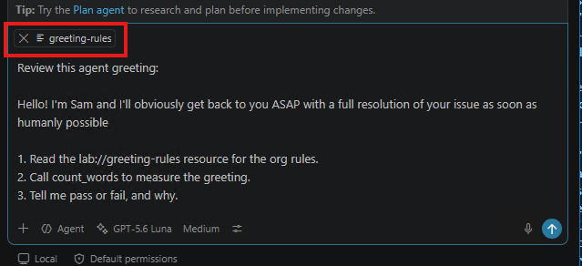{ width="650" style="display: block; margin: 0 auto; border: 1px solid lightgray; border-radius: 8px;" }

2. Open a new VS Code as the MCP client.

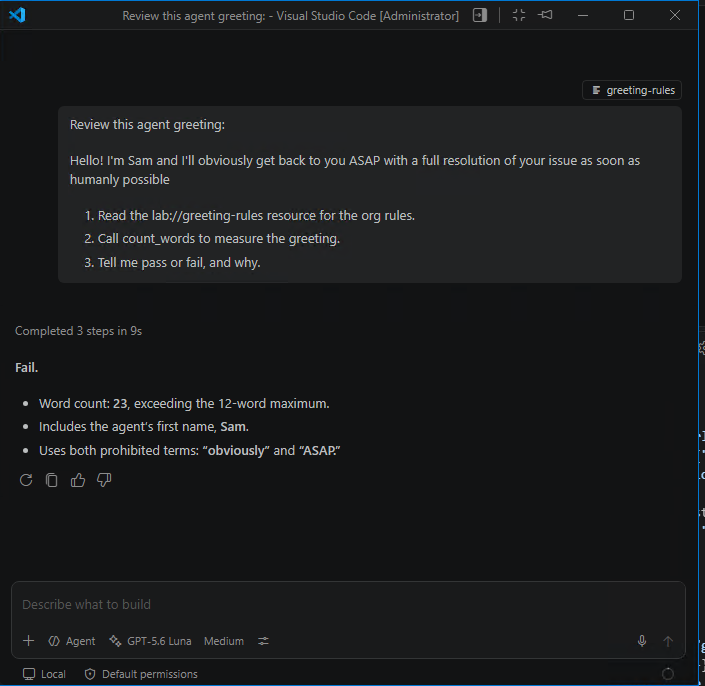{ width="650" style="display: block; margin: 0 auto; border: 1px solid lightgray; border-radius: 8px;" }

3. Ask your client: *"list my address books, then show me the entries in the first one"* — and watch the model carry the id from the first call into the second.

{ width="650" style="display: block; margin: 0 auto; border: 1px solid lightgray; border-radius: 8px;" }

!!! Note
    The approval ran twice as there were two tools called.

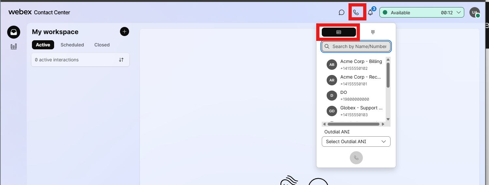{ width="650" style="display: block; margin: 0 auto; border: 1px solid lightgray; border-radius: 8px;" }

They can be seen there in Control Hub as well:

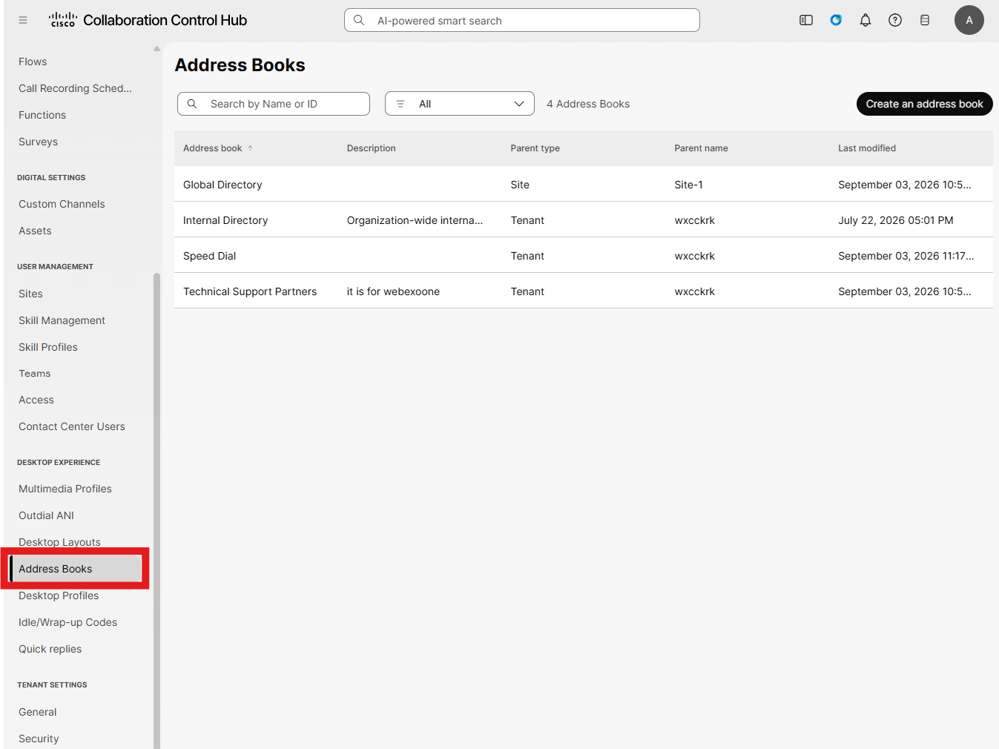{ width="650" style="display: block; margin: 0 auto; border: 1px solid lightgray; border-radius: 8px;" }

You should see two `tools/call` for both entries and books read in the MCP logs.

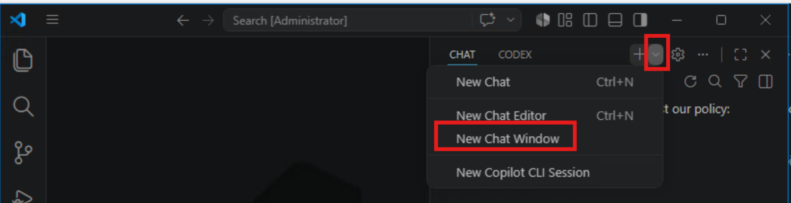{ width="650" style="display: block; margin: 0 auto; border: 1px solid lightgray; border-radius: 8px;" }

## Step 6.4: Understand Webex Contact Center Address Book APIs

1. Open a web browser and navigate to the developer portal: `https://developer.webex.com/`
2. Sign in with the username assigned to you (e.g., `ciscolabuser002+1@gmail.com`).
3. Under customer experience, select Webex Contact Center.

{ width="650" style="display: block; margin: 0 auto; border: 1px solid lightgray; border-radius: 8px;" }

You can see different sections on the left-hand side, for example:
- **Authentication:** This section explains the authentication method used by WxCC and the prerequisites.
- **Common API errors:** In this section you have the list of errors that can be returned as a response to an API request.
- **Introduction to APIs:** In this section you can find an overview to the WxCC open architecture APIs.
- **API Reference:** You will see in this section all the APIs categories that WxCC offers.

{ width="650" style="display: block; margin: 0 auto; border: 1px solid lightgray; border-radius: 8px;" }

4. Navigate to the API reference and select Address Book.

{ width="650" style="display: block; margin: 0 auto; border: 1px solid lightgray; border-radius: 8px;" }

5. In this case, you want to first list the address books already created. So, scroll down and click on the GET request under "List Address Books request".

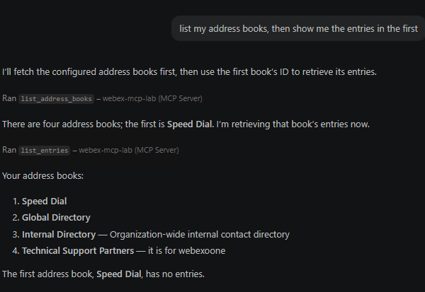{ width="650" style="display: block; margin: 0 auto; border: 1px solid lightgray; border-radius: 8px;" }

6. You can see all the parameters required, like `orgid` and optional parameters, like page or page size, and so on.

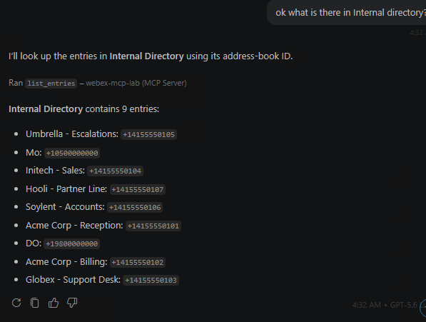{ width="650" style="display: block; margin: 0 auto; border: 1px solid lightgray; border-radius: 8px;" }

7. On the right-hand side, you see how the API is executed. You can see the method (GET), the URL used with the variable (`orgid`), and the code language that is being used (you can use cURL, C#, Java, Python, etc.).

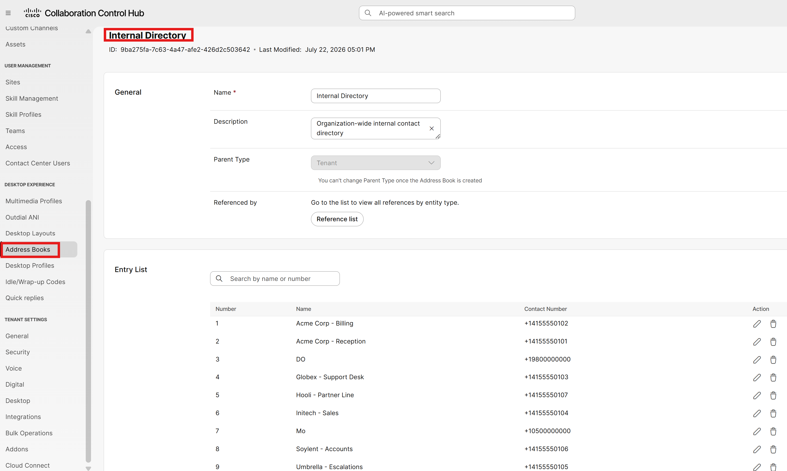{ width="650" style="display: block; margin: 0 auto; border: 1px solid lightgray; border-radius: 8px;" }

8. Select the "Try out" section. As you notice, this requires an authorization token. The token used by default is the one automatically assigned when you log in with the admin credentials to the Developers portal. It also pulls the `orgid` from the organization the user you logged in is part of. Click Run.

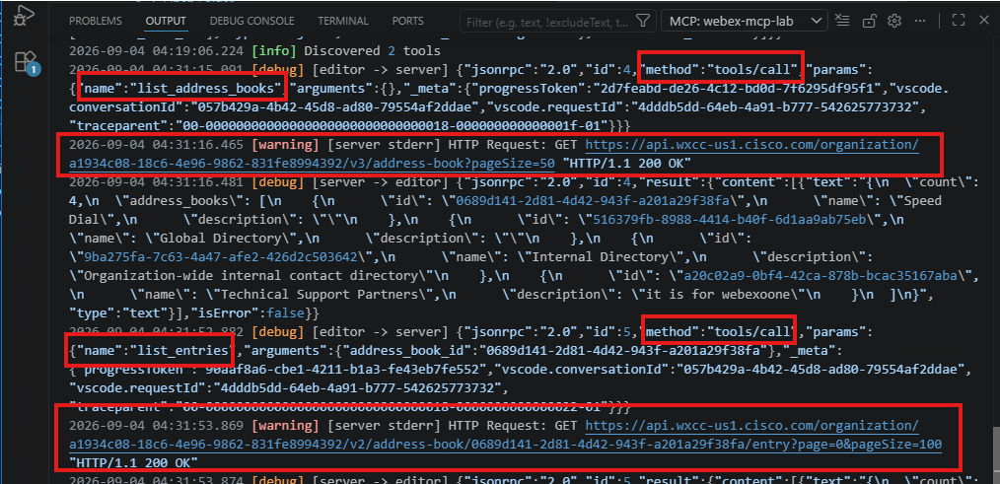{ width="650" style="display: block; margin: 0 auto; border: 1px solid lightgray; border-radius: 8px;" }

You see the 200 Response, which indicates the request was successful. You also see the address books created in this org. You can scroll down in the response window to see the list of all address books.

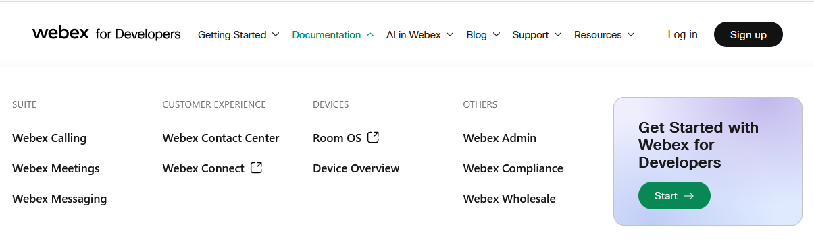{ width="650" style="display: block; margin: 0 auto; border: 1px solid lightgray; border-radius: 8px;" }

## Step 6.5: Writing: Create and Fill an Address Book

This step writes to the API. It exposes exactly two tools: `create_address_book` and `add_entry`. There are no read tools here — listing is Step 6.3's job. By the end you will understand how MCP handles consent for destructive actions and how tool results carry ids forward.

1. Update `mcp.json` to point at `06_custom_mcp/04_write_books.py` and restart.

    ??? Tip "Python Code"
        ```python
        # Step 04 - writing: create an address book, then fill it with contacts.

        import os
        import sys
        import httpx
        from dotenv import load_dotenv
        from mcp.server import MCPServer

        # Load credentials from .env.
        load_dotenv()

        TOKEN = os.environ.get("ACCESS_TOKEN")
        ORG_ID = os.environ.get("WEBEX_ORG_ID")
        CONFIG_API_BASE = os.environ.get("WXCC_CONFIG_API_BASE", "")

        # Stop early if any credential is missing.
        for _name, _value in (
            ("ACCESS_TOKEN", TOKEN),
            ("WEBEX_ORG_ID", ORG_ID),
            ("WXCC_CONFIG_API_BASE", CONFIG_API_BASE),
        ):
            if not _value:
                sys.exit(f"{_name} is not set. This lab needs Webex Contact Center - see .env.example.")

        # Build the API base URL and common headers.
        ORG = f"{CONFIG_API_BASE.rstrip('/')}/organization/{ORG_ID}"
        HEADERS = {"Authorization": f"Bearer {TOKEN}", "Accept": "application/json"}

        # Create an MCP server instance.
        mcp = MCPServer("webex-mcp-lab-04")


        # Turn an HTTP failure into a sentence the model can relay to the user.
        def _fail(response: httpx.Response) -> dict:
            """Turn an HTTP failure into a sentence the model can pass on to the user."""
            if response.status_code == 401:
                return {"error": "Webex rejected the token. Check that it has not expired."}
            if response.status_code == 403:
                return {"error": "The token lacks Contact Center config permission (cjp:config_write)."}
            if response.status_code == 404:
                return {"error": "No such address book in this organization."}
            if response.status_code == 429:
                return {"error": "Rate limited by Webex. Wait a moment and try again."}
            return {"error": f"Webex Contact Center returned HTTP {response.status_code}."}


        # Create a new address book and return its id.
        @mcp.tool()
        async def create_address_book(name: str, description: str = "") -> dict:
            """Create a new address book. Returns its id, which add_entry then needs.

            The MCP client asks the user for approval before this runs.
            """
            async with httpx.AsyncClient(timeout=15) as http:
                response = await http.post(
                    f"{ORG}/v3/address-book",
                    headers=HEADERS,
                    json={"name": name, "description": description, "parentType": "ORGANIZATION"},)

            if response.status_code not in (200, 201):
                return _fail(response)

            book = response.json()
            return {"created": True, "address_book_id": book.get("id"), "name": book.get("name")}


        # Add a contact to an address book using the id from create_address_book.
        @mcp.tool()
        async def add_entry(address_book_id: str, name: str, number: str) -> dict:
            """Add a contact to an address book. `number` should be E.164, e.g. +14155550101.

            `address_book_id` is what create_address_book returned. The MCP client asks
            the user for approval before this runs.
            """
            async with httpx.AsyncClient(timeout=15) as http:
                response = await http.post(
                    f"{ORG}/address-book/{address_book_id}/entry",
                    headers=HEADERS,
                    json={"name": name, "number": number},
                )

            if response.status_code not in (200, 201):
                return _fail(response)

            return {"added": True, "entry_id": response.json().get("id"), "name": name}


        # Start the server on stdio and wait for a client to connect.
        if __name__ == "__main__":
            print(
                "webex-mcp-lab-04 running on stdio - waiting for a client (Ctrl+C to stop).",
                file=sys.stderr,
            )
            mcp.run()

        ```

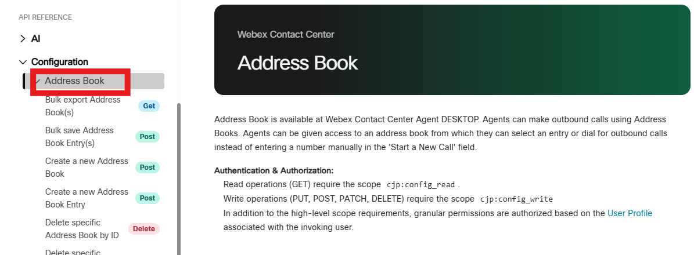{ width="650" style="display: block; margin: 0 auto; border: 1px solid lightgray; border-radius: 8px;" }

2. Ask the AI assistant to create an address book and entries there.

{ width="650" style="display: block; margin: 0 auto; border: 1px solid lightgray; border-radius: 8px;" }

3. Approve the first tool callings.

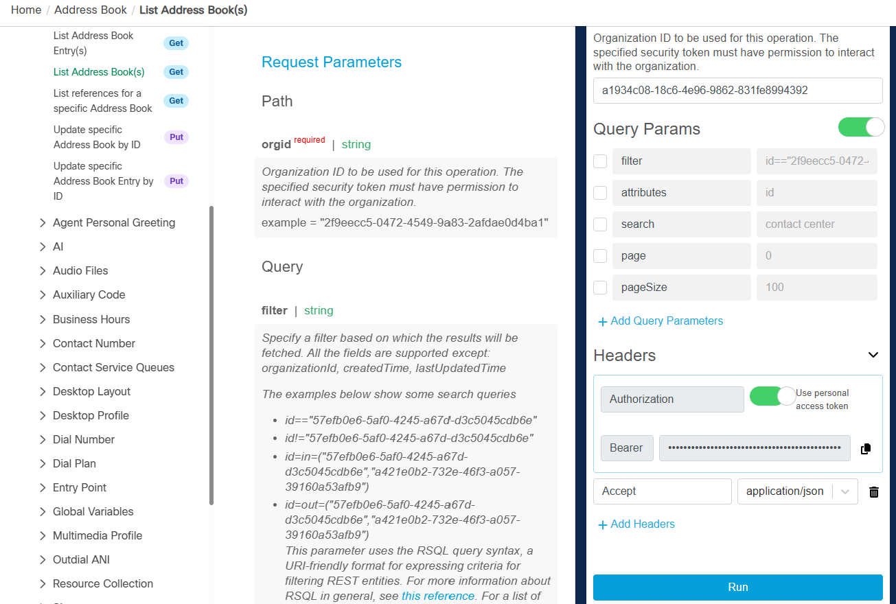{ width="650" style="display: block; margin: 0 auto; border: 1px solid lightgray; border-radius: 8px;" }
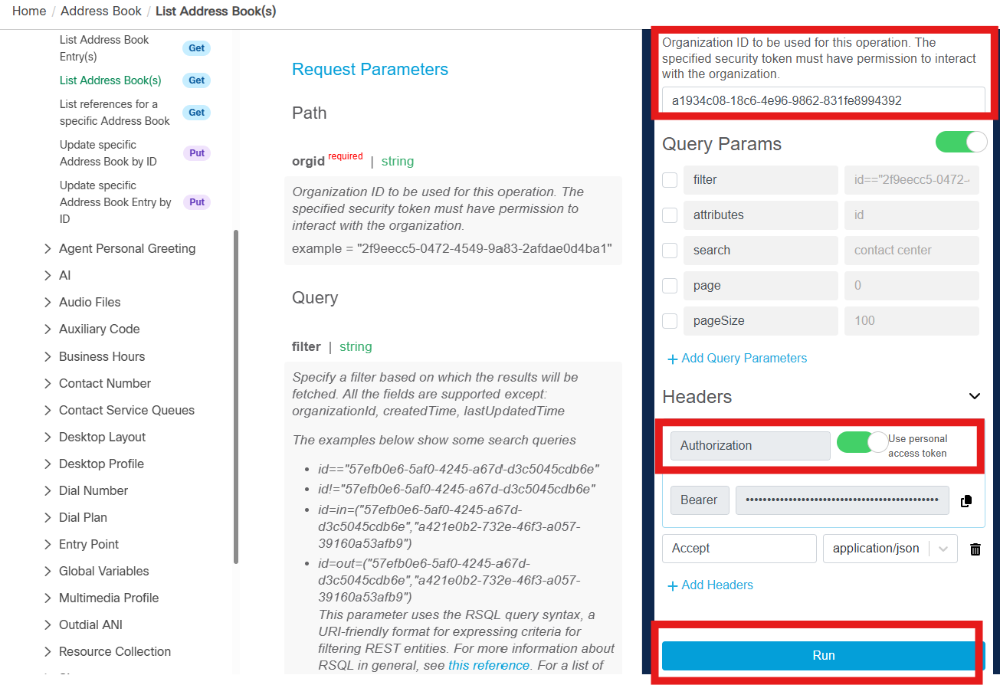{ width="650" style="display: block; margin: 0 auto; border: 1px solid lightgray; border-radius: 8px;" }
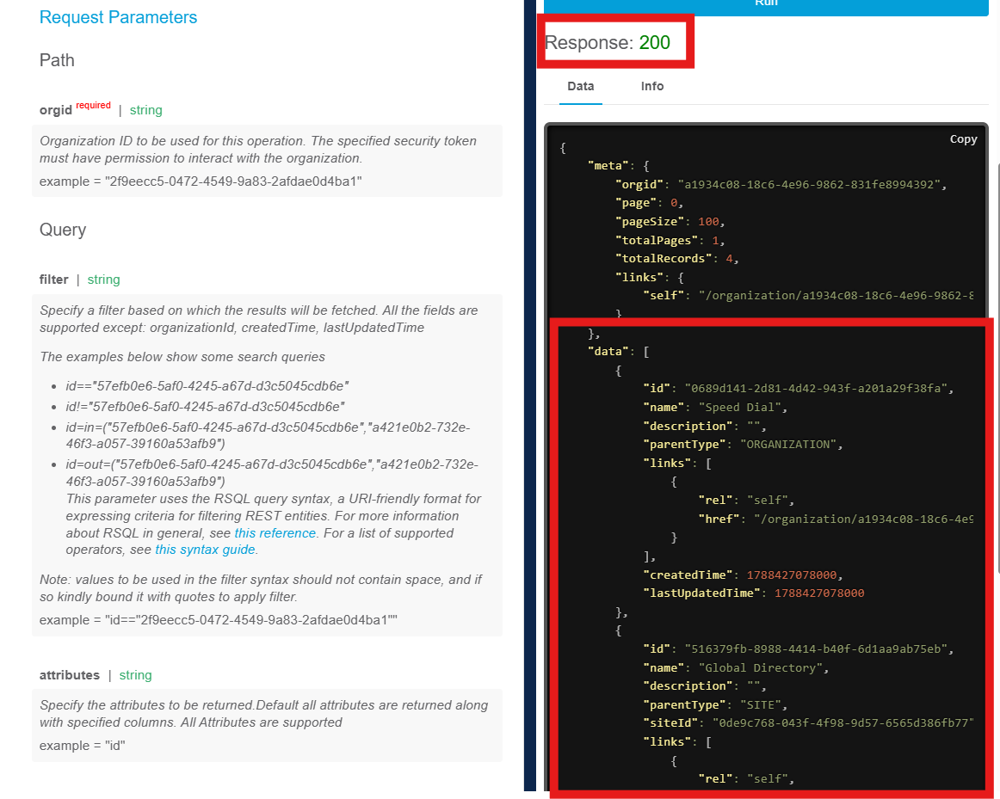{ width="650" style="display: block; margin: 0 auto; border: 1px solid lightgray; border-radius: 8px;" }

You can see below it has been created and logs show two tools calling.

{ width="650" style="display: block; margin: 0 auto; border: 1px solid lightgray; border-radius: 8px;" }
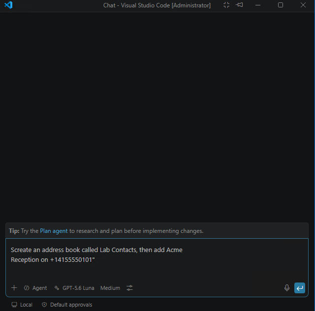{ width="650" style="display: block; margin: 0 auto; border: 1px solid lightgray; border-radius: 8px;" }

4. Verify it in Control Hub.

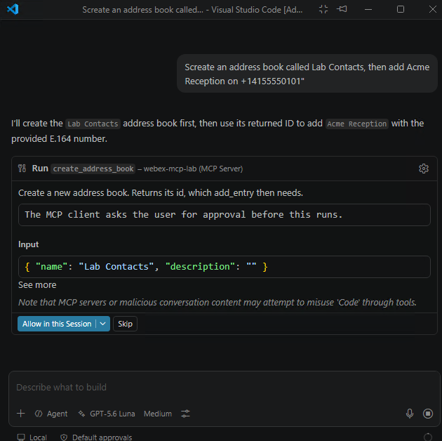{ width="650" style="display: block; margin: 0 auto; border: 1px solid lightgray; border-radius: 8px;" }

And the entry added:

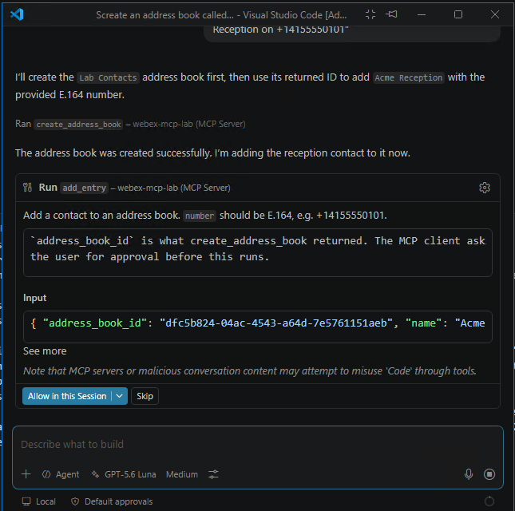{ width="650" style="display: block; margin: 0 auto; border: 1px solid lightgray; border-radius: 8px;" }

## Extra: Deleting with Elicitation

We trusted the host to ask permission. This step explores what happens when the server itself needs to ask a question mid-call. The MCP protocol calls this **elicitation**: the server pauses, sends a form to the user, and resumes based on the answer.

The server exposes exactly two tools: `delete_address_book` and `delete_entry`. There are no read tools — the id to delete comes from the create -> fill -> delete narrative. You already have a fresh id in the transcript.

1. Update `.vscode/mcp.json` to point at `06_custom_mcp/05_delete_books.py` and restart.

    ??? Tip "Python Code"
        ```python
        # Step 05 - deleting with a safety net: elicitation asks "are you sure?" mid-call.

        import os
        import sys
        from typing import Annotated

        import httpx
        from dotenv import load_dotenv
        from mcp.server import MCPServer

        # Elicitation imports: the resolver pattern lets the server ask the user a question mid-call.
        from mcp.server.mcpserver import (
            AcceptedElicitation,
            CancelledElicitation,
            DeclinedElicitation,
            Elicit,
            ElicitationResult,
            Resolve,
        )
        from pydantic import BaseModel

        # Load credentials from .env.
        load_dotenv()

        TOKEN = os.environ.get("ACCESS_TOKEN")
        ORG_ID = os.environ.get("WEBEX_ORG_ID")
        CONFIG_API_BASE = os.environ.get("WXCC_CONFIG_API_BASE", "")

        # Stop early if any credential is missing.
        for _name, _value in (
            ("ACCESS_TOKEN", TOKEN),
            ("WEBEX_ORG_ID", ORG_ID),
            ("WXCC_CONFIG_API_BASE", CONFIG_API_BASE),
        ):
            if not _value:
                sys.exit(f"{_name} is not set. This lab needs Webex Contact Center - see .env.example.")

        # Build the API base URL and common headers.
        ORG = f"{CONFIG_API_BASE.rstrip('/')}/organization/{ORG_ID}"
        HEADERS = {"Authorization": f"Bearer {TOKEN}", "Accept": "application/json"}

        # Create an MCP server instance.
        mcp = MCPServer("webex-mcp-lab-05")


        # The confirmation form the user sees: one boolean field.
        class Confirm(BaseModel):
            ok: bool


        # Resolver for address book deletion — always asks before proceeding.
        async def confirm_delete_book(address_book_id: str) -> Elicit[Confirm]:
            return Elicit(f"Delete address book '{address_book_id}'? This cannot be undone.", Confirm)


        # Resolver for entry deletion — always asks before proceeding.
        async def confirm_delete_entry(address_book_id: str, entry_id: str) -> Elicit[Confirm]:
            return Elicit(
                f"Delete entry '{entry_id}' from book '{address_book_id}'? This cannot be undone.",
                Confirm,
            )


        # Delete an address book after the user confirms via elicitation.
        @mcp.tool()
        async def delete_address_book(
            address_book_id: str,
            confirm: Annotated[ElicitationResult[Confirm], Resolve(confirm_delete_book)],
        ) -> dict:
            """Delete an address book by id. The server asks you to confirm first."""
            match confirm:
                case AcceptedElicitation(data=Confirm(ok=True)):
                    async with httpx.AsyncClient(timeout=15) as http:
                        r = await http.delete(
                            f"{ORG}/v3/address-book/{address_book_id}", headers=HEADERS
                        )
                    if r.status_code not in (200, 204):
                        return {"error": f"Webex Contact Center returned HTTP {r.status_code}."}
                    return {"deleted": True, "address_book_id": address_book_id}
                case AcceptedElicitation():
                    return {"deleted": False, "reason": "You chose not to delete."}
                case DeclinedElicitation() | CancelledElicitation():
                    return {"deleted": False, "reason": "Confirmation was declined or dismissed."}


        # Delete a single contact after the user confirms via elicitation.
        @mcp.tool()
        async def delete_entry(
            address_book_id: str,
            entry_id: str,
            confirm: Annotated[ElicitationResult[Confirm], Resolve(confirm_delete_entry)],
        ) -> dict:
            """Delete a single contact from an address book. The server asks you to confirm first."""
            match confirm:
                case AcceptedElicitation(data=Confirm(ok=True)):
                    async with httpx.AsyncClient(timeout=15) as http:
                        r = await http.delete(
                            f"{ORG}/v2/address-book/{address_book_id}/entry/{entry_id}",
                            headers=HEADERS,
                        )
                    if r.status_code not in (200, 204):
                        return {"error": f"Webex Contact Center returned HTTP {r.status_code}."}
                    return {"deleted": True, "entry_id": entry_id}
                case AcceptedElicitation():
                    return {"deleted": False, "reason": "You chose not to delete."}
                case DeclinedElicitation() | CancelledElicitation():
                    return {"deleted": False, "reason": "Confirmation was declined or dismissed."}


        # Start the server on stdio and wait for a client to connect.
        if __name__ == "__main__":
            print(
                "webex-mcp-lab-05 running on stdio - waiting for a client (Ctrl+C to stop).",
                file=sys.stderr,
            )
            mcp.run()

        ```

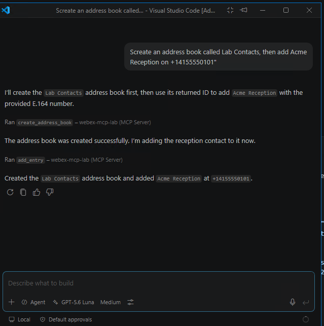{ width="650" style="display: block; margin: 0 auto; border: 1px solid lightgray; border-radius: 8px;" }

2. Ask to delete a certain address book, it asks for the ID of that book, just click "Enter".

{ width="650" style="display: block; margin: 0 auto; border: 1px solid lightgray; border-radius: 8px;" }

This is the request from VS Code for tool execution approval:

{ width="650" style="display: block; margin: 0 auto; border: 1px solid lightgray; border-radius: 8px;" }

You will see another approval requested here which is what elicitation means:

{ width="650" style="display: block; margin: 0 auto; border: 1px solid lightgray; border-radius: 8px;" }

!!! Tip "Watch for"
    Two approval moments. First the host asks "call delete_address_book?", then the server's elicitation form asks "delete this specific book?". They are different layers.

Since we are not sure what the ID of that address book is, it returns 404.

{ width="650" style="display: block; margin: 0 auto; border: 1px solid lightgray; border-radius: 8px;" }

Now how can we ask the AI assistant to list address books IDs? We need to run the server `03_read_books.py`.

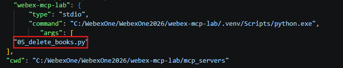{ width="650" style="display: block; margin: 0 auto; border: 1px solid lightgray; border-radius: 8px;" }

We can have multiple servers registered in `mcp.json` as you see here:

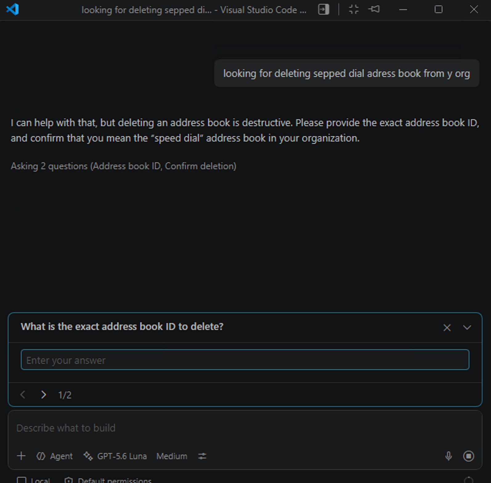{ width="650" style="display: block; margin: 0 auto; border: 1px solid lightgray; border-radius: 8px;" }

Now we can delete the speed dial with a specific ID.

{ width="650" style="display: block; margin: 0 auto; border: 1px solid lightgray; border-radius: 8px;" }
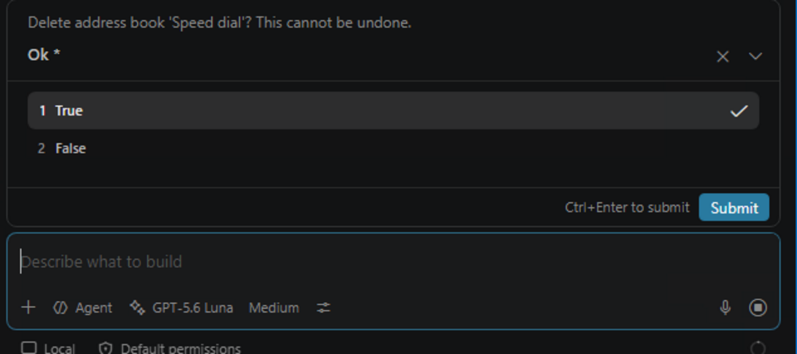{ width="650" style="display: block; margin: 0 auto; border: 1px solid lightgray; border-radius: 8px;" }
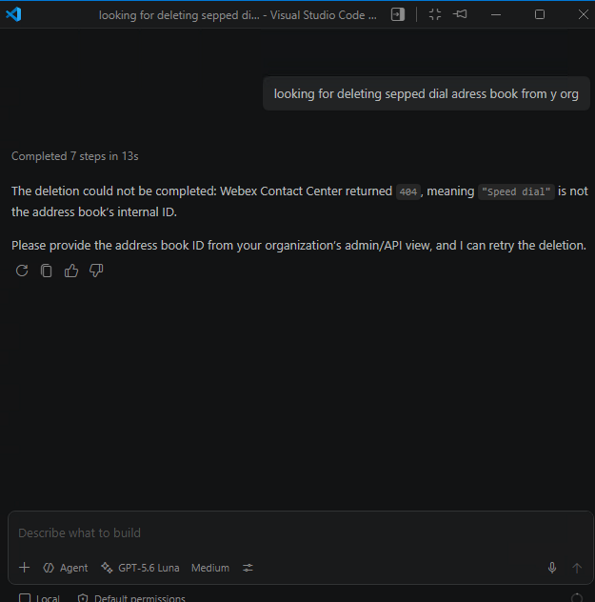{ width="650" style="display: block; margin: 0 auto; border: 1px solid lightgray; border-radius: 8px;" }

The confirmation requested by the MCP server which requested for elicitation:

{ width="650" style="display: block; margin: 0 auto; border: 1px solid lightgray; border-radius: 8px;" }
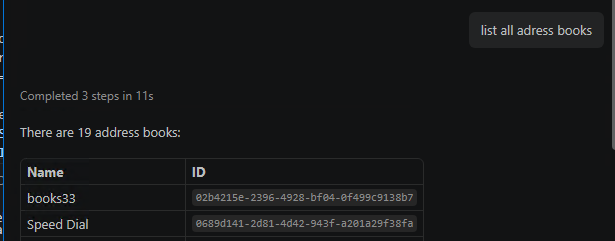{ width="650" style="display: block; margin: 0 auto; border: 1px solid lightgray; border-radius: 8px;" }
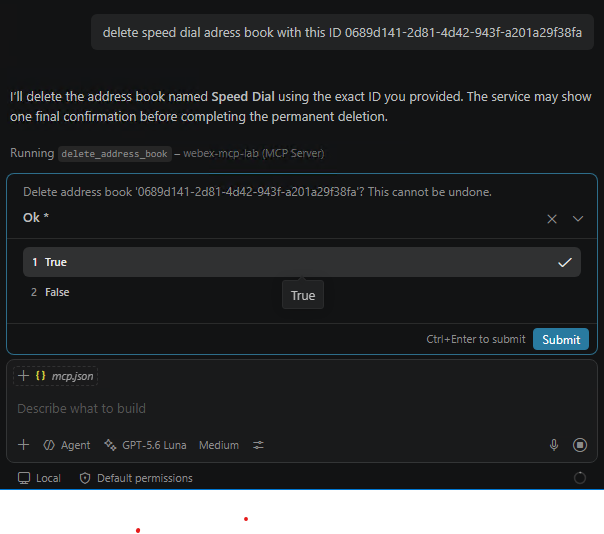{ width="650" style="display: block; margin: 0 auto; border: 1px solid lightgray; border-radius: 8px;" }

Successfully deleted.

{ width="650" style="display: block; margin: 0 auto; border: 1px solid lightgray; border-radius: 8px;" }

Logs show the API to delete that specific address book:

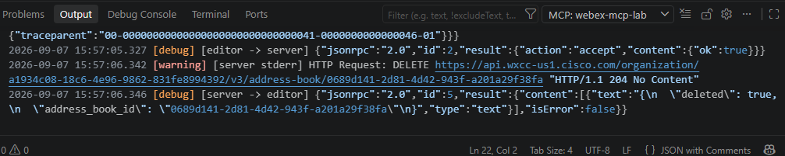{ width="650" style="display: block; margin: 0 auto; border: 1px solid lightgray; border-radius: 8px;" }
