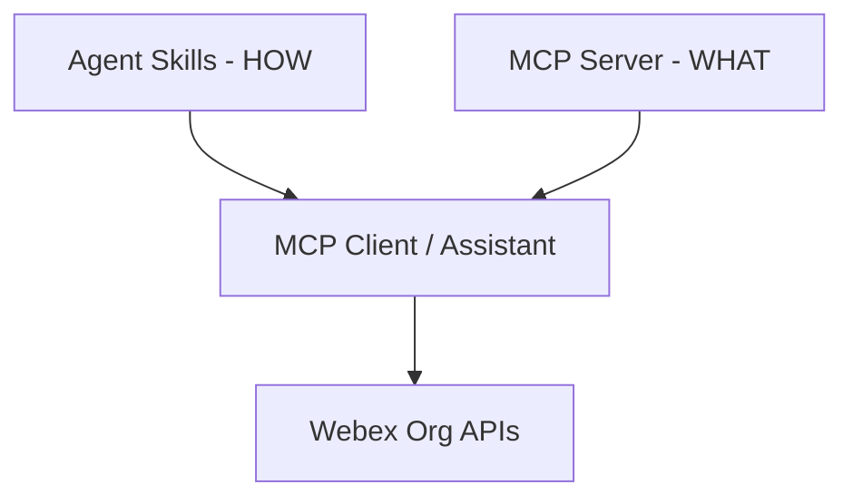

# Lab 6 - Agent Skills for Operational Runbooks

In this section, you will use **Agent Skills** to encode operational expertise — how to diagnose, audit, and fix Webex org issues — separately from MCP tool connectivity.

Reference: [Agent Skills](https://agentskills.io){:target="_blank"}

## Learning Objectives

Upon completion of this section, you will be able to:

- Explain how Agent Skills complement MCP servers
- Create a `SKILL.md` file for a troubleshooting workflow
- Apply progressive disclosure (discovery → activation → execution)
- Combine skills with MCP tools in a multi-step scenario

## Skills vs MCP

| Layer | Responsibility | Example |
| --- | --- | --- |
| **MCP server** | What the assistant *can do* — governed API access | `tool_list_agents`, `tool_get_desktop_profile` |
| **Agent Skills** | *How* to troubleshoot — runbooks and tribal knowledge | "When agents are offline, check profiles first" |



## Step 6.1: Skill anatomy

Each skill is a folder containing at minimum a `SKILL.md` file:

```text
skills/
  diagnose-agent-availability/
    SKILL.md
    checklists.md
  audit-address-books/
    SKILL.md
```

Example `SKILL.md` front matter:

```markdown
---
name: diagnose-agent-availability
description: Diagnose why Contact Center agents appear offline or unavailable.
---

# Diagnose Agent Availability

## When to use
Use when an admin reports agents offline, not receiving calls, or stuck in unavailable state.

## Steps
1. Check Webex Status for platform incidents.
2. Call `tool_list_agents` filtered by the reported team.
3. For each offline agent, call `tool_get_desktop_profile`.
4. Compare profile assignment vs expected queue configuration.
5. Summarize findings and recommend next actions.

## Guardrails
- Never delete profiles without explicit user approval.
- Flag empty address books as high severity.
- Always preview write operations before committing.
```

## Step 6.2: Progressive disclosure

1. **Discovery** — At startup, the agent loads only skill names and descriptions.
2. **Activation** — When a task matches, the agent reads full `SKILL.md` instructions.
3. **Execution** — The agent follows steps, optionally loading referenced files and calling MCP tools.

## Step 6.3: Install skills in your assistant

Configure your MCP host or agent framework to load skills from the lab repository:

```json
{
  "skills": {
    "paths": ["./skills"]
  }
}
```

!!! Note
    Exact configuration varies by client. Update this section with Cursor / custom agent settings before the event.

## Step 6.4: Run a skill-guided scenario

User prompt in Webex (via your bot):

```text
Several agents in Pod 3 show offline. Diagnose the issue using the agent availability skill.
```

Expected behavior:

- Agent activates `diagnose-agent-availability`
- Follows checklist steps
- Calls MCP tools in the documented order
- Returns a structured summary in Webex

## Exercise

Create a second skill for one of:

- Auditing address books for empty or stale entries
- Investigating queue wait time above threshold
- Validating desktop profile assignments after a bulk change

## Content still to define

- Supported skill clients in the lab (Cursor, custom agent, etc.)
- Sample skill folders in the lab code repository
- Evaluation rubric for skill quality (under 500 lines, gotchas, output templates)
