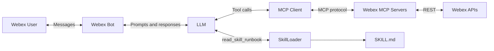
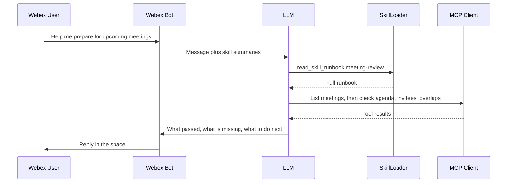
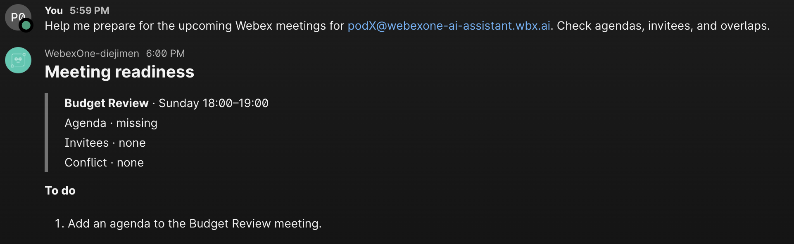
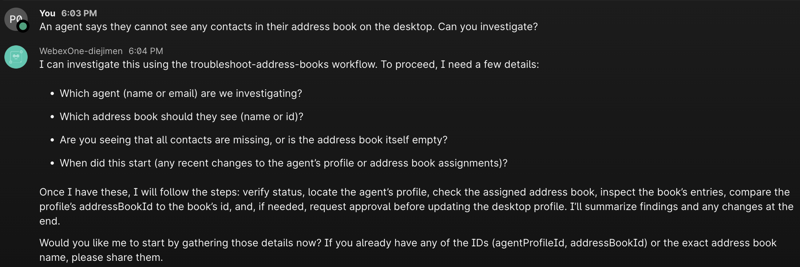

# Lab 7 - Skills in the AI Assistant

Before, when you added the `meeting-review` skill to **VS Code Chat (Agent mode)**, Agent was looking for it. VS Code, and any other host that follows the Agent Skills standard, finds `SKILL.md` files on its own. At startup it reads only each skill's name and description. When your request matches that description, the host loads the rest of the file into the conversation.

A bot you write in Python does not do that. The model only sees the system prompt and the tools you send on that request. A `SKILL.md` file in the repository stays invisible until your code offers it. This section builds that piece: a **skill loader** that reads the same `SKILL.md` file, a one-line summary you place in the system prompt, and a tool the model calls when it needs the full instructions.

Same skill file. Same format. The host is what changed.

## Architecture



### The Request Flow

Here is how a single question travels through that architecture:



## Step 7.1: The SkillLoader class

Every script in this folder imports the same class. Read it before you run anything.

1. In VS Code, make sure your terminal is in the correct folder:

    * cd ../07_skills_bot

2. Navigate to `07_skills_bot/skill_loader.py` and review the code:

    ??? Tip "Python Code"
        ```python
        import yaml
        from pathlib import Path

        class Skill:
            def __init__(self, name: str, description: str, instructions: str):
                self.name = name
                self.description = description
                self.instructions = instructions

        class SkillLoader:
            def __init__(self, skills_dir: str):
                self.skills_dir = Path(skills_dir)
                self.skills = {}
                self._load_skills()

            def _load_skills(self):
                if not self.skills_dir.exists():
                    print(f"Warning: Skills directory {self.skills_dir} not found.")
                    return

                for skill_path in self.skills_dir.rglob("SKILL.md"):
                    content = skill_path.read_text(encoding="utf-8")

                    # Split front matter and body
                    parts = content.split("---", 2)
                    if len(parts) >= 3:
                        frontmatter_str = parts[1]
                        body = parts[2].strip()

                        try:
                            metadata = yaml.safe_load(frontmatter_str) or {}
                            if not isinstance(metadata, dict):
                                print(f"Error parsing YAML in {skill_path}: front matter is not a mapping.")
                                continue
                            name = metadata.get("name", skill_path.parent.name)
                            description = metadata.get("description", "")
                            if not isinstance(description, str):
                                description = str(description)
                            description = description.replace("\n", " ").strip()

                            self.skills[name] = Skill(name, description, body)
                        except yaml.YAMLError as e:
                            print(f"Error parsing YAML in {skill_path}: {e}")

            def get_skill(self, name: str) -> Skill | None:
                return self.skills.get(name)

            def get_all_skills_summary(self) -> str:
                if not self.skills:
                    return "No skills loaded."

                summary = "Available Skills (Runbooks):\n"
                for name, skill in self.skills.items():
                    summary += f"- {name}: {skill.description}\n"
                return summary
        ```

The class does three things:

1. **Discover.** It scans a directory for `SKILL.md` files and reads the YAML front matter.
2. **Summarize.** `get_all_skills_summary()` returns one line per skill. That line is what goes into the system prompt at startup.
3. **Activate.** `get_skill(name).instructions` returns the full body when the model asks for that skill.

One class, one parser, shared by every script below. If the skills directory is missing, the loader warns you and continues with an empty catalog. If a file's front matter is not valid YAML, that file is skipped and the others still load.

## Step 7.2: Discover skills

To see the Skill Loader in action, we will first run a script that scans the directory and prints the discovered skills. This simulates the startup phase where the system prompt is populated with skill summaries.

1. Run the script:

    * python 01_list_skills.py

2. You should see that there is one skill already, the one we created previously:

    ```terminal
    meeting-review: Use when the user asks to prepare for, review readiness of, check what is missing from, or fix readiness gaps in their meetings. Triggers on phrases like 'help me prepare', 'am I ready for', 'checkmy schedule for gaps', or 'add an agenda to my meetings'. This skill evaluates agendas, invitees, and conflicts, and can update missing meeting details. Do NOT use it for plain requests to list meetings.
    ```

The script creates a `SkillLoader`, points it at `skills/`, and prints the `name` and `description` of every skill it finds. You should see `meeting-review`.

This is the **Discovery** stage: the only thing the agent knows about each skill at startup.

## Step 7.3: Progressive disclosure

Skills can be quite long, and loading all of them into the system prompt would consume too many tokens. The progressive disclosure pattern solves this by only loading the full instructions when the model requests them. Let's see the size difference between the discovery and activation stages.

1. Run the script:

    * python 02_skill_size.py

2. You will see the following in the terminal:

    ```terminal
    Skills discovered: 1
    Discovery, one skill (meeting-review description): ~100 tokens
    Activation, one skill (meeting-review body):       ~744 tokens
    The body is 7x the description.
    Every description together: ~112 tokens
    Every full body together:   ~744 tokens
    ```

The script prints how big the description is, how big the full body is, and the same comparison for every skill in the folder:

Startup should send the descriptions. The body is loaded only when the agent decides that skill is relevant. Ten skills the size of `meeting-review` would be about 1,000 tokens of descriptions, or about 7,400 tokens if every body were loaded up front.

## Step 7.4: Compare the same question with and without the skill

Now let's see how the skill actually changes the LLM's behavior. We will ask the exact same question twice: once with the standard system prompt, and once with the `meeting-review` runbook injected.

1. Run the script:

    * python 03_llm.py

    !!! Tip
        For this script, logging has been disabled for clean output.
        If you want to see the detailed logs of the tool calls, you can run the script with the `-v` flag: `python 03_llm.py -v`.

2. You will see the following:

    ```terminal
    WITHOUT skill
    -------------
    Here’s what I found for your next Webex meeting:
    
    - Budget Review
    - When: 2026-09-27, 16:00–17:00 UTC
    - Link: https://webexone-ai-assistant-sbx.webex.com/webexone-ai-assistant-sbx/j.php?MTID=mdf108c380b230a7999254e7ab52b0f2e
    - Host: Pod 0
    - Meeting type: scheduledMeeting
    - Invitees: not set (empty)
    
    Quick prep plan (pick any you want me to do):
    - Draft a concise agenda (objectives, topics, timeboxes)
    - Attach or share pre-read docs (budget spreadsheet, prior period reports)
    - Confirm attendees and assign roles (chair, note-taker, timekeeper, co-host)
    - Add calendar reminders (e.g., 24 hours and 30 minutes prior)
    - Prepare materials for share-out and screen-sharing order
    - Run through tech check (join link works, audio/video, screen sharing)
    
    Would you like me to:
    - Create and share an agenda?
    - Invite attendees? If yes, please provide emails.
    - Add pre-read documents?
    - Set reminders or add this to your calendar?
    
    WITH skill
    ----------
    ### Meeting readiness
    
    > **Budget Review** · Sunday 18:00–19:00
    > Agenda · missing
    > Invitees · none
    > Conflict · none
    
    **To do**
    1. Approve the proposed agenda draft for Budget Review (Proposed agenda: 1) Budget status and variances, 2) Decisions needed, 3) Action items and owners, 4) Next steps and deadlines). If approved, I will update the meeting agenda in Webex.
    ```

| | Without the skill | With the skill |
| --- | --- | --- |
| Meetings | listed | listed |
| Agenda, invitees, and conflicts | not checked | checked |
| Checks that passed | hidden | reported |
| What you can do next | nothing | a to-do list |

The skill puts the runbook into the system prompt with `SkillLoader.get_skill("meeting-review").instructions`.

It is the same class you used in the first two scripts. No new tool is involved. The runbook is what changes the answer.

## Step 7.5: Run the full bot

Finally, let's put it all together. We will run the Webex bot with the Skill Loader and the MCP client connected. This allows you to interact with the assistant in Webex and see it dynamically load and execute the skill.

1. Run the bot:

    * python 04_bot.py

This is the bot we built in the previous section, connected to the messaging, meeting, and custom MCP servers, with `SkillLoader` wired in. On startup it does three things:

1. Discovers the skills.
2. Injects the summaries into the system prompt with `get_all_skills_summary()`.
3. Gives the model a `read_skill_runbook` tool that returns `get_skill(name).instructions`.

The model decides when to load a skill. That is the same progressive disclosure pattern as in Lab 2.

2. In Webex, ask:

    * Help me prepare for the upcoming Webex meetings for podX@webexone-ai-assistant.wbx.ai. Check agendas, invitees, and overlaps.

    !!! Warning
        Replace podX for your user.

3. The bot will reply with the information:

    { width="750" style="display: block; margin: 0 auto; border: 1px solid lightgray; border-radius: 8px;" }

4. And the following in the terminal:

    ```terminal
    2026-09-26 17:44:27,954 INFO Loaded 1 skill(s): meeting-review
    2026-09-26 17:44:30,383 INFO Listening as webexone-diejimen1@webex.bot via WebSocket... (Ctrl+C to stop)
    2026-09-26 17:45:35,935 INFO Received from pod0@webexone-ai-assistant.wbx.ai: Help me prepare for the upcoming Webex meetings for pod0@webexone-ai-assistant.wbx.ai. Check agendas, invitees, and overlaps.
    ...
    2026-09-26 17:45:41,596 INFO read-books running on stdio - waiting for a client (Ctrl+C to stop).
    2026-09-26 17:45:41,661 INFO Offering 11 tool(s) to gpt-5-nano
    2026-09-26 17:45:48,473 INFO LLM asked for read_skill_runbook {'skill_name': 'meeting-review'}
    2026-09-26 17:45:48,473 INFO LLM reading skill: meeting-review
    ...
    2026-09-26 17:46:18,531 INFO Sent to pod0@webexone-ai-assistant.wbx.ai: ### Meeting readiness
    
    > **Budget Review** · Sunday 18:00–19:00
    > Agenda · missing
    > Invitees · none
    > Conflict · none
    
    **To do**
    1. Provide agenda topics to include in Budget Review so I can add them to the meeting after your approval.
    ```

The model sees `meeting-review` in the summary, calls `read_skill_runbook`, reads the runbook, and follows it.

## Exercise: Add a new skill

Adding a skill does not change `skill_loader.py` or the bot. You add a folder whose name matches the `name` in the front matter, with a single `SKILL.md` inside.

### 1. Add troubleshoot-address-books

1. Create `07_skills_bot/skills/troubleshoot-address-books/SKILL.md` and paste the skill:

    ??? Tip "SKILL.md"
        ```markdown
        ---
        name: troubleshoot-address-books
        description: >-
          Use when a contact-center agent reports a problem with address books
          or contacts on the Webex Contact Center desktop — contacts missing,
          wrong address book showing, empty contact list, or address book not
          assigned. Investigates the agent's desktop profile, its address book
          assignment, and the book's entries. Can fix a misassigned or missing
          address book by updating the desktop profile. Combines a local
          platform-status check with MCP tools from the address-book server (06)
          and the desktop-profile server (07).
        compatibility: >-
          Requires MCP servers 06_manage_address_books and
          07_verify_desktop_profiles, plus local tool check_webex_status.
        metadata:
          author: webex-mcp-lab
          version: "3.0"
          lab-chapter: "7"
        ---

        # Troubleshoot Address Books

        ## Why a skill, not an MCP prompt?

        This workflow spans three tool sources — a local tool, MCP server 06,
        and MCP server 07. An MCP server prompt can only reference its own tools.
        A skill lives client-side and orchestrates tools from any connected server,
        plus local tools and pure reasoning steps that no single server provides.

        ## How it works

        1. **Check platform status** — call `check_webex_status` (local tool) to
           rule out an outage before digging into config.
        2. **Find the agent** — call `list_agents` (server 07) and grab their
           `agentProfileId`.
        3. **Look at their profile** — call `get_desktop_profile` (server 07) with
           that id. The key field is `addressBookId`.
        4. **Find the right address book** — call `list_address_books` (server 06)
           to get the desired book's `id`.
        5. **Check the book has entries** — call `list_entries` (server 06) with
           the book's `id` from step 4. You need that `id` first.
        6. **Compare** — does the profile's `addressBookId` match the desired
           book's `id`? This is a reasoning step, no tool needed.
        7. **Fix if needed** — call `update_desktop_profile` (server 07) to point
           the profile at the right book.

        ## Data flow

        Tool outputs chain directly into tool inputs. Field names match the API.
        Use them exactly as shown.

        - `list_agents` returns each agent's `agentProfileId`.
        - Pass that as the `id` to `get_desktop_profile`. It returns the
          profile's `addressBookId`.
        - `list_address_books` returns each book's `id`.
        - Compare the profile's `addressBookId` with the desired book's `id`.
        - If they don't match, pass both to `update_desktop_profile`
          (`id` = the profile, `addressBookId` = the desired book).

        ## Steps

        1. Ask for the symptom:
           - Which agent (name or email)? What do they see on their desktop?
           - Which address book should they see? (name or id)
           - Are contacts missing entirely, or is the address book empty?
           - When did it start? (config changes take a few minutes to propagate)
        2. Call `check_webex_status` first. If an incident is active, stop and
           report it.
        3. Call `list_agents` to find the agent. Note their `agentProfileId`.
        4. Call `get_desktop_profile` with `id` set to the `agentProfileId` from
           step 3. Do not call this until step 3 has returned.
           Note the `addressBookId` field.
        5. Call `list_address_books` to find the desired address book and its `id`.
           This does not depend on steps 3 and 4, so it can run alongside them.
        6. Call `list_entries` with the book's `id` from step 5. You need that `id`
           first. Do not call this until step 5 has returned. An empty book is as
           useless as no book.
        7. Compare the profile's `addressBookId` (from step 4) with the desired
           book's `id` (from step 5). Both must be available before you compare:
           - **Match** — the book is assigned correctly; the problem is elsewhere
             (check if the book is empty, or if there is a platform incident).
           - **Mismatch or null** — the agent's profile points to the wrong book
             (or none). Proceed to step 8.
        8. Fix with approval: call `update_desktop_profile` with `id` set to the
           `agentProfileId` from step 3 and `addressBookId` set to the desired
           book's `id` from step 5. The server shows a confirmation card warning
           that all agents on this profile will be affected. It will not proceed
           until the user approves.
        9. Summarize findings and what was changed.

        ## Edge cases

        - **Agent not found** — may be inactive or in a different org.
        - **`addressBookId` is null** — profile was never assigned a book, not just
          the wrong one.
        - **Address book exists but is empty** — correct assignment, wrong content.
          The fix is to add entries, not change the profile.
        - **Multiple agents share the profile** — updating the profile affects all
          of them. The confirmation card makes this explicit.

        ## Guardrails

        - **Confirm before writing.** Never update a profile without approval.
          `update_desktop_profile` shows a confirmation card. It will not proceed
          until the user approves. Remind the user that updating a profile affects
          every agent assigned to it, not just the one being investigated.
        - **Validate before writing.** Before calling `update_desktop_profile`,
          verify that the `addressBookId` belongs to an actual book (it appeared
          in `list_address_books` results) and the profile `id` belongs to an
          actual profile (it appeared in `get_desktop_profile` results). Never
          pass values you constructed or guessed. Only use IDs that came from
          a tool response.
        ```

### 2. Confirm the loader sees it

1. Run discovery again:

    * python 01_list_skills.py

2. You should see `meeting-review` and `troubleshoot-address-books`:

    ```terminal
    meeting-review: Use when the user asks to prepare for, review readiness of, check what is missing from, orfix readiness gaps in their meetings. Triggers on phrases like 'help me prepare', 'am I ready for', 'checkmy schedule for gaps', or 'add an agenda to my meetings'. This skill evaluates agendas, invitees, and conflicts, and can update missing meeting details. Do NOT use it for plain requests to list meetings.
    troubleshoot-address-books: Use when a contact-center agent reports a problem with address books or contacts on the Webex Contact Center desktop — contacts missing, wrong address book showing, empty contact list, or address book not assigned. Investigates the agent's desktop profile, its address book assignment, and the book's entries. Can fix a misassigned or missing address book by updating the desktop profile. Combines alocal platform-status check with MCP tools from the address-book server (06) and the desktop-profile server (07).
    ```

### 3. Ask the bot to use it

1. Restart `04_bot.py`. The loader scans `skills/` at startup, so the new skill is offered with no Python change.
    
    ```terminal
    2026-09-26 18:03:12,329 INFO Loaded 2 skill(s): meeting-review, troubleshoot-address-books
    2026-09-26 18:03:13,940 INFO Listening as webexone-diejimen1@webex.bot via WebSocket... (Ctrl+C to stop)
    ```

2. In Webex, ask:

    * An agent says they cannot see any contacts in their address book on the desktop. Can you investigate?

    The model loads `troubleshoot-address-books` and follows that runbook.

    { width="950" style="display: block; margin: 0 auto; border: 1px solid lightgray; border-radius: 8px;" }

