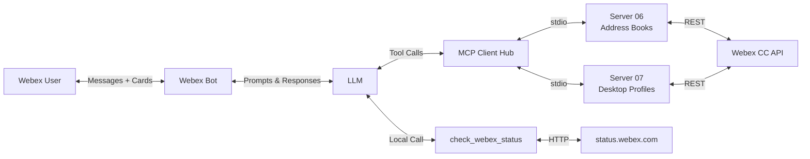

# Lab 8 - Use Cases

You have built a **Webex bot** (Lab 5), an **MCP client and hub** (Lab 6), a **skill loader** (Lab 7), and **custom MCP servers** (Labs 3-4). In this lab you compose those modules into a real troubleshooting use case for **Webex Contact Center address books** — and discover where they hit their limits.

The use case: a Contact Center manager reports that an agent's address book is wrong. Your bot investigates across two MCP servers, diagnoses the misconfiguration, and **fixes it with a confirmation card** — all by importing the modules you already built.

## Architecture



### What you are composing

| Module | Built in | Import path |
| --- | --- | --- |
| `WebSocketClient` | Lab 5 | `05_bot/websocket_client.py` |
| `McpClient` / `McpHub` | Lab 6 | `06_mcp_bot/mcp_client.py`, `mcp_hub.py` |
| `run_turn` / `as_openai_tools` | Lab 6 | `06_mcp_bot/llm.py` |
| `SkillLoader` | Lab 7 | `07_skills_bot/skill_loader.py` |
| `WebSocketClientCards` | Agent Bot | `agent_bot/utils/websocket.py` |
| Persistent `mcp_client` | Agent Bot | `agent_bot/utils/mcp_client.py` |
| `elicit` (card bridge) | Agent Bot | `agent_bot/utils/elicit.py` |

### Setup

```bash
cd 08_use_cases
pip install -r ../webex-mcp-lab/agent_bot/requirements.txt
cp .env.example .env    # then edit .env
```

!!! Note
    The `.env` file needs `BOT_TOKEN`, `OPENAI_API_KEY`, `MODEL`, plus the Contact Center credentials (`WEBEX_ACCESS_TOKEN`, `WEBEX_ORG_ID`, `WXCC_CONFIG_API_BASE`) that were configured during the lab setup.

## Step 8.1: Compose what you built

In this first step, you will compose the modules from Labs 5, 6, and 7 into a single bot that connects to the Contact Center MCP servers. No new code is written — everything is imported.

1. Navigate to `08_use_cases/01_naive_bot.py` and review the code:

    ??? Tip "Python Code"
        ```python
        import asyncio
        import logging
        import os
        import sys
        from datetime import datetime, timezone
        from pathlib import Path

        import requests
        from dotenv import load_dotenv

        LAB_ROOT = Path(__file__).resolve().parent.parent

        # Import modules built in earlier labs — no rewriting.
        sys.path.insert(0, str(LAB_ROOT / "05_bot"))
        sys.path.insert(0, str(LAB_ROOT / "06_mcp_bot"))
        sys.path.insert(0, str(LAB_ROOT / "07_skills_bot"))

        from websocket_client import WebSocketClient          # Lab 5
        from mcp_client import McpClient                      # Lab 6
        from mcp_hub import McpHub                            # Lab 6
        from llm import as_openai_tools, run_turn             # Lab 6
        from skill_loader import SkillLoader                  # Lab 7
        ```

    Notice: **zero code is rewritten**. The bot imports the WebSocket client from Lab 5, the MCP client/hub and LLM loop from Lab 6, and the skill loader from Lab 7. It connects to the two Contact Center MCP servers (address books and desktop profiles) over stdio, and adds a local `check_webex_status` tool via the `extra` dispatch parameter that `run_turn` already supports.

2. Run the bot:

    ```bash
    python 01_naive_bot.py
    ```

3. In your Webex space, ask:

    * List my address books

4. You should see the bot successfully call `list_address_books` and reply with the results:

    ```terminal
    INFO Offering 12 tool(s) to gpt-5-nano
    INFO LLM asked for list_address_books {'limit': 50}
    INFO Sent to user@example.com: Here are your address books: ...
    ```

5. Try another read across both servers:

    * List agents and their desktop profiles

    The bot calls tools on **both** MCP servers and combines the results. Everything works.

!!! Note "All read operations succeed"
    The Lab 5/6/7 modules compose cleanly for read-only operations. The `McpHub` routes tool calls to the right server, and `run_turn` handles the agentic loop. The skill loader discovers the troubleshoot skill. This is the power of building reusable modules.

## Step 8.2: Try a write

Now ask the bot to **fix** a misconfiguration — this triggers a write tool (`update_desktop_profile`) that uses server-side elicitation.

1. In Webex, ask:

    * Fix Ana's desktop profile to use the Sales-EMEA address book

2. Watch the terminal. The LLM will call `update_desktop_profile`, but something unexpected happens:

    ```terminal
    INFO LLM asked for update_desktop_profile {'id': '...', 'addressBookId': '...'}
    INFO Sent to user@example.com: The update was not performed.
           The confirmation was declined or dismissed.
    ```

    **No card appeared in Webex.** The tool returned `{"updated": false, "reason": "Confirmation was declined or dismissed."}` — but you never saw a confirmation prompt.

!!! Warning "The server tried to ask 'are you sure?' but nobody was listening"
    The `update_desktop_profile` tool uses **server-side elicitation** — it sends a confirmation request back through the MCP session. But Lab 6's `McpClient` has no way to handle that request, so it was silently declined.

## Step 8.3: Understand why

There are exactly **two gaps** between the Lab 5/6 modules and what this use case needs.

### Gap 1: No card-tap channel

Lab 5's `WebSocketClient` only processes messages (`verb == "post"`). When the user taps a button on an Adaptive Card, the Mercury WebSocket delivers `verb == "cardAction"` — and Lab 5 silently drops it.

| | Lab 5 `WebSocketClient` | Agent Bot `WebSocketClientCards` |
| --- | --- | --- |
| Messages (`verb == "post"`) | Handled | Handled |
| Card taps (`verb == "cardAction"`) | **Dropped** (filtered out) | Handled via `on_card` callback |
| Card input decryption | Not implemented | `get_card_inputs()` method |

### Gap 2: No elicitation callback

Lab 6's `McpClient` creates `ClientSession(read, write)` with **no `elicitation_callback`**. When the MCP server tries to elicit confirmation, the SDK has no handler — the elicitation is automatically declined.

| | Lab 6 `McpClient` | Agent Bot `MCPConnection` |
| --- | --- | --- |
| Session lifecycle | One-shot (open per call) | Persistent (background thread) |
| `elicitation_callback` | **Not set** | Set to `_on_elicit` |
| Card bridge | None | `elicit.py` posts card, waits for tap |
| Resources / Prompts | Not read | Discovered and merged |

!!! Note "Two gaps to bridge"
    1. **Transport**: The WebSocket client needs to hear card button taps, not just messages.
    2. **MCP client**: The MCP session needs an elicitation callback that can post an Adaptive Card and wait for the user's response.

    The Lab 5/6 modules were designed for simpler scenarios. The agent bot's upgraded modules solve both gaps.

## Step 8.4: Switch to upgraded modules

Now switch to the full bot that imports the upgraded modules from `agent_bot/utils`. These provide persistent MCP sessions with elicitation callbacks and a WebSocket client that handles both messages and card taps.

1. Stop the naive bot (`Ctrl+C`) and review `08_use_cases/02_full_bot.py`:

    ??? Tip "Python Code"
        ```python
        LAB_ROOT = Path(__file__).resolve().parent.parent
        AGENT_BOT_DIR = str(LAB_ROOT / "webex-mcp-lab" / "agent_bot")

        # Import the upgraded modules from agent_bot/utils
        sys.path.insert(0, AGENT_BOT_DIR)

        from utils import mcp_client, elicit, skills
        from utils.websocket import WebSocketClientCards
        from local_agent_tools import webex_status
        ```

    Key differences from the naive bot:

    - **`WebSocketClientCards`** replaces `WebSocketClient` — handles `on_card` taps
    - **`mcp_client.connect_all`** keeps persistent sessions with `elicitation_callback`
    - **`elicit.init` + `mcp_client.set_elicit_bridge`** wires the card bridge
    - **`on_card` handler** routes card taps to `elicit.resolve`

2. Run the full bot:

    ```bash
    python 02_full_bot.py
    ```

3. In Webex, ask the same question:

    * Fix Ana's desktop profile to use the Sales-EMEA address book

4. This time, an **Adaptive Card** appears in the Webex space:

    The card shows the action ("Update desktop profile X to use address book Y? This affects ALL agents assigned to this profile.") with **Confirm** and **Decline** buttons.

5. Tap **Confirm**. The terminal shows:

    ```terminal
    INFO Card tap: confirmed
    INFO Sent to user@example.com: Done! Ana's desktop profile now uses Sales-EMEA.
    ```

    The profile is updated. If you tap **Decline** instead, the tool returns `{"updated": false}` and the bot reports no change was made.

## Step 8.5: Skill-guided troubleshooting

The full bot also loads the `troubleshoot-address-books` skill, which orchestrates the complete diagnostic flow across both MCP servers and the local status check.

1. Review the skill file at `08_use_cases/skills/troubleshoot-address-books/SKILL.md`:

    ??? Tip "SKILL.md"
        The skill defines a 9-step workflow:

        1. Ask for the symptom
        2. Check platform status (`check_webex_status` — local tool)
        3. Find the agent (`list_agents` — server 07)
        4. Get their desktop profile (`get_desktop_profile` — server 07)
        5. Find the desired address book (`list_address_books` — server 06)
        6. Check the book has entries (`list_entries` — server 06)
        7. Compare profile's `addressBookId` with the desired book's `id`
        8. Fix with approval (`update_desktop_profile` — server 07, with confirmation card)
        9. Summarize findings

2. In Webex, describe a symptom:

    * Agent Ana says she can't see the Sales-EMEA contacts on her desktop. The address book looks wrong. Can you investigate?

3. Watch the terminal as the bot follows the skill's steps, calling tools across all three sources (local, server 06, server 07), and posting a confirmation card before making any changes.

## Exercises

### Add a second use case

The `08_use_cases/` directory already contains two MCP servers: `troubleshooting_mcp.py` and `controlhub_mcp.py`. These expose tools for security audit events, call history, reports, and workspace management.

Add a third MCP server to the full bot's `_configs` list and write a new skill that uses its tools alongside the existing ones.

??? Solution

    1. Add a new entry to the `_configs` list in `02_full_bot.py`:

        ```python
        _configs = [
            {
                "name": "address-books",
                "command": sys.executable,
                "args": ["06_manage_address_books.py"],
                "cwd": MCP_SERVERS_DIR,
            },
            {
                "name": "desktop-profiles",
                "command": sys.executable,
                "args": ["07_verify_desktop_profiles.py"],
                "cwd": MCP_SERVERS_DIR,
            },
            {
                "name": "troubleshooting",
                "command": sys.executable,
                "args": [str(LAB_ROOT / "08_use_cases" / "troubleshooting_mcp.py")],
                "cwd": str(LAB_ROOT / "08_use_cases"),
            },
        ]
        ```

    2. Create a new skill at `08_use_cases/skills/investigate-audit/SKILL.md` with frontmatter and steps that call `list_admin_audit_events` and `list_security_audit_events`.

    3. Restart the bot. The skill loader discovers the new skill, and the LLM can now call tools from three servers.
