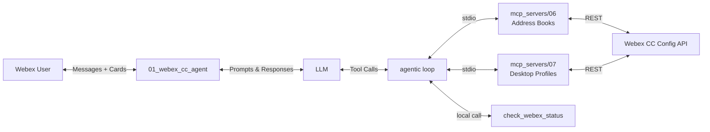

# Lab 8 - Use Cases

You have built a **Webex bot** (Lab 5), an **MCP client and hub** (Lab 6), a **skill loader** 
(Lab 7), and **custom MCP servers** (Labs 3-4). In this lab you compose those modules into a 
real troubleshooting use case for **Webex Contact Center address books** — and discover where 
they hit their limits.

In Chapter 7 you built an **agent bot engine** — an agentic loop, a multi-server MCP client, an elicitation-to-card bridge, a skills loader, and a WebSocket that carries both messages and card taps. That engine is generic on purpose.

In this lab you meet the engine as **complete, self-contained use cases**. Each use case is a single folder that carries *everything* it needs — its own `utils/`, `local_agent_tools/`, `skills/`, `mcp_servers/`, persona, and `agentbot.py`. Open one folder and you see every moving part. Copy the folder and you have a template for the next agent.

This lab has three use cases. We document the **Webex Contact Center agent** in full here; the **Calling** and **Meeting** agents ship as drafts and will be documented later.

```
08_use_cases/
    01_webex_cc_agent/        <-- documented in this lab (fully built)
    02_webex_calling_agent/   <-- draft (coming soon)
    03_webex_meeting_agent/   <-- draft (coming soon)
```

!!! Note "Self-contained by design"
    There is no shared library. Each use-case folder has its **own copy** of the engine. The trade-off — the same `utils/` appears in more than one folder — is deliberate: every use case is a complete, runnable, copy-paste-able example with **no imports from other labs** and nothing to wire up across directories.

---

## Section 1 — Webex Contact Center Agent

The scenario: a Contact Center manager reports that an agent's address book is wrong on their desktop. This agent investigates across two MCP servers, diagnoses the misconfiguration, and — with your approval on an Adaptive Card — fixes it.

### Architecture


```mermaid
flowchart LR
    User[Webex User] <-->|Messages + Cards| Bot[01_webex_cc_agent]
    Bot <-->|Prompts & Responses| LLM[LLM]
    LLM <-->|Tool Calls| Loop[agentic loop]
    Loop <-->|stdio| S06[mcp_servers/06\nAddress Books]
    Loop <-->|stdio| S07[mcp_servers/07\nDesktop Profiles]
    S06 <-->|REST| CC[Webex CC Config API]
    S07 <-->|REST| CC
    Loop <-->|local call| Status[check_webex_status]
```

### Step 1.1: Anatomy of a self-contained use case

Open `08_use_cases/01_webex_cc_agent/`. Everything the agent needs is here:

```
01_webex_cc_agent/
    agentbot.py              # entrypoint: config, wiring, message/card routing
    system_prompt.txt        # the persona (domain-specific)
    utils/                   # the engine (from Chapter 7)
        mcp_client.py        #   agentic loop + multi-server routing + elicitation
        websocket.py         #   Mercury: messages + card taps, one socket
        elicit.py            #   MCP elicitation -> Adaptive Card bridge
        skills.py            #   progressive skill discovery
        commands.py          #   optional /keyword -> MCP prompt
    local_agent_tools/
        webex_status.py      # a local tool (not from any MCP server)
    skills/
        troubleshoot-address-books/
            SKILL.md         # the cross-server troubleshooting runbook
    mcp_servers/
        06_manage_address_books.py     # address book CRUD
        07_verify_desktop_profiles.py  # agent/profile verification + update
```

| Piece | What it is | Who built it |
| --- | --- | --- |
| `utils/` | The engine — agentic loop, MCP client, elicitation, skills, websocket | **Chapter 7** |
| `local_agent_tools/webex_status.py` | A plain HTTP status check, offered to the LLM as a tool | Chapter 7 |
| `mcp_servers/06`, `07` | The two Contact Center servers | Chapters 6 & 7 |
| `skills/troubleshoot-address-books/` | The runbook the LLM follows | Chapter 7 |
| `system_prompt.txt` | The domain persona | **this lab** |
| `agentbot.py` | The thin wiring that connects it all | **this lab** |

!!! Note "No setup step"
    There is no `.env` or `requirements.txt` inside the use-case folder. You already created your `.env` and installed dependencies earlier in the lab — this agent reuses them.

### Step 1.2: The persona

The bot's system prompt is built from **three layers**, each from a different source:

```python
SYSTEM_PROMPT = (
    load_persona()                       # Layer 1: system_prompt.txt (tone + rules)
    + skills.catalog_prompt(catalog)     # Layer 2: one line per available skill
    + "\n\n"
    + mcp_client.get_resources_text()    # Layer 3: the servers' own resources
)
```

Open `system_prompt.txt`. Notice it sets **tone and rules** — "look things up with a tool, confirm before writing, check status first" — but leaves the *domain facts* (what `addressBookId` means, address-book naming conventions) to Layer 3, the server resources.

!!! Tip "Design choice — persona sets behavior, resources carry knowledge"
    Keep the persona domain-light. The moment domain facts live in the servers' resources instead of the prompt, the same engine can front a different domain by swapping servers — which is exactly how the Calling and Meeting agents reuse this folder.

### Step 1.3: The troubleshooting skill

Open `skills/troubleshoot-address-books/SKILL.md`. Its frontmatter (`name`, `description`) is all that loads at startup; the LLM pulls the full body only when a request matches — that's **progressive disclosure** (see Chapter 7, §7.3.3).

The skill chains tools from **three sources** in one flow:

| Step | Tool | Source |
| --- | --- | --- |
| Rule out an outage | `check_webex_status` | local tool |
| Find the agent | `list_agents` | server 07 |
| Read their profile | `get_desktop_profile` | server 07 |
| Find the desired book | `list_address_books` | server 06 |
| Verify it has contacts | `list_entries` | server 06 |
| Compare & fix (with approval) | `update_desktop_profile` | server 07 |

!!! Note "Why a skill, not an MCP prompt?"
    An MCP prompt lives inside one server and can only reference that server's tools. This workflow spans a local tool **and** two different servers — only a client-side skill can wire them together. MCP provides the *tools*; the skill provides the *judgment*. (Chapter 7, §7.6.4.)

### Step 1.4: The wiring

Open `agentbot.py`. It is short — because the hard parts are already in `utils/`.

??? Tip "Python Code — the wiring that makes it a Contact Center agent"
    ```python
    # Own-folder imports — this folder is the import root.
    from utils import mcp_client, skills, elicit
    from utils.websocket import WebSocketClientCards
    from local_agent_tools import webex_status

    # Connect to THIS agent's own two servers (address books + desktop profiles).
    _configs = [
        {"name": "address-books",   "command": sys.executable,
         "args": ["06_manage_address_books.py"],    "cwd": MCP_SERVERS_DIR},
        {"name": "desktop-profiles","command": sys.executable,
         "args": ["07_verify_desktop_profiles.py"], "cwd": MCP_SERVERS_DIR},
    ]
    mcp_client.connect_all(_configs, interactive=False)

    # Wire the Adaptive Card elicitation bridge.
    elicit.init(bot_token)
    mcp_client.set_elicit_bridge(elicit)

    # Discover this folder's skills + offer the local status tool.
    skills_catalog = skills.discover(SKILLS_DIR)
    extra_tools = [skills.tool_spec(skills_catalog), webex_status.status_tool_spec()]
    dispatch = {
        "load_skill": lambda a: skills.load_skill(skills_catalog, a.get("name", "")),
        **webex_status.status_dispatch(),
    }
    ```

!!! Note "What you are NOT writing"
    No agentic loop. No MCP session handling. No elicitation logic. No WebSocket. No card decoding. All of that lives in `utils/`, built in Chapter 7. This file only **names the servers, loads the skill, and routes messages and card taps**.

### Step 1.5: Run the agent

1. Change into the use-case folder:

    * cd 08_use_cases/01_webex_cc_agent

2. Run it:

    * python agentbot.py

3. Confirm both servers connect. You should see two "MCP ready" lines — one per server:

    ```terminal
    MCP ready — 6 tool(s), ... resource text, 1 prompt(s)
    MCP ready — 4 tool(s), ... resource text, 0 prompt(s)
    Listening as WebexOne-... via Mercury (messages + cards)...
    ```

4. In the Webex space, start with a read:

    * List my address books

5. Now describe the problem and let the skill drive:

    * Agent Ana can't see the Sales-EMEA contacts on her desktop. Investigate and fix it.

6. The agent works through the skill, and when it reaches the fix it posts an **Adaptive Card** asking you to confirm — because `update_desktop_profile` affects **all** agents on that profile. Tap **Confirm**:

    ```terminal
    INFO Card tap: confirmed
    INFO Sent to ...: Done — Ana's desktop profile now points at Sales-EMEA.
    ```

    Tap **Decline** and nothing changes.

### Step 1.6: Design lessons

The servers and skill in this folder look the way they do because of real lessons learned while building them. Each callout is the *principle*; the full stories live in Chapter 7, §7.7.

!!! Note "Lesson 1 — surface the data your consumers need"
    `get_desktop_profile` returns `addressBookId`, not just `name` and `id`. If the tool dropped that field, the skill could never compare "assigned book" against "desired book". A tool must return the fields its consumers reason over.

!!! Note "Lesson 2 — write to the right resource"
    To reassign an agent's address book, the agent updates the **desktop profile**, not the user record. Updating the user returns `400` and wouldn't fix the profile anyway. When a write fails, check you're calling the API that actually owns the change.

!!! Tip "Lesson 3 — speak the API's language"
    `update_desktop_profile(id, addressBookId)` uses the API's exact field names, not `profile_id` or `book_id`. The LLM pipes each tool's output straight into the next tool's input — so if `get_desktop_profile` returns `addressBookId`, the model passes `addressBookId`. Match the API's names, or the call bounces.

!!! Tip "Lesson 4 — tell the model what to wait for"
    An LLM can fire several tool calls at once — fast, until call B needs call A's result. The skill spells out the wiring: *"use the `id` from step 4"*, *"don't call this until step 4 returns"*, *"this one can run alongside step 3"*. Without those markers the model guesses — and calls `list_entries` before it has a book ID.

!!! Note "Lesson 5 — never hardcode the model"
    `MODEL` is read from the environment and the bot exits with a clear message if it's unset. Hardcoding a model name breaks the moment someone's project lacks access to it. Externalizing it makes the same code work across OpenAI, Azure, or any compatible provider.

??? Note "How this skill matured (v1 → v2)"
    | What | v1 | v2 |
    | --- | --- | --- |
    | Description | one narrow trigger phrase | many trigger keywords |
    | "Why a skill?" | missing | explained |
    | Data flow | none | explicit bullet chain |
    | Field names | `desktop_profile_id` (snake_case) | `agentProfileId` (API-aligned) |
    | Comparison logic | "does it have the right books?" | "compare `addressBookId` with book `id`" |
    | Dependencies | implicit | explicit ("don't call until…") |
    | Edge cases | none | agent-not-found, null book, empty book, shared profile |
    | Write tool | `reassign_desktop_profile` (wrong API) | `update_desktop_profile` (correct API) |

    A skill is not just a list of tools to call in order. It is orchestration logic: cross-server wiring, reasoning instructions, edge-case handling, and dependency markers. MCP provides the tools; the skill provides the judgment.

### Step 1.7: This folder is a template

To build a new agent, you don't start from scratch — you copy this folder and swap three things:

```
copy 01_webex_cc_agent/  ->  0N_new_agent/
    swap  system_prompt.txt   (new persona)
    swap  skills/             (new runbook)
    swap  mcp_servers/ + _configs in agentbot.py   (new servers)
    keep  utils/ + local_agent_tools/              (the engine — unchanged)
```

That is exactly how the next two use cases are set up.

### Exercises

#### Exercise 1 — a report-only persona

Change the Contact Center agent so it *diagnoses but never writes* — it should explain what to fix, but not call `update_desktop_profile`.

??? Solution
    Edit `system_prompt.txt` to add a rule: "You are read-only. Never call write tools such as `update_desktop_profile`. Instead, report the exact change an admin should make." The skill still guides the diagnosis; the persona stops the write.

#### Exercise 2 — add a third tool source

Give the agent the `check_webex_status` local tool a bigger role: make the skill's first step always report platform status, even when everything is healthy.

??? Solution
    In `SKILL.md`, change step 1 to: "Always call `check_webex_status` and include the platform state in your summary, healthy or not." Restart the agent — no code change needed, because `webex_status` is already offered via `extra_tools`.

---

## Section 2 — Webex Calling Agent

!!! Note "Coming soon"
    The Webex Calling agent ships as a **draft** in `08_use_cases/02_webex_calling_agent/`. It follows the same self-contained pattern as the Contact Center agent, with its own `mcp_servers/` (`calling_mcp.py`, `controlhub_mcp.py`, `troubleshooting_mcp.py`) and the `troubleshoot-status` skill (check platform incidents, then verify the user). A full walkthrough will be added here later. See that folder's `README.md` for how to finish it.

---

## Section 3 — Webex Meeting Agent

!!! Note "Coming soon"
    The Webex Meeting agent ships as a **draft** in `08_use_cases/03_webex_meeting_agent/`, with the `meeting-review` skill (review each meeting across schedule, participants, summary, recording, and transcript). Unlike the other two agents, it targets the **remote hosted Webex Meetings MCP** over HTTP, so its engine needs HTTP transport added to `utils/mcp_client.py`. A full walkthrough will be added here later. See that folder's `README.md` for details.
