# Lab 8 - Use Cases

Now, you will compose the modules that you have been building into three real troubleshooting agents.

In this lab you meet the engine as **complete, self-contained use cases**. Each use case is a single folder that carries *everything* it needs — its own `utils/`, `skills/`, `mcp_servers/`, persona, and `agentbot.py`. Open one folder and you see every moving part.

This lab has three use cases, each a self-contained agent built from the same engine: 

- **Contact Center** agent that fixes a misconfiguration
- **Calling / Control Hub** agent that investigates a user's calls 
- **Meeting Quality** agent that explains why a meeting looked and sounded bad.

```
08_use_cases/
    01_webex_cc_agent/        <-- Contact Center — fix an address-book misconfiguration
    02_webex_calling_agent/   <-- Calling / Control Hub — investigate a user's calls
    03_webex_meeting_agent/   <-- Meeting Quality — analyze meeting audio/video
```

!!! Note "Self-contained by design"
    There is no shared library. Each use-case folder has its **own copy** of the engine. The trade-off — the same `utils/` appears in more than one folder — is deliberate: every use case is a complete, runnable, copy-paste-able example with **no imports from other labs** and nothing to wire up across directories. Only `.env` file is shared for simplicity.

---

## Section 1 — Webex Contact Center Agent

The scenario: a Contact Center manager reports that an agent's address book is wrong on their desktop. This agent investigates across two MCP servers, diagnoses the misconfiguration, and — with your approval on an Adaptive Card — fixes it.

### Architecture

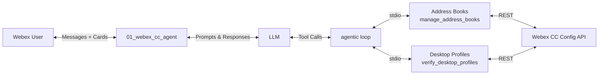
```mermaid
flowchart LR
    User[Webex User] <-->|Messages + Cards| Bot[01_webex_cc_agent]
    Bot <-->|Prompts & Responses| LLM[LLM]
    LLM <-->|Tool Calls| Loop[agentic loop]
    Loop <-->|stdio| S06["Address Books<br/>manage_address_books"]
    Loop <-->|stdio| S07["Desktop Profiles<br/>verify_desktop_profiles"]
    S06 <-->|REST| CC[Webex CC Config API]
    S07 <-->|REST| CC
```

### Step 8.1.1: The two MCP servers

The agent connects to two servers. One you have already built; one is new.

#### Address Book Server — you already wrote every tool in it

`manage_address_books.py` is not new code. It is the three address-book
servers from Lab 4 merged into one file:


#### Desktop Profile Server — the one genuinely new server

`verify_desktop_profiles.py` is the only file here you have not seen before. It
answers one question: *which address book is this agent actually configured to see?*

| Tool | What it does |
| --- | --- |
| `list_agents` | Every agent in the org, each with their `agentProfileId` |
| `list_desktop_profiles` | Every desktop profile in the org |
| `get_desktop_profile` | One profile — crucially, including its `addressBookId` |
| `update_desktop_profile` | Point a profile at a different address book (elicited) |

It also exposes one resource, `lab://desktop-profile-reference`.

??? Note "What the resource says — and what it deliberately does not"
    The resource is a **field glossary**, not a runbook. It explains what a desktop profile is, that each agent is assigned exactly one, and that the profile's `addressBookId` determines which contacts appear on the Agent Desktop.

    It does **not** say "Step 1: do this. Step 2: do that." That is the skill's job, and Step 8.1.2 explains why the split matters.

    | Concern | Where it lives |
    | --- | --- |
    | "What does `addressBookId` mean?" | server resource |
    | "What does the profile API return?" | server tool |
    | "Agent can't see contacts — do X then Y" | client-side skill |

!!! Note "Neither server ships a prompt — on purpose"
    The troubleshooting workflow needs tools from *both* servers plus a reasoning step, and a prompt cannot reach outside its own server. So that logic lives in a skill instead. Step 8.1.2 makes the rule general.

### Step 8.1.2: Four places knowledge can live

This agent knows things. That knowledge sits in four different places, and
choosing the right one is the main design decision in the whole folder.

Two questions tell them apart: **who owns it** — the client or the server — and
**when it enters the model's context** — always, or only when needed.

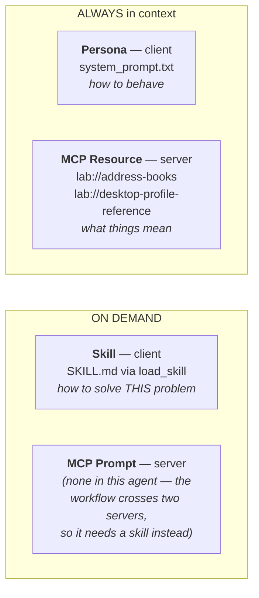
```mermaid
flowchart TB
    subgraph AlwaysLoaded["ALWAYS in context"]
        direction LR
        P["<b>Persona</b> — client<br/>system_prompt.txt<br/><i>how to behave</i>"]
        R["<b>MCP Resource</b> — server<br/>lab://address-books<br/>lab://desktop-profile-reference<br/><i>what things mean</i>"]
    end
    subgraph OnDemand["ON DEMAND"]
        direction LR
        S["<b>Skill</b> — client<br/>SKILL.md via load_skill<br/><i>how to solve THIS problem</i>"]
        M["<b>MCP Prompt</b> — server<br/><i>(none in this agent — the<br/>workflow crosses two servers,<br/>so it needs a skill instead)</i>"]
    end
    AlwaysLoaded ~~~ OnDemand
```

The always-loaded row is literally the system prompt, assembled in `agentbot.py`:

```python
SYSTEM_PROMPT = (
    load_persona()                       # client, always — tone + rules
    + skills.catalog_prompt(skills_catalog)  # one line per skill, so the model knows what exists
    + "\n\n"
    + mcp_client.get_resources_text()    # server, always — the domain facts
)
```

Open `system_prompt.txt` and notice what it *omits*. It says "look things up with
a tool, confirm before writing" — and never explains what an
`addressBookId` is. It does not need to: that fact is sitting in the next cell
over, published by the server that owns the API.

!!! Tip "Design choice — the persona stays domain-light"
    Every domain fact you move out of the persona and into a server resource is a fact the server can update without anyone editing the bot. Swap the servers and the same engine fronts a different domain — which is exactly how the Calling and Meeting agents reuse this folder.

#### Why the troubleshooting workflow is a skill

Look at what the workflow actually touches:

| Step | Tool | Owned by |
| --- | --- | --- |
| Find the agent | `list_agents` | desktop-profiles server |
| Read their profile | `get_desktop_profile` | desktop-profiles server |
| Find the desired book | `list_address_books` | address-books server |
| Verify it has contacts | `list_entries` | address-books server |
| Compare the two IDs | *(reasoning — no tool)* | — |
| Fix, with approval | `update_desktop_profile` | desktop-profiles server |

Two servers, plus a reasoning step that belongs to no one. So where does this workflow live?

- **Not the persona** — it is always loaded. A multi-step runbook there would spend context on every message, even "what time is it?"
- **Not a resource** — a resource describes what fields mean, not what to do with them.
- **Not an MCP prompt** — a prompt can sequence steps, but only within its own server. This workflow needs tools from *both* servers.
- **A skill** — it lives on the client, loads only when the problem matches, and can reach any connected server. That is why this is a skill.

!!! Note "MCP provides the tools; the skill provides the judgment"
    A prompt stays inside one server. The skill crosses both servers plus a reasoning step that lives in neither. Pick the narrowest container that can see everything the job needs.

### Step 8.1.3: Inside the engine

You can run this agent without reading this step. Open it when you want to know
*how* the folder works rather than *what* it does.

#### How a question becomes an answer

Everything plugs into one function in `utils/mcp_client.py` — the agentic loop.
It works in six steps:

1. Send the conversation to the LLM along with every available tool.
2. If the LLM replies with text, return it — done.
3. If it replies with tool calls, execute each one.
4. If a confirmation card was declined or expired, stop immediately — do not let the model chase the request with another gated tool.
5. Append the results to the conversation and go back to step 1.
6. After `max_iter` rounds, stop.

The `dispatch` dictionary is what makes it flexible. MCP tools, `load_skill`,
and the prompt meta-tools all sit in one flat namespace.
The loop never asks where a tool came from — it just calls it.

    ??? Tip "The agentic loop — the 20 lines that drive every agent"
        ```python
        def agentic_loop(messages, model, max_iter=10,
                         extra_tools=None, dispatch=None):
            all_tools = list(_tools) + (extra_tools or [])
            msgs = list(messages)
            if _resources_text:
                msgs.insert(0, {"role": "system",
                                 "content": _resources_text})
            for _ in range(max_iter):
                resp = _openai.chat.completions.create(
                    model=model, messages=msgs, tools=all_tools or None,
                )
                choice = resp.choices[0]
                if not choice.message.tool_calls:
                    return choice.message.content or ""
                msgs.append(choice.message.model_dump())
                declined = False
                for tc in choice.message.tool_calls:
                    args = json.loads(tc.function.arguments) if tc.function.arguments else {}
                    if dispatch and tc.function.name in dispatch:
                        result = dispatch[tc.function.name](args)
                    else:
                        result = call_tool(tc.function.name, args)
                    msgs.append({"role": "tool", "tool_call_id": tc.id, "content": result})
                    if isinstance(result, str) and "Confirmation was declined or dismissed" in result:
                        declined = True
                if declined:
                    return ("The confirmation card expired or was declined, so nothing "
                            "was changed. Ask again when you're ready to confirm.")
            return "Hit tool-call limit — try a simpler request."
        ```

!!! Tip "The conversation is the memory"
    The loop keeps no state of its own. Every tool call and every result is appended to `msgs`, so when the next round is sent the model sees its own history. That is why step 4 exists — drop it and the model repeats itself forever.

Here is what the loop actually does when someone asks *"Can Ana see the Sales-EMEA contacts?"* — three rounds:

```terminal
Round 1
  LLM sees : system prompt, the question, 10 tools
  LLM wants: list_agents({})
  Bot runs : -> {"count":1, "agents":[{"name":"Ana Ruiz", "desktop_profile_id":"323cffeb..."}]}
  Appended to the conversation

Round 2
  LLM sees : everything above, including Ana's desktop_profile_id
  LLM wants: get_desktop_profile({"id": "323cffeb..."})
  Bot runs : -> {"name": "Sales Desktop", "addressBookId": null}
  Appended to the conversation

Round 3
  LLM sees : everything above, including addressBookId = null
  LLM wants: nothing — it replies with text
  -> "Ana's Sales Desktop profile has no address book assigned."

Loop exits. 3 rounds, 2 tool calls, 1 answer.
```

#### Memory across messages

The loop above is memory *within one question*: a scratch list of tool calls and results that is built up, used for the answer, and then thrown away. But a chat is many questions, so the agent also needs to remember what was said *between* them. That longer-lived memory lives in `agentbot.py`, not in the loop.

`agentbot.py` keeps one running history per user, keyed by their email:

```python
# Per-user conversation history.
conversations: dict[str, list] = {}

def _run_agent(uid, text, room_id):
    if uid not in conversations:
        conversations[uid] = [{"role": "system", "content": SYSTEM_PROMPT}]
    conversations[uid].append({"role": "user", "content": text})
    reply = mcp_client.agentic_loop(conversations[uid], ...)
    conversations[uid].append({"role": "assistant", "content": reply})
    while len(conversations[uid]) > 1 + MAX_HISTORY * 2:
        conversations[uid].pop(1); conversations[uid].pop(1)
    return reply
```

So each user gets their own thread — a `system` prompt at index 0, then the back-and-forth of `user` and `assistant` turns. That is why you can ask a follow-up like *"and their devices?"* and the agent still knows who "their" refers to.

Three things keep it from growing forever:

- **A rolling window.** `MAX_HISTORY` (default `20`, set in `.env`) caps the history at the last 20 exchanges. Past that, the oldest user+assistant pair is dropped — the system prompt at index 0 always stays.
- **A reset command.** Texting `/reset` clears that user's history and starts a fresh thread.
- **Restart.** `conversations` is an in-memory dict. Stop the bot and every thread is gone — nothing is written to disk.

!!! Note "Two kinds of memory, one clean history"
    The tool-call scaffolding from the loop never enters the stored history.
    
    `agentic_loop` works on a *copy* (`msgs = list(messages)`) and only the final text reply is appended back. So the per-user thread stays a clean sequence of system, user, and assistant messages — which is also why trimming a pair at a time (`pop(1); pop(1)`) never splits a tool call from its result.

#### How the pieces connect

The loop is deliberately ignorant: it calls tools and appends results, nothing
more. The rest of `mcp_client.py` handles reaching the servers, and three
companion modules in `utils/` handle everything else — one concern each:

| Module | The concern it owns |
| --- | --- |
| `mcp_client.py` (connections) | one connection per server, one flat tool list |
| `elicit.py` | turn a server's "are you sure?" into a Webex card |
| `skills.py` | load a playbook only when it is needed |
| `websocket.py` | carry messages and card taps to and from Webex |

Expand whichever you are curious about.

??? Note "mcp_client.py — one connection per server, one flat tool list"
    **`MCPConnection`** wraps a single server: its session, its tools, its resources, its prompts. Each instance runs its own asyncio event loop on a background thread, so a slow address-books server never blocks desktop-profiles.

    **`connect_all(configs)`** creates one `MCPConnection` per entry, connects each, then merges their tools into module-level state. This is Lab 6's `McpHub`, moved inside the client.

    **Routing** happens through a `_tool_to_conn` dictionary built at connect time:

    ```
    list_address_books      -> address-books connection
    list_entries            -> address-books connection
    list_agents             -> desktop-profiles connection
    get_desktop_profile     -> desktop-profiles connection
    update_desktop_profile  -> desktop-profiles connection
    ```

    `call_tool(name, args)` looks the name up and forwards the call. If two servers registered the same tool name the first config wins — these two have no overlap.

    The single-server `connect()` from Lab 6 still works; it just builds a one-entry version of the same state.

??? Note "elicit.py — approval without a webhook"
    When a server calls `elicit()` — before deleting a book, or before updating a profile — the user is in Webex, not at a terminal. This module bridges that gap:

    ```
    Server          mcp_client       elicit.py          Webex          websocket.py
      |                 |                |                 |                 |
      |-- elicit() ---->|                |                 |                 |
      |                 |-- request() -->|                 |                 |
      |                 |                |-- POST card --->|                 |
      |                 |                |   (blocks...)   |                 |
      |                 |                |                 |<-- user taps ---|
      |                 |                |                 |--- cardAction ->|
      |                 |                |<-- resolve() ---|                 |
      |                 |<-- True/False -|                 |                 |
      |<- accept/decline|                |                 |                 |
    ```

    Step by step:

    1. The server elicits during a tool call.
    2. `mcp_client`'s `_on_elicit` callback fires on the background thread.
    3. `elicit.request(message)` generates an id, posts a branded Adaptive Card with **Confirm** / **Decline**, and blocks on a `threading.Event`.
    4. The user taps a button in Webex.
    5. `websocket.py` receives the `cardAction` frame.
    6. `agentbot.on_card` calls `elicit.resolve(elicit_id, confirmed)`.
    7. `resolve()` sets the event, unblocking `request()`, which returns `True` or `False`.
    8. `_on_elicit` returns `accept` or `decline`; the server proceeds or cancels.

    No response in three minutes and `request()` times out, deletes the stale card, posts an expiry notice, and returns `False`.

    The server never learns any of this happened. It called `elicit()` and got an answer.

    !!! Warning "One number has to stay bigger than the other"
        The card waits up to 180 seconds. The tool-call timeout in `mcp_client.call_tool()` is 210. Invert those and the tool gives up before the user can tap.

??? Note "skills.py — progressive disclosure in three stages"
    Loading every skill at startup would spend context on skills nobody asks for. The [agentskills.io specification](https://agentskills.io/specification){:target="_blank"} defines three stages, and this file implements the first two:

    **Stage 1 — discovery, at startup.** `discover()` scans `skills/`, parses only the YAML frontmatter of each `SKILL.md`, and returns a catalog with `body: None`. `catalog_prompt()` turns that into one line per skill in the system prompt. Roughly 50 tokens each.

    **Stage 2 — activation, on demand.** The model calls `load_skill("troubleshoot-address-books")`. Only then is the full body read from disk — and it is cached on the catalog entry, so the file is read once.

    **Stage 3 — execution.** Larger skills load extra `scripts/` or `references/` as their instructions reference them. This skill is small enough not to need it.

    Ten skills at 100 lines each would cost 1,000 lines of context on every single message. This costs ten lines, and the full body arrives only when the model decides it is relevant.

??? Note "websocket.py — messages and card taps on one socket"
    The bot needs two things from Webex: text messages and Adaptive Card button taps. A webhook would need a public URL, a tunnel, and certificates. Websockets is an **outbound** connection, so it works behind NAT, firewalls, and VPNs with no inbound connection at all.

    `WebSocketClientCards` opens one socket and sorts frames by verb — `cardAction` goes to `on_card`, `post` goes to `on_message`.

    ```python
    if verb == "cardAction" and self.on_card:
        inputs = self.get_card_inputs(activity)
        self.on_card(inputs, card_room)          # -> elicit.resolve()
        continue
    if verb == "post":
        msg = self.get_message(activity, room_id)
        loop.run_in_executor(None, self._safe_on_message, msg)
    ```

    !!! Warning "Why messages run in a worker thread"
        `run_in_executor` is not an optimisation — it prevents a deadlock. `on_message` blocks while an elicitation waits for a tap. If it blocked the WebSocket loop, the loop could not receive the very tap it is waiting for. The bot would hang until the card expired, every time.

!!! Tip "This page works the way the agent does"
    Those collapsed blocks are the same idea as `skills.py`: one line up front so you know what is there, the full body only when you ask for it. Progressive disclosure is a documentation pattern before it is a model one.

### Step 8.1.4: The wiring

Open `agentbot.py`. It is short — because the hard parts are already in `utils/`.

??? Tip "Python Code — the wiring that makes it a Contact Center agent"
    ```python
    # Own-folder imports — this folder is the import root.
    from utils import mcp_client, skills, elicit
    from utils.websocket import WebSocketClientCards

    # Connect to THIS agent's own two servers (address books + desktop profiles).
    _configs = [
        {"name": "address-books",   "command": sys.executable,
         "args": ["manage_address_books.py"],    "cwd": MCP_SERVERS_DIR},
        {"name": "desktop-profiles","command": sys.executable,
         "args": ["verify_desktop_profiles.py"], "cwd": MCP_SERVERS_DIR},
    ]
    mcp_client.connect_all(_configs, interactive=False)

    # Wire the Adaptive Card elicitation bridge.
    elicit.init(bot_token)
    mcp_client.set_elicit_bridge(elicit)

    # Discover this folder's skills and expose each server's prompts as
    # prompt__* meta-tools.
    skills_catalog = skills.discover(SKILLS_DIR)
    extra_tools = ([skills.tool_spec(skills_catalog)] if skills_catalog else []) \
        + mcp_client.get_prompt_tools()
    dispatch = {
        "load_skill": lambda a: skills.load_skill(skills_catalog, a.get("name", "")),
        **mcp_client.get_prompt_dispatch(),
    }
    ```

!!! Note "What you are NOT writing"
    No agentic loop. No MCP session handling. No elicitation logic. No WebSocket. No card decoding. All of that lives in `utils/`. This file only **names the servers, loads the skill, and routes messages and card taps**.

### Step 8.1.5: Run the agent

!!! Prerequisite "Before you start"
    Make sure you have already filled in the shared `WebexOne2026/.env` from the environment template at the top of the lab folder — all three use cases read the same file.

1. Change into the use-case folder:

    - cd ../01_webex_cc_agent

2. Run it:

    - python agentbot.py

3. Confirm both servers connect. You should see two "MCP ready" lines — one per server:

    ```terminal
    MCP ready — 6 tool(s), ... resource text, 0 prompt(s)
    MCP ready — 4 tool(s), ... resource text, 0 prompt(s)
    Skills: 1 — ['troubleshoot-address-books']
    Listening as WebexOne-... via Webex Websockets (messages + cards)...
    ```

    That is the two servers in one screen: six tools from the address-books server, four tools and no prompt from the desktop-profiles server.

4. In the Webex space, start with a read:

    * List my address books

5. Now describe the problem and let the skill drive:

    * Agent Ana can't see the Sales-EMEA contacts on her desktop. Investigate and fix it.

6. The agent works through the skill, and when it reaches the fix it posts an **Adaptive Card** asking you to confirm — because `update_desktop_profile` affects **all** agents on that profile. Tap **Confirm**:

    ```terminal
    INFO Card tap: confirmed
    INFO Sent to ...: Done — Ana's desktop profile now points at Sales-EMEA.
    ```

    Tap **Decline** and nothing changes.

### Step 8.1.6: Design lessons

Every server and every line of the skill in this folder looks the way it does
because something went wrong first. These are the five that shaped it — each one
is what happened, why, the fix, and the rule you can carry to your own MCP work.

??? Note "Lesson 1 — surface the data your consumers need"
    **What happened.** An agent reports *"I can't see the Sales address book on my desktop."* The bot loads the skill, calls `list_agents`, calls `get_desktop_profile` — and then stalls:

    > *"I can see the Sales book exists. I'm not sure which book is assigned to this profile..."*

    **Why.** The tool was throwing the answer away:

    ```python
    # Before — the API returned addressBookId, the tool dropped it
    return {
        "id": p.get("id"),
        "name": p.get("name"),
        "description": p.get("description"),
    }
    ```

    The bot could see the profile's *name* but had no way to learn which book it pointed at. And the skill said "compare: does the profile have the right books?" without naming a field — so the model had nothing to compare and nothing to compare it with.

    **The fix, in two layers.** Return the field:

    ```python
    # After — include the fields the skill reasons over
    return {
        "id": p.get("id"),
        "name": p.get("name"),
        "description": p.get("description"),
        "addressBookId": p.get("addressBookId"),
        "outdialEnabled": p.get("outdialEnabled"),
        "active": p.get("active"),
    }
    ```

    Then tell the skill what to do with it:

    ```markdown
    7. Compare the profile's `addressBookId` with the desired book's id:
       - Match -> the book is assigned correctly; the problem is elsewhere.
       - Mismatch or null -> proceed to fix.
    ```

    > **Principle.** A tool must return the fields its consumers reason over, and a skill must explain the *reasoning*, not just the *sequence*. The model needs to know what to look **for**, not only what to call.

??? Note "Lesson 2 — write to the right resource"
    **What happened.** The first write tool tried to move an agent to a different profile by updating the **user** record. It returned `400 Bad Request`, every time.

    ```python
    # Before — update the user to change their agentProfileId
    got = await http.get(f"{ORG}/user/{agent_id}", headers=HEADERS)
    agent = got.json()
    agent["agentProfileId"] = new_profile_id
    r = await http.put(f"{ORG}/user/{agent_id}", headers=HEADERS, json=agent)
    # -> 400 Bad Request
    ```

    **Why.** Two reasons, and the second is worse. The `GET` returns the full user object including read-only fields — `id`, `ciUserId`, `links`, `systemDefault` — which the `PUT` rejects. But even on success the approach was backwards: *"move Jane from Profile A to Profile B"* does not fix Profile A, which still has no address book. And what if no Profile B exists with the right book?

    **The fix.** Update the **profile**, not the user, and strip the read-only fields first:

    ```python
    # After — set the profile's addressBookId
    got = await http.get(f"{ORG}{DESKTOP_PROFILE_PATH}/{desktop_profile_id}",
                         headers=HEADERS)
    profile = got.json()
    for key in _PROFILE_READ_ONLY:
        profile.pop(key, None)
    profile["addressBookId"] = address_book_id
    r = await http.put(f"{ORG}{DESKTOP_PROFILE_PATH}/{desktop_profile_id}",
                       headers=HEADERS, json=profile)
    ```

    The elicitation then makes the blast radius explicit: *"This affects ALL agents assigned to this profile."*

    > **Principle.** When a write returns `400`, ask two questions: are you calling the API that actually owns the change, and are you sending back fields the `PUT` will not accept?

??? Note "Lesson 3 — speak the API's language"
    **What happened.** The tool rejected its own caller:

    ```terminal
    Tool 'update_desktop_profile' rejected arguments:
      ['address_book_id', 'desktop_profile_id']
    ```

    **Why.** The Python function used `snake_case`:

    ```python
    # Before
    async def update_desktop_profile(desktop_profile_id: str,
                                      address_book_id: str) -> dict:
    ```

    But the previous tool's response used the API's names — `{"id": "...", "addressBookId": "..."}` — and **the model echoes the field names it sees**. It does not translate between naming conventions. So it sent `id` and `addressBookId`, and Pydantic refused them.

    **The fix.** Match the API:

    ```python
    # After — the names the model will naturally provide
    async def update_desktop_profile(id: str,
                                      addressBookId: str) -> dict:
    ```

    Now outputs flow straight into inputs with no translation step:

    ```terminal
    Tool A output:  {"id": "abc", "addressBookId": "xyz"}
         └──> Tool B input:  (id="abc", addressBookId="xyz")
    ```

    This applies **across** servers too. The address-books server returns a book as `{"id": "9ba275fa..."}`; the desktop-profiles server refers to the same thing as `{"addressBookId": "9ba275fa..."}`; the skill has to state that those are the same value. Same concept, same name, everywhere — or document the join explicitly.

    | # | Checklist for MCP tool authors |
    | --- | --- |
    | 1 | Tool parameters use API field names |
    | 2 | Tool responses use API field names |
    | 3 | Skills document data flow, not schemas |
    | 4 | Resources explain field meanings |
    | 5 | Shared concepts use one name across servers |

    > **Principle.** MCP tool parameters should use the same names as the API they wrap. The model echoes what it sees.

??? Note "Lesson 4 — tell the model what to wait for"
    **What happened.** Four tool calls failed in 31 milliseconds:

    ```terminal
    07:04:01.727  list_entries rejected arguments    <- 4 failures
    07:04:01.741  list_entries rejected arguments
    07:04:01.745  list_entries rejected arguments
    07:04:01.758  list_entries rejected arguments

    07:04:02.552  list_address_books: GET ...        <- still in flight!
    07:04:03.527  list_address_books: HTTP 200       <- the IDs arrive here
    ```

    **Why.** A model with function calling can emit several tool calls in one response, and usually that is a win. Here it fired `list_entries` four times *before* `list_address_books` had returned the book IDs those calls needed. The skill had said only:

    ```markdown
    5. Check the book has entries — call `list_entries`.
    ```

    Nothing in that sentence says "you need a value from step 4 first", so steps 4 and 5 read as independent and ran in parallel.

    **The fix.** Flag every dependency in the skill's own words:

    ```markdown
    4. Call `get_desktop_profile` with `id` set to the `agentProfileId` from
       step 3 — don't call this until step 3 has returned.

    5. Call `list_address_books` to find the desired address book.
       This doesn't depend on steps 3-4 — it can run alongside them.

    6. Call `list_entries` with the book's `id` from step 5. You need
       that `id` first — don't call this until step 5 has returned.
    ```

    Three phrasings carry the whole pattern:

    * **"from step N"** — names where each value comes from
    * **"don't call this until"** — blocks a premature call
    * **"this doesn't depend on"** — tells the model where parallelism *is* safe

    The full dependency shape of this skill:

    ```terminal
    Step 1  ask the user            — independent
    Step 2  list_agents             — independent
    Step 3  get_desktop_profile     — needs agentProfileId from step 2
    Step 4  list_address_books      — independent (can run alongside 2-3)
    Step 5  list_entries            — needs id from step 4
    Step 6  compare                 — needs results from steps 3 AND 4
    Step 7  update_desktop_profile  — needs values from steps 2 AND 4
    ```

    > **Principle.** A skill's job is not only to list the steps — it is to say which steps depend on which. Without explicit markers the model guesses, and sometimes it guesses wrong.

??? Note "Lesson 5 — never hardcode the model"
    **What happened.** A harmless-looking default:

    ```python
    MODEL = os.getenv("OPENAI_MODEL", "gpt-4o-mini")
    ```

    Then a teammate ran the bot against an OpenAI project without access to that model:

    ```terminal
    Error code: 403 - Project `proj_...` does not have access to model `gpt-4o-mini`
    ```

    **Why.** A default model name is a silent assumption about someone else's billing account.

    **The fix.** Require it, and fail with instructions rather than a stack trace:

    ```python
    MODEL = os.getenv("OPENAI_MODEL", "").strip()
    if not MODEL:
        sys.exit(
            "ERROR: OPENAI_MODEL is not set in .env. Set it to the model your "
            "OpenAI project has access to, e.g.:\n"
            "  OPENAI_MODEL=gpt-5-nano\n"
        )
    ```

    That is the code you will find at the top of `agentbot.py` today, and it is why `OPENAI_MODEL` is required with no default.

    > **Principle.** The `OpenAI()` client already reads `OPENAI_API_KEY` and `OPENAI_BASE_URL` from the environment. Externalise `OPENAI_MODEL` too and the same code runs against OpenAI, Azure, Ollama, or any compatible provider with zero edits.

!!! Tip "The five in one line each"
    | # | Lesson | One-liner |
    | --- | --- | --- |
    | 1 | Surface the data | Return the fields your consumers reason over |
    | 2 | Right resource | `PUT` the endpoint that owns the change |
    | 3 | Align names | Match tool parameters to API field names |
    | 4 | Flag dependencies | Tell the model what to wait for |
    | 5 | Externalise the model | Never hardcode — read it from config |

??? Note "How this skill matured (v1 → v2)"
    Every lesson above left a mark on `SKILL.md`. Comparing the two versions shows what a skill gains as it grows up:

    | What | v1 | v2 |
    | --- | --- | --- |
    | Description | one narrow trigger phrase | 10+ trigger keywords |
    | "Why a skill?" | missing | explained up front |
    | Data flow | none | explicit bullet chain |
    | Field names | `desktop_profile_id` (snake_case) | `agentProfileId` (API-aligned) |
    | Comparison logic | "does it have the right books?" | "compare `addressBookId` with book `id`" |
    | Dependencies | implicit | explicit ("don't call until…") |
    | Edge cases | none | agent-not-found, null book, empty book, shared profile |
    | Write tool | `reassign_desktop_profile` (wrong API) | `update_desktop_profile` (correct API) |
    | Spec compliance | `name` + `description` only | plus `compatibility`, `metadata` |

    A skill is not a list of tools to call in order. It is orchestration logic, and it provides five things MCP tools cannot:

    1. **Cross-server wiring** — "the `agentProfileId` from the desktop-profiles server becomes the `id` for `get_desktop_profile`"
    2. **Reasoning instructions** — "compare field X with field Y"
    3. **Edge-case handling** — "if null, it was never assigned, not just wrong"
    4. **Dependency markers** — "don't call this until step 5 returns"
    5. **Portability** — the same file works in any [agentskills.io-compatible](https://agentskills.io/clients){:target="_blank"} client

    MCP provides the **tools**. Skills provide the **judgment**.

### Step 8.1.7: Architecture at a glance

Everything from Steps 1.1 to 1.7, on one page:

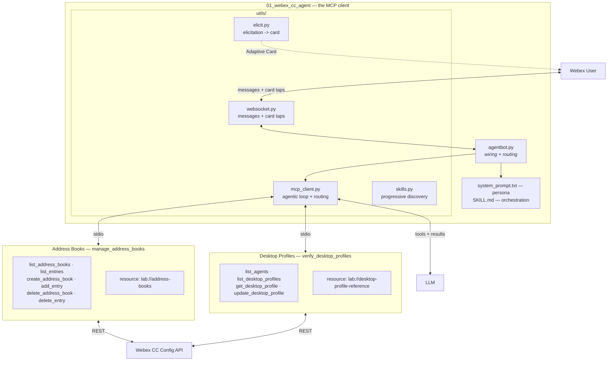
```mermaid
flowchart TB
    User["Webex User"]

    subgraph Agent["01_webex_cc_agent — the MCP client"]
        direction TB
        Bot["agentbot.py<br/><i>wiring + routing</i>"]
        Know["system_prompt.txt — persona<br/>SKILL.md — orchestration"]
        subgraph Engine["utils/"]
            direction TB
            MC["mcp_client.py<br/>agentic loop + routing"]
            EL["elicit.py<br/>elicitation -> card"]
            SK["skills.py<br/>progressive discovery"]
            WS["websocket.py<br/>messages + card taps"]
        end
    end

    subgraph S06["Address Books — manage_address_books"]
        direction TB
        T06["list_address_books · list_entries<br/>create_address_book · add_entry<br/>delete_address_book · delete_entry"]
        R06["resource: lab://address-books"]
    end

    subgraph S07["Desktop Profiles — verify_desktop_profiles"]
        direction TB
        T07["list_agents · list_desktop_profiles<br/>get_desktop_profile · update_desktop_profile"]
        R07["resource: lab://desktop-profile-reference"]
    end

    CC["Webex CC Config API"]
    LLM["LLM"]

    User <-->|"messages + card taps"| WS
    WS <--> Bot
    Bot --> Know
    Bot --> MC
    MC <-->|"tools + results"| LLM
    MC <-->|stdio| S06
    MC <-->|stdio| S07
    EL -.->|"Adaptive Card"| User
    S06 <-->|REST| CC
    S07 <-->|REST| CC
```

### Step 8.1.8: This folder is a template


To build a new agent, you don't start from scratch — you copy this folder and swap three things:

```
copy 01_webex_cc_agent/  ->  0N_new_agent/
    swap  system_prompt.txt   (new persona)
    swap  skills/             (new runbook)
    swap  mcp_servers/ + _configs in agentbot.py   (new servers)
    keep  utils/                                   (the engine — unchanged)
```

That is exactly how the next two use cases are set up.

### Exercises

#### Exercise 1 — a report-only persona

Change the Contact Center agent so it *diagnoses but never writes* — it should explain what to fix, but not call `update_desktop_profile`.

??? Solution
    Edit `system_prompt.txt` to add a rule: "You are read-only. Never call write tools such as `update_desktop_profile`. Instead, report the exact change an admin should make." The skill still guides the diagnosis; the persona stops the write.

#### Exercise 2 — handle an empty address book

What happens when the agent's profile points to an address book that exists but has zero entries? Update the skill so it explicitly reports this case instead of proceeding to fix the assignment.

??? Solution
    In `SKILL.md`, expand the compare step (step 6): after "Match — the book is assigned correctly", add: "If the book is empty (step 5 returned zero entries), report that the assignment is correct but the book has no contacts — the fix is to add entries with `add_entry`, not to change the profile." The skill already lists this edge case, but making the step explicit prevents the model from offering to reassign the profile when the real problem is missing contacts.

---

## Section 2 — Webex Calling & Control Hub Agent

The Contact Center agent *fixed* a misconfiguration. This second use case does something you will reach for far more often in practice: it **reports and investigates**. An administrator asks *"show me this user's calls"* — or *"did any of them fail, and why?"* — and the agent pulls the evidence, reports what happened, and, when a call did not succeed, explains the cause.

This is a deliberate contrast. The engine is identical. What changes is the MCP servers used, an investigation skill instead of a fix skill, and a persona that reads freely but gates every write.

!!! Tip "Same engine, different agent"
    You are not writing an agentic loop, an MCP client, or a WebSocket again.
    
    This section is about **wiring** — which is the whole point of the template.

### Scenario

Most of the time an admin just wants to see what happened: *"show me this user's recent calls."* Every call the org makes is already recorded as a **CDR** (Call Detail Record) — who called whom, how long, and the `outcome`. The agent pulls those records and reports them. And because a failed call carries an `outcome` and an `outcomeReason` in that same data, the agent can also flag the ones that did not succeed and explain why — without you having to *stage* a broken call.

### Architecture

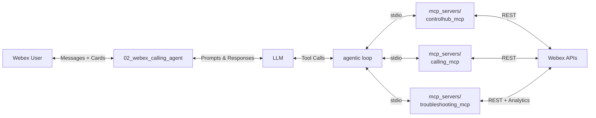
```mermaid
flowchart LR
    User[Webex User] <-->|Messages + Cards| Bot[02_webex_calling_agent]
    Bot <-->|Prompts & Responses| LLM[LLM]
    LLM <-->|Tool Calls| Loop[agentic loop]
    Loop <-->|stdio| CH["mcp_servers/<br/>controlhub_mcp"]
    Loop <-->|stdio| CA["mcp_servers/<br/>calling_mcp"]
    Loop <-->|stdio| TR["mcp_servers/<br/>troubleshooting_mcp"]
    CH <-->|REST| API[Webex APIs]
    CA <-->|REST| API
    TR <-->|REST + Analytics| API
```

### Step 8.2.1: MCP servers

This agent connects to three MCP servers — all of them ones you already built in previous labs.

| Server | Tools it exposes | Role here |
| --- | --- | --- |
| `controlhub_mcp.py` | `list_people`, `list_licenses`, `list_roles`, `list_workspaces`, `create_workspace`, `delete_workspace` | Who the user is and what they are entitled to |
| `calling_mcp.py` | `list_numbers`, `list_locations`, `get_location_call_settings`, `list_devices`, `list_dial_plans`, `create_location`, `delete_device`, `get_call_forwarding`, `update_call_forwarding`, `list_blocked_numbers`, `block_number`, `unblock_number`, `get_calling_permissions`, `block_toll_free`, `unblock_toll_free` | How the user is provisioned to call |
| `troubleshooting_mcp.py` | `unresolved_incidents`, `get_detailed_call_history` (CDRs), `audit events`, `reports`, `meeting quality` | Platform health and the call evidence |

!!! Note "Rule out an outage — only when something failed"
    When a call actually failed, the `investigate-calls` skill rules out a known Webex incident (`unresolved_incidents`) before blaming a user's configuration — the same guardrail as the Contact Center agent. Plain listing and reporting requests skip the incident check entirely; it only runs when there is a problem to explain.

### Step 8.2.2: Read freely, write with approval

Section 1 taught elicitation with a single write (`update_desktop_profile`). This agent keeps that lesson but frames it as a rule for the whole domain:

- **Investigation is always safe.** Listing people, licenses, numbers and devices, and pulling CDRs, changes nothing — the agent does it without asking.
- **Management is gated.** The write tools here (`create_workspace`, `delete_workspace`, `create_location`, `delete_device`, `update_call_forwarding`, `block_number`, `unblock_number`, `block_toll_free`, `unblock_toll_free`) change the organization. The `delete_*` tools, `update_call_forwarding`, `block_number`, `unblock_number`, `block_toll_free`, and `unblock_toll_free` elicit, so the server posts an Adaptive Card and waits for **Confirm**.

The persona (`system_prompt.txt`) states this split explicitly, so the model never "fixes" something it was only asked to investigate.

### Step 8.2.3: The investigation skill

The `investigate-calls` skill tells the agent how to pull call records, report them, and — when a call did not succeed — correlate the user's provisioning to explain why. Both files that shape this agent are shown below.

??? Tip "system_prompt.txt"
    ```
    You are a Webex Calling and Control Hub troubleshooting assistant reachable
    from Webex. You help administrators investigate users, licenses, phone
    numbers, devices, locations, and call history, and you can make a small number
    of Control Hub changes when asked. Be concise and accurate.

    Working principles:
    - Investigate with the tools. Never guess at IDs, licenses, numbers, or call
    outcomes — always look them up with a tool first, then reason over the
    results the tool returned.
    - Identify who a request is about first. In this organization people are named
    "Pod 0", "Pod 1", and so on, so a subject like "Pod N" is a user — never a
    location, site, or device. Resolve a named person (a "Pod N", a display name,
    or an email) with `list_people`, and a phone number with `list_numbers`. Don't
    ask whether a named subject is a user, location, or device — look it up. Ask
    only when the request names no subject at all.
    - Only check platform status (incidents) when the user reports something wrong
    that is happening now — a call failing right now, or a service currently down
    or slow. `unresolved_incidents` lists only currently-open outages, so it can
    never explain a failure from the past; never blame a current incident for a
    past-dated call. Even for a live problem, cite an incident only when it
    affects the same service involved (for example, Webex Calling) and its
    timeframe overlaps the failure — an unrelated service's incident (for example,
    Contact Center) is not your cause. Plain listing or reporting requests never
    need an incident check.
    - When asked to list or report data, answer it fully in one reply: cover every
    matching record — never resolve just one and then ask whether to do the rest.
    Keep each entry concise (don't dump every field); completeness comes first,
    brevity second.
    - Know what you can and cannot do, and only offer what you can. Your connected
    servers let you look up and report on people, licenses, and workspaces; on
    calling provisioning and routing; and on call history, incidents, audit
    events, and reports — plus the specific changes those servers expose, each
    behind a confirmation card. You reply only as chat text: you cannot place or
    test calls, read trunk/PSTN configuration, or attach, upload, export, or
    download files. Never offer a capability your tools don't provide, and only
    propose a next step you can actually perform.
    - Present readable names, not raw IDs. When a record references another object
    by ID, resolve it to its name before showing the result. For user licenses,
    this means calling `list_licenses` to map the IDs found on the user to their
    human-readable names.
    - Read before you write. Investigation (listing and pulling data) is always
    safe. A management action that changes the organization must be confirmed.
    Call the tool directly; the server presents a confirmation card and handles
    approval. Do not ask the user to confirm in plain text.
    - When a skill matches the reported problem, load it and follow its steps in
    order.
    - Report results plainly, including any errors the tools return.
    - When something failed, keep explanations short and evidence-based; do not
    pad with a generic checklist of possibilities.
    - If a request is genuinely ambiguous, ask one brief clarifying question.

    Domain facts (what a CDR outcome means, which analytics need user context)
    come from the connected servers' resources — read them before acting.
    ```

    ??? Note "Why the persona names the 'Pod' convention"

        This query exposed a strong model bias:

        * **The problem:** The agent assumed "Pod 0" was a location (since "pod" is a networking term) and refused to look up user licenses.
        * **The failed fix:** A generic rule saying *"treat named subjects as users"* didn't work. The model kept second-guessing the word "Pod".
        * **The working fix:** Stating the exact fact in the persona: *"in this organization people are named Pod 0"*.

        **The takeaway:** When a model misunderstands your domain's vocabulary, state the facts explicitly instead of relying on general guidance.

??? Tip "SKILL.md"
    ```markdown
    ---
    name: investigate-calls
    description: >-
      Use for any question about a user's or a number's Webex calls — show or
      summarize call history, list who called whom, review recent calls, or look
      into a specific call. Reports the call records (CDRs) plainly, and when a
      call did not succeed it flags that call and explains the likely cause by
      correlating the user's license, phone number, and device. Also answers
      "can this user make calls at all?".
    ---

    # Investigate Calls

    You are asked about a user's or a number's calls. Pull the actual call
    records first, report what you find, and only dig into causes if something
    did not succeed — you do not need a failed call to be useful. Most requests
    are simply "show me what happened".

    ## Tools you use

    - `get_detailed_call_history` (troubleshooting server) — the call records
      (CDRs) for a recent window.
    - `unresolved_incidents` (troubleshooting server) — is there a live outage?
    - `list_people`, `list_licenses` (control-hub server) — who the user is and
      what they are entitled to. Licenses appear on a person as IDs; join them to
      `list_licenses` (`id` -> `name`) and report the names, not the IDs.
    - `list_numbers`, `list_devices` (calling server) — how the user is
      provisioned to call.
    - `get_call_forwarding` (calling server) — a user's call forwarding. If their
      inbound calls are not arriving, forwarding may be sending them elsewhere.
    - `list_blocked_numbers` (calling server) — the specific numbers a user is
      blocked from dialing (outgoing-permission digit patterns). If a user cannot
      reach one particular number while other calls work, that number may have a
      BLOCK pattern here.
    - `get_calling_permissions` (calling server) — a user's outgoing permissions by
      call type. If a user cannot reach a whole category of numbers while other
      calls work, check whether that call type is set to BLOCK here.

    ## Steps

    1. Identify the subject — a person (resolve with `list_people`, matching display
       name or email) or a number (`list_numbers`); CDRs also carry a `user` display
       name you can match directly. If a user has multiple addresses, use all of
       them to match their calls. If the request names no subject, summarize all
       calls in the window. The window is either a recent span or a specific past
       date/time.
    2. Pull the records with `get_detailed_call_history`. Call this tool **exactly
       once per user request** — the CDR feed is rate-limited to roughly one request
       per minute, so a second call fails with `429 Too Many Requests`. Your very
       first call to this tool must already carry the right window: resolve the
       subject and work out the window, then make one call. Never call it bare or
       with empty parameters to "see recent calls" first — that reflexive pull wastes
       the single request you get and makes the real query fail.
       - If the user names a specific date or time, that single call MUST pass
         `start_time` and `end_time` (UTC — a date or an ISO 8601 timestamp). Never
         call with empty parameters when a date was requested: an empty call returns
         only the last 12 hours ending now and will miss the requested window
         entirely. The tool fully supports past windows — never claim otherwise.
       - Only if the user just wants recent calls, call with `hours_back` (max 12)
         and no start/end.
       
       Do not fall back to the most recent 12 hours if a past date is requested. The
       window is capped at a 12-hour span and must end at least ~5 minutes in the
       past. Report exactly what the feed returns: the calls, an empty window, or the
       API's error.
    3. Report the calls that match the user or number in question — who called
       whom, when, how long, and the outcome. If the user asks you to summarize,
       provide a summary instead of just listing every call. If you could not
       resolve the named subject, report all calls in the window and say you could
       not narrow to that subject — do not block.
    4. If every call succeeded, say so plainly and stop; there is nothing to fix.
    5. If one or more calls did not succeed, flag them and find out why:
       - `unresolved_incidents` — only relevant when the failure is happening now.
         It lists currently-open outages and cannot explain a past-dated call. Cite
         an incident only if it affects Webex Calling and overlaps the failure's
         time; ignore incidents for other services (for example, Contact Center).
       - `list_people` / `list_licenses` — is the user active and licensed to call?
       - `list_numbers` / `list_devices` — do they own the number and have a
         registered device?
       - `get_call_forwarding` — if inbound calls are not arriving, is forwarding
         sending them elsewhere?
       - `list_blocked_numbers` — if the user cannot dial one specific number (for
         example 1-800-444-4444) while other calls work, check whether that number
         has a BLOCK digit pattern.
       - `get_calling_permissions` — if the user cannot dial a number, check whether
         that calls or call type (e.g. TOLL_FREE) is set to BLOCK.
       Correlate: no license or no number explains a user who cannot call; a call
       rejected for one specific number while others succeed on healthy provisioning
       points at a blocked digit pattern; a whole call type failing (e.g. all
       toll-free) points at a blocked call-type permission; a routing `outcomeReason`
       on otherwise healthy provisioning points at dial plans or the destination, not
       the user.
    6. For any non-successful call, quote its `outcomeReason` — it is the API's
       own explanation and the single most useful field.

    ## Reporting a diagnosis

    Keep the whole reply short. Name the most likely cause the evidence supports —
    anchored to the specific `outcomeReason` and the pattern you saw, not to a
    coincidental incident whose service or timeframe does not match — then stop
    reasoning. Do not infer a cause the `outcomeReason` does not state, and do not
    assume a fixed cause for a given reason; let the evidence drive it.

    End with one short list of one or two concrete next actions: specific tool calls
    you would run or a clear recommendation, never a conditional hedge ("if you have
    a dial plan id", "if possible", "may require permissions"). Give a single such
    list — not separate "what I can check", "what I can do", and "suggested next
    steps" sections. Do not re-list the calls you already showed, do not pad with a
    long list of possibilities, and skip incidental tool errors that are not the
    cause.
    ```

The skill reports first and diagnoses second. Its steps, in short:

| Step | Tool | Owned by |
| --- | --- | --- |
| Pull the call records | `get_detailed_call_history` | troubleshooting server |
| Report the matching calls | *(reasoning over CDR fields)* | — |
| Rule out an outage (if a call failed) | `unresolved_incidents` | troubleshooting server |
| Is the user active / licensed? | `list_people`, `list_licenses` | control-hub server |
| Does the user own the number / a device? | `list_numbers`, `list_devices` | calling server |
| Explain the cause | *(reasoning)* | — |

When a call did not succeed, the skill joins its `user` and `callingNumber` to `list_people` and `list_numbers` to tell a *provisioning* problem (no license, no number) from a *routing* problem (healthy provisioning, but a routing `outcomeReason`).

### Step 8.2.4: Run the agent

1. Change into the folder and run it:

    - cd ../02_webex_calling_agent
    - python agentbot.py

2. Confirm all three servers connect — you should see three "MCP ready" lines and both skills discovered:

    ```terminal
    webex-control-hub-complex running on stdio - waiting for a client (Ctrl+C to stop).
    MCP ready — 6 tool(s), 0 chars of resource text, 0 prompt(s), elicitation=auto-accept
    webex-calling-complex running on stdio - waiting for a client (Ctrl+C to stop).
    MCP ready — 15 tool(s), 0 chars of resource text, 0 prompt(s), elicitation=auto-accept
    webex-troubleshooting-complex running on stdio - waiting for a client (Ctrl+C to stop).
    MCP ready — 10 tool(s), 0 chars of resource text, 0 prompt(s), elicitation=auto-accept
    Skills: 2 — ['investigate-calls', 'troubleshoot-status']
    Listening as webexone-...@webex.bot via Webex Websockets (messages + cards)... (Ctrl+C to stop)
    WebSocket connected — listening for messages and cards
    ```

3. In the Webex space, start with plain reporting:

    - What calling licenses does Pod 0 have?

        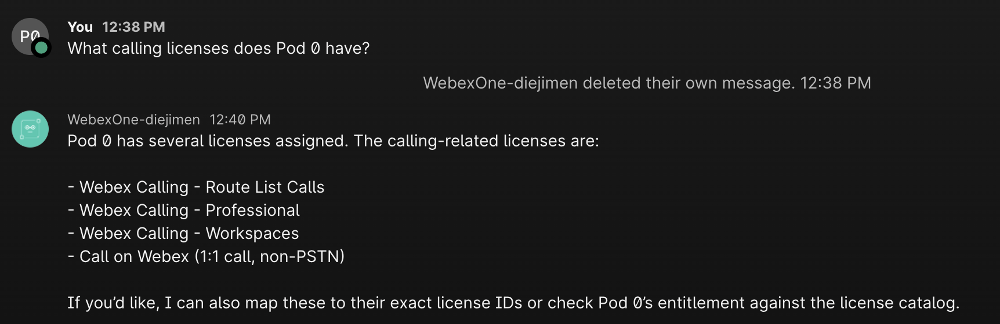{ width="750" style="display: block; margin: 0 auto; border: 1px solid lightgray; border-radius: 8px;" }

        The agent looks the user up, resolves each license ID to its readable name, and answers directly with that user's calling licenses — no incident check, since nothing was reported as broken.

    - Show me the call history for Pod 0

        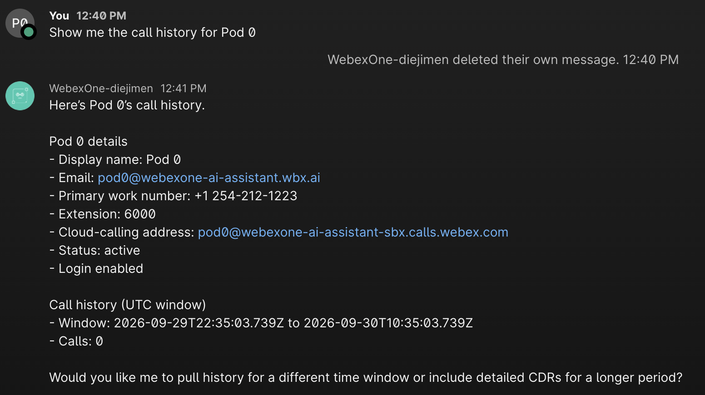{ width="750" style="display: block; margin: 0 auto; border: 1px solid lightgray; border-radius: 8px;" }

        By default this returns the **last 12 hours**, so a quiet window can come back empty. To look further back, name a window and the agent passes it straight through to the CDR feed — for example *"Show me the call history on 2026-09-24 between 05:00 and 08:30 UTC"*. Webex caps any single request at a 12-hour span and needs the end to be at least ~5 minutes in the past, and CDRs older than the feed's retention are simply gone.

        !!! Warning
            This call is limited to 1 per minute. If you try many consecutives calls the agent will get a 429 Too Many Request error.

    - Show me the call history for Pod 0 on 2026-09-24 between 05:00 and 08:30 UTC

        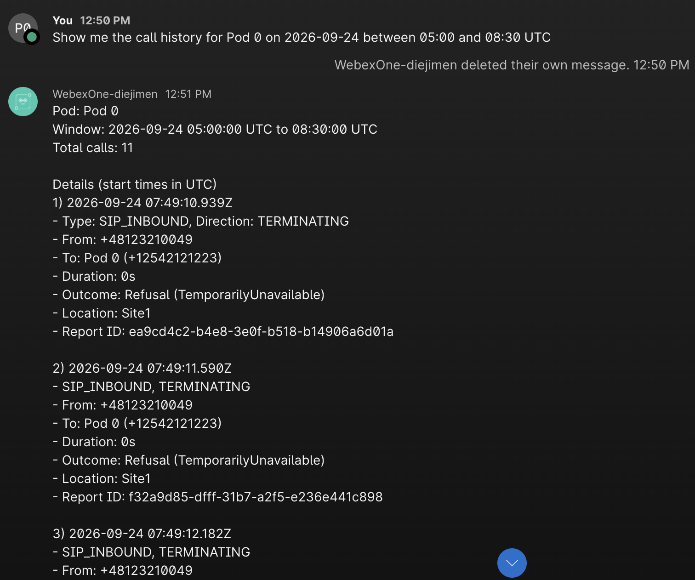{ width="750" style="display: block; margin: 0 auto; border: 1px solid lightgray; border-radius: 8px;" }

4. Now let the skill drive a deeper look:

    - Summarize Pod 0's calls on 2026-09-24 between 05:00 and 08:30 UTC and flag anything that did not connect

        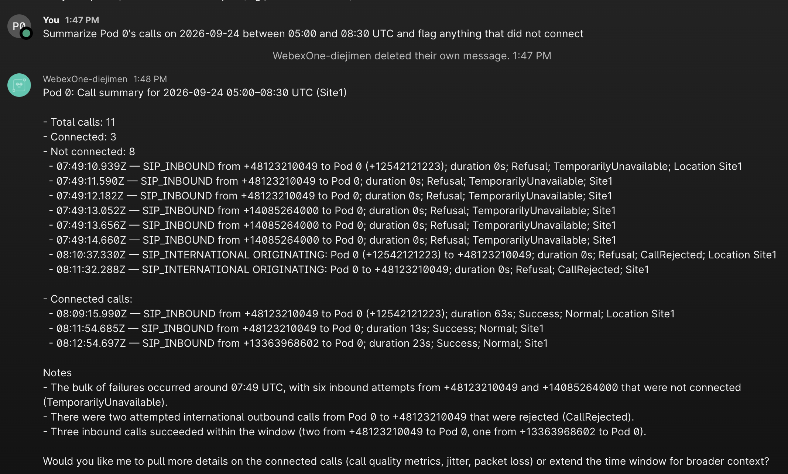{ width="750" style="display: block; margin: 0 auto; border: 1px solid lightgray; border-radius: 8px;" }
    
    - Did Pod 0 have any failed calls, and if so why?

        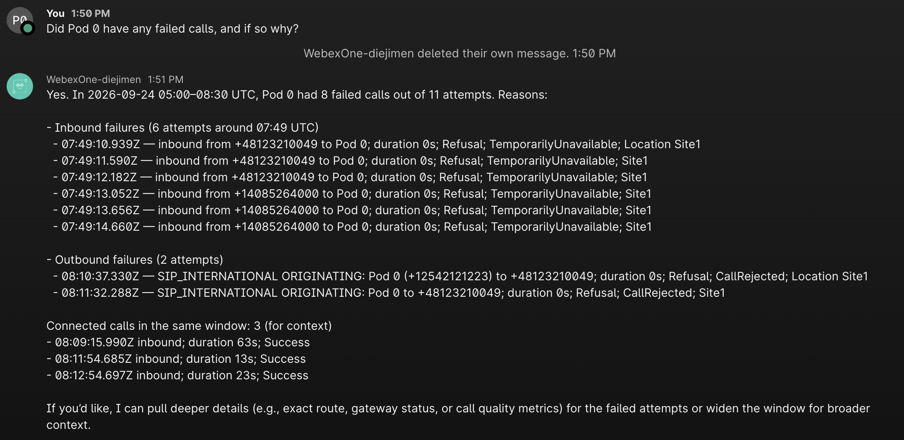{ width="750" style="display: block; margin: 0 auto; border: 1px solid lightgray; border-radius: 8px;" }    

    The agent pulls the CDRs and reports them. If a call did not succeed, it flags those and correlates each with the user's license, number, and device to explain the likely cause — quoting the `outcomeReason` back to you. If every call succeeded, it simply says so.

    - Investigate possible causes

        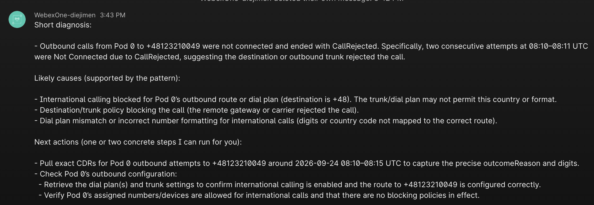{ width="750" style="display: block; margin: 0 auto; border: 1px solid lightgray; border-radius: 8px;" } 
    
### Exercise

This is the full loop the agent was built for: you make a configuration change that breaks a real call, let the call fail, ask the agent to investigate, and then have the agent put the configuration back. It exercises **both** sides of this section — a gated write and a real investigation — on one live call you place yourself.

The target is **1-800-444-4444**, a free, always-on toll-free test number that reads your caller ID back to you. You block it for a single user without touching anything else, and the agent offers two ways to do it:

- **Block the exact number** (`block_number` / `unblock_number`) — adds a per-user **outgoing-permission digit pattern** for that exact number with action `BLOCK`, so only calls to 1-800-444-4444 fail while every other call keeps working.
- **Block the whole toll-free call type** (`block_toll_free` / `unblock_toll_free`) — sets the user's **outgoing-permission call type** `TOLL_FREE` to `BLOCK`, so every toll-free call fails while other calls keep working.

Either mechanism breaks the call to 1-800-444-4444; the steps below use the exact-number block, but you can swap in the toll-free call-type block the same way. Use your own Webex user so you can place the call and hear the result yourself.

1. From your Webex app or desk phone, dial **1-800-444-4444**. It should connect and read your number back:

    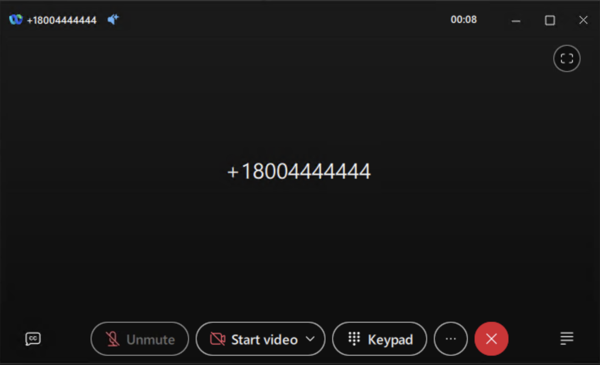{ width="500" style="display: block; margin: 0 auto; border: 1px solid lightgray; border-radius: 8px;" } 

2. Ask the agent to block toll-free calling for your user:

    - Block toll-free (1-800) calls for Pod 0

        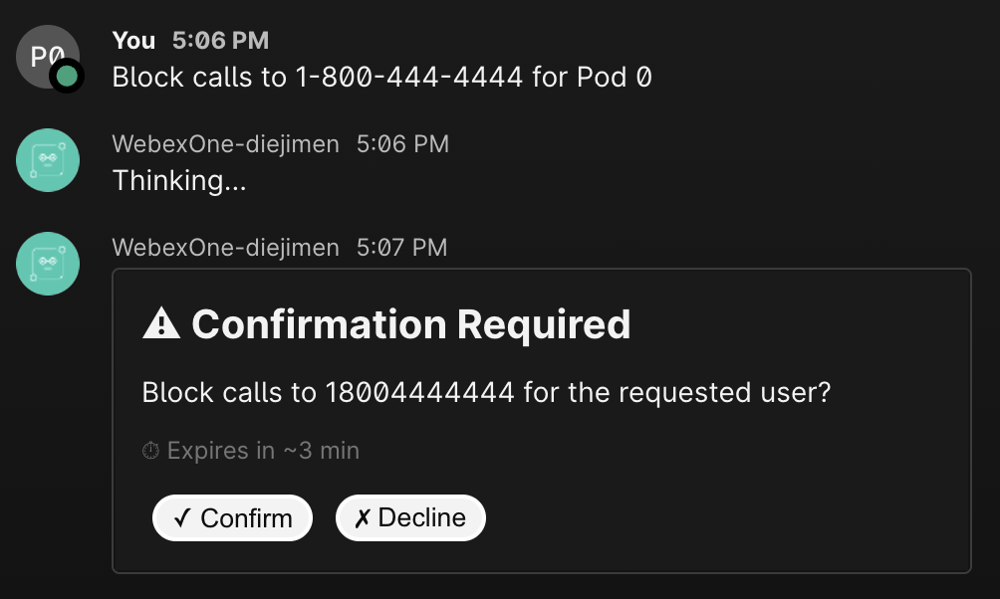{ width="500" style="display: block; margin: 0 auto; border: 1px solid lightgray; border-radius: 8px;" }
        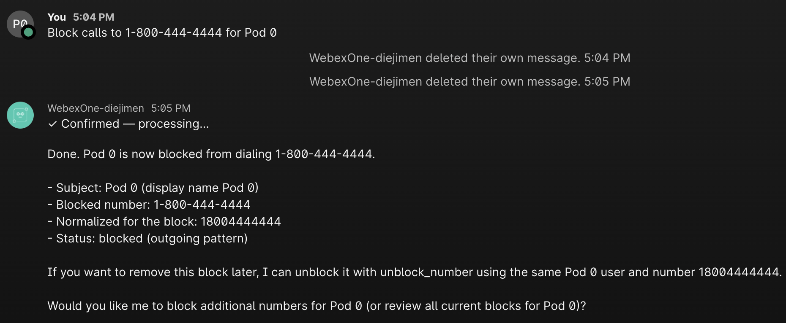{ width="750" style="display: block; margin: 0 auto; border: 1px solid lightgray; border-radius: 8px;" } 

3. Dial **1-800-444-4444** again. This time it is rejected. 

    !!! Warning
        Wait about five minutes so the failed call lands in the CDR feed (which reports calls a few minutes in the past).

4. Ask the agent, as an admin would:

    - Why did Pod 0 call to 1-800-444-4444 fail?

        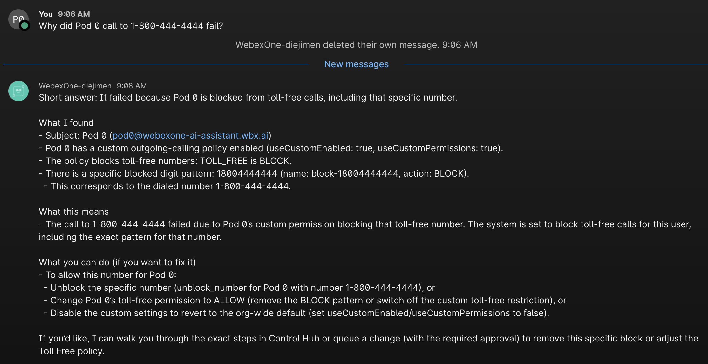{ width="500" style="display: block; margin: 0 auto; border: 1px solid lightgray; border-radius: 8px;" }

    The `investigate-calls` skill pulls your recent CDRs, flags the failed toll-free call and quotes its `outcomeReason`, confirms your license, number, and device are healthy, then reads `get_outgoing_permission` and finds `TOLL_FREE` set to `BLOCK` — the cause. It reports that in a short diagnosis and recommends allowing toll-free again.

5. Have the agent undo the change:

    - Allow toll-free calls for Pod 0

        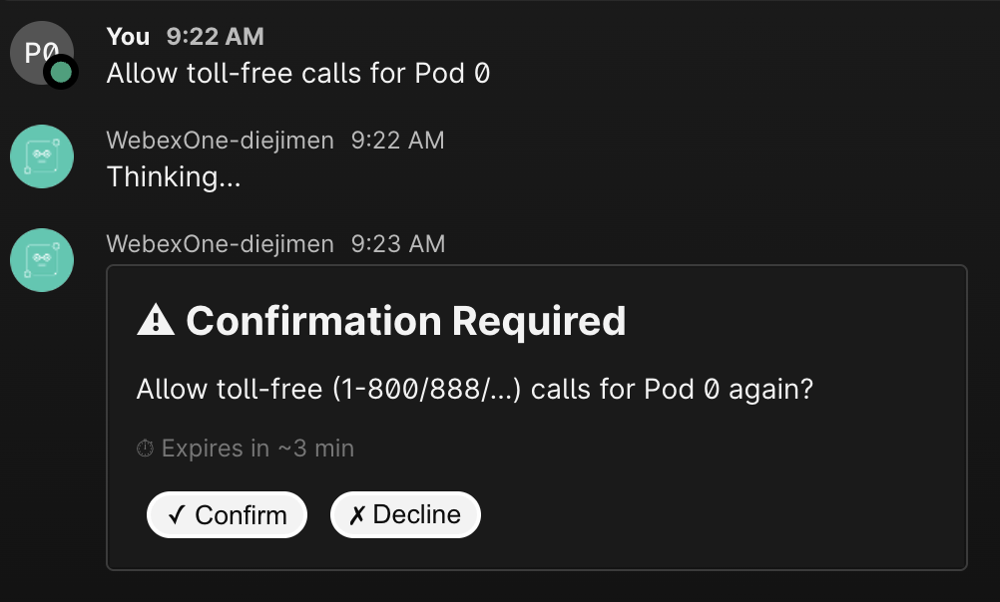{ width="500" style="display: block; margin: 0 auto; border: 1px solid lightgray; border-radius: 8px;" }
        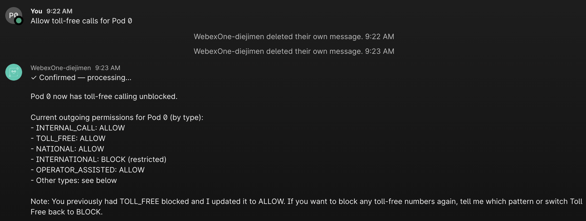{ width="500" style="display: block; margin: 0 auto; border: 1px solid lightgray; border-radius: 8px;" }

6. Dial **1-800-444-4444** once more. It connects again, and the tenant is exactly as you found it.

---

## Section 3 — Webex Meeting Quality Agent

The first two agents answered *"is it configured correctly?"* This third one answers a different kind of question: *"how did that meeting look and sound?"* An administrator or host names a meeting, and the agent pulls its **quality analytics** and reports — per participant — how the audio and video held up. When the numbers show trouble, it explains what degraded and who was affected.

### Scenario

You usually just want to see how a meeting went — *"pull the quality for yesterday's all-hands."* Webex recorded per-participant quality metrics while it happened, so the agent finds the meeting and reports those metrics. If someone does complain it was *"choppy for half the room,"* the same data tells you whether one person's network was bad or the whole meeting degraded — with no need to reproduce it.

### Architecture

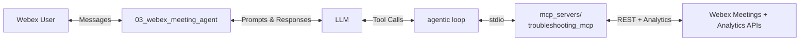
```mermaid
flowchart LR
    User[Webex User] <-->|Messages| Bot[03_webex_meeting_agent]
    Bot <-->|Prompts & Responses| LLM[LLM]
    LLM <-->|Tool Calls| Loop[agentic loop]
    Loop <-->|stdio| TR["mcp_servers/<br/>troubleshooting_mcp"]
    TR <-->|REST + Analytics| API[Webex Meetings + Analytics APIs]
```

### Step 8.3.1: One server, two tools

This agent connects to a single MCP server — a copy of the general `troubleshooting_mcp.py`. Of everything that server exposes, the skill uses two tools:

| Tool | What it does |
| --- | --- |
| `list_ended_meetings` | Meetings that already ended, each with an `id`, title, and start/end; scope to one person with `host_email` |
| `get_meeting_qualities` | Per-participant audio/video quality analytics for one meeting id |
| `list_meeting_participants` | Who attended an ended meeting, with each participant's join/leave times and audio device |

!!! Tip "The server is general; the agent is specific"
    You are not building a meeting-only server. You reuse the same troubleshooting server as Section 2 and let the **persona** and **skill** narrow the model's attention to meetings. That is the cheapest way to make a focused agent out of a broad toolbox.

### Step 8.3.2: Report, then analyze

The `meeting-quality` skill (`skills/meeting-quality/SKILL.md`) is the whole point of this agent: it pulls a meeting's per-participant quality and reports it, then — when the metrics show trouble — separates one participant's bad network from a meeting-wide fault. Both files that shape this agent are shown below.

??? Tip "system_prompt.txt"
    ```text
    You are a Webex Meeting quality assistant reachable from Webex. You help
    administrators and hosts review and report meeting quality — pulling a
    meeting's per-participant audio and video analytics, reporting how it looked
    and sounded, and, when media was poor, explaining what degraded and to whom.
    Be concise and accurate.

    Working principles:
    - Investigate with the tools. Never guess at meeting IDs, participants, or
      quality numbers — list the meetings first, then pull the quality data for
      the specific meeting, then reason over what the tool returned.
    - Match the depth to the request. If the user only asks to list or find
      meetings, just list them and stop — do not pull quality data unasked. Only
      when they ask how a meeting went (quality, audio/video, who was affected)
      should you pull the quality data.
    - Be brief. Lead with a one- or two-line verdict — healthy, or who had trouble.
      Only quote metrics for a participant whose media was actually poor, and only
      the two or three numbers that prove it. Do not print a full metrics table for
      participants who were fine.
    - Read the raw numbers correctly. A value of -1 means "not measured", never
      zero — never report it as "no video", "no frames", or an outage. A metric
      belongs only to the participant whose record it came from; never carry one
      person's latency or jitter onto another. Judge quality mainly on packet loss
      and latency/jitter; low frame rate on a short or low-motion call is normal. No
      packet loss, sub-100 ms latency and single-digit jitter is healthy.
    - Identify the pattern. If one participant is bad while everyone else is fine,
      it is likely that participant's network or device. If everyone degrades at
      the same time, it points at the meeting or a wider issue.
    - This agent is read-only. You review and explain quality; you do not change
      any configuration.
    - Report results plainly, including any errors the tools return. A 403 usually
      means the token lacks the scope or user context the analytics API requires;
      an empty result may just mean the time window held no ended meetings.
    - If the request is ambiguous — which meeting, which day, whose meetings — ask
      one brief clarifying question.

    When the meeting-quality skill matches the request, load it and follow its
    steps in order.
    ```

??? Tip "SKILL.md"
    ```markdown
    ---
    name: meeting-quality
    description: >-
      Use for any question about a Webex meeting's audio/video quality — show or
      review a meeting's quality, report how a meeting looked and sounded, check
      which recent meetings had issues, or explain why a meeting was choppy. Pulls
      the per-participant quality analytics and reports them, and when media was
      poor it flags the affected participants and explains whether it was one
      person's network or a meeting-wide problem.
    ---

    # Meeting Quality

    You are asked about a meeting's quality. Find the meeting, pull its
    per-participant quality data, and report it. You do not need a complaint to be
    useful — most requests are simply "show me how this meeting went". Add the
    analysis only when the numbers show a problem.

    ## Tools you use

    - `list_ended_meetings` (troubleshooting server) — meetings that already
      ended, each with an `id`, title, and start/end. When the request names a
      specific user, pass their email as `host_email` to scope the list to that
      person's meetings rather than the whole org.
    - `get_meeting_qualities` (troubleshooting server) — per-participant
      audio/video metrics for one meeting id.
    - `list_meeting_participants` (troubleshooting server) — who attended an ended
      meeting, with each participant's join/leave times and audio device. Use the
      same `meeting_id` as `get_meeting_qualities`.

    ## Steps

    1. Clarify scope only if it is missing: which meeting (title/host) or which
       window to review, and whether the whole meeting or one participant.
    2. Call `list_ended_meetings` for the window and pick the meeting(s) that
       match. When the request is about a specific user, pass their email as
       `host_email` so you only pull that person's meetings, not the whole org.
       Note each `id`. **If the user only asked to list or find meetings, stop here
       and report the list — do not pull quality data unasked.**
    3. Only when the request is about how a meeting went (quality, audio/video, who
       was affected): for each meeting, call `get_meeting_qualities` with
       `meeting_id` set to the `id` from step 2.
    4. Lead with a one- or two-line verdict for the meeting: healthy, or which
       participant(s) had trouble on audio or video. Keep it short — do not print a
       metrics table for everyone.
    5. If everyone's media was fine, say so in a sentence and stop; any complaint is
       likely about content or scheduling, not the network. Do not list per-metric
       numbers for healthy participants.
    6. Only for a participant whose media was actually poor: name them and quote the
       two or three numbers that prove it (the high jitter, the frame-rate collapse,
       the loss), then read the pattern:
       - One participant bad, the rest fine → that participant's network or device.
       - Everyone degrades together, especially at the same time → a meeting-wide
         or network-path problem, not an individual.
    7. When the request is about *who* attended, or you need to tie a quality dip to
       a specific person, call `list_meeting_participants` with the same `meeting_id`
       and line the join/leave timeline up against the metrics.

    ## What "poor" means

    For each participant and media type (audio, video), treat it as poor when, for
    a sustained period: packet loss is high (well above a fraction of a percent),
    latency / round-trip time is high enough to disrupt conversation (hundreds of
    ms), jitter is high (the usual cause of choppy audio), or video
    resolution/bitrate collapses. Quote the numbers you found — they are the
    evidence.

    Judge "poor" mainly on **packet loss and latency/jitter**. A low video frame
    rate on a short or low-motion call (a 1:1, a static screen) is normal — do not
    flag it as a problem on its own.

    ### Reading the raw values — do this before you judge anything

    - **`-1` means "not measured", not zero.** It is a sentinel for a missing
      sample. Never read `-1` as "no video", "no frames", or "no audio", and never
      report it as a failure. If a stream is all `-1`, that metric simply was not
      captured for that participant — say nothing was recorded, do not infer an
      outage. The same goes for empty streams.
    - **A participant can send fine while inbound is unmeasured.** If `videoIn` is
      all `-1` but `videoOut` shows real frame rates and bitrate, that person's
      video was working — only the inbound measurement is missing.
    - **Attribute every number to the right person.** A latency or jitter value
      belongs only to the participant whose record it came from. Never carry one
      participant's number over to another.
    - **Values are usually `[start, end]` pairs.** A bitrate or frame rate dropping
      to 0/`-1` at the very end often just means that person left before the meeting
      ended — not a failure.
    - **No packet loss + sub-100 ms latency + single-digit jitter = healthy**, even
      if frame rates are low or many fields are `-1`.

    `list_ended_meetings` gives the `id`; pass it as `meeting_id` to
    `get_meeting_qualities`, which returns the per-participant items.

    ## Edge cases

    - **No ended meetings in the window** — offer to widen `days_back`; do not
      report "healthy".
    - **Meeting found but no quality data** — very short meetings, or data not yet
      processed. Say so rather than inventing metrics.
    - **403 from the qualities API** — the token lacks the scope or user context
      the analytics API requires; report it as a permission problem.

    ## Guardrails

    - Read-only — this agent reviews and reports; it never changes config.
    - Only use a `meeting_id` returned by `list_ended_meetings`; never guess one.
    - Every "poor" flag must cite the metric and value from the tool result;
      never invent participants or numbers.
    - `-1` is "not measured", never a measurement. Do not turn it into "no video",
      "no frames", or an outage, and do not score it as poor.
    ```

The skill's steps, in short:

| Step | Tool | Owned by |
| --- | --- | --- |
| Find the meeting(s), optionally scoped to one host | `list_ended_meetings` | troubleshooting server |
| Pull the quality data | `get_meeting_qualities` | troubleshooting server |
| See who attended and when | `list_meeting_participants` | troubleshooting server |
| Report quality per participant | *(reasoning over metrics)* | — |
| Flag poor audio/video (if any) | *(reasoning)* | — |
| One bad participant vs. meeting-wide | *(reasoning)* | — |

The skill defines what "poor" means (packet loss, latency, jitter, collapsed video) and insists the agent quote the actual numbers as evidence.

### Step 8.3.3: Run the agent

1. Change into the folder and run it:

    - cd ../03_webex_meeting_agent
    - python agentbot.py

2. Confirm the server connects and the skill is discovered:

    ```terminal
    webex-troubleshooting-complex running on stdio - waiting for a client (Ctrl+C to stop).
    MCP ready — 11 tool(s), 0 chars of resource text, 0 prompt(s), elicitation=auto-accept
    Skills: 1 — ['meeting-quality']
    Listening as webexone-...@webex.bot via Webex Websockets (messages + cards)... (Ctrl+C to stop)
    WebSocket connected — listening for messages and cards
    ```

3. In the Webex space, start with plain reporting:

    - List the meetings that ended in the last 30 days

        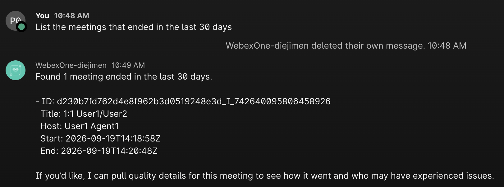{ width="750" style="display: block; margin: 0 auto; border: 1px solid lightgray; border-radius: 8px;" }

    - What meetings did user1@webexone-ai-assistant.wbx.ai host in the last 30 days?

         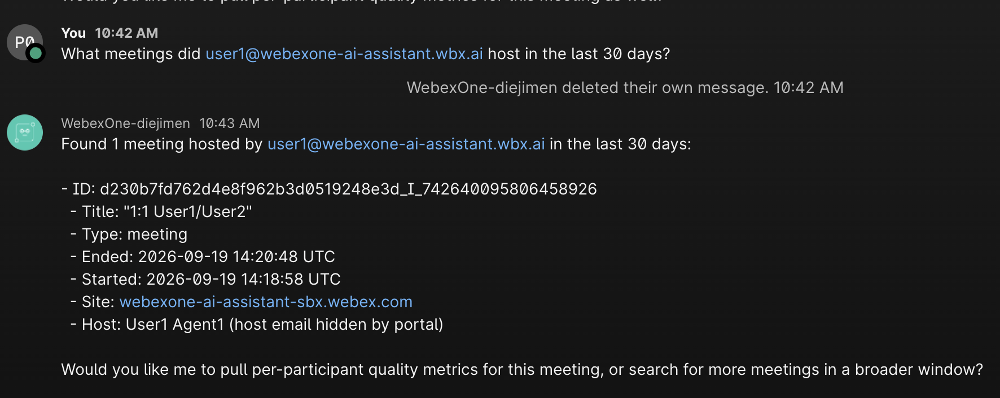{ width="750" style="display: block; margin: 0 auto; border: 1px solid lightgray; border-radius: 8px;" }

4. Review how that meeting went:

    * How did "1:1 User1/User2" look and sound — any audio or video problems, and who was affected?

         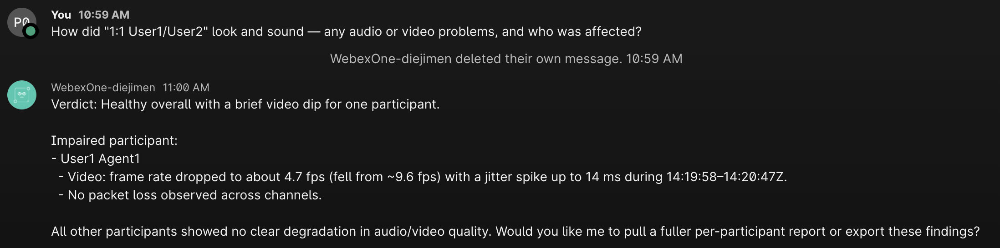{ width="750" style="display: block; margin: 0 auto; border: 1px solid lightgray; border-radius: 8px;" }

    The agent pulls `get_meeting_qualities` and reports the per-participant audio
    and video with the actual numbers. If a participant's media was poor, it
    flags them, decides whether it is one person or the whole meeting, and leads
    with the worst-affected. If everyone was fine, it says so.

5. Tie the numbers to the room — who was there and when:

    * Who attended "1:1 User1/User2", and when did each person join and leave?

         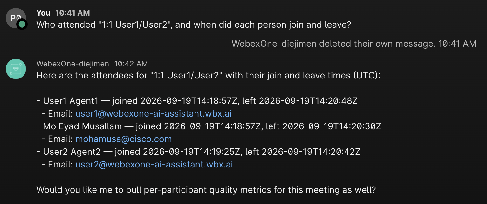{ width="750" style="display: block; margin: 0 auto; border: 1px solid lightgray; border-radius: 8px;" }

    Here the agent calls `list_meeting_participants` for the join/leave timeline
    and lines it up against the quality it just read — so a dip at a given minute
    can be pinned to who was actually in the meeting then. Everything stays
    read-only: no confirmation card, nothing changed.
