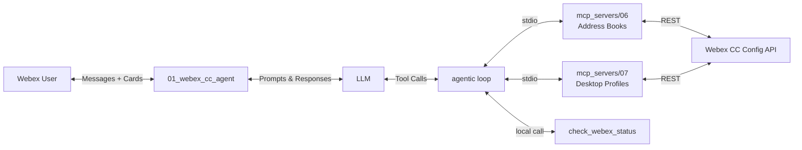
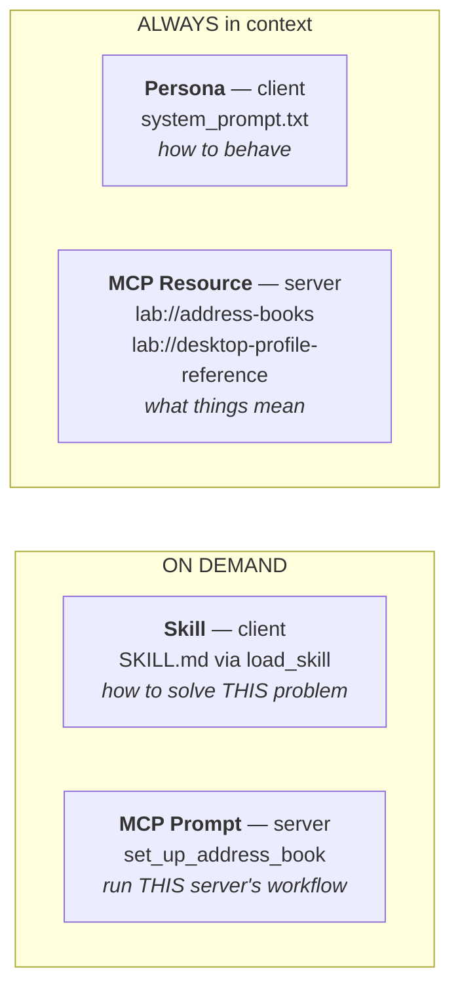
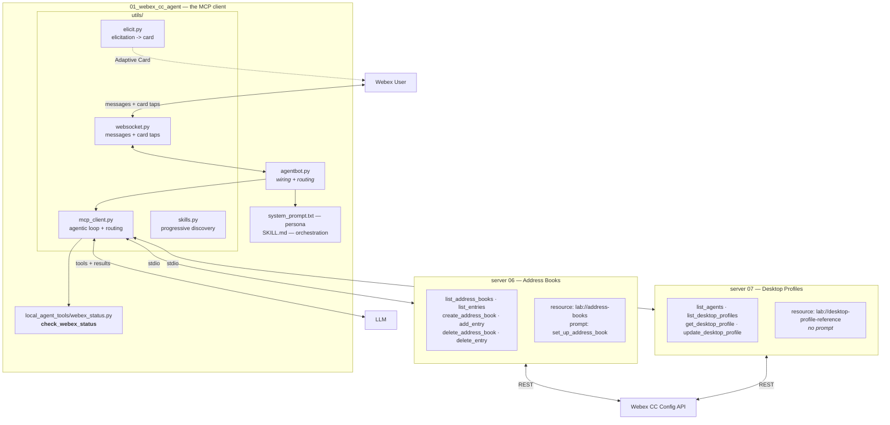

# Lab 8 - Use Cases

You have built a **Webex bot** (Lab 5), an **MCP client and hub** (Lab 6), a **skill loader**
(Lab 7), and **custom MCP servers** (Lab 4). In this lab you compose those modules into a
real troubleshooting use case for **Webex Contact Center address books**.

This is a capstone: you **read and run** a finished agent rather than build one. Nothing here
asks you to write code. What it does ask is that you recognise your own work in it.

In this lab you meet the engine as **complete, self-contained use cases**. Each use case is a single folder that carries *everything* it needs — its own `utils/`, `local_agent_tools/`, `skills/`, `mcp_servers/`, persona, and `agentbot.py`. Open one folder and you see every moving part. Copy the folder and you have a template for the next agent.

This lab has three use cases. We document the **Webex Contact Center agent** in full here; the **Calling** and **Meeting** agents ship as drafts and will be documented later.

```
08_use_cases/
    01_webex_cc_agent/        <-- documented in this lab (fully built)
    02_webex_calling_agent/   <-- draft (coming soon)
    03_webex_meeting_agent/   <-- draft (coming soon)
```

!!! Note "Self-contained by design"
    There is no shared library. Each use-case folder has its **own copy** of the engine. The trade-off — the same `utils/` appears in more than one folder — is deliberate: every use case is a complete, runnable, copy-paste-able example with **no imports from other labs** and nothing to wire up across directories.

---

## Section 1 — Webex Contact Center Agent

The scenario: a Contact Center manager reports that an agent's address book is wrong on their desktop. This agent investigates across two MCP servers, diagnoses the misconfiguration, and — with your approval on an Adaptive Card — fixes it.

### Architecture


```mermaid
flowchart LR
    User[Webex User] <-->|Messages + Cards| Bot[01_webex_cc_agent]
    Bot <-->|Prompts & Responses| LLM[LLM]
    LLM <-->|Tool Calls| Loop[agentic loop]
    Loop <-->|stdio| S06["mcp_servers/06<br/>Address Books"]
    Loop <-->|stdio| S07["mcp_servers/07<br/>Desktop Profiles"]
    S06 <-->|REST| CC[Webex CC Config API]
    S07 <-->|REST| CC
    Loop <-->|local call| Status[check_webex_status]
```


### Step 8.1.1: The two MCP servers

The agent connects to two servers. One you have already built; one is new.

#### Adress Book Server — you already wrote every tool in it

`manage_address_books.py` is not new code. It is the three address-book
servers from Lab 4 merged into one file:


####  Desktop profile Server — the one genuinely new server

`verify_desktop_profiles.py` is the only file here you have not seen before. It
answers one question: *which address book is this agent actually configured to see?*

| Tool | What it does |
| --- | --- |
| `list_agents` | Every agent in the org, each with their `agentProfileId` |
| `list_desktop_profiles` | Every desktop profile in the org |
| `get_desktop_profile` | One profile — crucially, including its `addressBookId` |
| `update_desktop_profile` | Point a profile at a different address book (elicited) |

It also exposes one resource, `lab://desktop-profile-reference`.

??? Note "What the resource says — and what it deliberately does not"
    The resource is a **field glossary**, not a runbook. It explains what a desktop profile is, that each agent is assigned exactly one, and that the profile's `addressBookId` determines which contacts appear on the Agent Desktop.

    It does **not** say "Step 1: do this. Step 2: do that." That is the skill's job, and Step 8.1.2 explains why the split matters.

    | Concern | Where it lives |
    | --- | --- |
    | "What does `addressBookId` mean?" | server resource |
    | "What does the profile API return?" | server tool |
    | "Agent can't see contacts — do X then Y" | client-side skill |

!!! Note "Server 07 ships no prompt — on purpose"
    Server 06 has a prompt. Server 07 has none. The troubleshooting workflow needs tools from *both* servers plus a local one, and a prompt cannot reach outside its own server. So that logic lives in a skill instead. Step 8.1.2 makes the rule general.

### Step 8.1.2: Four places knowledge can live

This agent knows things. That knowledge sits in four different places, and
choosing the right one is the main design decision in the whole folder.

Two questions tell them apart: **who owns it** — the client or the server — and
**when it enters the model's context** — always, or only when needed.


```mermaid
flowchart TB
    subgraph AlwaysLoaded["ALWAYS in context"]
        direction LR
        P["<b>Persona</b> — client<br/>system_prompt.txt<br/><i>how to behave</i>"]
        R["<b>MCP Resource</b> — server<br/>lab://address-books<br/>lab://desktop-profile-reference<br/><i>what things mean</i>"]
    end
    subgraph OnDemand["ON DEMAND"]
        direction LR
        S["<b>Skill</b> — client<br/>SKILL.md via load_skill<br/><i>how to solve THIS problem</i>"]
        M["<b>MCP Prompt</b> — server<br/>set_up_address_book<br/><i>run THIS server's workflow</i>"]
    end
    AlwaysLoaded ~~~ OnDemand
```

The always-loaded row is literally the system prompt, assembled in `agentbot.py`:

```python
SYSTEM_PROMPT = (
    load_persona()                       # client, always — tone + rules
    + skills.catalog_prompt(catalog)     # one line per skill, so the model knows what exists
    + "\n\n"
    + mcp_client.get_resources_text()    # server, always — the domain facts
)
```

Open `system_prompt.txt` and notice what it *omits*. It says "look things up with
a tool, confirm before writing, check status first" — and never explains what an
`addressBookId` is. It does not need to: that fact is sitting in the next cell
over, published by the server that owns the API.

!!! Tip "Design choice — the persona stays domain-light"
    Every domain fact you move out of the persona and into a server resource is a fact the server can update without anyone editing the bot. Swap the servers and the same engine fronts a different domain — which is exactly how the Calling and Meeting agents reuse this folder.

#### Why the troubleshooting workflow is a skill

Look at what the workflow actually touches:

| Step | Tool | Owned by |
| --- | --- | --- |
| Rule out an outage | `check_webex_status` | **local tool** — no server at all |
| Find the agent | `list_agents` | server 07 |
| Read their profile | `get_desktop_profile` | server 07 |
| Find the desired book | `list_address_books` | server 06 |
| Verify it has contacts | `list_entries` | server 06 |
| Compare the two IDs | *(reasoning — no tool)* | — |
| Fix, with approval | `update_desktop_profile` | server 07 |

Three sources, plus a reasoning step that belongs to no one. Now read that back
against the grid: a resource describes one server's data and cannot sequence
anything. A prompt can sequence, but only over its own server's tools. The
persona is always loaded, so putting a seven-step runbook there would spend the
context budget on every "what time is it?" message.

Only the client-owned, on-demand cell can reference server 06, server 07, and a
local function in one flow — and load itself only when the problem matches. That
is the skill.

!!! Note "MCP provides the tools; the skill provides the judgment"
    This is not an argument against prompts. `set_up_address_book` is a good prompt precisely because it stays inside server 06. The rule is about *reach*: pick the narrowest container that can see everything the job needs.

??? Note "The fourth cell is live too — the model can call the prompt"
    `agentbot.py` registers every connected server's prompts as meta-tools:

    ```python
    extra_tools = [...] + mcp_client.get_prompt_tools()
    dispatch = {..., **mcp_client.get_prompt_dispatch()}
    ```

### Step 8.1.3: Inside the engine

You can run this agent without reading this step. Open it when you want to know
*how* the folder works rather than *what* it does.

#### The agentic loop

Everything else plugs into one function in `utils/mcp_client.py`.

??? Tip "Python Code" 

    def agentic_loop(messages, model, max_iter=10,
                 extra_tools=None, dispatch=None):
    all_tools = list(_tools) + (extra_tools or [])
    msgs = list(messages)
    if _resources_text:
        msgs.insert(0, {"role": "system", "content": _resources_text})
    for _ in range(max_iter):
        resp = _openai.chat.completions.create(
            model=model, messages=msgs, tools=all_tools or None,
        )
        choice = resp.choices[0]
        if not choice.message.tool_calls:
            return choice.message.content or ""   # done — text reply
        msgs.append(choice.message.model_dump())
        for tc in choice.message.tool_calls:
            args = json.loads(tc.function.arguments) if tc.function.arguments else {}
            if dispatch and tc.function.name in dispatch:
                result = dispatch[tc.function.name](args)
            else:
                result = call_tool(tc.function.name, args)
            msgs.append({"role": "tool", "tool_call_id": tc.id,
                         "content": result})

Read it as five steps:

1. Send the conversation to the LLM along with every available tool.
2. If the LLM replies with text, return it — done.
3. If it replies with tool calls, execute each one.
4. Append the results to the conversation and go back to step 1.
5. After `max_iter` rounds, stop.

The `dispatch` dictionary is what makes it flexible. MCP tools, the local status
check, `load_skill`, and the prompt meta-tools all sit in one flat namespace.
The loop never asks where a tool came from — it just calls it.

!!! Tip "The conversation is the memory"
    The loop keeps no state of its own. Every tool call and every result is appended to `msgs`, so when the next round is sent the model sees its own history. That is why step 4 exists — drop it and the model repeats itself forever.

#### A concrete run

Nothing to type here. This traces what the loop *already does* when a user
asks the agent something in Step 1.6.

Someone asks *"Can Ana see the Sales-EMEA contacts?"*. The loop turns over
three times:

```terminal
Round 1
  LLM sees : system prompt, the question, ~12 tools
  LLM wants: list_agents({})
  Bot runs : -> "Jane Smith, agentProfileId 323cffeb..."
  Appended to the conversation

Round 2
  LLM sees : everything above, including Jane's profile id
  LLM wants: get_desktop_profile({"id": "323cffeb..."})
  Bot runs : -> {"name": "Sales Desktop", "addressBookId": null}
  Appended to the conversation

Round 3
  LLM sees : everything above, including addressBookId = null
  LLM wants: nothing — it replies with text
  -> "Jane's profile has no address book assigned."

Loop exits. 3 rounds, 2 tool calls, 1 answer.
```
#### Reaching the servers

The loop lives in `mcp_client.py`. So does everything about *reaching* the
servers — the same file's other half.

??? Note "mcp_client.py — one connection per server, one flat tool list"
    **`MCPConnection`** wraps a single server: its session, its tools, its resources, its prompts. Each instance runs its own asyncio event loop on a background thread, so a slow server 06 never blocks server 07.

    **`connect_all(configs)`** creates one `MCPConnection` per entry, connects each, then merges their tools into module-level state. This is Lab 6's `McpHub`, moved inside the client.

    **Routing** happens through a `_tool_to_conn` dictionary built at connect time:

    ```
    list_address_books      -> address-books connection
    list_entries            -> address-books connection
    list_agents             -> desktop-profiles connection
    get_desktop_profile     -> desktop-profiles connection
    update_desktop_profile  -> desktop-profiles connection
    ```

    `call_tool(name, args)` looks the name up and forwards the call. If two servers registered the same tool name the first config wins — these two have no overlap.

    The single-server `connect()` from Lab 6 still works; it just builds a one-entry version of the same state.

#### The support modules

The loop is deliberately ignorant: it calls tools and appends results, nothing
more. Every harder job lives in its own module beside it in `utils/`, and the
loop just calls in. Three modules, one concern each:

| Module | The concern it owns |
| --- | --- |
| `elicit.py` | turn a server's "are you sure?" into a Webex card |
| `skills.py` | load a playbook only when it is needed |
| `websocket.py` | carry messages and card taps to and from Webex |

Expand whichever you are curious about.

??? Note "elicit.py — approval without a webhook"
    When a server calls `elicit()` — before deleting a book, or before updating a profile — the user is in Webex, not at a terminal. This module bridges that gap:

    1. The server elicits during a tool call.
    2. `mcp_client`'s `_on_elicit` callback fires on the background thread.
    3. `elicit.request(message)` generates an id, posts a branded Adaptive Card with **Confirm** / **Decline**, and blocks on a `threading.Event`.
    4. The user taps a button in Webex.
    5. `websocket.py` receives the `cardAction` frame.
    6. `agentbot.on_card` calls `elicit.resolve(elicit_id, confirmed)`.
    7. `resolve()` sets the event, unblocking `request()`, which returns `True` or `False`.
    8. `_on_elicit` returns `accept` or `decline`; the server proceeds or cancels.

    No response in three minutes and `request()` times out, deletes the stale card, posts an expiry notice, and returns `False`.

    The server never learns any of this happened. It called `elicit()` and got an answer.

    !!! Warning "One number has to stay bigger than the other"
        The card waits up to 180 seconds. The tool-call timeout in `mcp_client.call_tool()` is 210. Invert those and the tool gives up before the user can tap.

??? Note "skills.py — progressive disclosure in three stages"
    Loading every skill at startup would spend context on skills nobody asks for. The [agentskills.io specification](https://agentskills.io/specification){:target="_blank"} defines three stages, and this file implements the first two:

    **Stage 1 — discovery, at startup.** `discover()` scans `skills/`, parses only the YAML frontmatter of each `SKILL.md`, and returns a catalog with `body: None`. `catalog_prompt()` turns that into one line per skill in the system prompt. Roughly 50 tokens each.

    **Stage 2 — activation, on demand.** The model calls `load_skill("troubleshoot-address-books")`. Only then is the full body read from disk — and it is cached on the catalog entry, so the file is read once.

    **Stage 3 — execution.** Larger skills load extra `scripts/` or `references/` as their instructions reference them. This skill is small enough not to need it.

    Ten skills at 100 lines each would cost 1,000 lines of context on every single message. This costs ten lines, and the full body arrives only when the model decides it is relevant.

??? Note "websocket.py — messages and card taps on one socket"
    The bot needs two things from Webex: text messages and Adaptive Card button taps. A webhook would need a public URL, a tunnel, and certificates. Mercury is an **outbound** WebSocket, so it works behind NAT, firewalls, and VPNs with no inbound connection at all.

    `WebSocketClientCards` opens one socket and sorts frames by verb — `cardAction` goes to `on_card`, `post` goes to `on_message`.

    ```python
    if verb == "cardAction" and self.on_card:
        inputs = self.get_card_inputs(activity)
        self.on_card(inputs, card_room)          # -> elicit.resolve()
        continue
    if verb == "post":
        msg = self.get_message(activity, room_id)
        loop.run_in_executor(None, self._safe_on_message, msg)
    ```

    !!! Warning "Why messages run in a worker thread"
        `run_in_executor` is not an optimisation — it prevents a deadlock. `on_message` blocks while an elicitation waits for a tap. If it blocked the WebSocket loop, the loop could not receive the very tap it is waiting for. The bot would hang until the card expired, every time.

!!! Tip "This page works the way the agent does"
    Those collapsed blocks are the same idea as `skills.py`: one line up front so you know what is there, the full body only when you ask for it. Progressive disclosure is a documentation pattern before it is a model one.

### Step 8.1.4: The wiring

Open `agentbot.py`. It is short — because the hard parts are already in `utils/`.

??? Tip "Python Code — the wiring that makes it a Contact Center agent"
    ```python
    # Own-folder imports — this folder is the import root.
    from utils import mcp_client, skills, elicit
    from utils.websocket import WebSocketClientCards
    from local_agent_tools import webex_status

    # Connect to THIS agent's own two servers (address books + desktop profiles).
    _configs = [
        {"name": "address-books",   "command": sys.executable,
         "args": ["manage_address_books.py"],    "cwd": MCP_SERVERS_DIR},
        {"name": "desktop-profiles","command": sys.executable,
         "args": ["verify_desktop_profiles.py"], "cwd": MCP_SERVERS_DIR},
    ]
    mcp_client.connect_all(_configs, interactive=False)

    # Wire the Adaptive Card elicitation bridge.
    elicit.init(bot_token)
    mcp_client.set_elicit_bridge(elicit)

    # Discover this folder's skills, offer the local status tool, and expose
    # each server's prompts as prompt__* meta-tools.
    skills_catalog = skills.discover(SKILLS_DIR)
    extra_tools = ([skills.tool_spec(skills_catalog)] if skills_catalog else []) \
        + [webex_status.status_tool_spec()] \
        + mcp_client.get_prompt_tools()
    dispatch = {
        "load_skill": lambda a: skills.load_skill(skills_catalog, a.get("name", "")),
        **webex_status.status_dispatch(),
        **mcp_client.get_prompt_dispatch(),
    }
    ```

!!! Note "What you are NOT writing"
    No agentic loop. No MCP session handling. No elicitation logic. No WebSocket. No card decoding. All of that lives in `utils/` — see Step 1.0 for where each module came from. This file only **names the servers, loads the skill, and routes messages and card taps**.

### Step 8.1.5: Run the agent

!!! Prerequisite "Before you start 
    Copy the environment template under 08_use_cases\01_webex_cc_agent and fill in your values:

    ```bash
    cp .env.example .env
    ```
  

1. Change into the use-case folder:

    * cd 08_use_cases/01_webex_cc_agent

2. Run it:

    * python agentbot.py

3. Confirm both servers connect. You should see two "MCP ready" lines — one per server:

    ```terminal
    MCP ready — 6 tool(s), ... resource text, 1 prompt(s)
    MCP ready — 4 tool(s), ... resource text, 0 prompt(s)
    Skills: 1 — ['troubleshoot-address-books']
    Listening as WebexOne-... via Mercury (messages + cards)...
    ```

    That is Step 1.2 in one screen: six tools and a prompt from server 06, four tools and no prompt from server 07.

4. In the Webex space, start with a read:

    * List my address books

5. Now describe the problem and let the skill drive:

    * Agent Ana can't see the Sales-EMEA contacts on her desktop. Investigate and fix it.

6. The agent works through the skill, and when it reaches the fix it posts an **Adaptive Card** asking you to confirm — because `update_desktop_profile` affects **all** agents on that profile. Tap **Confirm**:

    ```terminal
    INFO Card tap: confirmed
    INFO Sent to ...: Done — Ana's desktop profile now points at Sales-EMEA.
    ```

    Tap **Decline** and nothing changes.

### Step 8.1.6: Design lessons

Every server and every line of the skill in this folder looks the way it does
because something went wrong first. These are the five that shaped it — each one
is what happened, why, the fix, and the rule you can carry to your own MCP work.

??? Note "Lesson 1 — surface the data your consumers need"
    **What happened.** An agent reports *"I can't see the Sales address book on my desktop."* The bot loads the skill, calls `list_agents`, calls `get_desktop_profile` — and then stalls:

    > *"I can see the Sales book exists. I'm not sure which book is assigned to this profile..."*

    **Why.** The tool was throwing the answer away:

    ```python
    # Before — the API returned addressBookId, the tool dropped it
    return {
        "id": p.get("id"),
        "name": p.get("name"),
        "description": p.get("description"),
    }
    ```

    The bot could see the profile's *name* but had no way to learn which book it pointed at. And the skill said "compare: does the profile have the right books?" without naming a field — so the model had nothing to compare and nothing to compare it with.

    **The fix, in two layers.** Return the field:

    ```python
    # After — include the fields the skill reasons over
    return {
        "id": p.get("id"),
        "name": p.get("name"),
        "description": p.get("description"),
        "addressBookId": p.get("addressBookId"),
        "outdialEnabled": p.get("outdialEnabled"),
        "active": p.get("active"),
    }
    ```

    Then tell the skill what to do with it:

    ```markdown
    7. Compare the profile's `addressBookId` with the desired book's id:
       - Match -> the book is assigned correctly; the problem is elsewhere.
       - Mismatch or null -> proceed to fix.
    ```

    > **Principle.** A tool must return the fields its consumers reason over, and a skill must explain the *reasoning*, not just the *sequence*. The model needs to know what to look **for**, not only what to call.

??? Note "Lesson 2 — write to the right resource"
    **What happened.** The first write tool tried to move an agent to a different profile by updating the **user** record. It returned `400 Bad Request`, every time.

    ```python
    # Before — update the user to change their agentProfileId
    got = await http.get(f"{ORG}/user/{agent_id}", headers=HEADERS)
    agent = got.json()
    agent["agentProfileId"] = new_profile_id
    r = await http.put(f"{ORG}/user/{agent_id}", headers=HEADERS, json=agent)
    # -> 400 Bad Request
    ```

    **Why.** Two reasons, and the second is worse. The `GET` returns the full user object including read-only fields — `id`, `ciUserId`, `links`, `systemDefault` — which the `PUT` rejects. But even on success the approach was backwards: *"move Jane from Profile A to Profile B"* does not fix Profile A, which still has no address book. And what if no Profile B exists with the right book?

    **The fix.** Update the **profile**, not the user, and strip the read-only fields first:

    ```python
    # After — set the profile's addressBookId
    got = await http.get(f"{ORG}{DESKTOP_PROFILE_PATH}/{desktop_profile_id}",
                         headers=HEADERS)
    profile = got.json()
    for key in _PROFILE_READ_ONLY:
        profile.pop(key, None)
    profile["addressBookId"] = address_book_id
    r = await http.put(f"{ORG}{DESKTOP_PROFILE_PATH}/{desktop_profile_id}",
                       headers=HEADERS, json=profile)
    ```

    The elicitation then makes the blast radius explicit: *"This affects ALL agents assigned to this profile."*

    > **Principle.** When a write returns `400`, ask two questions: are you calling the API that actually owns the change, and are you sending back fields the `PUT` will not accept?

??? Note "Lesson 3 — speak the API's language"
    **What happened.** The tool rejected its own caller:

    ```terminal
    Tool 'update_desktop_profile' rejected arguments:
      ['address_book_id', 'desktop_profile_id']
    ```

    **Why.** The Python function used `snake_case`:

    ```python
    # Before
    async def update_desktop_profile(desktop_profile_id: str,
                                      address_book_id: str) -> dict:
    ```

    But the previous tool's response used the API's names — `{"id": "...", "addressBookId": "..."}` — and **the model echoes the field names it sees**. It does not translate between naming conventions. So it sent `id` and `addressBookId`, and Pydantic refused them.

    **The fix.** Match the API:

    ```python
    # After — the names the model will naturally provide
    async def update_desktop_profile(id: str,
                                      addressBookId: str) -> dict:
    ```

    Now outputs flow straight into inputs with no translation step:

    ```terminal
    Tool A output:  {"id": "abc", "addressBookId": "xyz"}
         └──> Tool B input:  (id="abc", addressBookId="xyz")
    ```

    This applies **across** servers too. Server 06 returns a book as `{"id": "9ba275fa..."}`; server 07 refers to the same thing as `{"addressBookId": "9ba275fa..."}`; the skill has to state that those are the same value. Same concept, same name, everywhere — or document the join explicitly.

    | # | Checklist for MCP tool authors |
    | --- | --- |
    | 1 | Tool parameters use API field names |
    | 2 | Tool responses use API field names |
    | 3 | Skills document data flow, not schemas |
    | 4 | Resources explain field meanings |
    | 5 | Shared concepts use one name across servers |

    > **Principle.** MCP tool parameters should use the same names as the API they wrap. The model echoes what it sees.

??? Note "Lesson 4 — tell the model what to wait for"
    **What happened.** Four tool calls failed in 31 milliseconds:

    ```terminal
    07:04:01.727  list_entries rejected arguments    <- 4 failures
    07:04:01.741  list_entries rejected arguments
    07:04:01.745  list_entries rejected arguments
    07:04:01.758  list_entries rejected arguments

    07:04:02.552  list_address_books: GET ...        <- still in flight!
    07:04:03.527  list_address_books: HTTP 200       <- the IDs arrive here
    ```

    **Why.** A model with function calling can emit several tool calls in one response, and usually that is a win. Here it fired `list_entries` four times *before* `list_address_books` had returned the book IDs those calls needed. The skill had said only:

    ```markdown
    5. Check the book has entries — call `list_entries`.
    ```

    Nothing in that sentence says "you need a value from step 4 first", so steps 4 and 5 read as independent and ran in parallel.

    **The fix.** Flag every dependency in the skill's own words:

    ```markdown
    4. Call `get_desktop_profile` with `id` set to the `agentProfileId` from
       step 3 — don't call this until step 3 has returned.

    5. Call `list_address_books` to find the desired address book.
       This doesn't depend on steps 3-4 — it can run alongside them.

    6. Call `list_entries` with the book's `id` from step 5. You need
       that `id` first — don't call this until step 5 has returned.
    ```

    Three phrasings carry the whole pattern:

    * **"from step N"** — names where each value comes from
    * **"don't call this until"** — blocks a premature call
    * **"this doesn't depend on"** — tells the model where parallelism *is* safe

    The full dependency shape of this skill:

    ```terminal
    Step 1  check_webex_status      — independent
    Step 2  ask the user            — independent
    Step 3  list_agents             — independent
    Step 4  get_desktop_profile     — needs agentProfileId from step 3
    Step 5  list_address_books      — independent (can run alongside 3-4)
    Step 6  list_entries            — needs id from step 5
    Step 7  compare                 — needs results from steps 4 AND 5
    Step 8  update_desktop_profile  — needs values from steps 3 AND 5
    ```

    > **Principle.** A skill's job is not only to list the steps — it is to say which steps depend on which. Without explicit markers the model guesses, and sometimes it guesses wrong.

??? Note "Lesson 5 — never hardcode the model"
    **What happened.** A harmless-looking default:

    ```python
    MODEL = os.getenv("MODEL", "gpt-4o-mini")
    ```

    Then a teammate ran the bot against an OpenAI project without access to that model:

    ```terminal
    Error code: 403 - Project `proj_...` does not have access to model `gpt-4o-mini`
    ```

    **Why.** A default model name is a silent assumption about someone else's billing account.

    **The fix.** Require it, and fail with instructions rather than a stack trace:

    ```python
    MODEL = os.getenv("MODEL", "").strip()
    if not MODEL:
        sys.exit(
            "ERROR: MODEL is not set in .env. Set it to the model your OpenAI "
            "project has access to, e.g.:\n"
            "  MODEL=gpt-5-nano\n"
        )
    ```

    That is the code you will find at the top of `agentbot.py` today, and it is why Step 1.6 lists `MODEL` as required with no default.

    > **Principle.** The `OpenAI()` client already reads `OPENAI_API_KEY` and `OPENAI_BASE_URL` from the environment. Externalise `MODEL` too and the same code runs against OpenAI, Azure, Ollama, or any compatible provider with zero edits.

!!! Tip "The five in one line each"
    | # | Lesson | One-liner |
    | --- | --- | --- |
    | 1 | Surface the data | Return the fields your consumers reason over |
    | 2 | Right resource | `PUT` the endpoint that owns the change |
    | 3 | Align names | Match tool parameters to API field names |
    | 4 | Flag dependencies | Tell the model what to wait for |
    | 5 | Externalise the model | Never hardcode — read it from config |

??? Note "How this skill matured (v1 → v2)"
    Every lesson above left a mark on `SKILL.md`. Comparing the two versions shows what a skill gains as it grows up:

    | What | v1 | v2 |
    | --- | --- | --- |
    | Description | one narrow trigger phrase | 10+ trigger keywords |
    | "Why a skill?" | missing | explained up front |
    | Data flow | none | explicit bullet chain |
    | Field names | `desktop_profile_id` (snake_case) | `agentProfileId` (API-aligned) |
    | Comparison logic | "does it have the right books?" | "compare `addressBookId` with book `id`" |
    | Dependencies | implicit | explicit ("don't call until…") |
    | Edge cases | none | agent-not-found, null book, empty book, shared profile |
    | Write tool | `reassign_desktop_profile` (wrong API) | `update_desktop_profile` (correct API) |
    | Spec compliance | `name` + `description` only | plus `compatibility`, `metadata` |

    A skill is not a list of tools to call in order. It is orchestration logic, and it provides five things MCP tools cannot:

    1. **Cross-server wiring** — "the `agentProfileId` from server 07 becomes the `id` for `get_desktop_profile`"
    2. **Reasoning instructions** — "compare field X with field Y"
    3. **Edge-case handling** — "if null, it was never assigned, not just wrong"
    4. **Dependency markers** — "don't call this until step 5 returns"
    5. **Portability** — the same file works in any [agentskills.io-compatible](https://agentskills.io/clients){:target="_blank"} client

    MCP provides the **tools**. Skills provide the **judgment**.

### Step 8.1.7: Architecture at a glance

Everything from Steps 1.1 to 1.7, on one page:


```mermaid
flowchart TB
    User["Webex User"]

    subgraph Agent["01_webex_cc_agent — the MCP client"]
        direction TB
        Bot["agentbot.py<br/><i>wiring + routing</i>"]
        Know["system_prompt.txt — persona<br/>SKILL.md — orchestration"]
        subgraph Engine["utils/"]
            direction TB
            MC["mcp_client.py<br/>agentic loop + routing"]
            EL["elicit.py<br/>elicitation -> card"]
            SK["skills.py<br/>progressive discovery"]
            WS["websocket.py<br/>messages + card taps"]
        end
        Local["local_agent_tools/webex_status.py<br/><b>check_webex_status</b>"]
    end

    subgraph S06["server 06 — Address Books"]
        direction TB
        T06["list_address_books · list_entries<br/>create_address_book · add_entry<br/>delete_address_book · delete_entry"]
        R06["resource: lab://address-books<br/>prompt: set_up_address_book"]
    end

    subgraph S07["server 07 — Desktop Profiles"]
        direction TB
        T07["list_agents · list_desktop_profiles<br/>get_desktop_profile · update_desktop_profile"]
        R07["resource: lab://desktop-profile-reference<br/><i>no prompt</i>"]
    end

    CC["Webex CC Config API"]
    LLM["LLM"]

    User <-->|"messages + card taps"| WS
    WS <--> Bot
    Bot --> Know
    Bot --> MC
    MC <-->|"tools + results"| LLM
    MC <-->|stdio| S06
    MC <-->|stdio| S07
    MC --> Local
    EL -.->|"Adaptive Card"| User
    S06 <-->|REST| CC
    S07 <-->|REST| CC
```

### Step 8.1.8: This folder is a template


To build a new agent, you don't start from scratch — you copy this folder and swap three things:

```
copy 01_webex_cc_agent/  ->  0N_new_agent/
    swap  system_prompt.txt   (new persona)
    swap  skills/             (new runbook)
    swap  mcp_servers/ + _configs in agentbot.py   (new servers)
    keep  utils/ + local_agent_tools/              (the engine — unchanged)
```

That is exactly how the next two use cases are set up.

### Exercises

#### Exercise 1 — a report-only persona

Change the Contact Center agent so it *diagnoses but never writes* — it should explain what to fix, but not call `update_desktop_profile`.

??? Solution
    Edit `system_prompt.txt` to add a rule: "You are read-only. Never call write tools such as `update_desktop_profile`. Instead, report the exact change an admin should make." The skill still guides the diagnosis; the persona stops the write.

#### Exercise 2 — add a third tool source

Give the agent the `check_webex_status` local tool a bigger role: make the skill's first step always report platform status, even when everything is healthy.

??? Solution
    In `SKILL.md`, change step 1 to: "Always call `check_webex_status` and include the platform state in your summary, healthy or not." Restart the agent — no code change needed, because `webex_status` is already offered via `extra_tools`.

---

## Section 2 — Webex Calling Agent

!!! Note "Coming soon"
    The Webex Calling agent ships as a **draft** in `08_use_cases/02_webex_calling_agent/`. It follows the same self-contained pattern as the Contact Center agent, with its own `mcp_servers/` (`calling_mcp.py`, `controlhub_mcp.py`, `troubleshooting_mcp.py`) and the `troubleshoot-status` skill (check platform incidents, then verify the user). A full walkthrough will be added here later. See that folder's `README.md` for how to finish it.

### Step 8.2.1: TBD
---

## Section 3 — Webex Meeting Agent

### Step 8.3.1: TBD

!!! Note "Coming soon"
    The Webex Meeting agent ships as a **draft** in `08_use_cases/03_webex_meeting_agent/`, with the `meeting-review` skill (review each meeting across schedule, participants, summary, recording, and transcript). Unlike the other two agents, it targets the **remote hosted Webex Meetings MCP** over HTTP, so its engine needs HTTP transport added to `utils/mcp_client.py`. A full walkthrough will be added here later. See that folder's `README.md` for details.
