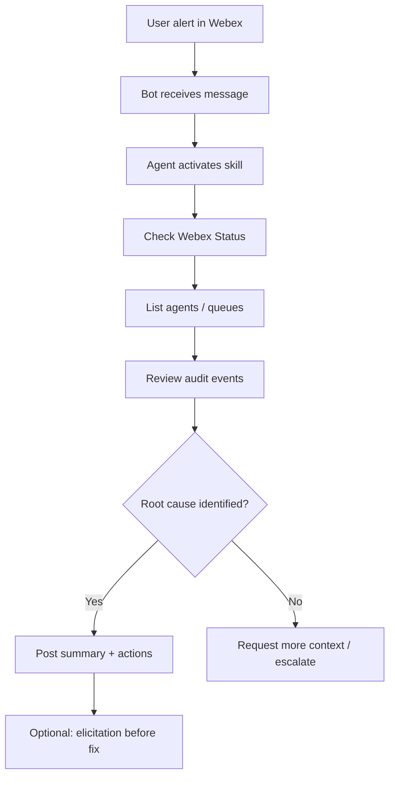

# Lab 8 - Capstone Troubleshooting Workflow

In this capstone, you will combine everything from the session — Webex Bot, AI assistant, Webex MCP servers, Agent Skills, and your custom MCP server — to investigate and resolve a realistic organizational issue.

## Scenario

**Alert:** Contact Center managers report that agents in **Pod 3** appear offline during peak hours, and queue wait times exceed five minutes.

Your assistant should:

1. Acknowledge the request in Webex
2. Check platform status for active incidents
3. Review recent admin audit events for configuration changes
4. Inspect agent and queue health via MCP tools
5. Summarize root cause and recommended actions
6. Post findings to the lab Webex space

## Learning Objectives

Upon completion of this section, you will be able to:

- Orchestrate a multi-step troubleshooting workflow across MCP servers
- Apply an Agent Skill to enforce consistent diagnostic steps
- Validate results before suggesting remediation
- Document actions for audit and handoff

## Step 8.1: Define the workflow prompt

User message to the bot:

```text
Pod 3 agents show offline and queue wait times are above 5 minutes.
Investigate and tell me what changed and what to do next.
```

## Step 8.2: Expected agent plan

| Step | Action | Tool / Skill |
| --- | --- | --- |
| 1 | Check platform health | `webex_status_unresolved` or Status API |
| 2 | Load runbook | Skill: `diagnose-agent-availability` |
| 3 | List affected agents | Webex Suite MCP tool |
| 4 | Review admin changes | `list_admin_audit_events` (custom MCP) |
| 5 | Correlate and summarize | LLM reasoning |
| 6 | Post to Webex | Bot reply |



## Step 8.3: Output template

Your assistant should return a structured summary like:

```markdown
## Investigation Summary — Pod 3 Agent Availability

**Status:** [Platform OK / Active incident: INC-XXXX]

**Findings:**
- X agents offline in Pod 3 queue
- Last admin change: [event] at [timestamp] by [admin]

**Likely cause:** [hypothesis based on evidence]

**Recommended actions:**
1. ...
2. ...

**Needs approval before executing:** [list any write operations]
```

## Step 8.4: Run the capstone

1. Start your bot handler and confirm MCP servers are connected.
2. Send the scenario prompt from your lab space.
3. Verify each step in the agent trace or IDE MCP logs.
4. Capture the final Webex response screenshot for your notes.

## Step 8.5: Extension challenges

Optional stretch goals:

- Auto-open a ticket when wait time exceeds threshold
- Page on-call only when severity is critical
- Restrict destructive fixes to approved admins via elicitation

## Exercise checklist

- [ ] Platform status checked
- [ ] Agent Skill applied
- [ ] At least two MCP tools invoked
- [ ] Structured summary posted to Webex
- [ ] Write operations gated behind user approval

## Content still to define

- Seeded lab scenario data (which agents are "offline" and why)
- Grading checklist for instructors
- Sample golden-path agent trace for TAs
