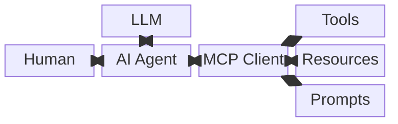

```mermaid
block-beta
    columns 4

    space L["LLM"] space T["Tools"]
    H["Human"] A["AI Agent"] C["MCP Client"] R["Resources"]
    space space space P["Prompts"]

    H <--> A
    L <--> A
    A <--> C
    C <--> T
    C <--> R
    C <--> P
```
