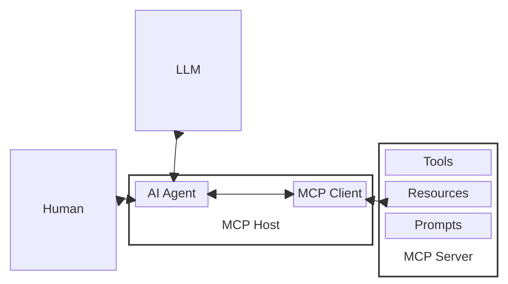

```mermaid
block-beta
    columns 4

    space
    block:llmSlot
        columns 1
        L["LLM"]
    end
    space space

    block:humanSlot
        columns 1
        H["Human"]
    end
    block:host:2
        columns 3
        A["AI Agent"] space C["MCP Client"]
        space HL["MCP Host"] space
    end
    block:server
        columns 1
        T["Tools"]
        R["Resources"]
        P["Prompts"]
        SL["MCP Server"]
    end

    H <--> A
    L <--> A
    A <--> C
    C <--> server

    style llmSlot fill:none,stroke:none
    style humanSlot fill:none,stroke:none
    style host fill:#ffffff,stroke:#333333,stroke-width:2px
    style server fill:#ffffff,stroke:#333333,stroke-width:2px
    style HL fill:none,stroke:none,color:#1496d4
    style SL fill:none,stroke:none,color:#159947
```
