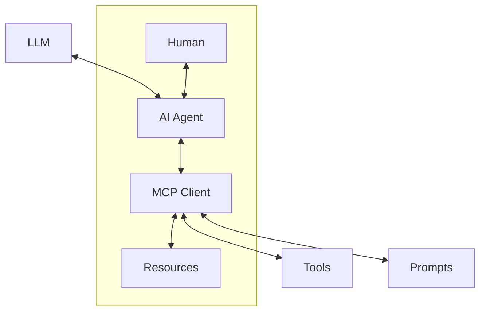

```mermaid
flowchart TB
    L[LLM] <--> A[AI Agent]

    subgraph Main_Flow[" "]
        direction LR
        H[Human] <--> A
        A <--> C[MCP Client]
        C <--> R[Resources]
    end

    C <--> T[Tools]
    C <--> P[Prompts]
```
