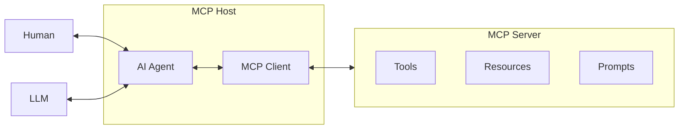

```mermaid
flowchart LR
    H[Human] <--> A

    subgraph host["MCP Host"]
        direction LR
        A[AI Agent] <--> C[MCP Client]
    end

    subgraph server["MCP Server"]
        direction TB
        T[Tools]
        R[Resources]
        P[Prompts]
    end

    C <--> server
    L[LLM] <--> A
```
