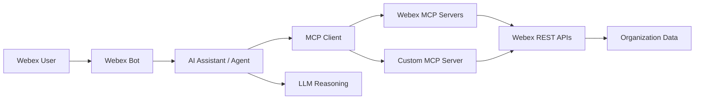

# Overview

## Lab Description

**Building an AI Assistant to Manage and Troubleshoot Your Organization**

In this hands-on session, participants will learn how to build an AI assistant using Webex Model Context Protocol (MCP) servers to retrieve and manage organizational data. Attendees will integrate their AI assistant with a Webex Bot and learn how to expand its capabilities by building a custom MCP server leveraging Webex APIs.

This session covers:

- Understanding and utilizing MCP servers within your IDE
- Integrating an AI Assistant with a Webex Bot
- Developing a custom MCP server to unlock new functionalities

## Architecture at a Glance

**User → Webex Bot → AI Assistant → MCP Tool → Webex API → Response**

The bot is the interaction channel. The agent is the system that reasons, selects tools, and orchestrates workflows behind the bot.

## Learning Objectives

Upon completion of this lab, you will be able to:

- Explain the difference between a web chat interface, an IDE-embedded assistant, and an operational AI agent
- Configure official Webex MCP servers in Visual Studio Code and drive the assistant with **OpenAI** models (API key provided for the lab)
- Use MCP tools, resources, and prompts to manage and troubleshoot Webex organization data
- Connect a Webex Bot to an AI assistant for interactive troubleshooting workflows
- Apply Agent Skills to encode operational runbooks and best practices
- Build a custom MCP server that exposes Webex API operations as tools
- Execute an end-to-end troubleshooting scenario (status check, audit review, reporting)

## Disclaimer

Although the lab design and configuration examples could be used as a reference, for design-related questions, please contact your representative at Cisco or a Cisco partner.
